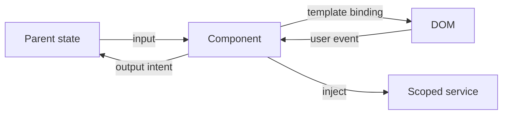

## Mental model: component là boundary, không phải mini-backend
Một component tốt nhận dữ liệu qua input, phát user intent qua output, render template và sở hữu resource có cùng lifetime với phần UI đó. Business rule, data access và global state không nên bị giấu trong lifecycle hook. Khi contract rõ, component có thể render trong nhiều host, test bằng DOM và thay implementation mà không buộc parent biết nội bộ.



Template là phần của component contract. Property binding `[disabled]` gán DOM property; attribute binding `[attr.aria-label]` dùng khi cần attribute/ARIA; event binding phát intent. Không tự nối HTML bằng string hoặc thao tác DOM nếu binding/directive giải quyết được, vì sẽ mất sanitization, accessibility và khả năng Angular theo dõi update.

```typescript title="quantity-stepper.ts"
@Component({
  selector: 'app-quantity-stepper',
  changeDetection: ChangeDetectionStrategy.OnPush,
  template: `
    <button type="button" (click)="decrease()" [disabled]="value() <= min()">−</button>
    <output [attr.aria-label]="label()">{{ value() }}</output>
    <button type="button" (click)="increase()" [disabled]="value() >= max()">+</button>
  `,
})
export class QuantityStepper {
  readonly value = input.required<number>();
  readonly min = input(1);
  readonly max = input(99);
  readonly changed = output<number>();
  readonly label = computed(() => `Số lượng hiện tại: ${this.value()}`);

  decrease(): void { this.changed.emit(Math.max(this.min(), this.value() - 1)); }
  increase(): void { this.changed.emit(Math.min(this.max(), this.value() + 1)); }
}
```

Component không mutate input do parent sở hữu. Nó đề xuất giá trị mới qua output; parent quyết định cập nhật nguồn sự thật. Với two-way component contract, `model()` có thể phù hợp, nhưng vẫn cần owner rõ để tránh vòng cập nhật khó truy vết.

## Lifecycle theo pha
| Pha | API thường dùng | Việc phù hợp |
|---|---|---|
| Construction | constructor, field initializer | `inject`, tạo state không phụ thuộc DOM |
| Input initialization | `ngOnChanges`, `ngOnInit` | Khởi tạo từ input, adapter legacy |
| Content/view initialized | query signals, after-init hooks | Đọc child/query đã có |
| Render completed | `afterNextRender`, `afterEveryRender` | DOM measurement/write có pha |
| Destruction | `DestroyRef`, `ngOnDestroy` | Hủy listener, timer, resource |

Constructor chạy khi Angular tạo instance, trước khi input binding hoàn tất; đừng đọc input required theo giả định đã có ở constructor. `ngOnChanges` chạy khi input thay đổi và lần đầu trước `ngOnInit`. Với signal input, nhiều derived values có thể biểu diễn bằng `computed` thay vì copy input sang field khác trong hook.

Angular duyệt cây để check binding. Tránh thay state giữa các after-content/view checked hook; điều đó vừa tốn chi phí mỗi lần check vừa có thể gây lỗi expression changed. `ngDoCheck`, `ngAfterContentChecked`, `ngAfterViewChecked` là escape hatch tần suất cao, không phải nơi polling state.

## Content, view và query
Content là node parent đưa vào qua projection; view là template riêng của component. Content query nhìn projected children, view query nhìn child trong template. Query hiện đại trả signal và có thể không có kết quả khi `@if` chưa render, vì vậy xử lý `undefined` như một state hợp lệ.

```typescript title="search-panel.ts"
export class SearchPanel {
  readonly inputElement = viewChild<ElementRef<HTMLInputElement>>('queryInput');

  focusQuery(): void {
    this.inputElement()?.nativeElement.focus();
  }
}
```

Query không nên biến parent thành “remote control” gọi hàng loạt method nội bộ của child. Nếu tương tác là business/UI intent, ưu tiên input/output hoặc shared scoped service. Query hợp lý cho focus, measurement hoặc integration với primitive DOM/library.

## Render callback và layout
`afterNextRender` chạy sau lần render kế tiếp của toàn application; `afterEveryRender` chạy sau mỗi lần render. Chúng cần injection context và không chạy trong SSR/build-time prerender. Khi phải đo DOM, tách write rồi read để giảm layout thrashing; code vẫn phải có fallback nếu render ở server.

```typescript title="auto-size.ts"
const host = inject(ElementRef<HTMLElement>);

afterNextRender({
  write: () => {
    host.nativeElement.style.maxHeight = '60vh';
    return true;
  },
  read: () => {
    const height = host.nativeElement.getBoundingClientRect().height;
    // Gửi measurement vào telemetry/state mà không tạo render loop.
  },
});
```

Tránh đọc layout rồi ghi style xen kẽ trong loop. Nếu callback ghi signal khiến render mới rồi callback lại ghi, có thể tạo vòng lặp. Chỉ cập nhật khi giá trị thực sự thay đổi.

## Cleanup gắn với ownership
Timer, event listener, observer, subscription dài và third-party widget phải dừng khi component bị hủy. Đặt setup và cleanup cạnh nhau qua `DestroyRef` giúp code ít sót hơn một `ngOnDestroy` khổng lồ.

```typescript title="visibility-owner.ts"
const destroyRef = inject(DestroyRef);
const onVisibility = () => this.visible.set(!document.hidden);

document.addEventListener('visibilitychange', onVisibility);
destroyRef.onDestroy(() => document.removeEventListener('visibilitychange', onVisibility));
```

Observable có thể dùng `takeUntilDestroyed`. Request HTTP thường complete, nhưng router/form/WebSocket stream thì không. Cleanup không chỉ chống memory leak: listener còn sống có thể ghi state của view đã chết hoặc tạo duplicate effect khi quay lại route.

## Failure scenarios
- Đọc required input ở constructor: giá trị chưa được bind; dùng init phase/computed.
- Copy input vào local field trong `ngOnInit` rồi không sync các update sau: giữ một source of truth.
- Dùng index trong parent và gọi method child qua query: reorder làm điều khiển nhầm instance.
- DOM measurement trong SSR: render callback không chạy; output server phải không phụ thuộc kết quả đó.
- `ngAfterViewChecked` chạy query/mapping nặng: chi phí lặp theo change detection.
- Listener global không cleanup: mỗi navigation thêm một handler.

## Production checklist
- Input/output có type, tên theo domain và không để child mutate owner state.
- Template không gọi computation nặng/side effect.
- Hook chỉ chứa logic đúng pha; tránh checked hooks trừ khi có evidence.
- Query chỉ dùng cho view primitive, xử lý trường hợp child chưa tồn tại.
- DOM API có SSR guard và read/write phase hợp lý.
- Mọi resource ngoại vi có owner và cleanup test khi destroy/remount.
- Component test qua host để xác nhận input → DOM và event → output.

## Góc phỏng vấn
Hãy giải thích component là template + class + DI scope, rồi kể lifecycle theo pha thay vì đọc thuộc danh sách hook. Nêu constructor chưa có input hoàn chỉnh, `ngOnChanges` trước `ngOnInit`, render callback dành cho DOM đã render và `DestroyRef` cho cleanup. Điểm senior là biết tránh state mutation trong traversal và tránh dùng lifecycle để che kiến trúc state kém.

## Key Takeaways
- Component contract đi qua input, output và template; query là công cụ hẹp.
- Lifecycle hook phản ánh pha runtime, không phải nơi tùy ý đặt code.
- Derived input state nên dùng `computed` thay vì copy dễ stale.
- Resource lifetime phải kết thúc cùng component/injector owner.
