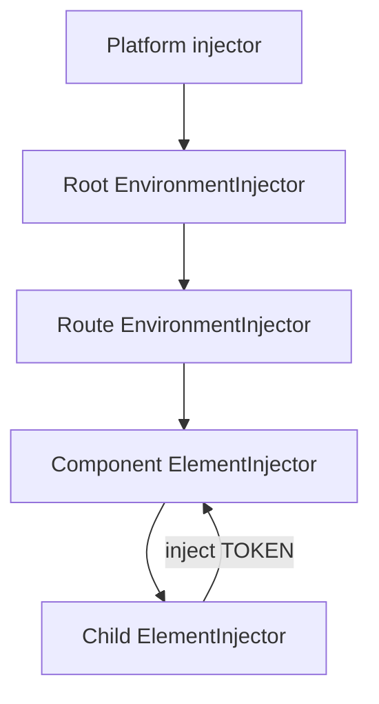

## Mental model: DI là đồ thị object có scope
Dependency Injection không chỉ là cách rút gọn `new Service()`. Provider là công thức ánh xạ một token sang giá trị; injector lưu công thức, tạo instance khi cần và giữ instance trong lifetime của chính injector. Vì vậy câu “service Angular luôn là singleton” thiếu một nửa: service chỉ singleton **bên trong một injector**. Cùng token ở hai injector con có thể tạo hai instance độc lập.

Angular hiện đại có hai hierarchy cần phân biệt. `EnvironmentInjector` bao quanh application, route hoặc môi trường động. `ElementInjector` gắn với cây component/directive. Khi component yêu cầu token, Angular tìm trong `ElementInjector` từ vị trí đó đi lên; nếu không có thì quay về điểm bắt đầu và tìm trong `EnvironmentInjector` hierarchy. Provider gần nhất thắng.



## Provider là một quyết định kiến trúc
| Provider | Dùng khi | Rủi ro cần nhớ |
|---|---|---|
| `useClass` | Chọn implementation theo interface token | Tạo instance mới cho token đó |
| `useValue` | Configuration immutable, test double | Object mutable bị chia sẻ ngoài ý muốn |
| `useFactory` | Giá trị phụ thuộc runtime/config khác | Factory quá nhiều logic, khó quan sát |
| `useExisting` | Hai token cùng trỏ một instance | Nhầm với `useClass` sẽ tạo hai instance |

TypeScript interface bị xóa ở runtime nên không thể làm DI token. Dùng `InjectionToken<T>` để vừa có runtime identity vừa giữ type checking.

```typescript title="api.providers.ts"
export interface ApiConfig {
  baseUrl: string;
  timeoutMs: number;
}

export const API_CONFIG = new InjectionToken<ApiConfig>('API_CONFIG');

export const apiConfigProvider: Provider = {
  provide: API_CONFIG,
  useFactory: () => ({
    baseUrl: document.location.origin + '/api',
    timeoutMs: 5_000,
  }),
};
```

`providedIn: 'root'` là mặc định tốt cho stateless service và shared infrastructure: có thể tree-shake nếu không dùng. Provider ở route phù hợp với feature state cần tồn tại qua các page con nhưng phải được hủy khi rời feature. Provider ở component phù hợp với editor/wizard instance cần state riêng cho từng subtree.

```typescript title="orders.routes.ts"
export const ORDER_ROUTES: Routes = [{
  path: '',
  providers: [OrderWorkspaceStore],
  children: [
    { path: '', loadComponent: () => import('./order-list') },
    { path: ':id', loadComponent: () => import('./order-detail') },
  ],
}];
```

Ở ví dụ này, list và detail trong cùng route branch dùng chung workspace store. Hai lần mount branch có thể có hai store. Đó là isolation có chủ đích, không phải bug.

## Resolution modifier và boundary
`self` buộc chỉ tìm ở injector hiện tại; `skipSelf` bắt đầu từ cha; `host` giới hạn việc đi lên tại host boundary; `optional` trả `null` khi không có provider. Chúng hữu ích khi xây library/component composition, nhưng dùng dày đặc thường báo hiệu dependency graph khó hiểu.

`providers` của component được nhìn thấy bởi view và projected content theo resolution rules. `viewProviders` chỉ lộ vào view riêng, không lộ cho nội dung chiếu qua `ng-content`. Đây là công cụ đóng boundary, không phải mẹo sửa lỗi `NullInjectorError`.

:::warning Provider shadowing
Đăng ký lại cùng token ở component âm thầm che provider root. Nếu service chứa cache, WebSocket hoặc auth state, việc shadow có thể tạo kết nối đôi, cache lệch hoặc màn hình thấy user khác nhau. Hãy xem provider scope như một phần public contract của feature.
:::

## Injection context và cleanup
`inject()` chỉ hợp lệ trong injection context: field initializer, constructor, provider factory hoặc callback được chạy bằng API tạo context phù hợp. Gọi `inject()` từ một click handler tùy ý sẽ lỗi vì Angular không biết injector nào phải phục vụ lời gọi.

Lifecycle của resource phải khớp lifecycle của injector. Service mở timer, stream hoặc listener nên dùng `DestroyRef` để cleanup khi scope bị hủy.

```typescript title="feature-presence.service.ts"
@Injectable()
export class FeaturePresence {
  private readonly destroyRef = inject(DestroyRef);
  private readonly timer = window.setInterval(() => this.ping(), 15_000);

  constructor() {
    this.destroyRef.onDestroy(() => window.clearInterval(this.timer));
  }

  private ping(): void {
    // Gửi heartbeat có deadline; không để request treo vô hạn.
  }
}
```

## Failure scenarios thường gặp
- Đặt stateful store ở `root`, rồi dữ liệu tenant A còn lại khi chuyển tenant B.
- Đặt HTTP client wrapper ở từng component, tạo cache và telemetry phân mảnh.
- Dùng `useClass: ExistingService` để alias, vô tình có hai object thay vì `useExisting`.
- Provider factory đọc global mutable state nên test phụ thuộc thứ tự chạy.
- Route lazy được preload: code được tải sớm nhưng route injector chưa nhất thiết được tạo; đừng đồng nhất code loading với service lifetime.

## Production checklist
- Ghi rõ token, owner, scope và cleanup policy của resource có state.
- Dùng root cho stateless/shared infrastructure; route hoặc component cho state cần isolation.
- Configuration qua typed `InjectionToken`, validate ngay lúc bootstrap.
- Không inject trực tiếp implementation nếu cần thay adapter ở test hoặc platform khác.
- Test ít nhất hai scope song song để bắt shared-state leak và provider shadowing.
- Theo dõi số connection/timer/subscription khi mount-unmount feature nhiều lần.

## Góc phỏng vấn
Một câu trả lời senior nên nói được rằng Angular DI có hierarchy, provider gần nhất thắng và singleton gắn với injector chứ không gắn tuyệt đối với class. Sau đó đưa ví dụ: auth client ở root, feature store ở route, editor state ở component; giải thích cleanup và nguy cơ shadowing. Nếu chỉ nói “DI giúp loose coupling” thì chưa thể hiện hiểu runtime behavior.

## Key Takeaways
- Token xác định dependency; provider xác định cách tạo; injector xác định scope và lifetime.
- Angular tra cứu qua `ElementInjector` rồi `EnvironmentInjector` hierarchy.
- `providedIn: 'root'` không phải lựa chọn đúng cho mọi stateful service.
- Provider scope là quyết định correctness, isolation và resource ownership.
