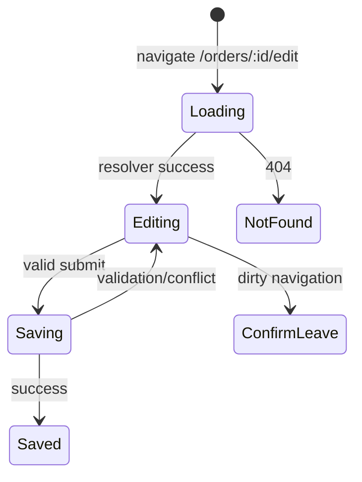

## Use case: màn hình sửa đơn hàng
Một feature thực tế hiếm khi chỉ là component. Màn hình sửa đơn hàng phải tải code khi cần, đọc `orderId` từ URL, lấy dữ liệu thiết yếu, dựng form typed, cảnh báo khi rời trang còn dirty, submit đúng một lần và xử lý conflict. Mental model hữu ích là một state machine có route làm boundary.



## Route tree định nghĩa code, data và DI boundary
Landing page quan trọng có thể eager; feature nặng nên dùng `loadChildren` hoặc `loadComponent`. Lazy loading giảm initial bundle nhưng tạo thêm network round-trip ở lần truy cập đầu, vì vậy có thể preload theo evidence thay vì preload tất cả theo phản xạ.

```typescript title="orders.routes.ts"
export const ORDER_ROUTES: Routes = [{
  path: ':id/edit',
  providers: [OrderEditorStore],
  canActivate: [signedInGuard],
  canDeactivate: [confirmDirtyGuard],
  resolve: { order: orderResolver },
  loadComponent: () => import('./order-editor.page'),
}];
```

Guard quyết định UX navigation phía client; nó không phải security boundary. JavaScript, route config và state trong browser đều có thể bị người dùng sửa. Backend vẫn phải authenticate và authorize từng request. Guard nên trả `UrlTree`/redirect command phù hợp thay vì gọi `navigate()` rồi trả `false`, vì side effect đó dễ tạo navigation race.

Resolver hữu ích khi page không thể có ý nghĩa nếu thiếu một mẩu dữ liệu cốt lõi. Tuy nhiên navigation bị block cho tới khi resolver complete. Dữ liệu phụ, tab ít dùng hoặc request chậm nên tải trong page với skeleton; resolver cần timeout/error redirect rõ ràng, không được treo vô hạn.

## Typed reactive form là executable model
Reactive form phù hợp feature phức tạp vì model explicit, synchronous và testable. Dùng `NonNullableFormBuilder` khi field không có trạng thái `null`; phân biệt DTO từ server, form model và command gửi đi thay vì bind một object cho cả ba.

```typescript title="order-editor.store.ts"
@Injectable()
export class OrderEditorStore {
  private readonly fb = inject(NonNullableFormBuilder);
  private readonly api = inject(OrderApi);

  readonly form = this.fb.group({
    customerEmail: ['', [Validators.required, Validators.email]],
    note: ['', [Validators.maxLength(500)]],
    lines: this.fb.array<FormGroup<OrderLineControls>>([]),
  });

  load(order: OrderDto): void {
    this.form.reset({ customerEmail: order.customerEmail, note: order.note ?? '' });
    this.form.controls.lines.clear();
    order.lines.forEach(line => this.form.controls.lines.push(this.createLine(line)));
    this.form.markAsPristine();
  }

  private createLine(line: OrderLineDto): FormGroup<OrderLineControls> {
    return this.fb.group({
      productId: [line.productId, Validators.required],
      quantity: [line.quantity, [Validators.required, Validators.min(1)]],
    });
  }
}
```

`setValue` buộc đúng toàn bộ shape nên tốt khi muốn phát hiện contract drift; `patchValue` tiện cho partial update nhưng có thể im lặng bỏ qua field không khớp. `FormArray` dành cho danh sách động, còn `FormGroup` dành cho tập key đã biết. Cross-field validator thuộc group vì cần nhìn nhiều control.

Async validator gọi server cần debounce/cancellation và cache hợp lý; nếu chạy mỗi keystroke nó có thể tạo request storm. Có thể dùng `updateOn: 'blur'` cho kiểm tra username/email tốn network. Dù UI báo hợp lệ, backend vẫn phải validate vì dữ liệu client không đáng tin.

## Submit flow và concurrency
Disable button chỉ cải thiện UX, không đảm bảo exactly-once. Dùng `exhaustMap` hoặc state `saving` để browser không phát mutation trùng; API quan trọng vẫn cần idempotency key. Với editor nhiều người, gửi version/ETag và xử lý `409 Conflict` hoặc `412 Precondition Failed` thay vì last-write-wins âm thầm.

```typescript title="submit-flow.ts"
readonly submitResult$ = this.submitClicks.pipe(
  filter(() => this.form.valid),
  tap(() => this.form.disable({ emitEvent: false })),
  exhaustMap(() => this.api.updateOrder(
    this.orderId(),
    toUpdateCommand(this.form.getRawValue()),
    { version: this.loadedVersion() },
  ).pipe(finalize(() => this.form.enable({ emitEvent: false })))),
  share(),
);
```

Đừng disable form trước khi đọc `form.value`: disabled controls bị loại khỏi `value`; dùng `getRawValue()` nếu command phải chứa chúng. Khi server trả field errors, map theo error code ổn định thay vì parse message. Global lỗi vẫn hiện ở summary để screen reader và người dùng không bỏ sót.

## Draft và dirty-state
Draft localStorage là convenience, không phải nguồn sự thật và không phù hợp plaintext sensitive data. Key phải chứa user/tenant/entity/version để tránh restore nhầm. Chỉ clear draft sau khi server xác nhận thành công. `canDeactivate` cần bỏ qua confirm khi chính submit flow điều hướng sau save.

:::production Accessibility
Label liên kết đúng control, error gắn `aria-describedby`, focus vào error đầu tiên sau submit và không chỉ dùng màu để báo lỗi. Validation tốt là feedback có thể hiểu, không chỉ là `form.invalid`.
:::

## Failure scenarios cần test
- User đổi URL khi resolver đang chạy; request cũ phải được hủy hoặc kết quả không ghi vào feature mới.
- Resolver trả 404/403/timeout; navigation có trang đích rõ ràng.
- Async validator response cũ về sau response mới; kết quả cũ không được thắng.
- Double-click submit; client chỉ phát một mutation và server deduplicate nếu request được gửi lại.
- Backend trả conflict version; form giữ input người dùng và cung cấp luồng reload/merge.
- Lazy chunk tải lỗi sau deploy; hiển thị retry/reload có chủ đích, không để blank screen.

## Production checklist
- Route là deep-link được; refresh trực tiếp không 404 ở web server.
- Guard chỉ lo navigation UX; mọi authorization được enforce ở API.
- Resolver chỉ tải critical data, có timeout và error policy.
- DTO, form model và mutation command có mapping/test riêng.
- Submit có client single-flight, backend idempotency và optimistic concurrency khi cần.
- Form keyboard-accessible; error message ổn định và không lộ dữ liệu nhạy cảm.
- Bundle/lazy chunk được đo bằng build stats và real-user metrics.

## Góc phỏng vấn
Khi thiết kế Angular feature, hãy kể theo luồng: route lazy tạo DI scope; guard điều hướng nhưng backend giữ quyền; resolver lấy dữ liệu tối thiểu; typed form quản state/validation; submit dùng operator phù hợp và version/idempotency; test cả happy path lẫn navigation, conflict, timeout. Cách trả lời theo failure path thể hiện tư duy production hơn việc chỉ liệt kê API Angular.

## Key Takeaways
- Feature boundary bao gồm route, provider lifetime, data loading, form và mutation flow.
- Lazy loading tối ưu initial load nhưng không miễn phí cho lần navigation đầu.
- Client validation/guard không thay server validation/authorization.
- Correctness của submit cần xử lý duplicate và concurrent update ở cả client lẫn server.
