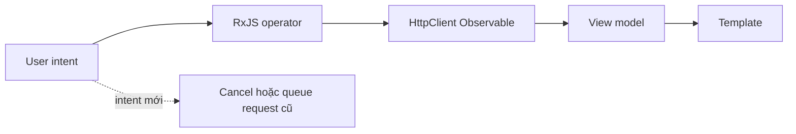

## Mental model: Observable mô tả công việc
Observable do `HttpClient` trả về là lazy: chưa subscribe thì chưa gửi request, và mỗi subscription có thể tạo một request mới. Unsubscribe một request đang chạy thường hủy request backend tương ứng. Vì vậy stream không chỉ “chứa response”; nó mô tả ownership, cancellation và thứ tự của công việc bất đồng bộ.

Component nên phát intent như search term, route id hoặc submit click. Data-access service biến intent thành request. Template nhận một view model có trạng thái `loading`, `data`, `empty`, `error`, thay vì rải nhiều boolean có thể mâu thuẫn.



## Chọn higher-order mapping theo nghiệp vụ
| Operator | Khi intent mới đến | Use case hợp lý |
|---|---|---|
| `switchMap` | Hủy inner stream cũ | Search, filter, route parameter |
| `concatMap` | Xếp hàng, giữ thứ tự | Lưu tuần tự khi order có ý nghĩa |
| `mergeMap` | Chạy song song | Upload độc lập có concurrency giới hạn |
| `exhaustMap` | Bỏ intent mới khi đang chạy | Chống double-submit ở UI |

Không có operator “tốt nhất”. `switchMap` dùng cho thanh toán có thể hủy request đang xử lý chỉ vì user click lại. `concatMap` cho autocomplete làm response cũ xuất hiện muộn. Hãy chọn theo semantics chứ không theo thói quen.

```typescript title="product-search.store.ts"
private readonly query = new Subject<string>();

readonly result$ = this.query.pipe(
  map(value => value.trim()),
  debounceTime(250),
  distinctUntilChanged(),
  switchMap(q => q.length < 2
    ? of({ kind: 'idle' as const, items: [] })
    : this.http.get<Product[]>('/api/products', {
        params: { q }, timeout: 5_000,
      }).pipe(
        map(items => ({ kind: 'ready' as const, items })),
        startWith({ kind: 'loading' as const, items: [] }),
        catchError(error => of({ kind: 'error' as const, items: [], error })),
      )
  ),
  shareReplay({ bufferSize: 1, refCount: true }),
);
```

`catchError` nằm **bên trong** `switchMap` để một request lỗi không giết luôn stream search. `shareReplay` tránh nhiều consumer tạo request lặp, nhưng cache có lifetime và invalidation cần chủ đích; không dùng nó như global cache vô hạn.

## Bridge giữa Observable và Signal
Signal phù hợp cho state đồng bộ mà template đọc; Observable mạnh ở event theo thời gian, cancellation và composition. `toSignal(stream$, { initialValue })` quản lý subscription theo injection context. `toObservable(signal)` đưa state signal vào pipeline RxJS. Không gọi `toSignal` lặp lại trong getter/template vì mỗi lần có thể tạo subscription mới.

Với subscription imperative, dùng `takeUntilDestroyed()` hoặc ownership tương đương. `HttpClient` thường complete sau response, nhưng stream dài như WebSocket, form changes và router events thì không.

## Interceptor là middleware, không phải nơi chứa mọi nghiệp vụ
Functional interceptor có thứ tự cấu hình dễ đoán. Request/response phần lớn immutable; muốn thêm header phải `clone`. Interceptor có thể gắn correlation ID, auth header cho đúng origin, deadline và telemetry. Nó không nên đổi business error thành fake success.

```typescript title="api-interceptors.ts"
export const correlationInterceptor: HttpInterceptorFn = (request, next) => {
  if (!request.url.startsWith('/api/')) return next(request);

  const enriched = request.clone({
    setHeaders: { 'X-Correlation-Id': crypto.randomUUID() },
  });
  const started = performance.now();

  return next(enriched).pipe(finalize(() => {
    console.debug('http_completed', enriched.method, enriched.url,
      Math.round(performance.now() - started));
  }));
};
```

Auth interceptor phải tránh gửi credential sang CDN/third-party URL. Refresh-token flow cần single-flight để nhiều response 401 không đồng loạt refresh. Retry chỉ dành cho lỗi transient và operation idempotent hoặc có idempotency key; retry một `POST /payments` mù quáng có thể tạo giao dịch kép.

:::warning Type không phải validation
Generic `http.get<User>()` chỉ type-check code TypeScript; nó không kiểm tra JSON runtime. Boundary quan trọng vẫn cần schema validation hoặc mapping rõ ràng trước khi dữ liệu vào domain/UI state.
:::

## Error taxonomy và UX
- Network error, timeout và abort đều có thể khác với HTTP 4xx/5xx; log phải phân loại.
- 401 thường là authentication/session; 403 là đã xác thực nhưng thiếu quyền; không tự retry cả hai.
- 429/503 có thể retry theo `Retry-After`, exponential backoff và jitter nếu deadline còn đủ.
- Validation 400/422 cần map lỗi theo field; đừng biến thành toast chung “có lỗi”.
- Khi user đổi route/query, cancellation là outcome dự kiến, không phải incident.

## Testing contract thay vì implementation detail
`provideHttpClientTesting()` thay backend thật. Test nên assert method, URL/params, header quan trọng, body, response mapping và error path; cuối test gọi `verify()` để bắt request ngoài dự kiến. Khi test interceptor, cấu hình `provideHttpClient(withInterceptors(...))` trước testing provider.

```typescript title="product-api.spec.ts"
const promise = firstValueFrom(api.find('router'));
const request = httpTesting.expectOne(r =>
  r.method === 'GET' && r.url === '/api/products' && r.params.get('q') === 'router');

request.flush([{ id: 'p-1', name: 'Router' }]);
expect((await promise)[0].id).toBe('p-1');
httpTesting.verify();
```

## Production checklist
- Mỗi request có deadline; UI phân biệt loading, empty, error và stale data.
- Higher-order operator phản ánh đúng cancellation/ordering/concurrency nghiệp vụ.
- Retry có budget, backoff+jitter và chỉ áp dụng operation an toàn.
- Interceptor lọc origin trước khi gắn credential; không log token/PII.
- Runtime validation tại boundary cho payload không đáng tin.
- Test timeout, 4xx, 5xx, network error, cancellation và duplicate click.

## Góc phỏng vấn
Khi được hỏi chống race condition ở search, hãy giải thích intent stream + `debounceTime` + `distinctUntilChanged` + `switchMap`: query mới unsubscribe request cũ nên response cũ không ghi đè UI. Sau đó nói rõ đây không phải lựa chọn cho mọi mutation, và đưa `exhaustMap` cho double-submit hoặc `concatMap` khi cần thứ tự. Câu trả lời đó thể hiện hiểu semantics hơn việc thuộc tên operator.

## Key Takeaways
- Subscription tạo công việc; unsubscribe là công cụ ownership và cancellation.
- Chọn operator dựa trên hành vi khi có intent mới.
- Interceptor xử lý concern ngang nhưng phải giữ scope, security và idempotency.
- TypeScript generic không thay runtime validation hay API contract test.
