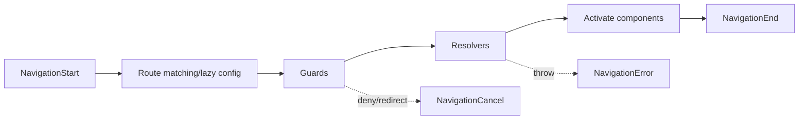

## URL là public state contract
Một route tốt có thể bookmark, share, refresh và dùng back/forward đúng kỳ vọng. Path thường biểu diễn resource/hierarchy (`/orders/42`), query parameter biểu diễn filter/sort/page có thể tùy chọn, fragment biểu diễn vị trí trong tài liệu. UI state thoáng qua như modal animation frame không nhất thiết đưa hết vào URL.

Route config là cây matching từ cụ thể đến fallback. Wildcard đặt cuối; redirect cần `pathMatch` đúng. Mỗi lazy route còn là code-splitting boundary và có thể tạo EnvironmentInjector scope cho provider của feature.

```typescript title="app.routes.ts"
export const routes: Routes = [
  { path: '', pathMatch: 'full', redirectTo: 'dashboard' },
  { path: 'dashboard', loadComponent: () => import('./dashboard/dashboard.page') },
  {
    path: 'orders',
    providers: [OrderWorkspaceStore],
    loadChildren: () => import('./orders/orders.routes'),
  },
  { path: '**', loadComponent: () => import('./not-found/not-found.page') },
];
```

## Navigation là pipeline có cancellation


Navigation mới có thể supersede navigation đang chạy. Data request theo route phải gắn lifecycle/cancellation; component không nên để response route ID cũ ghi vào route mới. Router có event cho config load, guard, resolver, end/cancel/error; telemetry nên phân biệt outcome thay vì coi mọi cancel là lỗi.

## Component có thể được reuse khi param đổi
Đi từ `/users/1` sang `/users/2` có thể giữ cùng component instance vì route config giống. Chỉ đọc snapshot trong constructor/ngOnInit sẽ giữ ID cũ. Dùng param stream hoặc input binding phù hợp, rồi `switchMap` request theo ID.

```typescript title="user-detail.page.ts"
private readonly route = inject(ActivatedRoute);
private readonly api = inject(UserApi);

readonly user$ = this.route.paramMap.pipe(
  map(params => params.get('id')),
  filter((id): id is string => id !== null),
  distinctUntilChanged(),
  switchMap(id => this.api.getById(id)),
  shareReplay({ bufferSize: 1, refCount: true }),
);
```

Query params cũng phát nhiều lần; normalize/default trước `distinctUntilChanged`. Đừng ghi filter vào service root mà quên URL: refresh/back/share sẽ lệch UI.

## Lazy loading và preloading
Eager load cho landing shell nhỏ/thiết yếu; `loadComponent`/`loadChildren` tách chunk cho feature ít truy cập. Lazy giảm initial JavaScript nhưng thêm request ở navigation đầu. Nested lazy quá sâu tạo chunk waterfall: route cha tải xong mới biết chunk con.

Preload tải chunk sau navigation đầu để đổi bandwidth idle lấy navigation nhanh. `PreloadAllModules` có thể tải quá nhiều trên mobile; custom strategy theo route data, role/feature entitlement, network hint và user journey thường hợp hơn. Preload code không đồng nghĩa chạy resolver hay tạo mọi component state.

Route-level provider giúp feature state không thành global singleton. Lifetime theo active route branch; test việc leave/re-enter tạo/cleanup đúng resource.

## Guard semantics
- `CanMatch` quyết định route config có match; trả `false` cho phép Router thử route khác.
- `CanActivate`/child quyết định có activate matched route.
- `CanDeactivate` bảo vệ unsaved-work UX.
- Guard có thể trả boolean, redirect object/`UrlTree`, Promise hoặc Observable.

Khi cần redirect, trả redirect thay vì gọi `navigate` side effect rồi trả false. Observable guard phải emit/complete; stream không complete có thể làm navigation treo.

:::warning Client guard không phải access control
Browser code có thể sửa/bypass. API phải authenticate và authorize mọi request, gồm tenant/resource ownership. Guard chỉ ngăn UX sai và giảm request không cần thiết.
:::

## Resolver: critical data thôi
Resolver chạy trước activation và navigation chờ nó. Dùng khi page không có nghĩa nếu thiếu data cốt lõi, hoặc cần quyết định 404/redirect trước render. Dữ liệu secondary/tab/chart nên tải trong component với skeleton để không block navigation.

Resolver cần timeout/error policy và cache có freshness rõ. Parent resolver chạy trước child; tránh chuỗi parent→child gây waterfall nếu có thể fetch song song. Cùng URL navigation, caching/reuse policy phải được hiểu thay vì kỳ vọng resolver luôn chạy lại.

## Deployment và deep link
SPA server/CDN phải fallback route không phải asset/API về `index.html`; nếu không, click nội bộ chạy nhưng refresh `/orders/42` trả 404. Fallback không được nuốt `/api/*` hoặc file asset missing thành HTML 200, vì gây lỗi khó debug/cache sai.

Base href, reverse proxy prefix và trailing slash cần test trong môi trường deploy thật. SSR/prerender còn yêu cầu route code tránh browser-only global ở server path.

## Observability và performance
Đo navigation duration theo phase: config chunk load, guard, resolver, activation/render. Log route **template** (`/orders/:id`), không raw URL chứa PII/high cardinality. NavigationCancel reason phân biệt redirect, superseded, guard rejection. Chunk load error sau deploy cần UX reload/retry và asset retention phù hợp cho tab đang mở phiên bản cũ.

## Testing
Test route bằng Router testing setup/`provideRouter`, navigation thật tới URL và assert DOM/redirect, thay vì gọi guard function duy nhất. Cases: direct deep link, unknown path, unauthorized redirect, parameter change trên same component, resolver 404/timeout, unsaved canDeactivate và lazy chunk failure ở browser smoke test.

## Failure scenarios
- Đọc snapshot một lần: component reuse hiển thị entity cũ.
- Guard gọi `navigate`: navigation lồng/cancel khó truy vết.
- Resolver lấy mọi widget: route chậm bằng dependency chậm nhất.
- Nested lazy ba tầng: request waterfall ở click đầu.
- Deploy xóa chunk hash cũ ngay: tab cũ navigation gặp chunk load error.
- Web server fallback cả `/api`: API 404 biến thành HTML 200.

## Production checklist
- URL model deep-linkable; path/query/default/canonical rule rõ.
- Route order, wildcard, redirect `pathMatch` có test.
- Param/query changes là stream; request cũ bị cancel/ignored.
- Lazy/preload dựa bundle/user journey/network evidence.
- Guard trả outcome, resolver bounded và chỉ lấy critical data.
- Server fallback tách SPA/API/assets; test refresh trực tiếp.
- Navigation phase/outcome/chunk errors có telemetry không lộ PII.

## Góc phỏng vấn
Hãy mô tả Router như state machine: match/lazy, guard, resolver, activation, end/cancel/error. Nêu component reuse nên phải subscribe param, trade-off lazy/preload, guard không phải security và resolver block navigation. Thêm deep-link server fallback/chunk deployment để thể hiện hiểu ngoài code Angular.

## Key Takeaways
- URL là user-facing state contract, không chỉ cách chọn component.
- Same route config có thể reuse component khi param đổi.
- Lazy loading giảm initial bundle nhưng có navigation latency/waterfall.
- Guard/resolver cần cancellation, timeout, error và observability rõ.
