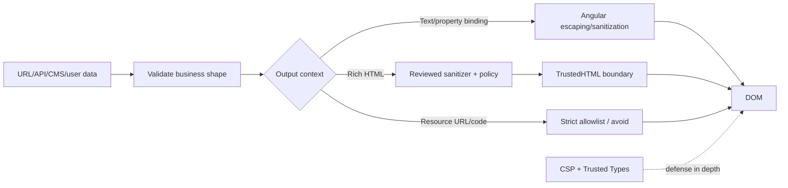

## Mental model: source → transform → sink

XSS xảy ra khi attacker-controlled data đến nơi browser diễn giải như code/markup hoạt động. Nguồn không chỉ là input form: API, URL/query/hash, local storage, postMessage, CMS, filename, websocket và database chứa dữ liệu đã lưu đều untrusted. Cần trace dataflow tới **sink** chứ không tìm riêng chuỗi `<script>`.



Input validation bảo vệ business contract nhưng không thay context-aware output handling. Một tên hợp lệ có dấu nháy vẫn phải render như text. Encoding cho HTML body không đúng cho JavaScript, CSS hay URL. “Sanitize một lần ở API gateway” không biết sink cuối cùng và dễ bị decode/concatenate lại.

## Angular bảo vệ gì

Angular coi value từ template binding là untrusted và xử lý theo security context:

| Context | Ví dụ | Hành vi/điểm cần nhớ |
|---|---|---|
| Text/interpolation | `<p>{{ comment }}</p>` | Escape để hiển thị data, không compile thành template |
| HTML | `[innerHTML]="article"` | Sanitize HTML, loại nội dung nguy hiểm theo policy Angular |
| URL | `[href]="link"` | Sanitize URL nguy hiểm |
| Resource URL | iframe/script executable source | Không thể sanitize tùy ý vì bản thân resource là code; cần construct/allowlist chặt |
| Style | style binding | Context riêng; không ghép CSS string từ input |

Angular template là trusted executable code. Không lấy chuỗi user/CMS rồi biên dịch thành Angular template; AOT production giảm một lớp template-injection nhưng không cứu direct DOM sink. Property binding đúng context an toàn hơn nối HTML string.

```html title="safe-comment.html"
<!-- Hiển thị nguyên văn như text -->
<p class="comment">{{ comment().body }}</p>

<!-- Chỉ dùng nếu requirement thật sự là rich HTML và đã có policy -->
<article [innerHTML]="sanitizedArticle()"></article>
```

Sanitization có thể làm nội dung thay đổi; warning development là tín hiệu cần kiểm tra source/context, không phải lý do gọi bypass để “hết warning”. Browser/client version có thể khác sanitizer server khác; canonical policy và test corpus phải rõ.

## `bypassSecurityTrust*` là capability nguy hiểm

`DomSanitizer.bypassSecurityTrustHtml/Url/ResourceUrl/...` không làm string sạch. Nó nói với Angular: “đã review, đừng bảo vệ nữa”. Nếu input attacker chạm tới lời gọi, ta chủ động tạo lỗ hổng.

Nếu thật sự cần iframe/video resource URL, construct từ identifier hẹp thay vì nhận URL hoàn chỉnh:

```typescript title="trusted-video-source.ts"
const VIDEO_ID = /^[A-Za-z0-9_-]{11}$/;

function youtubeEmbed(id: string, sanitizer: DomSanitizer): SafeResourceUrl {
  if (!VIDEO_ID.test(id)) throw new Error('invalid video id');
  return sanitizer.bypassSecurityTrustResourceUrl(
    `https://www.youtube-nocookie.com/embed/${id}`
  );
}
```

Bypass đặt sát construction, trong module nhỏ có owner/test và comment threat model; không bọc thành `trustAnything(value)`. Allowlist phải kiểm scheme/host/port/path bằng URL parser, không `startsWith('https://good.example')` vì hostname confusion. Redirect của endpoint được allow cũng là boundary cần xem xét.

Rich-text sanitizer nên có allowlist tag/attribute/protocol tối thiểu, version pin, regression corpus và server/client contract. Sanitized HTML vẫn có thể chứa link theo dõi, form lừa đảo hoặc nội dung business xấu; XSS safety không đồng nghĩa content safety.

## Direct DOM và third-party libraries

`ElementRef.nativeElement.innerHTML`, `document.write`, string truyền vào script/style/URL setter và library chart/editor tự chèn HTML có thể đi ngoài Angular sanitizer. Ưu tiên template/Renderer API phù hợp và text nodes. Inventory các sink bằng static search/linter và runtime Trusted Types report.

Third-party widget chạy cùng origin có quyền đọc DOM/token storage như code của ta. Sandbox iframe trên origin riêng khi boundary cho phép; cấu hình CSP `frame-src`, `connect-src`, `img-src` theo nhu cầu thật. Không thêm wildcard chỉ để widget chạy. Dependency update cần security review vì sink có thể xuất hiện sau upgrade.

SSR không loại XSS. HTML do server concatenate có thể inject trước khi Angular hydrate; JSON state nhúng vào `<script>` cần serializer/context đúng. Đừng đưa secret/token vào serialized transfer state. Hydration reuse DOM nghĩa là markup server cũng nằm trong trust boundary.

## CSP: giảm blast radius bằng allowlist thực thi

Content Security Policy được gửi bằng response header. Bắt đầu với `Content-Security-Policy-Report-Only`, thu report ở endpoint có rate/storage/privacy control, loại violation hợp lệ, rồi enforce. Nonce phải random cho từng response và xuất hiện đồng nhất trong header cùng style/script được phép; nonce hardcode không có giá trị.

Một baseline Angular current cần điều chỉnh theo build/asset thực tế:

```http
Content-Security-Policy:
  default-src 'self';
  script-src 'self' 'nonce-{PER_REQUEST_NONCE}';
  style-src 'self' 'nonce-{PER_REQUEST_NONCE}';
  object-src 'none';
  base-uri 'self';
  frame-ancestors 'none';
  require-trusted-types-for 'script';
  trusted-types angular angular#bundler;
```

Angular có `CSP_NONCE`/`ngCspNonce` và workspace support; chọn cách để server cấp nonce mà không làm public cache sai. Policy cụ thể phụ thuộc critical CSS, lazy bundler, analytics và browser support. Tránh `'unsafe-inline'`/`'unsafe-eval'`; nếu legacy buộc phải dùng, ghi exception, owner và kế hoạch loại.

CSP là defense in depth, không thay sửa sink. Cho phép origin bị compromise hoặc JSONP/script upload cùng origin có thể phá mô hình. Report cũng không chứng minh request bị chặn nếu mới ở Report-Only.

## Trusted Types: ép typed value tại injection sink

Trusted Types cho phép browser yêu cầu các DOM XSS sinks nhận `TrustedHTML`, `TrustedScript` hoặc `TrustedScriptURL` do policy tạo thay vì string thường. Mục tiêu là thu nhỏ code có quyền tạo giá trị nguy hiểm và làm violation quan sát được. Đây vẫn là W3C Working Draft và browser support không đồng đều; Angular sanitizer vẫn cần cho browser không hỗ trợ.

Angular security guide mô tả policy names framework cần. Chỉ thêm `angular#unsafe-bypass` khi app thật sự dùng bypass API; thêm nó mở capability nên phải audit call sites. `angular#unsafe-jit` chỉ cho JIT use case được review; production ưu tiên AOT. Policy name không tự sanitize nội dung — callback/policy code vẫn phải an toàn.

Rollout:

1. Inventory direct DOM/bypass/third-party sinks.
2. Bật CSP/Trusted Types report-only ở staging và canary production.
3. Phân loại violation theo route, browser, release; không log payload nhạy cảm.
4. Refactor sang text/template hoặc reviewed sanitizer policy.
5. Enforce trên một traffic slice, theo dõi functional error và security report.
6. Mở rộng, giữ kill switch có expiry; ngăn regression bằng E2E header assertion.

## Failure scenarios và troubleshooting

- **Production blank page sau enforce:** xem CSP/TT console report, build hash và policy names; rollback header có kiểm soát, không thêm wildcard vĩnh viễn.
- **Lazy route không tải:** kiểm `angular#bundler`, `script-src`, CDN origin/integrity và chunk MIME; phân biệt CSP block với 404.
- **Rich text mất format:** xem sanitizer removed field và allowlist requirement; không bypass toàn HTML.
- **Stored XSS qua CMS:** quarantine nội dung, revoke session nếu cần, tìm mọi sink/render channel; fix cả write/import và output boundary.
- **Nonce cache sai:** HTML cache dùng nonce cũ nhưng header nonce mới; tạo cả hai trong cùng response hoặc thiết kế CSP/hash/cache đúng.
- **Violation chỉ ở browser cũ:** xác nhận support và fallback; không coi “không báo” là được bảo vệ.

## Production checklist

- [ ] Có inventory untrusted sources, DOM sinks, bypass API và third-party renderer.
- [ ] Template/interpolation/property binding được ưu tiên; không compile dynamic template.
- [ ] Mỗi bypass có construction hẹp, owner, threat model và negative tests.
- [ ] Rich HTML sanitizer allowlist/version/corpus rõ; không tin MIME/extension đơn thuần.
- [ ] CSP chạy report-only rồi enforce; nonce per response, không wildcard/unsafe tùy tiện.
- [ ] Trusted Types policy tối thiểu; production AOT và không mở unsafe policy không dùng.
- [ ] SSR/transfer state không chứa secret và escape đúng embedding context.
- [ ] E2E test payload XSS ở URL/API/CMS, headers và lazy route dưới policy production.

## Góc phỏng vấn

**Angular có tự chặn mọi XSS không?** Không. Template binding có contextual escaping/sanitization, nhưng direct DOM, bypass, dynamic template, server-generated HTML và third-party library vẫn là boundary.

**CSP khác Trusted Types?** CSP kiểm nguồn/kiểu tài nguyên và nhiều execution constraints; Trusted Types tập trung ép typed values ở DOM injection sinks. Cả hai defense in depth và bổ sung output safety.

**Khi nào dùng bypass?** Chỉ khi resource/content được construct và review theo context không thể biểu diễn an toàn hơn. Bypass là exception capability, không phải sanitizer.

## Key Takeaways

- Trace untrusted data tới context-specific sink; input validation hoặc một encoder chung không đủ.
- Angular template protections mạnh khi ở trong template path, nhưng direct DOM và bypass đi quanh chúng.
- CSP nonce và Trusted Types thu nhỏ blast radius, đồng thời cần rollout/reporting có kỷ luật.
- SSR markup, transfer state và third-party code đều thuộc XSS trust boundary.
- Security tốt là giảm số privileged sinks và chứng minh exception, không tắt warning để UI hoạt động.
