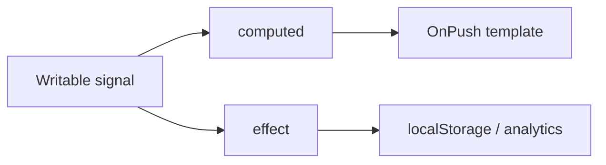

## Mental model
Signal là một ô giá trị có khả năng thông báo cho những consumer đã đọc nó. Khi template của component OnPush đọc signal, Angular ghi nhận dependency và đánh dấu component cần cập nhật khi giá trị đổi.

:::note Nói đơn giản
Signal trả lời hai câu hỏi: dữ liệu hiện tại là gì, và phần nào của UI thực sự quan tâm tới dữ liệu đó.
:::

## Ba primitive cốt lõi
| Primitive | Vai trò | Có nên ghi trực tiếp? |
|---|---|---|
| signal | State nguồn | Có, qua set hoặc update |
| computed | State dẫn xuất, memoized | Không |
| effect | Đồng bộ ra API không reactive | Không dùng để truyền state |

```typescript title="cart.store.ts"
readonly items = signal<CartItem[]>([]);
readonly total = computed(() =>
  this.items().reduce((sum, item) => sum + item.price * item.quantity, 0)
);

add(item: CartItem): void {
  this.items.update(items => [...items, item]);
}
```

computed phù hợp cho dữ liệu có thể suy ra. Nếu lưu cả items và total thành hai signal writable, hai nguồn sự thật có thể lệch nhau.

## Cơ chế cập nhật
Signal theo dõi dependency tại thời điểm chạy. Nhánh computed không đọc một signal thì signal đó không phải dependency cho lần tính hiện tại. Giá trị mặc định được so sánh bằng Object.is; mutation một object tại chỗ không tạo reference mới và thường không phát thông báo.



## Khi nào dùng effect
effect dành cho biên imperative: ghi localStorage, vẽ canvas hoặc kết nối thư viện không hiểu signal. Không dùng effect để sao chép A sang B; hãy dùng computed. Một effect ghi lại dependency của chính nó dễ tạo vòng lặp hoặc ExpressionChanged errors khó truy vết.

:::best-practice Quy tắc thực dụng
State nguồn dùng signal; state dẫn xuất dùng computed; sự kiện người dùng thay đổi state qua method; effect chỉ đi qua ranh giới với thế giới không reactive.
:::

## Production concerns
- Giữ state theo feature thay vì một global store khổng lồ.
- Không mutate array/object tại chỗ; trả về reference mới trong update.
- Đo change detection trước khi thêm equality function sâu vì deep comparison cũng tốn CPU.
- Cleanup effect/subscription gắn với lifecycle của injection context.

## Common misconceptions
Signals không tự biến mọi code thành nhanh hơn. Chúng giúp Angular biết dependency chính xác hơn, nhưng render danh sách lớn, calculation nặng và network waterfall vẫn cần thiết kế riêng. effect cũng không phải phiên bản mới của mọi RxJS stream; RxJS vẫn phù hợp cho event stream bất đồng bộ, cancellation và composition theo thời gian.

## Trả lời phỏng vấn
Trong 30 giây: Signal là primitive reactive đồng bộ. signal giữ state, computed suy ra state, effect đồng bộ với side effect. Template OnPush đọc signal sẽ được Angular theo dõi và cập nhật có mục tiêu.

## Key Takeaways
- Một nguồn sự thật, giá trị dẫn xuất bằng computed.
- Đọc signal bằng cách gọi getter.
- Immutable update giúp thay đổi reference rõ ràng.
- effect là escape hatch cho side effect, không phải state propagation.
