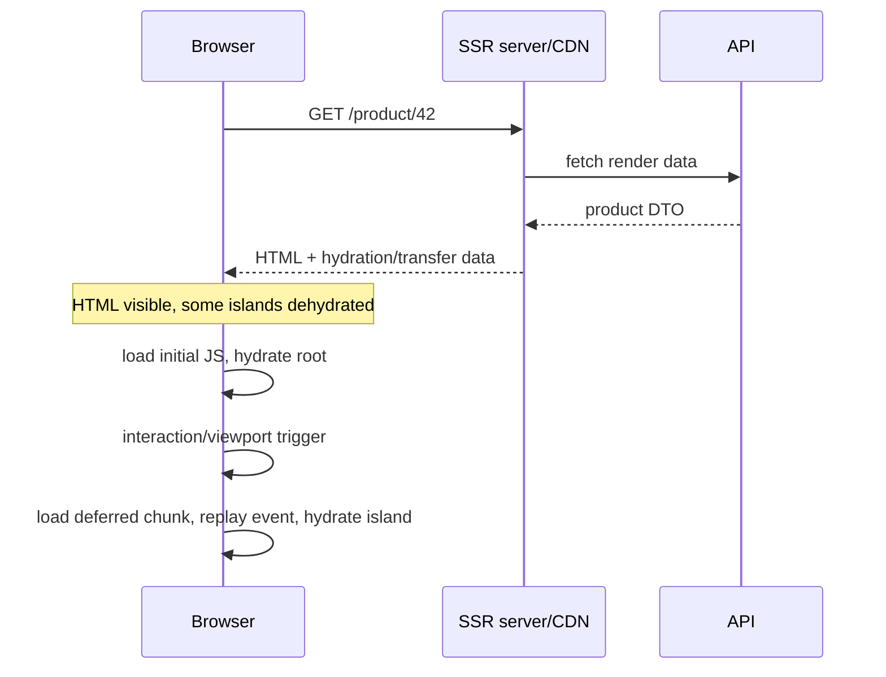

## Mental model: ba thời điểm, hai tài nguyên

Rendering không chỉ là chọn nơi chạy template. Cần tách ba thời điểm: build-time, request-time và browser-time; đồng thời tính cả tài nguyên server lẫn thiết bị người dùng.

| Mode | HTML được tạo lúc nào | Hợp với | Chi phí/rủi ro chính |
|---|---|---|---|
| CSR | Browser chạy JavaScript | App sau đăng nhập, SEO thấp | Empty shell, JS/data waterfall |
| SSG / prerender | Build-time | Nội dung public ít đổi | Build phình, dữ liệu có thể stale |
| SSR | Mỗi request | Public/dynamic/SEO hoặc first view quan trọng | Server CPU, latency, cache và isolation |
| Hybrid | Mỗi route một mode | Sản phẩm có nhiều loại trang | Policy/deploy phức tạp hơn |

SSR gửi HTML hữu ích sớm nhưng chưa tương tác cho tới khi JavaScript tải và Angular **hydrate**. Hydration đối chiếu component/view với DOM server đã có và tái sử dụng node thay vì phá rồi render lại. Incremental hydration giữ một số subtree ở trạng thái dehydrated và chỉ tải/activate khi trigger xảy ra. `@defer` là code-splitting/render boundary; hydrate trigger là activation boundary của HTML đã server-render. Hai khái niệm liên quan nhưng không đồng nhất.



## Chọn mode theo route, không theo khẩu hiệu

Landing page và tài liệu ổn định thường hợp SSG + CDN. Catalog có giá/availability đổi theo request có thể SSR. Dashboard cá nhân phía sau authentication có thể CSR nếu SEO không có giá trị và skeleton chấp nhận được. Một route động không tự động cần SSR: nếu backend chậm, SSR chỉ chuyển waterfall sang server và tăng Time to First Byte.

Angular current cho phép server route khai báo `RenderMode.Client`, `RenderMode.Prerender` hoặc `RenderMode.Server`:

```typescript title="app.routes.server.ts"
import { PrerenderFallback, RenderMode, ServerRoute } from '@angular/ssr';

export const serverRoutes: ServerRoute[] = [
  { path: '', renderMode: RenderMode.Prerender },
  { path: 'products/:id', renderMode: RenderMode.Server },
  { path: 'account/**', renderMode: RenderMode.Client },
  {
    path: 'docs/:slug',
    renderMode: RenderMode.Prerender,
    fallback: PrerenderFallback.Server,
    async getPrerenderParams() { return [{ slug: 'start' }, { slug: 'security' }]; }
  }
];
```

Tính build duration, artifact count, invalidation/freshness và fallback cho path chưa sinh. SSR cần cache key gồm locale, variant và mọi input làm response khác nhau; không cache public response có dữ liệu user. CSR route vẫn cần server/CDN deep-link fallback đúng.

## Server-compatible code và request isolation

Server không có `window`, `localStorage`, layout thật hay nhiều browser API. Tách adapter theo platform hoặc chạy DOM-dependent setup trong `afterNextRender`, hook chỉ chạy ở browser. Không dùng `isPlatformBrowser` trong template để server render một tree còn browser render tree khác; đó là công thức mismatch/layout shift.

SSR process phục vụ nhiều request. Mutable singleton/root provider hoặc module-level variable có thể giữ user A rồi lộ sang user B. Request-specific value phải lấy từ request token/factory và không nằm trong cache toàn cục không partition. Cookie/token chỉ đi tới API cần nó, không serialize vào HTML, transfer state, log hoặc error page.

Server rendering cần deadline và cancellation cho downstream. Một API treo không được giữ render worker vô hạn. Giới hạn response body, concurrency và memory; degrade/fallback có chủ đích khi dependency không quan trọng. SSR autoscaling phải nhìn queue time, active renders, CPU/memory và downstream saturation, không chỉ request count.

## Hydration đòi deterministic first render

Server DOM và client DOM ban đầu phải cùng cấu trúc. Các nguồn mismatch phổ biến:

- `Date.now()`, random ID, locale/time zone khác nhau trong template.
- Browser extension/analytics/ads sửa DOM trước hydration.
- HTML không hợp lệ khiến browser tự sửa nesting.
- Trực tiếp `nativeElement.innerHTML`, append/move node hoặc thư viện chart tự quản DOM.
- Server và client nhận data/feature flag khác nhau.

Sinh stable ID/data một lần trên server rồi transfer hoặc trì hoãn phần browser-only. `ngSkipHydration` là escape hatch ở host component, không phải fix mặc định: subtree bị render lại và mất lợi ích DOM reuse. Khoanh nhỏ component third-party, ghi owner và metric để dần loại skip.

Angular `HttpClient` transfer cache giúp browser reuse một số response server đã lấy, tránh request kép lúc hydrate. Cấu hình hiện hành mặc định loại request nhạy cảm có authorization/cookie/credential và tôn trọng cache-control; đừng bật include auth hoặc POST hàng loạt. Cache POST chỉ khi đó là query idempotent, key bao đủ variables/tenant và response an toàn để đưa vào HTML. Header nhạy cảm không được transfer.

## Incremental hydration và @defer

Version note quan trọng: Angular 21 của repo dùng `provideClientHydration(withIncrementalHydration())`. Trong Angular 22, incremental hydration được bật mặc định bởi `provideClientHydration()` và helper cũ đã deprecated; khi nâng major hãy dùng API đúng version, không copy config mù.

```typescript title="app.config.ts-angular-21"
import {
  provideClientHydration,
  withIncrementalHydration,
} from '@angular/platform-browser';

export const appConfig = {
  providers: [provideClientHydration(withIncrementalHydration())],
};
```

```html title="product-page.html"
@defer (on viewport; hydrate on interaction) {
  <app-reviews [productId]="productId()" />
} @placeholder {
  <section class="reviews-skeleton" aria-label="Đánh giá sẽ được tải"></section>
} @error {
  <p role="alert">Không tải được phần đánh giá.</p>
}
```

Ở initial SSR, hydrate trigger cho phép main content được render server nhưng chunk client trì hoãn đến interaction; event replay giữ một số event trước hydration rồi phát lại. Event replay giảm mất click, không biến mọi operation thành exactly-once: handler phải chống double submit/idempotent ở business boundary.

Regular trigger (`on viewport`) chi phối client-side navigation sau initial load; hydrate trigger chỉ chi phối initial hydrated page. Nested dehydrated block cần hydrate ancestors trước. Tránh nhiều nested block cùng trigger gây cascading chunk requests. Placeholder phải ổn định kích thước, accessible và không giả nút bấm hoạt động khi subtree chưa hydrate.

## Đo đúng và troubleshoot

Đừng kết luận SSR nhanh từ Lighthouse một lần. So cùng route/device/cache state và tách:

- TTFB/server render/downstream duration.
- HTML bytes, transfer state size, initial/deferred JS bytes.
- LCP/layout shift và thời điểm control thật sự interactive.
- Hydration duration/mismatch count, long task và event replay delay.
- SSR error/timeout, active render/queue, cache hit và memory per worker.

Troubleshooting mismatch: lấy URL/request identity, tắt extension/third-party script, so server HTML với DOM trước hydration, tìm browser-only conditional/random/invalid markup, khoanh component nhỏ nhất. Troubleshooting duplicate API: kiểm transfer-cache eligibility, request URL/headers/body khác nhau và thời điểm app stable; không chữa bằng global `shareReplay` giữ data user cũ.

Failure scenarios:

- SSR cache thiếu tenant/locale key: cross-user data leak; purge, disable cache và audit ngay.
- Downstream chậm: render queue tăng rồi OOM; deadline, concurrency/admission limit và CSR/partial fallback.
- Deploy HTML và chunk lệch version: hydration/chunk 404; atomic asset deploy, immutable filenames và giữ version cũ qua grace window.
- `hydrate never` bao subtree tương tác: UI trông sẵn nhưng không hoạt động; chỉ dùng content static và test keyboard.
- Analytics sửa DOM sớm: mismatch; trì hoãn sau hydration hoặc tích hợp qua safe boundary.

## Production checklist

- [ ] Mỗi route có lý do CSR/SSG/SSR, freshness, cache và fallback rõ.
- [ ] Server code không phụ thuộc browser global; request state không nằm trong singleton chia sẻ.
- [ ] HTML/server-client data deterministic; hydration mismatch bằng 0 trong critical journey.
- [ ] Transfer cache loại auth/cookie/PII, key đúng tenant/variant và giới hạn payload.
- [ ] `@defer` chunk thực sự tách; placeholder/loading/error accessible và giữ layout.
- [ ] Incremental hydration config khớp Angular 21 hoặc 22 đang deploy.
- [ ] SSR có timeout, concurrency/memory bound, tracing và rollback/degrade path.
- [ ] Test hard reload, client navigation, slow JS, pre-hydration interaction và mixed-version deploy.

## Góc phỏng vấn

**SSR khác hydration thế nào?** SSR tạo HTML trên server; hydration làm HTML đó sống trên client bằng cách nối runtime/component với DOM. HTML thấy sớm không đồng nghĩa tương tác sớm.

**Khi nào chọn SSG thay SSR?** Khi dữ liệu có thể biết ở build-time và freshness/invalidation chấp nhận được; đổi lại giảm request-time compute và dễ CDN cache.

**@defer có luôn cải thiện performance?** Không. Nó giảm initial bundle/work nhưng thêm request và delay. Above-the-fold cần incremental hydration hoặc thiết kế khác; quyết định bằng user journey evidence.

## Key Takeaways

- Rendering mode là quyết định theo route, data freshness, SEO, server cost và interactivity.
- Hydration reuse DOM chỉ đúng khi server/client first render deterministic và không bị script sửa sớm.
- Incremental hydration tách “HTML đã thấy” khỏi “code đã tải và tương tác”; event replay không thay idempotency.
- Angular 21 và 22 khác cách bật incremental hydration, nên version-aware configuration là bắt buộc.
- Đo cả server queue/TTFB lẫn browser LCP, hydration và interaction; tối ưu một phía có thể làm phía kia xấu đi.
