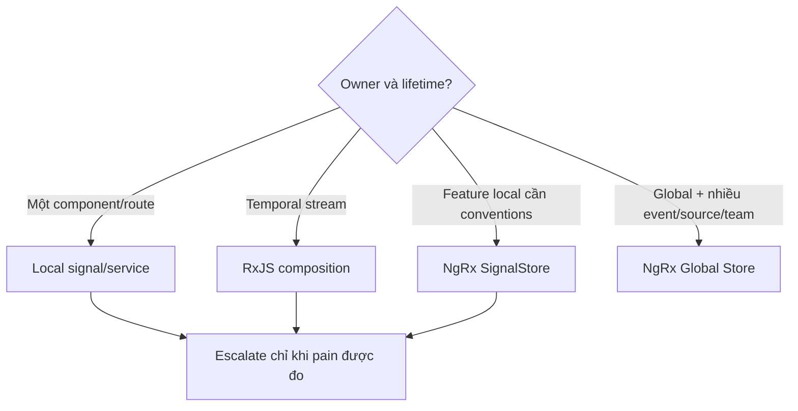

## Đừng bắt đầu bằng tên library

State management là bài toán ownership và transition, không phải cuộc thi Signals với NgRx. Trước khi chọn công cụ, lập inventory:

- **Ephemeral UI state:** menu mở, tab đang chọn, input draft; thường owner là component.
- **Route state:** path, query, fragment; URL nên là source of truth nếu cần bookmark/share/back-forward.
- **Server state:** entity/query result, freshness, error, pagination; backend vẫn là authority, client chỉ cache/projection.
- **Session state:** current user, tenant, permissions; lifetime vượt component nhưng phải reset đúng login/logout/tenant switch.
- **Workflow state:** multi-step checkout, optimistic command, websocket/event cạnh tranh; cần transition và reconciliation rõ.
- **Derived state:** filtered rows, total, permission view; nên tính từ source, không lưu bản sao nếu không cần.

Ba câu hỏi quyết định phần lớn kiến trúc: ai được ghi, state sống bao lâu, và có bao nhiêu nguồn event bất đồng bộ cùng tác động? Một form component không cần global action/reducer. Ngược lại, workflow có router, websocket, offline resume và nhiều team cùng sửa sẽ khó audit nếu chỉ có vài `signal()` công khai trong root service.



## Signals: state hiện tại và derived graph

Signal phù hợp khi consumer cần đọc giá trị hiện tại đồng bộ và Angular cần track dependency render. Writable signal là state nhỏ; `computed` là pure derived state; method của service là command boundary. Giấu writable signal để component không bypass invariant:

```typescript title="cart-state.ts"
@Injectable()
export class CartState {
  private readonly _lines = signal<readonly CartLine[]>([]);
  readonly lines = this._lines.asReadonly();
  readonly total = computed(() =>
    this._lines().reduce((sum, line) => sum + line.price * line.quantity, 0)
  );

  changeQuantity(id: string, quantity: number): void {
    if (!Number.isInteger(quantity) || quantity < 1) throw new Error('invalid quantity');
    this._lines.update(lines => lines.map(line =>
      line.id === id ? { ...line, quantity } : line
    ));
  }
}
```

Provider scope quyết định lifetime: component provider bị destroy cùng component; route provider theo route injector; root provider sống tới khi app kết thúc. Đặt tenant-sensitive store ở root mà không có explicit reset dễ lộ state người trước. Với SSR, tuyệt đối tránh module-level singleton chia sẻ request.

`effect` không nên dùng để copy A sang B hoặc điều phối chuỗi business command. Nó chạy vì dependency reactive, nên dễ tạo vòng lặp, ordering ẩn và state trung gian. Dùng computed cho derivation; method/event pipeline cho side effect. Equality sâu có thể giấu update và tốn CPU; ưu tiên immutable boundary/normalized state.

## RxJS: thời gian, concurrency và cancellation

Observable mạnh khi ý nghĩa nằm trong chuỗi theo thời gian: search query debounce, websocket, router events, retry, timeout, cancellation hoặc combine nhiều nguồn. `switchMap`, `concatMap`, `mergeMap`, `exhaustMap` là quyết định concurrency chứ không phải style.

RxJS stream không tự là “store”. `Subject` public cho mọi nơi `.next()` tạo multiple writers và event khó trace. `shareReplay(1)` có thể giữ cache vô hạn, duplicate request theo lifecycle hoặc replay data user cũ. Ghi rõ cold/hot, owner subscription, reset và error policy.

Interop không miễn phí: `toSignal` subscribe ngay và cần initial-value/error semantics; không gọi lặp trong getter/template. `toObservable` phát sau khi signal ổn định và có thể chỉ đưa giá trị cuối khi nhiều set liên tiếp; đừng kỳ vọng event log lossless. State value dùng signal; discrete audit/business events vẫn cần event stream/log riêng.

## NgRx SignalStore: convention cho feature-local state

SignalStore kết hợp state, computed và methods thành injectable store; plugin có thể hỗ trợ entities/RxJS integration. Nó hữu ích khi plain service bắt đầu thiếu convention nhưng global action bus là quá nặng. Scope store ở component/route nếu state local; root chỉ khi requirement thật sự global.

Giá trị không nằm ở giảm số dòng code mà ở public API hẹp, feature composition và testable transition. Tránh expose `patchState` cho UI; component gọi intent method như `loadPage` hoặc `approve`, store kiểm invariant. Async method cần latest/queue/drop semantics, loading/error per operation và stale response protection.

## Global NgRx Store: event log và coordination rõ

NgRx Store dùng actions mô tả event, reducer thuần tạo state mới, selector dựng read model, Effects xử lý external interaction. Nó đáng giá khi state Shared/Hydrated/Available/Retrieved/Impacted, nhiều nguồn event cùng tác động, cần devtools/replay/audit hoặc nhiều team cần contract chung.

Chi phí là ceremony, learning curve, schema toàn cục, action noise và nguy cơ biến Store thành database frontend. Không lưu mọi response, form keystroke hay derived boolean. Normalized entity state giảm duplicate; selector memoized tạo view. Action đặt theo event/intent (`InvoiceApproveRequested`, `InvoiceApproved`) chứ không phải setter (`SetLoadingTrue`). Reducer không gọi HTTP, clock hoặc random.

Effect phải xử lý outcome đầy đủ:

```text
request action
  -> effect chọn concurrency operator
  -> success | rejected | cancelled | timed-out action
  -> reducer cập nhật state theo operation/request id
```

Nếu request A chậm hơn B, success A không được ghi đè B. Mang request ID/query key hoặc dùng cancellation theo đúng semantics. Effect error thoát outer stream có thể làm effect chết; catch ở inner boundary và map thành failure action. Retry mutation cần idempotency server, không chỉ action dedup client.

## Decision matrix

| Signal | Local Signals | RxJS | SignalStore | Global NgRx Store |
|---|---|---|---|---|
| Current value/derived UI | Rất tốt | Có thể nhưng verbose | Rất tốt | Tốt qua selector |
| Temporal/concurrency | Hạn chế | Rất tốt | Tốt khi interop | Rất tốt qua Effects |
| Local lifecycle | Tự nhiên | Cần cleanup/share rõ | Tự nhiên theo provider | Thường global/feature |
| Event trace/replay | Tự thiết kế | Stream không mặc định giữ log | Tùy feature | Mạnh với action/devtools |
| Cross-team conventions | Nhẹ | Dễ phân tán pattern | Vừa | Mạnh nhưng nhiều ceremony |

Quy tắc thực dụng: bắt đầu ở scope nhỏ nhất giữ invariant rõ. Chỉ nâng cấp khi có evidence: duplicate caches, writers không kiểm soát, race async, debug cost hoặc cross-feature coordination. Không migrate toàn app cùng lúc; đặt façade để UI không biết implementation bên dưới.

## Failure và troubleshooting

- **UI stale:** tìm writer, object mutation, signal dependency và provider instance; đừng gọi `detectChanges` trước khi hiểu state graph.
- **HTTP gọi hai lần:** đếm subscriptions, nơi gọi `toSignal`, `async` pipe và share lifecycle.
- **Data tenant cũ sau logout:** kiểm root store/persistence/cache key; reset atomically và hủy in-flight request.
- **NgRx effect ngừng chạy:** outer stream có thể error; kiểm catch placement và error telemetry.
- **Optimistic update nhảy ngược:** mang entity version/operation ID, reconcile server result và định nghĩa rollback conflict.
- **Devtools state quá lớn/chậm:** không lưu binary/DOM/class instance; normalize, giới hạn history ở production và tránh action payload nhạy cảm.

## Production checklist

- [ ] State inventory có owner, writer, lifetime, authority và reset condition.
- [ ] URL/server là source of truth khi phù hợp; không tạo bản sao client mâu thuẫn.
- [ ] Writable state bị encapsulate; derived state không lưu trùng.
- [ ] Async operation nêu rõ latest/serial/parallel/drop, timeout và cancellation.
- [ ] Provider scope đúng component/route/session; SSR không chia state giữa request.
- [ ] Loading/error gắn operation key, không phải một boolean global mơ hồ.
- [ ] Persistence versioned, validated và không chứa token/PII không cần thiết.
- [ ] Test transition, race/out-of-order, logout reset, effect failure và rehydration.

## Góc phỏng vấn

**Khi nào cần NgRx?** Không trả lời bằng kích thước app. Nêu shared/lifetime/event sources, need for explicit transitions/devtools/team convention và trade-off ceremony.

**Signals thay RxJS chưa?** Signals biểu diễn current reactive value; RxJS mô hình hóa stream theo thời gian và concurrency. Chúng bổ sung nhau và có interop với semantics khác nhau.

**Store có phải cache backend?** Nó có thể giữ projection/cache, nhưng freshness, invalidation, optimistic conflict và authorization vẫn cần contract. Backend vẫn là authority cho server state.

## Key Takeaways

- Chọn state tool sau khi xác định ownership, lifetime, authority và event concurrency.
- Signals mạnh cho current/derived state; RxJS mạnh cho time/cancellation; SignalStore thêm convention local; Global Store thêm event coordination.
- Provider scope và reset quan trọng ngang reducer/selector, đặc biệt với session và SSR.
- Side effect cần outcome, concurrency và idempotency rõ; `effect` hoặc `Subject` không tự giải quyết race.
- Bắt đầu nhỏ, đặt façade và chỉ escalates khi complexity có evidence.
