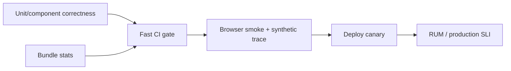

## Test boundary theo risk, không theo file extension
Một test tốt thất bại khi behavior người dùng/contract bị phá và không thất bại chỉ vì refactor nội bộ. Chọn lớp nhỏ nhất vẫn quan sát được risk: pure function không cần TestBed; DI service có thể cần provider; component cần class + template + DOM; route flow cần Router; wiring/browser API cần integration hoặc browser smoke.

| Risk | Evidence phù hợp | Không chứng minh được |
|---|---|---|
| Pure mapping/validator | Unit/table test | Template binding/accessibility |
| Service + dependency | Constructor/TestBed + fake adapter | HTTP serialization thật nếu mock quá cao |
| Component interaction | TestBed + DOM/host | Browser layout/network |
| HTTP client contract | `HttpTestingController` | Backend thật tương thích hoàn toàn |
| Navigation flow | Router test + rendered DOM | CDN deep-link fallback/chunk deploy |
| Runtime UX/performance | Browser trace/RUM/smoke | Mọi business edge case |

Test pyramid không có nghĩa “mock mọi thứ ở đáy”. Contract boundary sai tầng tạo suite xanh nhưng production hỏng.

## Component là class và template
Test class thuần tốt cho computation, nhưng không phát hiện selector sai, binding thiếu, event không nối hoặc ARIA không render. Component test tạo fixture, set input qua component API, chạy stabilization phù hợp, tương tác DOM như user và assert output/visible state.

```typescript title="quantity-stepper.spec.ts"
it('phát giá trị mới khi người dùng tăng số lượng', async () => {
  const fixture = TestBed.createComponent(QuantityStepper);
  fixture.componentRef.setInput('value', 2);
  fixture.componentRef.setInput('max', 3);
  const emitted: number[] = [];
  fixture.componentInstance.changed.subscribe(value => emitted.push(value));

  await fixture.whenStable();
  const buttons = fixture.nativeElement.querySelectorAll('button');
  buttons[1].click();
  await fixture.whenStable();

  expect(emitted).toEqual([3]);
});
```

Test host hữu ích để xác nhận parent input/output binding và content projection. Đừng query bằng class CSS trang trí dễ đổi; ưu tiên role/label/text hoặc stable test hook khi không có semantic selector. Tuy vậy, test không nên bỏ qua accessibility: accessible role/name chính là user contract.

## DI scope và test double
Component có provider riêng tạo child injector; `TestBed.inject(Service)` có thể khác instance component nhận. Lấy từ `fixture.debugElement.injector` hoặc override component provider đúng scope. Đây là lỗi test phổ biến khiến spy không thấy call dù component chạy thật.

Fake nên mô phỏng contract và failure quan trọng, không copy implementation. Mock quá sâu theo method call làm refactor gãy. Với HTTP service, mock tại `HttpBackend` để vẫn test URL, method, params, headers, body và mapping. Cuối test verify không có request ngoài dự kiến.

```typescript title="orders-api.spec.ts"
const result = firstValueFrom(api.getOrder('o-17'));
const request = httpTesting.expectOne('/api/orders/o-17');
expect(request.request.method).toBe('GET');
request.flush({ id: 'o-17', status: 'OPEN' });
expect((await result).status).toBe('OPEN');
httpTesting.verify();
```

Đừng gọi backend thật từ unit/component suite: chậm, flaky và phụ thuộc môi trường. Contract/integration suite riêng có thể chạy schema/provider thật ở boundary cần thiết.

## Async test không dùng sleep đoán mò
Timer, debounce, promise, change detection và HTTP có scheduler khác. Dùng fake timer/virtual time cho temporal operator; `whenStable()` khi framework còn async work; flush HTTP qua controller. `setTimeout(1000)` làm test chậm mà vẫn race trên máy CI.

Test cancellation: phát route/query mới, assert result cũ không render. Test destroy/remount: listener/subscription không chạy đôi. Test error/empty/loading riêng; happy path không chứng minh recovery.

## Router và form behavior
Router test nên navigate tới URL và assert rendered destination/redirect, bao guard/resolver/parameter reuse. Gọi guard function riêng chỉ là unit test policy. Form test nhập qua DOM để xác nhận CVA/binding/touched/message; validator pure có thêm unit table test. Backend error mapping và double submit là scenarios riêng.

## Performance không phải assertion thời gian trong unit test
`expect(fn()).toRunUnder(10ms)` trên CI chia sẻ CPU thường flaky và không đại diện browser. Performance evidence gồm:
- Build output/bundle budget cho initial/lazy chunks.
- Browser production build trace trên device/network profile ổn định.
- Angular/Chrome profiler để tìm change detection, long task, layout/paint.
- Synthetic journey lặp có thống kê và baseline versioned.
- Real User Monitoring theo route/device/network, không chứa PII/high-cardinality URL.



Static bundle budget bắt dependency phình nhưng không bắt API chậm/render list lớn. Browser synthetic bắt regression kịch bản nhưng không phản ánh toàn thiết bị thật. RUM phản ánh thật nhưng noisy và sau deploy. Các lớp bổ sung nhau.

## Thiết kế performance regression test
1. Chọn user journey cụ thể: mở catalog, search, mở detail.
2. Chọn metric gắn UX: initial JS bytes, navigation duration, interaction latency, long-task count.
3. Cố định build mode, dataset, browser/device/network profile và warm/cold cache.
4. Chạy đủ mẫu, so distribution/percentile và noise floor; không bịa threshold.
5. Lưu artifact trace/bundle diff để chẩn đoán khi gate fail.
6. Canary/RUM xác nhận giả thuyết sau deploy.

Threshold phải xuất phát baseline và objective, có owner. Nếu test dao động ±15%, gate 2% chỉ tạo false alarm. Trước khi nới budget, tìm change cụ thể; exception có lý do/expiry.

## Anti-pattern trong test suite
- Chỉ có `should create`: tăng count nhưng không bảo vệ behavior.
- Snapshot toàn DOM lớn: thay text/layout hợp lệ tạo noise, bug interaction vẫn lọt.
- Assert private field/method: khóa implementation.
- `NO_ERRORS_SCHEMA` che component/binding typo diện rộng.
- Mock Router/HttpClient bằng object sơ sài: bỏ mất contract framework.
- Chạy mọi test qua full app: suite chậm và failure khó định vị.
- Coverage 100% được coi là correctness: line executed không chứng minh assertion đúng.

:::best-practice Test failure path trước khi gọi production-ready
Mỗi critical flow cần ít nhất permission denied, timeout/server error, empty data, duplicate user action và destroy/navigation cancellation phù hợp. Đây là nơi integration bug thường sống.
:::

## Production checklist
- Test inventory map risk → layer; không trùng lặp mọi case ở mọi tầng.
- Component assertions qua DOM/accessible behavior, không chỉ class/private state.
- Provider override đúng injector scope; HTTP/Router dùng testing primitive thật.
- Async test dùng deterministic clock/stabilization, không sleep.
- CI tách correctness, bundle, browser synthetic và production SLI evidence.
- Performance scenario có controlled profile, baseline, artifact và owner threshold.
- Flaky test được triage/root-cause, không retry vô hạn che lỗi.

## Góc phỏng vấn
Khi hỏi test Angular, hãy chọn boundary: pure rule unit, component bằng TestBed+DOM, HTTP bằng testing backend, route bằng navigation thật, browser smoke cho wiring. Nêu DI child injector và async stabilization. Với performance, nói unit timing không đáng tin; dùng production build, trace, bundle budget, synthetic/RUM và so distribution.

## Key Takeaways
- Test behavior ở boundary nhỏ nhất vẫn quan sát đúng risk.
- Component không chỉ là class; template/DOM/input/output là contract.
- Framework testing primitive giữ nhiều realism hơn mock object tùy ý.
- Correctness và performance cần các loại evidence khác nhau.
