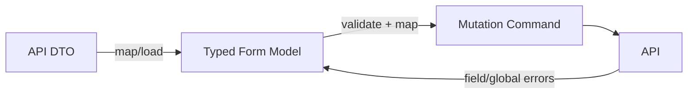

## Ba model, ba trách nhiệm
Form model phục vụ editing state; DTO phản ánh transport từ API; command phản ánh intent gửi backend. Dùng một interface cho cả ba dễ làm disabled field biến mất, server-only field bị gửi ngược hoặc nullable semantics sai. Mapping explicit là nơi normalize text, đổi date/currency và chọn field được phép mutate.



Reactive Forms quản `value`, `status`, `dirty`, `touched`, `disabled` theo cây `AbstractControl`. Parent status/value được tổng hợp từ child. `FormGroup` dùng key cố định, `FormArray` dùng collection động, `FormRecord` hợp key động cùng type.

## Nullability và disabled value
`new FormControl('')` mặc định có thể reset về `null`, nên type thường là `string | null`. `NonNullableFormBuilder` hoặc `{ nonNullable: true }` làm reset về initial value. Chọn theo domain, không chỉ để xóa lỗi TypeScript.

`form.value` loại control disabled và vì thế type có thể partial. `getRawValue()` gồm cả disabled value. Nhưng disabled UI không phải authorization: attacker vẫn tự gửi field. Mutation command chỉ map allowlisted field, backend enforce quyền.

```typescript title="registration-form.ts"
const fb = inject(NonNullableFormBuilder);

readonly form = fb.group({
  email: ['', [Validators.required, Validators.email]],
  password: ['', [Validators.required, Validators.minLength(12)]],
  confirmPassword: ['', Validators.required],
  profile: fb.group({
    displayName: ['', [Validators.required, Validators.maxLength(80)]],
  }),
}, { validators: [samePasswordValidator] });

function samePasswordValidator(group: AbstractControl): ValidationErrors | null {
  const password = group.get('password')?.value;
  const confirmation = group.get('confirmPassword')?.value;
  return password === confirmation ? null : { passwordMismatch: true };
}
```

Cross-field rule nằm ở common ancestor, vì error phụ thuộc tổ hợp. Validator nên pure, deterministic và không mutate sibling; trả error object có stable key + parameters. Message presentation nằm ở UI/i18n layer, không hardcode prose trong validator.

## Validation không phải một lớp duy nhất
| Lớp | Mục tiêu | Ví dụ |
|---|---|---|
| Browser/UI | Feedback nhanh, giảm lỗi nhập | required, format, cross-field |
| API contract | Shape/type/size tin cậy | schema validation, max length |
| Domain | Invariant/authorization | email unique trong tenant, state transition |
| Database | Integrity cuối | unique/check/foreign key |

Client validation có thể bị bypass và data có thể stale. “Email còn trống” kiểm tra local được; “email chưa tồn tại” cần server và vẫn phải kiểm tra lại trong transaction khi submit. Async validator chỉ cải thiện UX, không giữ uniqueness.

## Async validator và race
Angular chạy async validator sau khi sync validators pass. Async validator phải complete và trả `null` hoặc error. Network check nên debounce/cancel hoặc chạy `updateOn: 'blur'` để không gọi mỗi phím. Nếu tự dựng stream ngoài validator, dùng `switchMap` để response query cũ không ghi đè query mới.

```typescript title="email-availability.validator.ts"
export const emailAvailable = (api: AccountApi): AsyncValidatorFn => control => {
  const email = String(control.value ?? '').trim().toLowerCase();
  if (!email) return of(null);

  return timer(300).pipe(
    switchMap(() => api.isEmailAvailable(email)),
    map(available => available ? null : { emailTaken: true }),
    catchError(() => of({ availabilityUnknown: true })),
    take(1),
  );
};
```

Quyết định khi dependency lỗi là product decision: `availabilityUnknown` có thể cho phép submit và backend quyết định, hoặc block với retry. Không map mọi network error thành `emailTaken`, vì message sai.

## Dynamic validator và event storm
Khi `setValidators`/`addValidators`/remove, gọi `updateValueAndValidity`. Batch update có thể dùng `{ emitEvent: false, onlySelf: true }` rồi recompute parent một lần, tránh vòng `valueChanges` A cập nhật B rồi B cập nhật A.

`setValue` bắt đúng toàn shape nên hữu ích phát hiện drift; `patchValue` cho partial data nhưng có thể bỏ qua key ngoài model. Khi load DTO, mapping + `setValue` thường an toàn hơn patch object tùy ý. Sau load, `markAsPristine`; sau submit invalid, mark controls touched theo UX có chủ đích.

## Server errors là state có vòng đời
Backend nên trả stable code và field path. Map lỗi field vào control, lỗi business/global vào form summary. Khi user sửa field liên quan, xóa server error đó nhưng giữ validator errors khác. Không gọi `setErrors(null)` mù quáng vì sẽ xóa required/pattern error.

```json title="Validation problem minh họa"
{
  "code": "VALIDATION_FAILED",
  "fieldErrors": [
    { "path": "email", "code": "EMAIL_ALREADY_USED" }
  ]
}
```

Client không parse câu tiếng người để tìm field. Với optimistic concurrency conflict, đó thường là form-level workflow cần reload/merge, không phải lỗi từng input.

## Custom control và ControlValueAccessor
Custom date picker/tag selector cần hoạt động như control: nhận value, phát change/touched, nhận disabled state. Không tự tạo một `FormControl` bí mật không kết nối parent. CVA callback chỉ phát khi user interaction đổi value; `writeValue` từ parent không được phát ngược gây loop.

## Accessibility và UX
- Label liên kết `for/id` hoặc accessible name rõ.
- Error gắn control bằng `aria-describedby`; global summary có link/focus tới field.
- Chỉ hiện error khi user đã tương tác hoặc submit, không đỏ toàn form lúc mở.
- `PENDING` có feedback; submit state không chỉ dựa vào button disabled.
- Không dùng màu duy nhất; message nói cách sửa.
- Giữ input người dùng khi server lỗi; không reset form ngoài success thật.

## Testing
Unit-test validator bằng table cases, gồm null/boundary/unicode. Component test phải nhập qua DOM và kiểm tra message/ARIA, không chỉ gọi `control.setValue`. Async validator dùng fake clock/HTTP testing backend để chứng minh stale response không thắng. Submit test xác nhận command mapping không chứa disabled/server-only field.

## Failure scenarios
- Dùng `form.value` sau disable toàn form: command thiếu field.
- Async validator không complete: control ở `PENDING` mãi.
- Cross-field validator đặt trên một child: không biết sibling update hoặc error sai chỗ.
- Server trả error, UI `setErrors` đè mất local errors.
- `valueChanges` hai chiều: recursion/request storm.
- UI disable trường admin nhưng API tin client: broken access control.

## Production checklist
- DTO → form → command mapping typed và được test.
- Null/empty/disabled semantics được chọn rõ, không dùng cast để né type.
- Validator pure; async bounded, cancellable và có failure policy.
- Server field/global errors có stable codes và lifecycle khi edit/resubmit.
- Custom control tuân CVA value/touched/disabled contract.
- Form keyboard/screen-reader usable; summary/focus cho submit invalid.
- Backend lặp validation và invariant/authorization trong trust boundary.

## Góc phỏng vấn
Một câu trả lời mạnh không dừng ở `Validators.required`. Hãy phân biệt DTO/form/command, typed nullability và disabled value; đặt cross-field validator ở group; async validator complete/cancel; map stable server errors; nhắc client validation không phải security. Thêm test DOM/accessibility và race để thể hiện production thinking.

## Key Takeaways
- Form là state tree có type/status/lifecycle, không phải DTO mutable.
- Validation được lặp theo trust boundary; backend giữ invariant cuối.
- Async validation cần completion, cancellation và error semantics trung thực.
- Disabled/touched/error UI là UX, không phải authorization.
