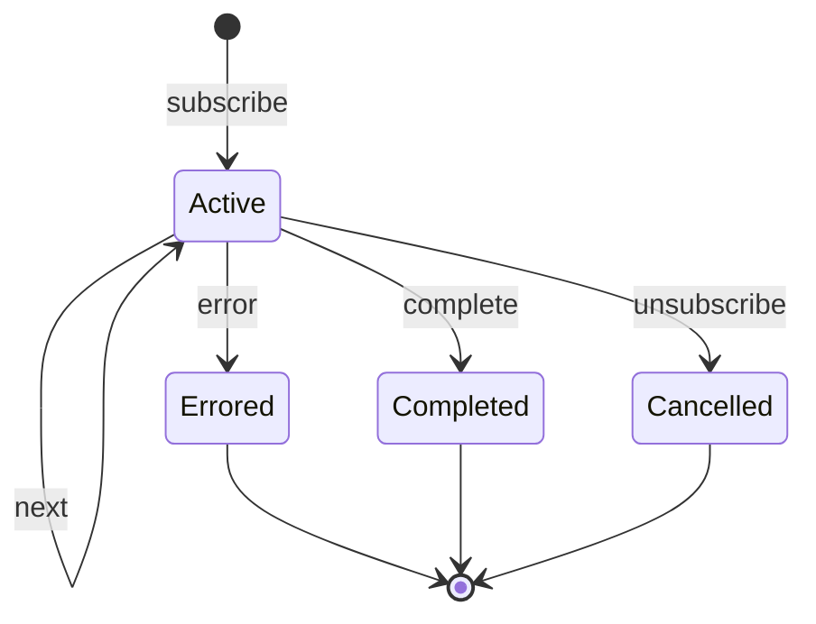

## Observable contract: error và complete là terminal
Một subscription nhận zero hoặc nhiều `next`, rồi tối đa một terminal signal `error` **hoặc** `complete`. Sau terminal, stream đó không sống lại. `catchError` không “xóa cờ lỗi”; nó thay source đã chết bằng Observable khác. `retry` tạo subscription mới vào source, nghĩa là side effect source có thể chạy lại.



`unsubscribe` không phải complete và không phát một domain event “cancelled”. Teardown/finalize dùng để giải phóng resource, nhưng không nên coi finalize là success callback vì nó chạy cả success, error và cancellation.

## Cold, hot và ownership
Cold Observable tạo producer riêng cho mỗi subscriber: HTTP request, `defer(() => fetch...)`, timer. Hot producer tồn tại độc lập hoặc được chia sẻ: DOM events, WebSocket, Subject. Hai subscription vào cold stream có thể gọi API hai lần; multicast có thể chia một subscription source nhưng thêm câu hỏi lifecycle/cache.

| Câu hỏi | Nếu không trả lời được, chưa nên multicast |
|---|---|
| Ai bắt đầu source? | Subscriber đầu, app bootstrap hay explicit connect? |
| Ai dừng source? | Subscriber cuối, complete hay owner destroy? |
| Late subscriber nhận gì? | Chỉ giá trị mới, last value hay history? |
| Error/complete rồi subscriber mới đến? | Nhận terminal, reset hay tạo source mới? |
| Cache invalidation lúc nào? | TTL, mutation, route leave hay manual refresh? |

Subject public cho phép mọi consumer gọi `next/error/complete`, phá ownership. Encapsulate writable Subject và expose `asObservable()` hoặc API intent. `BehaviorSubject` cần current value; `ReplaySubject` giữ N giá trị; replay không phải persistence và có thể giữ object lớn trong memory.

## Error boundary placement
Search stream phải sống qua nhiều request. Nếu `catchError` đặt ngoài `switchMap`, một request lỗi terminate cả search; input sau đó không làm gì. Đặt catch trong inner stream để chỉ request đó trở thành error state.

```typescript title="search-stream.ts"
const viewModel$ = query$.pipe(
  map(query => query.trim()),
  distinctUntilChanged(),
  switchMap(query => api.search(query).pipe(
    map(items => ({ kind: 'ready' as const, items })),
    startWith({ kind: 'loading' as const }),
    catchError(error => of({ kind: 'error' as const, error: classify(error) })),
  )),
);
```

Ngược lại, stream xử lý config bootstrap có thể phải fail toàn pipeline nếu config invalid; catch trong từng bước rồi trả empty có thể che lỗi fatal. Error boundary theo ownership: recovery có nghĩa ở đâu thì catch ở đó.

Không throw string hoặc biến mọi error thành `[]`; empty data khác request failed. Domain/view model nên giữ state phân biệt để UI và telemetry trung thực.

## Retry là resubscribe
Với cold source, resubscribe tái chạy producer. Dùng `defer` khi mỗi attempt phải đọc token/time/config mới. Retry mutation chỉ khi idempotent; giới hạn attempt/time và backoff+jitter. Nếu source có side effect trước điểm lỗi, retry có thể lặp phần đã thành công.

```typescript title="bounded-retry.ts"
const result$ = defer(() => api.readCatalog()).pipe(
  retry({
    count: 2,
    delay: (error, attempt) => isTransient(error)
      ? timer(randomJitter(200 * 2 ** attempt))
      : throwError(() => error),
  }),
);
```

Không retry 401/403/validation mù. `retryWhen`/custom policy phức tạp cần test bằng virtual/fake time và deadline ở transport, nếu không user có thể chờ vô hạn.

## `share` và `shareReplay`
`share()` multicast source trong khi có subscriber theo config reset; late subscriber không mặc định nhận value cũ. `shareReplay({bufferSize: 1, refCount: true})` thường dùng để chia request/current state và replay last value, nhưng không phải cache hoàn chỉnh.

Với `refCount: true`, source có thể unsubscribe khi subscriber count về 0 và subscription sau tạo lại work. Với source không complete, `refCount: false` có thể giữ timer/socket sống dù view đã rời. Với response cached mãi, mutation/user change có thể nhận dữ liệu stale hoặc lộ state giữa scope. Hãy đặt shared stream trong service có DI lifetime phù hợp và có invalidation explicit.

```typescript title="scoped-catalog.store.ts"
private readonly refresh = new Subject<void>();

readonly catalog$ = this.refresh.pipe(
  startWith(undefined),
  switchMap(() => this.api.loadCatalog()),
  shareReplay({ bufferSize: 1, refCount: true }),
);

reload(): void { this.refresh.next(); }
```

Multiple AsyncPipe reads trên cùng shared Observable không gọi API nhiều lần; nhưng nếu method `catalog()` tạo pipeline mới mỗi template evaluation, sharing bên trong mỗi instance không giúp. Tạo stream một lần.

## Backpressure: phải định nghĩa mất gì hoặc chờ gì
Browser Observable push không có protocol chung bắt producer chờ consumer. Khi event đến nhanh hơn xử lý, lựa chọn gồm:
- Drop/intermediate: `throttleTime`, `auditTime`, `sampleTime` cho pointer/scroll telemetry.
- Keep latest/cancel old: `switchMap` cho search/read.
- Ignore new while busy: `exhaustMap` cho single-flight submit.
- Queue ordered: `concatMap`, nhưng queue có thể tăng không bound.
- Parallel bounded: `mergeMap(project, concurrency)` cho upload độc lập.
- Batch: `bufferTime`/`windowTime`, nhưng đặt max size/time và overflow policy.

Không gọi debounce là backpressure đầy đủ: nó chỉ lọc temporal burst. Với WebSocket/message stream không thể pause, cần bounded buffer/drop/reconnect/resume protocol hoặc chuyển xử lý sang server/worker. Với queue nghiệp vụ không được mất, durable broker + consumer flow control phù hợp hơn memory RxJS.

:::warning Unbounded queue
`concatMap` bảo toàn thứ tự nhưng producer 1.000/s và consumer 10/s sẽ tích backlog trong memory. Đo queue depth/age, giới hạn intake hoặc batch; operator không tạo capacity.
:::

## Cancellation và resource
Higher-order operator unsubscribe inner Observable, nhưng external side effect có thật sự abort phụ thuộc producer. `HttpClient` tích hợp abort; Promise đã chạy thường không bị hủy chỉ vì bọc bằng Observable. WebSocket cần teardown đóng listener/socket theo owner; `takeUntilDestroyed` kết thúc subscription theo Angular lifecycle.

`finalize` thích hợp tắt spinner/release local resource, nhưng concurrent request dùng một boolean có thể tắt spinner sớm. Dùng in-flight counter hoặc view model theo request ownership.

## Test theo timeline
Test phải bao next/error/complete/unsubscribe và subscription count, không chỉ output happy path. Dùng deterministic scheduler/fake time cho debounce/retry; assert source chỉ subscribe một lần khi share, resubscribe đúng khi refCount về 0, và outer stream còn nhận query sau inner error.

## Failure scenarios
- `catchError` ngoài switchMap: một lỗi giết stream user intent.
- `shareReplay` ở root cache data user trước sau logout.
- Retry source POST không idempotent: duplicate effect.
- `concatMap` producer vô hạn: memory tăng dù thứ tự đúng.
- Wrap Promise bằng `from`: unsubscribe không hủy network underlying.
- Subject bị consumer gọi `complete`: toàn feature im lặng.

## Production checklist
- Ghi rõ cold/hot, owner, start/stop và late-subscriber semantics.
- Error state không bị biến thành empty/success; catch ở recovery boundary.
- Retry bounded và idempotent; cancellation thật sự đi tới producer.
- Multicast có refCount/reset/replay/invalidation và DI scope rõ.
- Concurrency/buffer có bound, overflow/drop policy và metric.
- Test timeline, teardown, duplicate subscription và recovery sau error.

## Góc phỏng vấn
Khi hỏi `shareReplay`, đừng chỉ nói “cache Observable”. Hãy giải thích multicast một source, replay cho late subscriber, refCount/lifetime và invalidation. Với error handling, nói error terminal và vị trí `catchError` quyết định inner hay outer stream chết. Với backpressure, chọn drop/latest/queue/bounded parallel theo semantics và thừa nhận operator không tạo capacity.

## Key Takeaways
- Error/complete kết thúc subscription; recovery là thay source hoặc resubscribe.
- Multicasting thay ownership/lifetime, không chỉ giảm API call.
- `shareReplay` cần scope và invalidation, không phải cache vạn năng.
- Backpressure reasoning bắt buộc chọn queue, drop, cancel hoặc giới hạn intake.
