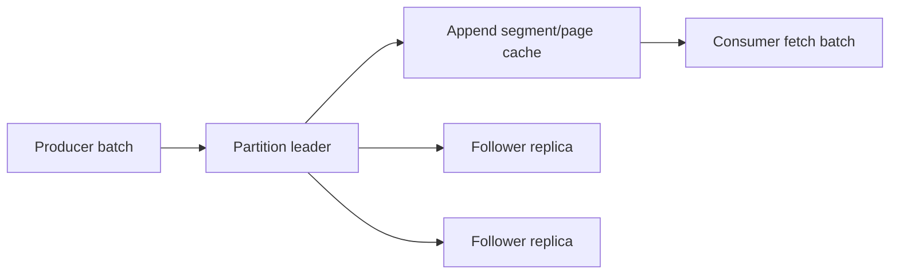

## Partition là replicated append log
Mỗi topic có các partition; mỗi partition là ordered log với offset tăng trong partition. Broker đang giữ leader nhận produce/fetch cho partition, follower sao chép log. Controller/metadata quorum quản lý metadata và election, còn data plane vẫn chảy giữa clients và partition leaders.

Ordering, parallelism, storage và failure blast radius đều gặp nhau ở partition. Quá ít partition giới hạn throughput/consumer concurrency; quá nhiều partition tăng metadata, open files, election/recovery và operational overhead. Chọn số partition từ throughput, key cardinality, consumer groups và growth; tăng sau này có thể đổi key-to-partition mapping/order nếu partitioner không được quản lý.

## Segment, page cache và batch
Kafka không giữ mỗi message như một object/row riêng. Partition log được chia thành segment files và indexes. Write append tuần tự, record batches đi xuyên producer, broker và consumer; compression trên batch giảm network/storage nhưng tăng CPU và latency chờ batch.

Kafka dựa nhiều vào filesystem/page cache. "Có data trong page cache" khác "đã durable trên thiết bị"; durability contract đến từ replication, acknowledgement và flush/storage stack, không chỉ một API send thành công.

Batching có ba trade-off: throughput tốt hơn do amortize request, compression tốt hơn và ít I/O; nhưng `linger`, batch size và queueing tăng latency/memory. Benchmark cần message-size distribution, compression type và concurrency thật.

## Replication factor, leader và ISR
Replication factor là số replica được gán, không phải số replica luôn bắt kịp. ISR (in-sync replicas) là tập replica đủ điều kiện theo tiêu chí đồng bộ. High watermark giới hạn phần log consumer bình thường có thể đọc như committed.

Khi leader fail, chọn replica đủ cập nhật giúp tránh mất acknowledged record. Cho phép unclean leader election có thể phục hồi availability từ replica stale nhưng đổi lấy data loss; đây phải là business decision, không phải toggle vô thức.

## `acks=all` chưa đủ nếu cấu hình topic yếu
Producer `acks=all` yêu cầu leader đợi tất cả ISR hiện tại acknowledge. `min.insync.replicas` đặt số ISR tối thiểu để write được chấp nhận khi dùng all-acks. Ví dụ replication factor 3, min ISR 2 thường cho phép mất một replica mà vẫn write, rồi dừng write nếu chỉ còn một in-sync replica thay vì âm thầm giảm durability.

| Trạng thái | RF=3, min ISR=2, acks=all |
|---|---|
| 3 ISR | write được, có ba bản đang theo kịp |
| 2 ISR | write được, đã mất một mức redundancy |
| 1 ISR | write bị từ chối cho tới khi phục hồi |

`acks=1` chỉ chờ leader; leader mất trước replication có thể mất record. `acks=0` không có broker acknowledgement. Kết quả còn phụ thuộc timeout/retry/idempotence, rack placement, disk và election settings.

## Retention và compaction là hai lifecycle
Delete retention loại segment theo time/size; consumed hay chưa không quyết định retention. Consumer lag vượt retention có thể mất offset/data cần đọc lại.

Log compaction giữ ít nhất giá trị gần nhất cho từng key trong phần log đã compact, với tombstone biểu diễn delete và cleanup có độ trễ. Compaction không biến topic thành database query engine, không đảm bảo chỉ còn đúng một record vật lý ngay tức thì, và key `null` không tham gia semantics cập nhật theo key như mong muốn.

Topic có thể dùng delete, compact hoặc kết hợp tùy cấu hình. Event history audit thường khác changelog state; đừng bật compaction cho event stream nếu business cần giữ mọi event.

## Partition placement và skew
Key distribution quyết định load. Một celebrity tenant/device có thể làm một partition leader nóng dù cluster còn dư tổng capacity. Broker cũng có thể lệch leader count, bytes hoặc disk usage. Thêm broker không tự di chuyển partition/rebalance mọi dữ liệu theo ý muốn; cần reassignment plan và theo dõi throttling.

Khi chọn key, cân bằng:
- ordering/affinity cần giữ;
- số key đủ phân tán;
- kích thước/tốc độ mỗi key;
- consumer state locality;
- khả năng thay đổi partition count.

## Failure scenarios
- ISR co còn một nhưng alert không phát hiện; write tiếp với policy yếu.
- Disk gần đầy làm latency tăng, replica tụt ISR rồi availability giảm.
- Retention ngắn hơn thời gian xử lý/recovery thực, replay không còn data.
- Một partition nhận phần lớn bytes do low-cardinality/hot key.
- Message lớn vượt broker/topic/producer/consumer limits không đồng bộ.
- TLS/compression thay đổi CPU/data path nhưng capacity test không bao phủ.
- Rolling restart làm nhiều leader/replica recovery cùng lúc và tạo cascade.

## Production signals
- Under-replicated/offline partitions và ISR shrink/expand rate.
- Request produce/fetch latency/error/throttle.
- Broker disk usage, I/O wait, network, page-cache pressure và GC.
- Bytes/messages in/out theo broker/topic/partition.
- Leader imbalance và partition count.
- Controller/metadata quorum health.
- Log flush/recovery, replica fetch lag và consumer lag theo partition.

:::production Checklist topic quan trọng
Ghi retention/compaction contract; chọn RF/min ISR/acks cùng nhau; đặt replica qua failure domain; giới hạn message size nhất quán; capacity test batch/compression; alert disk và ISR trước outage; có partition reassignment/runbook; chaos test broker/rack failure; kiểm tra client retry/idempotence.
:::

## Góc phỏng vấn
"`acks=all` có nghĩa mọi replica trên topic đã ghi không?" — Nó chờ tất cả replica đang ở ISR, không nhất thiết mọi replica được gán. Nếu ISR đã co và `min.insync.replicas` quá thấp, durability thấp hơn kỳ vọng. Cần nói cả RF, min ISR, election và producer idempotence.

## Key Takeaways
- Partition là đơn vị ordering, storage, replication và parallelism.
- Kafka đạt throughput nhờ append, page cache và batching.
- RF, ISR, min ISR và acks tạo một contract chung.
- Retention độc lập consumer acknowledgement; replay có giới hạn thời gian.
- Cluster còn dư capacity không cứu được hot partition.
