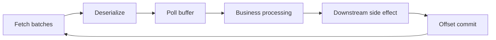

## Lag là backlog position, không tự là user impact
Per-partition lag thường là log-end offset trừ consumer-group committed/processed position theo metric/tool semantics. 1 triệu records có thể là vài giây ở throughput cao hoặc nhiều giờ với heavy processing. Offset lag không biết event age, business priority hay downstream side effects.

Theo dõi cả records lag, oldest-event age/end-to-end freshness và drain rate. Nếu arrival rate λ lớn hơn service rate μ lâu dài, backlog tăng không giới hạn; restart không chữa capacity. Recovery time xấp xỉ backlog chia `(μ-λ)` khi μ>λ, nhưng skew, retries và downstream limits làm thực tế khác.

## Phân tích theo partition trước average
Consumer group chia partition; một partition chỉ thuộc một consumer trong group tại thời điểm. Thêm consumers vượt partition count không tăng parallelism. Một hot key/partition có thể lag hàng giờ trong khi average group trông ổn.

Dashboard cần max lag, distribution và top partitions, không chỉ sum/avg. Map partition tới consumer instance, broker leader, key distribution và processing latency. Nếu bottleneck chỉ một partition, scale consumers vô ích; cần key/data model hoặc xử lý per-record.

## Pipeline của một consumer

Lag có thể do fetch/network/throttle, deserialize poison, consumer thread blocked, slow DB/API, lock contention, retry sleep, GC, commit error hoặc rebalance churn. CPU thấp không chứng minh consumer khỏe nếu đang chờ connection pool/downstream.

Instrument stage latency, batch size, records/sec, errors/retry, pool wait và downstream saturation cùng Kafka metrics.

## Poll contract và `max.poll.interval.ms`
Consumer gọi `poll()` để nhận records và tham gia lifecycle. Nếu thời gian giữa poll vượt `max.poll.interval.ms`, group xem member không tiến triển và reassign partitions theo protocol/config; worker cũ có thể vẫn xử lý records đã lấy, tạo duplicate/concurrent side effects khi owner mới chạy.

`max.poll.records` giới hạn records trả mỗi poll, không nhất thiết fetch bytes/network batch. Giảm batch giúp bounded processing time nhưng có thể giảm throughput. Tăng max poll interval che processing chậm và kéo dài recovery khi hung; giải pháp tốt thường tách polling/processing có pause/resume, bounded worker queues và partition-aware offset tracking.

Không xử lý records của cùng partition song song rồi commit offset cao nhất nếu lower offset chưa hoàn tất; crash sẽ bỏ qua record. Parallelism phải giữ completion watermark liên tục theo partition hoặc partition-to-worker affinity.

## Heartbeat, session timeout và protocol
Heartbeat/session timeout phát hiện member mất. Kafka 4.x hỗ trợ next-generation consumer rebalance protocol khi client cấu hình `group.protocol=consumer`; server điều khiển một số heartbeat/session/assignor settings và protocol fully incremental theo documentation. Classic groups vẫn tồn tại. Không trộn config assumptions giữa hai protocol.

Giảm session timeout cho failover nhanh hơn nhưng network/GC pause gây false eviction/rebalance; tăng quá cao làm recovery chậm. Dùng metrics và failure SLO, không chọn một giá trị từ blog.

## Rebalance triggers và cost
Member join/leave/crash, subscription/partition changes và protocol events có thể rebalance. Eager-style assignment revoke rộng hơn; cooperative/incremental strategy có thể giảm partition movement theo compatibility. Static membership (`group.instance.id`) giảm churn khi restart ngắn nhưng duplicate instance ID/deployment lifecycle phải quản lý.

Rebalance callback cần:
- ngừng nhận work mới cho revoked partitions;
- hoàn tất/cancel bounded work;
- commit safe contiguous offsets nếu strategy cho phép;
- flush state/close resources;
- không block lâu hơn protocol/deadline.

Nếu shutdown vượt grace period, duplicate là normal at-least-once case; idempotency bắt buộc.

## Offset commit semantics
Committed offset thường là record tiếp theo cần đọc. Auto commit có thể commit records đã poll nhưng chưa hoàn tất nếu processing model không phù hợp. Manual sync dễ reason nhưng adds latency; async commit cần handle ordering/failure — callback cũ không được overwrite perceived state mới trong application logic.

Commit sau side effect cho at-least-once: crash giữa effect và commit tạo duplicate. Commit trước effect cho at-most-once: crash làm mất processing. Inbox/unique constraint/stateful idempotency giải duplicate tốt hơn cố timing hoàn hảo.

## Fetch và memory tuning
`fetch.min.bytes`/wait tăng batching nhưng latency trade-off. `max.partition.fetch.bytes`, `fetch.max.bytes` và broker record limits phải cho consumer progress với largest valid batch. `max.poll.records` ảnh hưởng application delivery count, không là hard cap bytes đã fetch/cached.

Nhiều assigned partitions × fetch buffers × decompressed records × business objects có thể làm heap/GC cao. Tuning producer large record phải kiểm tra consumer memory. Compression giảm network nhưng dùng CPU decompress.

## Retry không được block partition vô hạn
Sleep retry trên poll thread có thể vi phạm max poll và gây rebalance loop. Tight retry làm downstream outage nặng hơn. Chọn bounded retry/backoff, pause partition, retry topics hoặc DLQ theo ordering requirement.

Pause vẫn cần poll/heartbeat đúng protocol và state; queue per partition phải bounded. Retry topic giải phóng main partition nhưng reorder business events. Poison record cần raw metadata/quarantine và owner.

## Lag recovery strategy
1. Dừng khuếch đại: disable bad retry, rate-limit producer/noncritical input nếu được phép.
2. Xác định hot partitions và bottleneck stage.
3. Bảo vệ downstream bằng concurrency limit; đừng scale qua capacity sink.
4. Scale consumers đến partition cap hoặc tăng per-record/batch efficiency.
5. Nếu repartition/topic change, lập migration/order plan.
6. Theo dõi drain rate/ETA và retention horizon.
7. Nếu lag gần retention, cân nhắc tăng retention/disk có capacity trước khi data bị xóa.

Restart group đồng loạt tạo rebalance và cold caches; rolling restart hoặc targeted instance tùy root cause. Reset offset không chữa lag — nó bỏ qua/replay data và thay business outcome.

## Offset reset và replay là production change
Trước reset, dừng group theo tool requirements, chụp current offsets, dry-run, xác định earliest/latest/time mapping và retention. Reset forward có thể bỏ events; reset backward tạo duplicates. Giữ audit/approval và reconciliation.

Group mới để replay vào shadow/rebuilt projection thường an toàn hơn reset live group. Throttle để không làm DB/API cạn pool. Schema/code phải đọc historical events.

## Metrics cần ghép
- records/bytes consumed rate, fetch latency/throttle/error;
- records lag max và lag per partition;
- poll idle ratio, records per request/batch;
- commit latency/failure;
- rebalance rate/latency/failure và last rebalance;
- assigned partitions/member count;
- processing/downstream p95/p99/error/pool wait;
- event age/freshness, retry/DLQ/duplicate rate;
- JVM CPU/GC/heap và network.

## Failure scenarios
- Scale consumers từ 20 lên 100 khi topic chỉ 24 partitions.
- Một hot partition che sau average lag.
- Batch xử lý 10 phút với max poll 5 phút, rebalance lặp và duplicate.
- Parallel processing commit offset 100 dù offset 97 chưa xong.
- Retry sleep trên poll thread khi dependency outage.
- Tăng consumer concurrency vượt DB pool, throughput giảm và lag tăng.
- Reset to latest để "hết lag", âm thầm bỏ business events.
- Backlog vượt retention trước khi đội ngũ tính drain ETA.

:::production Lag incident runbook
Ghi user freshness impact; snapshot offsets/top partitions/rates; xác định λ, μ và retention deadline; inspect rebalances/poll/GC/downstream; giảm retry/input; tune/scale tới partition và sink capacity; quarantine poison; theo dõi drain; không reset offset thiếu dry-run/audit; reconcile business counts sau recovery.
:::

## Góc phỏng vấn
"Consumer lag tăng thì thêm consumer được không?" — Chỉ tới số partitions và khi bottleneck là consumer compute. Nếu hot partition, slow database, retry hoặc rebalance churn, thêm instance không giúp và có thể tăng contention. Cần per-partition lag, arrival/service rates và downstream capacity.

## Key Takeaways
- Lag phải gắn với event age, drain rate và retention horizon.
- Partition đặt trần group parallelism; skew phá average.
- Poll interval và processing architecture quyết định rebalance stability.
- Offset commit không atomically bao phủ external side effect.
- Reset/replay cần idempotency, throttle, audit và reconciliation.
