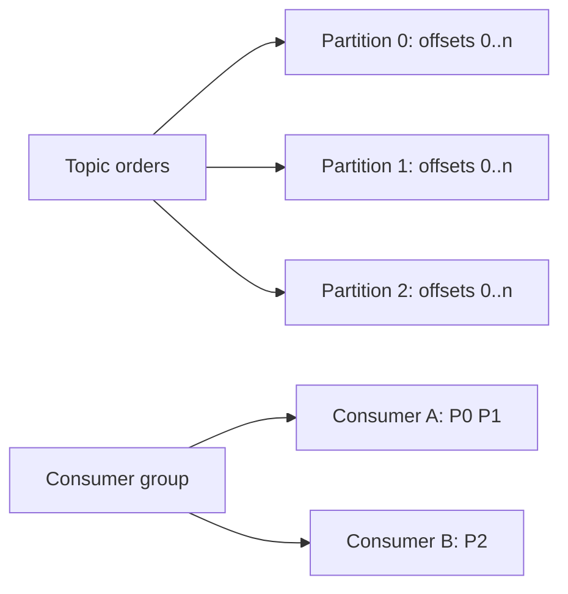

## Topic, partition, record, offset
Topic chia thành partition. Record được append vào một partition và có offset tăng đơn điệu trong partition đó. Ordering chỉ có ý nghĩa trong từng partition, không phải toàn topic. Key thường quyết định partition, vì vậy key là quyết định về cả ordering lẫn load distribution.

## Consumer group và rebalance
Trong một group, mỗi partition tại một thời điểm được gán cho tối đa một consumer. Nhiều consumer hơn partition không tăng parallelism. Membership thay đổi có thể rebalance; consumer phải xử lý pause, revoke, state cleanup và offset commit đúng thứ tự.

## Delivery semantics
At-most-once commit trước xử lý có thể mất message. At-least-once xử lý rồi commit có thể lặp khi crash giữa side effect và commit. Idempotent consumer dùng business key/inbox/unique constraint để duplicate không gây side effect lần hai.

:::warning Exactly-once bị hiểu sai
Kafka transactions và idempotent producer có thể cung cấp exactly-once cho pipeline Kafka-to-Kafka được cấu hình đúng. Chúng không tự làm email, REST call hoặc database ngoài transaction Kafka trở thành exactly-once. End-to-end vẫn cần idempotency và thiết kế boundary.
:::

## Retry và poison message
Retry vô hạn trên consumer thread chặn partition. Chọn retry topic với backoff, giới hạn attempt, dead-letter/quarantine và công cụ replay có audit. Preserve key/order khi business requirement cần; nếu chuyển topic có thể thay đổi ordering semantics.

## Production signals
- Consumer lag theo partition và tốc độ tăng.
- Rebalance frequency/duration.
- Under-replicated partition, ISR shrink và broker disk.
- Produce/fetch latency, request errors, batch/compression ratio.
- Poison message rate và duplicate detected.

## Trả lời phỏng vấn
Partition là đơn vị ordering và parallelism. Consumer group chia partition giữa consumers. At-least-once thường thực dụng nhưng consumer phải idempotent. Exactly-once của Kafka có phạm vi transaction và không bảo đảm side effect ngoài Kafka tuyệt đối không lặp.

## Key Takeaways
- Không có global ordering mặc định.
- Partition count đặt trần consumer parallelism của một group.
- Commit offset là phần của failure semantics.
- Exactly-once phải mô tả rõ boundary.
