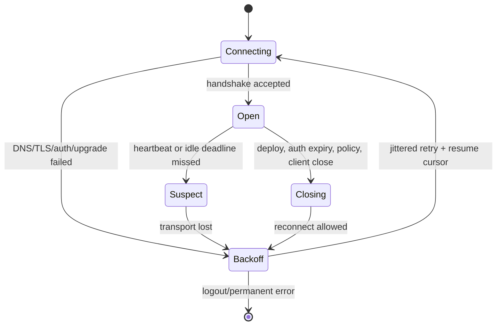

## Mental model: chọn contract, không chọn từ khóa “real-time”

TCP là byte stream hai chiều giữa endpoints; UDP là datagram transport. WebSocket là application protocol có opening handshake, message framing và close lifecycle. SSE là convention truyền event một chiều trên HTTP với media type `text/event-stream`. Polling và long polling dùng request/response HTTP thông thường. Socket.IO lại là library/protocol riêng có event, room, acknowledgement và fallback; client Socket.IO không nói trực tiếp với server WebSocket thuần.

Trước khi chọn, mô tả contract: ai chủ động gửi, latency/freshness chấp nhận được, message có thể mất/duplicate/reorder không, số connection, kích thước/frequency, browser/proxy support, authentication, reconnect và offline behavior. “Real-time” cho dashboard cập nhật mỗi phút khác hoàn toàn collaborative editor.

| Cơ chế | Hướng dữ liệu | State trên server | Khi phù hợp | Chi phí chính |
|---|---|---:|---|---|
| Short polling | Client → server định kỳ | Thấp | Dữ liệu đổi ít, freshness rộng | Request rỗng, latency theo interval |
| Long polling | Client request, server giữ đến event/timeout | Trung bình | Compatibility HTTP, tần suất vừa | Request churn, race khi reconnect |
| SSE | Server → browser | Connection dài | Notification/feed/progress một chiều | Một chiều, buffering/proxy/connection budget |
| WebSocket | Hai chiều | Connection dài | Chat, presence, collaboration | Protocol state, backpressure, scale/drain |

## WebSocket lifecycle và internals cần biết

RFC 6455 định nghĩa opening handshake tương thích HTTP: client yêu cầu upgrade và server chấp nhận bằng response phù hợp; sau đó hai bên trao đổi text/binary messages gồm một hoặc nhiều frames. Browser gửi `Origin`; server phải allowlist origin đáng tin, vì CORS middleware không mặc nhiên bảo vệ WebSocket. Frame browser-to-server được mask theo protocol, nhưng masking không phải encryption; production dùng `wss://` và TLS validation.

Control frames gồm Ping, Pong và Close. Browser WebSocket API truyền thống không cho application trực tiếp phát protocol Ping, nên nhiều ứng dụng thêm heartbeat message ở tầng app hoặc server ping/client pong tùy library. Heartbeat phải phân biệt idle hợp lệ với half-open connection; interval/timeout cân bằng detection time, radio/battery và proxy idle timeout. Close code/reason là diagnostic, không nên chứa token hoặc PII.

Authentication có thể diễn ra bằng cookie trong handshake hoặc application message/token theo architecture. Query-string token dễ lọt access log, browser history hay telemetry. Token hết hạn trong connection dài cần policy: reauthenticate, server close với code quy ước rồi reconnect, hoặc connection lifetime ngắn. Dù đã authenticated, **mỗi subscribe/send action vẫn authorization** theo user, room, tenant và resource hiện tại; không tin `userId` do client gửi.

Mỗi connection tiêu thụ file descriptor, memory buffer, scheduler work và load-balancer state. Đặt limit theo user/IP/tenant, message size, frame rate, subscriptions và outbound queue. Parse/validate schema trước dispatch; compression giúp bandwidth nhưng tăng CPU/memory và cần cấu hình thư viện an toàn. Không deserialize object tùy ý hay đưa message vào shell/query động.

## SSE và HTTP polling lifecycle

SSE response giữ HTTP connection mở, dùng UTF-8 `text/event-stream`. Server phát các field như `event`, `data`, `id`, `retry`, ngăn event bằng dòng trống; nhiều dòng `data` được ghép theo browser behavior. `EventSource` tự reconnect và có thể gửi `Last-Event-ID`, cho phép server resume nếu còn retention. ID chỉ hữu ích khi gắn với cursor ổn định; nếu cursor quá cũ, trả snapshot/resync contract thay vì giả vờ không mất event.

Proxy có thể buffer response làm event đến theo cụm; cần header/proxy config phù hợp và flush có kiểm chứng. Comment heartbeat giúp giữ connection qua intermediary nhưng không thay application freshness. Với nhiều tab/client và HTTP version/proxy khác nhau, connection budget khác nhau; đo trên deployment thật thay vì ghi một giới hạn browser như hằng số phổ quát.

Polling vẫn là baseline tốt. Dùng conditional request (`ETag`/`If-None-Match`) hoặc version cursor để giảm payload; thêm jitter để hàng nghìn client không poll cùng giây. Interval adaptive theo visibility/activity và server `Retry-After`/backoff khi overload. Long polling phải kết thúc bằng event hoặc timeout rồi client mở request mới; gắn cursor để event xuất hiện giữa hai request không bị rơi. GET phải giữ safe semantics; mutation dùng method/idempotency contract riêng.

## Ordering, delivery và backpressure

TCP giữ byte order trên **một connection**, không tạo business total order qua nhiều node, producer hay reconnect. Event cần `eventId`, aggregate/channel và sequence/version nếu order quan trọng. Sau reconnect, client có thể nhận duplicate khi server replay; handler phải deduplicate hoặc update state theo version. “Exactly once WebSocket” thường là khẩu hiệu: transport mất đúng lúc acknowledgement tạo trạng thái unknown, nên side effect cần idempotency key và query/reconciliation.

Browser `WebSocket` API không cung cấp backpressure end-to-end hoàn chỉnh; `bufferedAmount` chỉ là một signal phía client. Server phải bound outbound queue. Policy theo semantics: coalesce vị trí/presence mới nhất, drop telemetry có thể mất, pause upstream, giảm subscription, hoặc disconnect slow consumer với resume cursor. Không để một mobile client chậm giữ vô hạn heap của node. SSE/polling cũng cần backpressure ở broker/worker và rate limit; HTTP không tự giải quyết overload.

## Horizontal scale, deploy và failure scenarios

Connection thuộc một gateway instance. Sticky routing giúp connection tiếp tục ở node đó nhưng không phân phối message từ node khác. Gateway thường đăng ký subscriptions/presence và nhận fan-out từ broker/pub-sub; broker retention/order/delivery phải khớp contract. Presence là soft state có TTL/heartbeat và reconciliation vì disconnect event có thể không tới.

Khi deploy, instance chuyển unready, ngừng nhận connection mới, gửi close/reconnect hint nếu có, drain trong deadline rồi đóng. Client dùng exponential backoff có jitter và cap; server/load balancer cần admission control để tránh reconnect storm. Giữ phiên bản cũ đủ lâu nếu client cached protocol cũ, hoặc version handshake/message schema.

Troubleshooting theo lifecycle:

- **Handshake 400/403/502:** kiểm DNS/TLS, path, `Upgrade`/`Connection`, origin/auth, proxy timeout và protocol negotiation.
- **Kết nối mở nhưng không có event:** kiểm subscription authorization, broker offset, proxy buffering, outbound queue và heartbeat.
- **Disconnect định kỳ:** so với LB/proxy idle timeout, token expiry, server GC/event-loop lag và mobile network change.
- **Duplicate/gap sau reconnect:** kiểm resume cursor retention, ack timing, partition key và client dedup/version.
- **Memory tăng theo connection:** đo buffer/subscription/listener per connection, slow consumer và cleanup khi close.

## Trade-offs và khi không dùng persistent connection

WebSocket giảm request overhead và hỗ trợ hai chiều nhưng tăng stateful operations, security surface và khó cache. SSE đơn giản cho server push nhưng client-to-server vẫn dùng HTTP và binary cần encoding/đường khác. Polling tốn request hơn nhưng observable, cache/proxy-friendly và recovery đơn giản. Nếu dữ liệu đổi thưa, freshness vài chục giây, client ngủ nền hoặc team chưa vận hành connection fleet, polling thường rẻ và đáng tin hơn.

Không đưa command quan trọng vào fire-and-forget channel nếu thiếu acknowledgement/idempotency/audit. Không dùng WebSocket chỉ để né thiết kế REST, và không dùng SSE cho upload/bidirectional collaboration. Transport là delivery path, không thay durable event log hay database.

## Production checklist

- [ ] Contract ghi direction, freshness, order, duplicate/gap, resume và offline behavior.
- [ ] TLS, origin, authentication expiry và per-message authorization được test.
- [ ] Connection/message/subscription/rate/buffer có quota theo tenant và node.
- [ ] Heartbeat, idle timeout và reconnect jitter tương thích proxy/load balancer.
- [ ] Slow-consumer policy và broker overload không tạo unbounded queue.
- [ ] Deploy có unready/drain; protocol/schema hỗ trợ mixed client versions.
- [ ] Dashboard có active/open/close code, handshake error, queue bytes, lag và reconnect rate.
- [ ] Failure drill gồm broker outage, node kill, network flap, expired cursor và reconnect storm.

## Góc phỏng vấn

**SSE khác WebSocket ở đâu?** SSE là event stream server-to-browser trên HTTP với built-in reconnect/last event ID; WebSocket là framed, full-duplex protocol. Chọn theo direction và lifecycle, không chỉ latency.

**TCP ordered thì vì sao event còn sai thứ tự?** Guarantee chỉ trong một connection byte stream. Nhiều producers, partitions, async handlers và reconnect cần sequence/version ở application.

**Scale WebSocket ngang thế nào?** Gateway quản connection, broker/pub-sub phân phối, registry/presence là soft state, mọi queue có bound; sticky session không thay shared message plane.

## Key Takeaways

- Phân biệt transport, protocol và library trước khi so sánh.
- Reconnect chỉ an toàn khi có cursor/resync, duplicate policy và jitter.
- Persistent connection cần quota, backpressure, authorization từng action và graceful drain.
- Ordering của TCP không thay business sequence; acknowledgement không tự tạo exactly-once.
- Polling là lựa chọn production tốt khi freshness rộng và complexity của connection không đáng giá.
