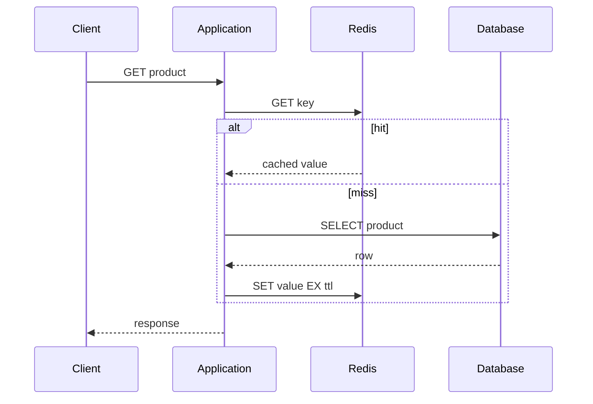

## Cache-aside flow
Ứng dụng đọc cache trước. Cache miss thì đọc source of truth, ghi Redis với TTL rồi trả kết quả. Khi update primary database, thường invalidate key; lần đọc tiếp theo repopulate. TTL giới hạn thời gian stale nhưng không bảo đảm strong consistency.

## Invalidation và race
Write database rồi DEL cache tạo một cửa sổ race: read cũ có thể repopulate sau delete. Giải pháp phụ thuộc tolerance: short TTL, versioned key, delayed double-delete có giới hạn, CDC invalidation hoặc không cache dữ liệu cần read-after-write nghiêm ngặt.

## Ba failure pattern
| Pattern | Triệu chứng | Mitigation |
|---|---|---|
| Stampede | Một hot key hết hạn, nhiều request cùng query DB | single-flight, jitter TTL, refresh-ahead |
| Penetration | Request key không tồn tại luôn miss | validate input, short negative cache |
| Avalanche | Nhiều key hết hạn cùng lúc | TTL jitter, warmup, rate limit |

:::production Redis unavailable
Fail-open về database chỉ an toàn khi database còn headroom. Dùng timeout ngắn, circuit breaker, concurrency limit và load shedding; nếu không cache outage sẽ kéo sập source of truth.
:::

## Eviction, hot key, big key
maxmemory và eviction policy phải khớp vai trò instance. Hot key dồn CPU/network vào một shard. Big key làm command, replication và deletion latency tăng. Theo dõi hit ratio cùng latency và database load; hit ratio cao không chứng minh cache tạo giá trị nếu invalidation sai.

## Distributed lock
Lock Redis không thay thế transaction database. Cần ownership token, expiry và atomic compare-delete khi release. Với correctness nghiêm ngặt, phân tích fencing token và failure model; “SETNX rồi DEL” có thể xóa lock của owner mới sau timeout.

## Trả lời phỏng vấn
Tôi dùng Redis khi cần giảm latency/load cho read hot hoặc primitive dữ liệu phù hợp. Tôi nêu TTL, invalidation, stampede, memory/eviction, HA và fallback. Redis là dependency có thể fail; degradation path phải bảo vệ database.

## Key Takeaways
- Cache là bản sao, source of truth vẫn ở nơi khác.
- TTL là giới hạn staleness, không tự giải quyết invalidation.
- Timeout/circuit/concurrency limit cần đi cùng fallback.
- Đừng dùng distributed lock mà chưa mô hình hóa lease expiry.
