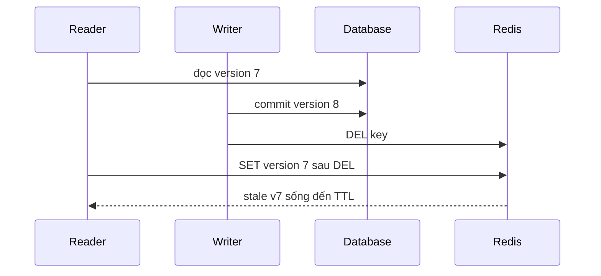

## Bắt đầu bằng consistency contract
Cache là bản sao. Trước thuật toán, định nghĩa endpoint chấp nhận stale bao lâu, có cần read-your-writes không, dữ liệu sai có hậu quả gì, source of truth ở đâu và behavior khi Redis/source lỗi. Product catalog có thể stale vài phút; permission, balance hay inventory reservation thường không nên dùng cùng policy.

TTL chỉ đặt upper bound gần đúng khi cache không được refresh lại bằng dữ liệu cũ; eviction có thể xóa sớm hơn; process/local cache có lifecycle khác. "Có TTL 5 phút" chưa chứng minh user không thấy data 10 phút nếu race repopulation hoặc nhiều lớp cache cộng dồn.

## Cache-aside read path và race cơ bản
Read miss tải database rồi `SET` Redis. Hai readers cùng miss có thể cùng load; thường correctness vẫn được nhưng source chịu duplicate work. Nguy hiểm hơn khi write xen giữa:



Database-then-delete là pattern phổ biến nhưng có cửa sổ stale repopulation. Delete-then-database còn nguy hiểm: reader có thể repopulate old value trước commit và writer không xóa lại. "Double delete + sleep" giảm một số timing nhưng sleep duration khó đúng và không tạo guarantee mạnh.

## Versioned value và conditional publish
Gắn source version/update timestamp vào value giúp phát hiện old payload. Nhưng Redis `SET` mù vẫn có thể overwrite v8 bằng v7. Conditional compare-and-set bằng Lua/Function có thể chỉ accept version mới hơn, miễn source version monotonic và mọi writer theo protocol.

Một cách khác là versioned key: `product:42:v8` và pointer/current version. Old reader ghi `v7` không thay v8 pointer, nhưng quản lý pointer, TTL và garbage collection phức tạp. Với correctness nghiêm, đọc source hoặc transactionally maintained authoritative read model có thể tốt hơn cache trick.

## Write-through, write-behind và invalidation
| Pattern | Write path | Ưu điểm | Failure surface |
|---|---|---|---|
| Cache-aside | DB rồi invalidate | đơn giản, chỉ cache data đọc | stale race/miss burst |
| Write-through | write qua layer cập nhật source/cache | read warm, policy tập trung | dual-write/latency/coupling |
| Write-behind | cache nhận rồi flush source | write nhanh/batch | data loss/order/recovery phức tạp |
| CDC invalidation/update | DB log phát change | tách transaction và cache | lag/duplicate/reorder/schema |

Write-through chỉ consistent nếu layer có atomic mechanism hoặc repair path; Redis và relational DB không tự là một transaction. Write-behind không phù hợp nếu Redis loss làm mất authoritative write, trừ khi durable log/contract giải quyết.

CDC/outbox có thể phát invalidation sau database commit, nhưng eventual lag tồn tại. Consumer idempotent, key/version ordering và reconciliation cần rõ. Delete invalidation thường ít risk overwrite schema hơn cập nhật full value, đổi lại cache miss sau change.

## Stampede, avalanche và penetration
Stampede: một hot key hết hạn/miss và nhiều requests cùng tải source. Avalanche: nhiều keys hết hạn/evict hoặc Redis outage đồng thời. Penetration: request keys không tồn tại luôn bypass cache. Ba vấn đề cần layer khác nhau.

TTL jitter giảm đồng bộ expiration nhưng không chữa single hot key. Negative cache giảm repeated not-found nhưng TTL ngắn và invalidation khi entity được tạo; không cache authorization/business failure tùy tiện. Bloom filter có false positives/refresh lifecycle và chỉ đáng dùng ở scale phù hợp.

## Single-flight/coalescing
Trong một process, map promise/future theo key cho một loader và nhiều waiters. Giới hạn map size, deadline, cleanup cả success/error và không giữ failed future quá lâu. Multi-instance vẫn có một loader mỗi instance; distributed lock giảm hơn nhưng thêm lease/failure complexity.

```text title="Pseudo-flow bounded single-flight"
if cache hit -> return
loader = inFlight.computeIfAbsent(key, startLoad)
try await loader with request deadline
finally remove only if same loader completed
```

Không để hàng nghìn waiters vô hạn trên một load. Có concurrency limit, stale-while-revalidate, timeout và load shedding.

## Refresh-ahead và stale-while-revalidate
Refresh-ahead cập nhật hot key trước hard expiry. Cần xác định hotness, refresh ownership và không refresh toàn keyspace. Stale-while-revalidate phục vụ giá trị stale trong grace window trong khi một worker refresh; availability tốt nhưng chỉ dùng nếu business cho phép staleness.

Soft TTL quyết định refresh; hard TTL quyết định không được serve sau thời điểm nào. Payload lưu `loadedAt/sourceVersion`; metric theo age giúp kiểm soát thay vì chỉ hit ratio.

Nếu refresh lỗi, retry có backoff/jitter và giữ stale có giới hạn. Infinite stale biến cache thành source không kiểm soát.

## Bảo vệ source khi Redis outage
Fail-open thẳng về database có thể biến cache outage thành database outage. Tính worst-case uncached QPS và source headroom. Các guard:
- Redis timeout rất ngắn so với request budget;
- circuit breaker để ngừng gọi dependency đang lỗi;
- bulkhead/concurrency semaphore quanh source load;
- request coalescing và stale local fallback;
- rate limit/load shedding theo priority;
- warmup dần, không nạp toàn bộ đồng thời khi Redis hồi phục.

Recovery còn nguy hiểm: cold cache kéo miss storm. Prewarm hot set có đo, ramp traffic và TTL jitter; không scan/load mọi record theo bản năng.

## Client-side cache invalidation
Redis server-assisted client-side caching theo dõi keys/prefix và gửi invalidation. Nó giảm network nhưng thêm một lớp stale risk. Nếu invalidation connection mất, client phải flush cache theo protocol/library; nếu cứ giữ local values thì staleness vô hạn.

Broadcasting mode đổi server tracking memory lấy nhiều invalidation messages; key prefix design quyết định fan-out. Data update quá thường xuyên có thể làm invalidation overhead lớn hơn benefit.

## Observability cho correctness
Hit ratio cao không chứng minh đúng hoặc nhanh. Theo dõi cache latency/error, hit/miss theo operation, load coalescing waiters, source load, item age/source version mismatch, invalidation lag, eviction, negative hit và refresh failure. Sampling comparison cache-vs-source có privacy/load controls giúp phát hiện drift; reconciliation cho derived cache nếu cần.

## Failure scenarios
- DB commit thành công nhưng invalidation mất; stale sống tới TTL.
- Slow reader repopulate version cũ sau writer delete.
- Mọi key TTL tròn 10 phút, avalanche định kỳ.
- Distributed lock loader hết lease, nhiều owner cùng query source.
- Redis outage làm toàn traffic fail-open vào database.
- Negative cache giữ "not found" sau entity vừa được tạo.
- Local cache bỏ lỡ invalidation và không flush khi disconnect.
- Refresh worker lỗi nhưng stale được serve vô hạn không alert.

:::production Cache design checklist
Phân loại data theo stale tolerance; chọn source/version; vẽ read/write races; TTL+jitter; single-flight/concurrency limit; negative cache policy; soft/hard expiry; invalidation delivery + repair; fail-open/closed per endpoint; cold-start plan; metrics item age/source load; chaos test Redis timeout, lost invalidation và slow reader race.
:::

## Góc phỏng vấn
"Update DB rồi DEL cache đã consistent chưa?" — Nó thực dụng nhưng còn race: reader lấy old DB value trước commit và SET sau DEL. Có thể giảm bằng version/CAS, CDC invalidation, short TTL hoặc tránh cache data cần strong read. Cần nói stampede/source protection và repair, không chỉ thứ tự hai lệnh.

## Key Takeaways
- Consistency bắt đầu từ business freshness, không từ TTL.
- Cache-aside có stale repopulation race dù DB-then-delete.
- Jitter chữa synchronized expiry; single-flight chữa concurrent loader.
- Fail-open phải có bulkhead/load shedding để bảo vệ source.
- Nhiều lớp cache cần invalidation disconnect và max-age contract rõ.
