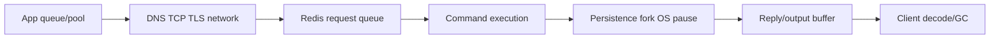

## Ba khái niệm khác nhau
Big key dùng nhiều bytes hoặc có quá nhiều elements. Hot key nhận tỷ lệ QPS/bandwidth bất thường. Slow command chiếm execution time dài cho một invocation. Một key 5 KB có thể hot vì hàng trăm nghìn GET/s; một sorted set 5 GB có thể ít truy cập nhưng một `ZRANGE` lớn làm latency spike; command O(1) vẫn quá tải khi request rate vượt CPU/network.

Remediation khác nhau: shard cluster không chia một key đơn lẻ; tăng memory không chữa O(N) command; đổi command không chữa cross-zone network. Bắt đầu bằng timeline và layer.

## Latency budget từ client đến server rồi quay lại
Observed latency gồm queue trong application, connection pool, DNS/TCP/TLS, network, Redis input queue, command execution, persistence/fork pauses, output buffer/network và client deserialization/GC. SLOWLOG chỉ đo thời gian server thực thi command, không gồm network I/O chờ client. Vì vậy SLOWLOG trống trong khi request chậm hướng điều tra sang queue/network/client hoặc Redis pauses không thuộc command execution.

Đo p50/p95/p99/max theo operation và shard; average che spike. Đồng bộ clock/tracing cẩn thận và không thêm high-cardinality key values trực tiếp vào metrics.

## Baseline intrinsic và network latency
`redis-cli --intrinsic-latency` chạy trên server giúp ước lượng scheduler/virtualization pause nền. `redis-cli --latency` từ client path giúp thấy round-trip. Chạy tool có scope/thời gian rõ vì chính diagnostic tạo load.

Cross-zone/region RTT đặt floor; pipelining/batching giảm round trips nhưng tăng queue/memory và per-batch tail latency. Connection tạo mới/TLS handshake thường đắt hơn reuse; pool quá lớn lại tăng concurrent queue và server/client buffers.

## SLOWLOG và command complexity
SLOWLOG ghi commands vượt threshold theo server execution time. Inspect command type/duration, nhưng redact/ACL log access vì arguments có thể chứa sensitive data tùy output/version/config. Đặt threshold đủ bắt incident mà không flood/overhead.

Commands như `KEYS`, `HGETALL`, `SMEMBERS`, set union/intersection, list removal hoặc Lua loop trên collection lớn có cost theo N. Big-O trong docs là bước đầu; N, element bytes và reply size quyết định latency thật.

`SCAN` incremental an toàn hơn `KEYS` cho online iteration, nhưng không tạo consistent snapshot, có thể trả duplicate và vẫn tốn toàn bộ công theo nhiều calls. Client phải bound `COUNT`, rate-limit và xử lý duplicate.

## LATENCY monitor tìm event/pause
Latency monitor ghi samples theo event class và cung cấp `LATENCY LATEST`, `HISTORY`, `DOCTOR` theo configuration. Nó giúp phân biệt command, fork, AOF fsync, eviction/expire cycle hoặc other internal events được instrument.

Fork cho RDB/AOF rewrite có copy-on-write memory pressure; write-heavy workload sau fork làm copy nhiều pages. Transparent Huge Pages, swapping, noisy neighbor và slow storage/fsync là OS causes thường gặp. Không kết luận Redis CPU chỉ từ application response time.

## Tìm big keys mà không gây incident
`MEMORY USAGE key [SAMPLES n]` ước lượng bytes của key và nested values. Cardinality commands như `HLEN`, `SCARD`, `ZCARD`, `XLEN`, `LLEN` thường rẻ hơn tải toàn content. `redis-cli --bigkeys`/`--memkeys` và SCAN-based tools vẫn quét keyspace, phải chạy replica/off-peak, rate-limit và hiểu cluster cần kiểm tra từng shard.

Sample từ application telemetry có thể tốt hơn full scan: record approximate payload/cardinality khi write, hoặc sampling keys theo namespace. Không dùng `DEBUG OBJECT`/admin command tùy tiện trên managed/production.

Big-key threshold phụ thuộc type và SLO. String 10 MB làm network/copy spike; hash triệu fields làm HGETALL/delete/migration nặng; stream pending entries và consumer metadata có lifecycle riêng.

## Tìm hot keys
Hot key có thể lộ qua per-command/key sampling, client telemetry, Redis tooling/monitoring hoặc shard-level imbalance. `MONITOR` trên production có overhead và data leakage; chỉ dùng khi documentation/runbook cho phép, thời gian cực ngắn và filter/secure output.

Cluster hot key thường hiện một shard CPU/network cao, latency cao trong khi shard khác nhàn. Thêm nodes không tự split key vì key hash vào một slot. Hashtag còn có thể dồn nhiều logical keys vào một slot.

## Remediation big key
- Không `GET/HGETALL` toàn object: split theo bounded chunks/fields, paginate/range.
- Đặt retention/trim cho list/stream/sorted-set time series.
- Xóa bằng cơ chế asynchronous/non-blocking phù hợp khi supported; theo dõi memory reclaim.
- Precompute bounded views thay vì set operation khổng lồ trên request path.
- Giới hạn payload tại API/write boundary và reject trước khi data phình.
- Migration schema từng bước; split key có consistency/dual-read lifecycle.

Split quá nhỏ tăng per-key memory overhead, multi-key roundtrips và cluster coordination. Tìm granularity từ access pattern.

## Remediation hot key
Read hot có thể dùng in-process/client-side cache, replicas hoặc duplicate/sharded keys với staleness/invalidation contract. Write hot counter có thể shard counter rồi aggregate, nhưng strong instantaneous total mất đi. Một global lock/rate key có thể partition allowance theo tenant/time bucket hoặc chuyển primitive.

Request coalescing/single-flight giảm concurrent cache misses; rate limit/admission control bảo vệ Redis. Local cache invalidation mất connection phải flush để không serve stale vô hạn.

## Output buffers và large response
Slow consumer hoặc Pub/Sub/replication client có thể tích output buffer và memory. Big reply còn giữ network thread/client heap, gây GC/timeout rồi retry storm. Bound response, configure client buffer limits theo role và monitor connected clients/buffer memory.

## Failure scenarios
- SLOWLOG trống nên tuyên bố Redis nhanh, bỏ qua network/pool/fork pause.
- Chạy `KEYS *` hoặc full `MONITOR` giữa incident và làm outage nặng hơn.
- Thêm shard nhưng hot key vẫn ở một slot.
- Dùng `SCAN COUNT` rất lớn, biến incremental scan thành burst.
- Delete big collection đồng bộ tạo latency spike.
- Retry timeout không giới hạn, nhân QPS đúng lúc Redis đã quá tải.
- Local cache bỏ lỡ invalidation nhưng không flush khi reconnect.
- Alert average latency trong khi p99 theo một shard vượt SLO.

:::production Troubleshooting runbook
Khoanh thời gian/shard/command; đo app queue + network + Redis p99; kiểm tra SLOWLOG và LATENCY events; xem CPU, RSS/swap, disk fsync/fork, network/output buffers; sample key size/cardinality an toàn; xác nhận hot distribution; giảm load/retry trước; sửa data pattern; canary và theo dõi tail latency, eviction, replication và downstream behavior.
:::

## Góc phỏng vấn
"Redis chậm nhưng SLOWLOG không có gì, điều tra gì?" — SLOWLOG không đo network/client queue và không bao phủ mọi pause. Kiểm tra client pool/timeout, RTT, intrinsic latency, LATENCY monitor, fork/fsync/OS, output buffers, shard skew và retry load; trace end-to-end trước khi scale.

## Key Takeaways
- Big, hot và slow là ba trục độc lập.
- SLOWLOG chỉ là server command execution, không phải request latency toàn trình.
- Diagnostic keyspace phải incremental, scoped và rate-limited.
- Một hot key không tự được cluster chia nhỏ.
- Sửa access pattern và retry/backpressure thường quan trọng hơn thêm node.
