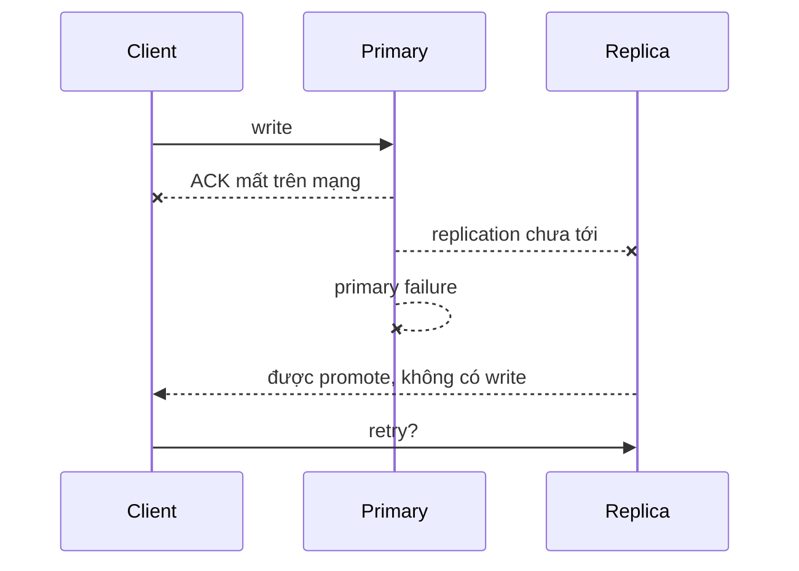

## Bốn câu hỏi tách biệt
Persistence trả lời "process/node restart thì dữ liệu nào còn?" Replication trả lời "có bản sao và read/failover thế nào?" Sentinel hỗ trợ discovery/monitoring/failover cho primary-replica không shard. Redis Cluster shard keyspace và có cơ chế failover theo shard. Backup/restore và disaster recovery lại là quy trình riêng.

Không được gộp tất cả thành từ "HA". Hãy đặt RPO, RTO, loss tolerance và consistency requirement cho từng workload: cache có thể rebuild khác session, rate limit hay coordination state.

## RDB và AOF
RDB tạo point-in-time snapshot. Nó compact và thuận lợi cho backup/startup trong nhiều tình huống, nhưng crash có thể mất thay đổi từ snapshot gần nhất. Snapshot/fork còn cần memory headroom do copy-on-write dưới write workload.

AOF ghi lại write command và có policy fsync. `appendfsync always` ưu tiên durability nhưng thêm latency/I/O; `everysec` thường cân bằng hơn nhưng có cửa sổ mất dữ liệu; `no` giao nhiều hơn cho OS. AOF rewrite compact log nhưng vẫn tiêu thụ CPU/I/O và memory.

Redis hỗ trợ kết hợp RDB+AOF. Lựa chọn không thay thế backup ngoài failure domain, kiểm tra restore và monitoring disk corruption/full.

| Mode | Điểm mạnh | Failure/cost cần chấp nhận |
|---|---|---|
| Không persistence | cache thuần, restart nhanh theo data size | mất toàn bộ dataset local |
| RDB | snapshot compact | mất thay đổi giữa snapshots |
| AOF every second | RPO thường ngắn hơn | log/rewrite và cửa sổ fsync |
| RDB + AOF | nhiều lựa chọn recovery | vận hành và resource cost cao hơn |

## Replication là asynchronous theo mặc định
Primary gửi stream command cho replica. Sau disconnect, replica cố partial resynchronization từ backlog; nếu không đủ history thì full sync. Full sync/load dataset lớn có thể tạo network, disk, CPU và blocking window.

Acknowledged write trên primary chưa chắc đã đến replica được promote khi failure xảy ra. `WAIT` có thể yêu cầu số replica acknowledge trong thời gian, nhưng Redis Cluster documentation vẫn không quảng cáo strong consistency; timeout/partition và durability local vẫn phải được mô hình hóa.

:::warning Cấu hình primary không persistence
Nếu primary tự restart với dataset rỗng trước failover, replica có thể đồng bộ thành rỗng theo primary. Tài liệu Redis khuyến cáo thận trọng; khi data safety quan trọng, persistence và restart/failover policy phải được thiết kế cùng nhau.
:::

## Sentinel: failover cho topology không shard
Sentinel theo dõi instance, cung cấp notification/discovery và phối hợp failover primary. Client phải hỗ trợ Sentinel discovery và reconnect; failover không làm in-flight command có kết quả chắc chắn. Application vẫn cần timeout, retry classification và idempotency.

Sentinel quorum giúp nhiều monitor đồng thuận về failure; nó không thay thế số replica, placement theo failure domain hay backup. Một topology chạy chung một host không trở thành HA chỉ vì có ba process Sentinel.

## Redis Cluster: 16,384 hash slots
Cluster ánh xạ key vào slot rồi slot vào primary shard. Client cluster-aware nhận redirect và cập nhật topology. Multi-key operation thường yêu cầu key cùng slot; hash tag `{...}` ép phần key dùng để hash.

```text title="Cùng slot cho một atomic operation có chủ đích"
cart:{user-42}:items
cart:{user-42}:version
```

Hash tag giúp transaction/script multi-key nhưng cũng có thể tạo hot shard. Data model nên ưu tiên operation locality mà vẫn phân phối tenant lớn. Resharding/migration tạo redirect và latency, cần client đúng, timeout và observability.

Redis Cluster dùng replication bất đồng bộ và có cửa sổ mất acknowledged write trong failure scenario. Majority partition giúp availability model nhưng không biến hệ thống thành linearizable store.

## Failover timeline và ambiguous outcome
Client gửi `SET`, primary áp dụng nhưng response mất; client không biết command đã xảy ra. Retry một command không idempotent có thể nhân side effect. Trong failover, DNS/discovery/topology refresh, connection pool và retry storm thường quan trọng không kém thời gian election.



Thiết kế cần phân biệt command safe-to-retry, idempotency token và state có thể rebuild. Với correctness quan trọng hơn availability, Redis có thể không phải nơi authoritative phù hợp.

## Backup, restore và upgrade
Copy file không đủ nếu snapshot/AOF không nhất quán hoặc encryption/access control sai. Drill phải phục hồi vào môi trường cô lập, kiểm tra dataset/application invariants và đo RTO. Upgrade rolling cần compatibility, persistence format, replica promotion và rollback plan theo đúng release documentation.

## Failure scenarios
- Replica lag cao nhưng dashboard chỉ nhìn primary latency.
- AOF/RDB ghi đầy disk, fork/rewrite gây memory spike và OOM.
- Cluster client không xử lý `MOVED`/`ASK`, outage khi reshard.
- Tất cả primary và replica của shard nằm cùng failure domain.
- Failover thành công nhưng retry storm kéo cluster mới xuống.
- Backup tồn tại nhưng credentials/config/version để restore không còn.

:::production Checklist
Phân loại workload cache hay authoritative; đặt RPO/RTO; chừa memory/disk headroom; bố trí replica khác failure domain; monitor replication offset/lag, backlog, fork, persistence error và slot health; dùng cluster/Sentinel-aware client; chaos test failover và network partition; restore drill định kỳ; giới hạn retry bằng deadline/jitter.
:::

## Góc phỏng vấn
"Redis replication có đảm bảo không mất dữ liệu khi failover?" — Không tuyệt đối: replication bất đồng bộ tạo cửa sổ replica chưa nhận write. Persistence, `WAIT`, placement và failover tuning thay đổi xác suất/contract nhưng phải đọc đúng giới hạn; với invariant nghiêm ngặt cần authoritative system phù hợp.

## Key Takeaways
- Persistence, replication, failover, sharding và backup là năm concern khác nhau.
- RDB/AOF đổi durability lấy resource/latency, không có lựa chọn miễn phí.
- Async replication có acknowledged-write loss window.
- Redis Cluster yêu cầu data locality và cluster-aware client.
- HA chỉ có ý nghĩa khi đã test failure và restore theo SLO.
