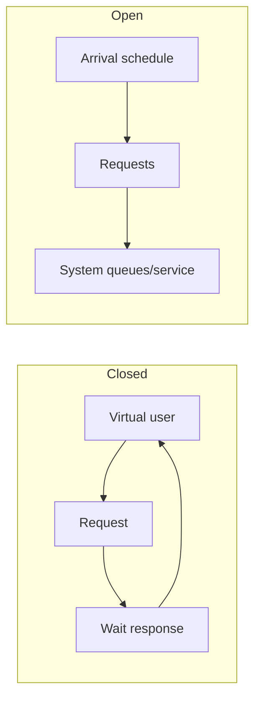

## Performance test phải trả lời một quyết định

“Hệ thống chịu được bao nhiêu request?” thiếu workload, SLO và failure assumptions. Một test có giá trị trả lời câu hẹp: với traffic mix, payload/data distribution, cache state và deployment này, mức arrival rate nào giữ error cùng p99 trong SLO; khi vượt ngưỡng hệ thống degrade/recover thế nào.

Bốn biến luôn đọc cùng nhau:

- Throughput/arrival/completion rate.
- Latency distribution tách queue và service time nếu có thể.
- Concurrency/in-flight/queue depth.
- Saturation/error ở CPU, memory, pools, DB, broker và downstream.

Nếu throughput dừng tăng nhưng concurrency/latency tiếp tục tăng, ta đã qua useful capacity dù error chưa xuất hiện. “Không crash” không phải pass.

## Open model và closed model

Closed workload thường mỗi virtual user gửi request mới sau response/think time. Khi server chậm, generator tự giảm arrival rate: nó tạo feedback làm graph trông ổn hơn đúng lúc production queue sẽ tăng. Open workload schedule arrivals độc lập với response, gần hơn traffic từ nhiều user/event sources.



Không có model nào luôn đúng. Batch worker pull next task sau completion có thể closed; public API arrivals thường gần open trong cửa sổ peak. Ghi rõ model và arrival distribution. “100 concurrent users” không quy đổi duy nhất thành requests/second nếu think time và response time không biết.

## Coordinated omission

Nếu generator dự kiến gửi mỗi 100 ms nhưng đợi response 5 giây trước request kế, nó bỏ qua hàng chục samples đáng lẽ đến trong pause. Histogram đo request đã gửi chứ không đo trải nghiệm arrivals bị trì hoãn, làm tail thấp giả.

Giải pháp là generator schedule theo intended arrival hoặc hiệu chỉnh coordinated omission có assumptions rõ. Đồng thời xác minh generator không hết CPU/socket và clock đủ ổn. Client-side latency gồm queue của generator/network; server trace chỉ thấy request sau khi đã tới, nên cần cả hai phía.

:::warning Generator cũng là hệ thống
Load generator có connection pool, ephemeral ports, TLS/CPU và network limit. Nếu nó saturation trước server, kết luận capacity sai. Theo dõi generator resource và phân tán nó khi cần.
:::

## Latency distribution và histogram

Average che minority rất chậm. p99 nghĩa 99% observations không lớn hơn giá trị đó trong đúng population/window, không có nghĩa một user chỉ gặp 1% slow nếu họ tạo nhiều requests hoặc fan-out.

Histogram bucket cho phép aggregate qua instances nếu boundaries hợp lý; quantile từ bucket là estimate. Summary quantile thường không aggregate theo cách trực giác. Bucket quá thưa quanh SLO làm quantile/burn analysis kém; cardinality quá cao làm backend metrics overload.

Không average percentiles từ Pods. Gộp histogram counts/sums/buckets hoặc query raw distribution theo telemetry system. Ghi unit và window; p99 một phút có độ nhiễu khác p99 một giờ. Max hữu ích cho anomaly nhưng rất nhạy outlier.

## Little's Law như sanity check

Trong steady state ổn định:

```text
L = λ × W
```

`L` là average items trong hệ thống, `λ` throughput và `W` average time. Ví dụ nếu completion 200 requests/s và average end-to-end 0,1 s, average in-flight xấp xỉ 20. Đây là quan hệ đo đạc, không phải công thức chọn thread pool trực tiếp.

Nếu in-flight đo được khác xa, kiểm scope/time window, retries, streaming/background work và hệ thống chưa steady. Little's Law cũng giải thích queue memory: arrival vượt completion dù chỉ một thời gian sẽ tích backlog theo chênh lệch.

Utilization gần 100% thường làm queue wait tăng phi tuyến vì variability. Capacity plan cần headroom cho burst, failover, maintenance và measurement error, không chạy steady ở cliff point.

## Workload model representative

Một workload specification nên version-control:

| Dimension | Ví dụ cần mô tả |
|---|---|
| Traffic mix | read/write/search/background percentages theo peak |
| Arrival | steady, diurnal ramp, burst, campaign, retry behavior |
| Data | cardinality, skew/hot tenant, payload percentiles, existing volume |
| State | cold/warm cache, connection reuse, authenticated sessions |
| Dependency | latency/error distribution và rate limits, không chỉ mock 0 ms |
| Correctness | invariant/checksum/duplicate/lost effect sau test |
| Deployment | replicas, requests/limits, JVM flags, pool sizes, versions |

Uniform random IDs thường làm cache/index behavior quá đẹp hoặc quá xấu so với Zipf/hot-key production. Dataset nhỏ vừa RAM không tái hiện IO/bloat/planner. Seed phải reproducible nhưng không khiến mọi user tranh đúng một row trừ khi đó là scenario cần test.

## Các phase khác nhau trả lời câu khác nhau

1. Smoke: script/telemetry/correctness có hoạt động.
2. Baseline: load thấp để biết service time và cost không queue.
3. Step/ramp: tăng arrivals từng mức, chờ steady, tìm knee/cliff.
4. Stress: behavior trên capacity—shed, timeout hay memory queue.
5. Spike: burst và autoscaling/cold start.
6. Soak: leak, bloat, compaction, rotation và thermal effects qua nhiều chu kỳ.
7. Failure/recovery: dependency slow/down, replica loss, deploy, cache flush; đo time-to-recover và herd.

Không chạy stress destructive trên production nếu không có scope/safety. Production canary/shadow có evidence thật nhưng privacy, side effect và blast radius phải kiểm soát.

## Capacity envelope thay vì một con số

Ghi bảng theo offered load:

| Arrival | Completion | p50/p95/p99 | Error/shed | Queue | Bottleneck |
|---|---|---|---|---|---|
| low | gần arrival | baseline | 0 | ổn | none |
| rising | theo arrival | tăng nhẹ | trong budget | bounded | headroom giảm |
| knee | bắt đầu lệch | tail tăng nhanh | xuất hiện | tăng | resource X |
| overload | thấp hơn arrival | deadline vượt | shed/timeout | phải bounded | protected/degraded |

Useful capacity là mức đạt SLO với headroom và failure assumption, không phải highest throughput trước crash. Failover capacity có thể thấp hơn normal; nếu mất một zone/replica là scenario thiết kế thì phải test.

## Measurement map

Client: scheduled/sent/completed, latency histogram, timeout/cancel, connection/TLS.

Ingress/app: admitted/rejected, in-flight, queue wait, executor, allocations/GC, CPU/throttling, endpoint trace.

Data/dependencies: pool acquire, query/lock/IO, cache hit cùng origin load, Kafka lag/rebalance, external latency/rate limit.

Deployment: replicas, rollout version, requests/limits, autoscaler desired/current, restart/OOM.

Correlation theo timestamp/version/scenario. Metric name không đủ; cần biết nó đo wall time, CPU time, cumulative counter hay gauge sample. Dashboard mới tạo chưa chứng minh instrumentation đúng—đối chiếu một request/known workload.

## Bottleneck workflow

1. Chốt SLO vi phạm và load level đầu tiên xuất hiện.
2. Tách queue time khỏi active service; xem throughput đã plateau chưa.
3. Tìm resource saturation hoặc serial contention trên critical path.
4. Dùng trace/profile/query plan để tạo hypothesis cụ thể.
5. Thay một control: code/query/index/pool/admission/capacity.
6. Replay cùng workload/data/state, so correctness và cost.
7. Test overload/recovery để chắc fix không chỉ dời cliff nguy hiểm hơn.

Nếu tăng thread pool làm completion không tăng nhưng DB wait và p99 tăng, bottleneck là downstream/capacity chain. Nếu cache tăng hit nhưng DB không giảm, có thể key/query path sai hoặc miss coalescing thiếu. Evidence phải nối cause-effect.

## Các benchmark sai thường gặp

- Chỉ test happy-path read với cache warm.
- Dùng average, bỏ error/timeout khỏi latency sample.
- Test database trống và payload nhỏ cố định.
- So hai build khác config/infra/time mà gọi là code improvement.
- Benchmark micro rồi suy ra end-to-end capacity.
- Không verify business row/event count, nên throughput “cao” do bỏ work.
- Bắt đầu test ngay khi JVM/JIT/cache còn warm-up khác nhau.
- Autoscaler che saturation bằng thêm replicas nhưng DB đã gần cliff.
- Kết thúc load rồi không đo drain/recovery/backlog.

## Trả lời phỏng vấn

:::interview Làm sao tìm capacity của API?
Tôi định nghĩa workload và SLO trước, dùng open arrival model representative, theo dõi offered/completed throughput, latency histogram, errors, in-flight/queue và mọi pool/downstream. Tôi ramp tới knee, chọn useful capacity có headroom, rồi test spike, soak và dependency/failover. Tôi kiểm coordinated omission, generator saturation và correctness trước khi tin con số.
:::

Senior follow-up: tại sao không average p99; Little's Law dùng sao; closed workload che overload thế nào; cache warm/cold; failover capacity; load shedding được tính success hay error; verify không mất business effect.

## Key Takeaways

- Performance test phải gắn với workload, SLO và decision.
- Offered load khác completion; queue có thể che overload tạm thời.
- Open/closed model và coordinated omission quyết định tail có đáng tin.
- Capacity là envelope có headroom/failure behavior, không phải record throughput.
- Correctness, recovery và generator health là phần của kết quả benchmark.
