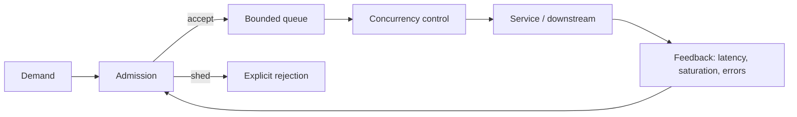

## Overload là khi demand vượt useful capacity

Overload không chỉ là CPU 100%. Database lock, connection pool, memory allocation, broker partition, external quota hoặc một serialized critical section đều có thể giới hạn completion. Khi arrival `λ` lớn hơn service rate `μ`, backlog tăng theo thời gian. Queue unbounded chỉ trì hoãn error và biến nó thành latency/memory outage.



Mục tiêu không phải hoàn thành mọi work bằng mọi giá. Mục tiêu là giữ invariant, hoàn thành work quan trọng còn deadline, reject sớm phần không thể hoàn thành và hồi phục nhanh.

## Bốn controls khác nhau

| Control | Giới hạn | Phù hợp | Không tự giải quyết |
|---|---|---|---|
| Rate limit | arrivals/time | quota, abuse, sustained capacity | request chậm giữ resource lâu |
| Concurrency limit | in-flight | DB/API/CPU scarce resource | burst queue trước admission |
| Bounded queue | waiting work | hấp thụ burst ngắn, tách producer/consumer | overload kéo dài |
| Backpressure | feedback producer | stream/pipeline có protocol hỗ trợ | external clients bỏ qua feedback |

Rate 100/s với mỗi request 10 s tạo khoảng 1.000 in-flight; vì thế rate không thay concurrency. Concurrency 100 nhưng request service 10 ms có thể đạt throughput khác concurrency 100 với 2 s. Dùng cả deadline và resource-specific limit.

Backpressure chỉ end-to-end khi upstream giảm/hoãn production. Reactive demand signal dừng một publisher tuân thủ; nó không làm browser, Kafka producer hay partner API tự giảm. Tại boundary không kiểm soát, cần buffer hữu hạn rồi shed/spill theo semantics.

## Bound mọi queue

Liệt kê queue ẩn: ingress accept/backlog, HTTP server, executor, connection pool waiters, DB locks, client pool, Kafka lag, retry scheduler, telemetry exporter. Mỗi queue cần:

- Capacity theo memory/deadline, không theo cảm giác.
- Enqueue timeout hoặc immediate reject.
- Ordering/priority/fairness.
- Metric depth và oldest age.
- Full policy: reject newest/oldest, drop/coalesce/spill hay block.
- Drain/recovery plan.

Queue length không so được giữa traffic rates; oldest age/deadline remaining cho biết work còn giá trị. Một queue 1.000 items ở 10.000/s nhỏ, ở 1/s là backlog dài.

:::warning Queueing collapse
Request hết deadline nhưng vẫn nằm queue, sau đó chiếm CPU/DB để tạo response không ai dùng. Propagate cancellation/deadline và loại expired work trước expensive stage.
:::

## Admission control đặt trước scarce resource

Giới hạn gần resource cần bảo vệ. Database concurrency limiter trước khi acquire/execute query; expensive report limit riêng với point lookup; tenant fairness trước global pool. Một global semaphore có thể để request chậm chiếm hết slot và chặn health/admin.

Static limit dễ hiểu nhưng không theo latency/capacity drift. Adaptive concurrency có thể quan sát queue/latency để điều chỉnh, nhưng control loop có noise/oscillation và cần min/max/fallback. Bắt đầu static từ load test, monitor và chỉ thêm adaptive khi team vận hành được.

Priority không nên là hai queue không giới hạn. Reserve capacity hoặc weighted fair scheduling, age/deadline và starvation guard. “VIP” traffic vẫn cần cap; nếu không một tenant premium có thể giết control plane.

## Load shedding rõ semantics

Shed sớm rẻ hơn timeout muộn. HTTP có thể dùng 429 cho rate policy, 503 cho temporary capacity, `Retry-After` khi estimate có ý nghĩa. Response không được giả success. Mutation chưa admitted không được tạo partial effect; nếu accepted async, trả operation ID và durable status.

Các degradation hợp lệ tùy business:

- Bỏ optional enrichment/recommendation, giữ core result.
- Giảm result/page/candidate count.
- Trả cache stale trong freshness/security bound.
- Coalesce latest-wins updates như presence.
- Delay batch/marketing, giữ transactional traffic.
- Disable expensive export với explicit retry later.

Không trả stale authorization/balance tùy tiện. Degradation matrix phải được product/security duyệt và test trước outage.

## Deadline và timeout budget

Deadline là thời điểm end-to-end hết giá trị; timeout là limit của một attempt/stage. Nếu ingress còn 500 ms, downstream timeout 2 s là vô nghĩa. Mỗi hop trừ queue/processing margin và truyền cancellation khi framework/protocol hỗ trợ.

Timeout quá dài giữ slots; quá ngắn tạo retry và false failure. Chọn từ latency distribution + SLO/dependency contract, không cùng một giá trị cho connect/TLS/read/overall. Outcome unknown của mutation cần idempotency/status reconciliation.

## Retry budget chống amplification

Retry chỉ dùng phần capacity nhỏ và một layer có context. Budget có thể giới hạn retries/original requests hoặc token pool; khi hết thì fail fast. Exponential backoff+jitter tránh herd nhưng không tạo capacity.

Nếu downstream đang saturation, client retry làm offered load tăng. Circuit breaker cắt calls lỗi; bulkhead/concurrency bảo vệ slots; load shedding giảm demand. Các controls phải phối hợp, không stack defaults ngẫu nhiên ở ingress, service mesh, SDK và application.

## Async queue và Kafka lag

Broker durable cho phép buffer outage hữu hạn nhưng không làm backlog miễn phí. Nếu producer 10k/s, consumer 8k/s thì lag tăng 2k/s; retention/deadline sẽ hết. Tăng consumers chỉ tới partition count và downstream capacity. Scale consumer có thể làm rebalance; database sink có thể là bottleneck thật.

Monitor oldest event age, per-partition lag/skew, processing time/error và estimated drain time:

```text
drain time ≈ backlog / (sustainable completion - current arrival)
```

Nếu completion không lớn hơn arrival, không có drain. Pause low-priority producers, shed/expire, increase proven capacity hoặc reduce per-item work. Replay/DLQ phải rate limit để không tranh live traffic.

## Autoscaling là delayed feedback

HPA quan sát metrics theo interval, scheduler đặt Pod, image pull/startup/readiness mất thời gian. Burst ngắn có thể kết thúc trước scale-out. CPU metric cũng có thể phản ứng muộn với I/O/queue bottleneck; custom queue-age/in-flight signals cần stable target và downstream budget.

Scale application từ 10 lên 100 Pods có thể nhân DB connections/retries. Global capacity constraint phải feed vào max replicas, pool per Pod và admission. Scale-in cần drain và tránh oscillation; stabilization/cooldown theo platform/version.

:::production Capacity khi failover
Nếu service chỉ đạt SLO khi mọi replica/zone khỏe, nó không có failure headroom. Admission thresholds và load test phải bao gồm replica loss/deploy, không chỉ normal fleet.
:::

## Cache outage và fallback storm

Cache giảm origin load nên hit traffic có thể lớn hơn DB capacity nhiều lần. Khi cache down/flush, fallback toàn bộ là thundering herd. Bảo vệ bằng request coalescing, local small cache/stale policy nếu đúng, concurrency limit trước DB, randomized warm-up và shed.

Fail-open/closed theo data: product catalog có thể stale; permission/revocation thường không. Cache circuit breaker không đủ nếu open nghĩa mọi request gọi DB. Degraded control cần capacity math.

## Telemetry overload

Incident có thể tăng error logs/traces đúng lúc CPU/network/backend telemetry yếu. Unbounded logging/export queue tranh resource với business. Sampling/redaction, bounded buffer và drop counters là overload design. Không block critical request vô hạn chờ collector.

Metric cardinality explosion cũng là overload: user/request IDs không làm labels. Dùng trace/log correlation có sampling và retention. Control plane health endpoint phải rẻ, không query mọi dependency.

## Scenario: downstream latency tăng 20 lần

1. Request concurrency tăng theo latency dù arrival không đổi.
2. Client pool/connection wait đầy; upstream timeouts bắt đầu.
3. Retry tăng offered load; queues giữ expired work.
4. Autoscaler thêm Pods và connections, dồn thêm vào dependency.
5. Memory/GC tăng vì in-flight contexts; telemetry bùng logs.

Guardrails: deadline propagation, dependency-specific concurrency cap, bounded queue/shed, retry budget, breaker half-open nhỏ, optional degradation, global connection budget và recovery ramp. Test slow response chứ không chỉ connection refused vì slow failure giữ resource nhiều hơn.

## Troubleshooting method

1. Chốt arrival/completion, p99 và error/shed timeline.
2. Tìm queue nào có age/depth tăng đầu tiên và resource nó bảo vệ.
3. Xác định retry/amplification và expired work.
4. Giảm demand/blast radius an toàn trước; giữ critical class.
5. Fix bottleneck/config/code hoặc thêm capacity đã chứng minh.
6. Drain có rate, không mở floodgate; theo dõi recovery herd.
7. Replay cùng slow/failure scenario và xác minh invariant/cost.

## Trả lời phỏng vấn

:::interview Hệ thống quá tải thì scale hay rate limit?
Tôi trước hết bảo vệ invariant và scarce resource bằng deadline, bounded queue, concurrency/admission và explicit shedding. Rate limit kiểm arrival/quota; scale có delay và có thể overload DB. Tôi đo arrival versus completion, queue age và bottleneck, dùng retry budget/degradation, rồi scale nếu workload parallelizable và downstream có capacity. Recovery phải ramp để tránh herd.
:::

Senior follow-up: rate khác concurrency; backpressure có đi qua HTTP/Kafka không; 429 vs 503; oldest age; HPA signal; cache failover; priority starvation; expired queued work; test slow dependency.

## Key Takeaways

- Queue unbounded biến overload thành latency/memory failure.
- Rate, concurrency, deadline và backpressure giải các chiều khác nhau.
- Shed early work không thể hoàn thành; giữ core invariant/priority.
- Retry, fallback và autoscaling có thể khuếch đại bottleneck.
- Recovery/drain cần control và test như failure onset.
