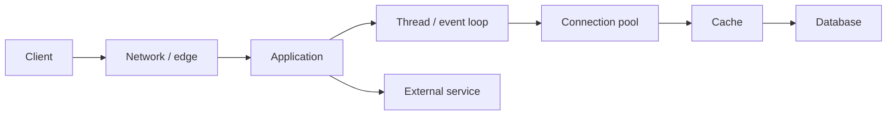

## Định nghĩa triệu chứng
“API chậm” cần endpoint, percentile, time window, traffic và SLO. Average che tail latency. So p50/p95/p99, error rate, throughput và saturation; latency thấp do request bị reject cũng không phải thành công.

## Troubleshooting flow

## Latency budget
Trace breakdown cho biết time ở queue, CPU, GC, pool wait, DB và downstream. Nếu span database 20 ms nhưng request 2 s, thêm index không giải quyết 1.98 s còn lại. Correlate với deployment/config/traffic changes.

## Bottleneck và queueing
Khi utilization tiến sát capacity, queue wait tăng phi tuyến. Tăng thread có thể làm contention/context switch tệ hơn. Fix có thể là giảm work, cache đúng, batch, tăng capacity, concurrency limit hoặc load shed; chọn theo evidence.

:::warning Benchmark integrity
Warm-up JVM, dùng data/cardinality đại diện, báo hardware/config/concurrency và đo nhiều percentile. Không công bố con số nếu chưa thật sự chạy benchmark.
:::

## Production checklist
- Client/network waterfall và payload size.
- Request queue, CPU, memory, GC, thread/event-loop lag.
- Connection pool active/wait/timeout.
- Cache hit latency và miss amplification.
- Query plan, lock wait và database saturation.
- Downstream deadline, retry amplification và circuit state.

## Key Takeaways
- Tối ưu percentile gắn với SLO, không chỉ average.
- Queue wait thường là tín hiệu saturation.
- Trace chỉ ra nơi mất thời gian; profile chỉ ra CPU/allocation.
- Thay đổi một giả thuyết rồi đo lại.
