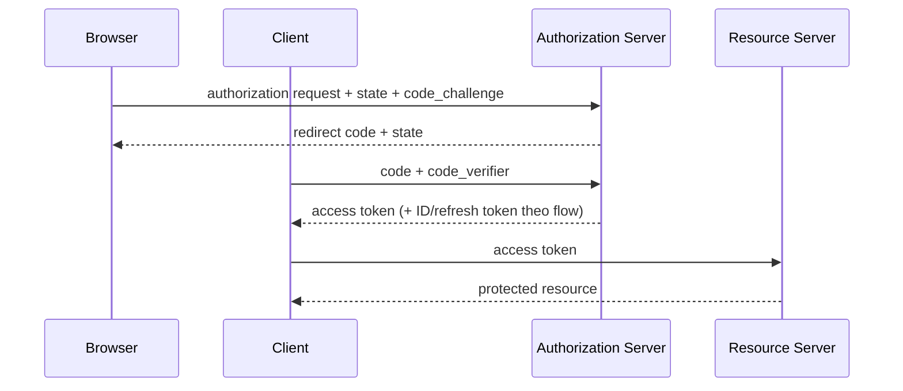

## Ba lớp khái niệm khác nhau
OAuth 2.0 là authorization framework cho delegated access: resource owner cho client quyền giới hạn để gọi resource server qua authorization server. OpenID Connect (OIDC) thêm identity layer để client biết người dùng đã đăng nhập là ai. JWT là một format token/claim có thể được ký; nó không tự tạo authentication flow hay authorization policy.

Access token dành cho resource server và thể hiện quyền truy cập. ID token dành cho OIDC client, mô tả authentication event/identity và có audience là client. Refresh token chỉ gửi tới authorization server để lấy access token mới. Dùng ID token như access token cho API hoặc gửi refresh token tới mọi microservice là phá trust boundary.



## Authorization Code + PKCE
Client tạo `code_verifier` entropy cao và gửi `code_challenge` dẫn xuất trong authorization request. Khi đổi authorization code tại token endpoint, nó chứng minh biết verifier. Kẻ chặn được code nhưng không có verifier khó redeem code đó. PKCE ràng buộc transaction; nó không mã hóa token hay thay TLS.

`state` ràng buộc authorization response với browser session/request và chống CSRF theo flow; OIDC `nonce` ràng buộc ID token với authentication request. Giá trị phải one-time, entropy cao và được kiểm tra exact. Redirect URI đăng ký/so khớp chặt; open redirect có thể làm rò code/token.

RFC 9700 khuyến nghị tránh implicit grant và Resource Owner Password Credentials; public client phải dùng PKCE, confidential client cũng được khuyến nghị. “Client secret” nhúng trong SPA/mobile không còn bí mật vì người dùng kiểm soát binary/browser.

:::warning TLS và browser boundary
Code/token có thể bị lộ qua URL, history, referrer, log hoặc extension nếu flow sai. Không đặt access token vào query string. Cookie session phải có `Secure`, `HttpOnly`, `SameSite` phù hợp và CSRF defense; token trong JavaScript phải tính đến XSS. Không có storage choice nào tự xóa mọi threat.
:::

## JWT: signed không có nghĩa encrypted
JWT thường gồm header, payload và signature được base64url encode. Payload có thể đọc được; không đặt secret/PII không cần thiết vào đó. Signature chứng minh integrity/authenticity theo key, không bảo mật nội dung.

Resource server phải dùng thư viện chuẩn và policy cấu hình trước, không tin dữ liệu token để tự chọn policy tùy ý. Validation tối thiểu:
- Chỉ chấp nhận algorithm dự kiến; không nhận `none` hay algorithm confusion.
- Xác minh signature bằng key của issuer đáng tin.
- So khớp `iss` exact và `aud` có resource/API hiện tại.
- Kiểm tra `exp`, `nbf`, có clock skew nhỏ có chủ đích; `iat` không thay expiry.
- Kiểm tra token type/use nếu hệ thống có nhiều loại token.
- Enforce scope/role và domain ownership trên resource cụ thể.

```json title="Access-token claims minh họa"
{
  "iss": "https://identity.example.com/realms/company",
  "sub": "4c21b5a0-...",
  "aud": ["orders-api"],
  "scope": "orders.read orders.write",
  "iat": 1788336000,
  "exp": 1788336300,
  "jti": "01J..."
}
```

Đây chỉ là shape minh họa, không phải token thật hay timestamp policy khuyến nghị. `sub` là identifier trong issuer namespace, không mặc định là database numeric ID/email. Map identity qua bảng/claim contract rõ; email có thể đổi và không luôn verified.

## Key rotation và cache
Verifier thường lấy public keys từ metadata/JWKS của authorization server, cache theo HTTP policy và chọn bằng `kid`. Khi gặp `kid` chưa biết, refresh có rate limit/single-flight để attacker không gây fetch storm. Giữ overlap key cũ đủ lâu cho token chưa hết hạn; rollout signer mới trước, verifier accept cả hai, rồi mới retire key cũ.

Nếu authorization server/JWKS tạm down, API phải có policy: dùng cached key còn hợp lệ trong cửa sổ giới hạn hoặc fail closed. Fetch key cho từng request vừa chậm vừa biến identity service thành dependency synchronous của toàn hệ thống.

Symmetric key chia cho nhiều resource server làm mỗi bên có khả năng ký token giả. Asymmetric signing thu hẹp signing authority nhưng private key vẫn phải ở key management/HSM phù hợp và rotation/audit rõ.

## Authorization không kết thúc ở scope
Scope như `orders.write` chỉ là coarse permission. API còn phải kiểm tra tenant, resource ownership, trạng thái nghiệp vụ và separation of duties. User có scope write không mặc định được sửa order tenant khác hoặc order đã settled.

```text title="Authorization decision"
authenticated principal
AND token issuer/audience/time valid
AND required scope present
AND principal belongs to requested tenant
AND policy permits action on this resource state
= allow
```

Mọi service bảo vệ dữ liệu phải enforce policy của chính nó hoặc qua policy decision point đáng tin; API gateway auth không đủ nếu request có thể đi đường nội bộ khác. Đừng forward toàn token sang service không cần nó; token exchange/downscoping hoặc internal identity có audience hẹp giảm blast radius.

## Lifetime, refresh và revocation
Access token ngắn hạn giảm thời gian lạm dụng nhưng tăng traffic refresh. Refresh token là credential giá trị cao: lưu phù hợp loại client, rotate khi dùng, phát hiện reuse và revoke token family khi nghi bị đánh cắp. Sender-constrained access token (mTLS/DPoP khi ecosystem hỗ trợ) giảm replay so với bearer thuần.

JWT self-contained không “logout tức thì” tự nhiên. Có thể dùng expiry ngắn, revoke refresh/session, denylist cho incident đặc biệt hoặc opaque token/introspection khi cần centralized control. Mỗi lựa chọn đổi latency/availability lấy revocation freshness; phải gắn với threat model.

## Failure scenarios
- API nhận token đúng signature nhưng sai audience: reject; đó có thể là token của service khác.
- Key rotate, cache chỉ biết key cũ: refresh có kiểm soát và overlap; không tắt signature check.
- Clock node lệch làm token chưa hợp lệ/hết hạn giả: đồng bộ clock, skew nhỏ và metric.
- SPA reload mất in-memory token: UX phải re-auth/refresh qua session an toàn, không hạ bảo mật bằng query/localStorage tùy tiện.
- User bị xóa nhưng access token còn hạn: authorization policy cho operation nhạy cảm có thể kiểm tra session/account state hoặc dùng lifetime phù hợp.
- Scope đúng nhưng object khác tenant: resource-level check ngăn IDOR/BOLA.

## Production checklist
- Document issuer, audience, token type, claim contract và owner cho từng API.
- Authorization Code + PKCE; redirect exact; validate state/nonce theo flow.
- Token validation pin algorithm/issuer/audience/time/type; test negative cases.
- Key cache/rotation có overlap, unknown-`kid` rate limit và outage policy.
- Access token ngắn hạn phù hợp; refresh rotation/reuse detection và revoke flow.
- Scope kết hợp tenant/resource/business authorization ở server.
- Log decision metadata cần thiết, không log raw token, code hay refresh token.

## Góc phỏng vấn
Câu trả lời tốt bắt đầu: OAuth là delegation, OIDC là identity layer, JWT là format. Mô tả code + PKCE và vai trò state/nonce; phân biệt ID/access/refresh token. Sau đó nêu validation JWT, rotation/JWKS, resource authorization và revocation trade-off. Tránh câu “JWT an toàn vì đã mã hóa” — JWT ký thường vẫn đọc được payload.

## Key Takeaways
- Flow, protocol và token format là ba lớp khác nhau.
- Access token cho resource server; ID token cho client; refresh token cho authorization server.
- JWT phải validate policy đầy đủ, không chỉ signature.
- Authorization cuối cùng là quyết định theo resource/tenant/business state tại server.
