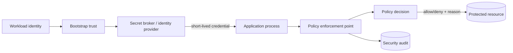

## Hai boundary thường bị trộn lẫn

Secret management trả lời: tiến trình nào được nhận credential nào, bằng kênh nào, trong bao lâu và có thể thu hồi ra sao. Authorization trả lời: identity đã xác thực được phép thực hiện action nào trên resource cụ thể trong context hiện tại. Một access token hợp lệ không tự chứng minh người gọi được sửa hóa đơn `invoice-42`; một secret được giấu khỏi Git cũng không bảo đảm workload dùng nó với quyền tối thiểu.

Mental model hữu ích là **credential mở phiên, policy giới hạn hành động**:



Authentication, credential delivery, authorization decision và audit phải nối được thành một chuỗi nhưng không nên nhập thành một cơ chế mơ hồ. Nếu service chỉ kiểm chữ ký JWT rồi tin mọi `resourceId` trong URL, authentication đúng nhưng authorization vẫn hỏng.

## Secret là dữ liệu có vòng đời

API key, database password, private key, signing key và encryption key là secret. Hostname, feature flag công khai hay timeout thường chỉ là configuration. Phân loại sai làm đội ngũ hoặc bảo vệ quá mức mọi cấu hình, hoặc vô tình đưa credential vào image, log và support bundle.

Một secret production cần các trạng thái và owner rõ ràng:

1. **Inventory và ownership:** biết secret bảo vệ hệ thống nào, consumer nào, môi trường nào và đội nào chịu trách nhiệm.
2. **Generation:** dùng entropy thích hợp; không dùng tên dự án, timestamp hoặc chuỗi tự nghĩ.
3. **Storage:** mã hóa ở secret manager/KMS phù hợp, hạn chế người và workload đọc được.
4. **Distribution:** truyền qua authenticated channel đến đúng workload identity, không qua ticket/chat/source code.
5. **Use:** chỉ đưa vào process cần nó; tránh command line, exception và telemetry có thể lộ giá trị.
6. **Rotation và revocation:** thay credential mà không downtime, thu hồi nhanh khi nghi ngờ compromise.
7. **Expiration và destruction:** credential phải có TTL hoặc review date; bản cũ bị vô hiệu hóa và bản sao lưu tuân thủ retention.
8. **Audit:** ghi ai/identity nào đọc, sửa hoặc rotate secret, nhưng không ghi chính giá trị secret.

“Đã xóa khỏi Git ở commit mới” chưa xử lý leak: lịch sử, fork, cache CI, artifact và máy developer vẫn có thể giữ bản sao. Phản ứng đúng là revoke/rotate trước, rồi điều tra phạm vi và làm sạch nơi lưu trữ theo quy trình.

## Bootstrap trust và workload identity

Secret manager không giải quyết được bài toán nếu ứng dụng cần một master password dài hạn để mở secret manager. Ưu tiên identity gắn với workload/runtime: service account, instance identity, mTLS certificate được cấp tự động hoặc federation từ CI. Identity này đổi lấy credential ngắn hạn với audience/scope cụ thể. Nhờ vậy, một file bị sao chép sang máy khác không nhất thiết hoạt động và thời gian khai thác bị giới hạn.

Quyền đọc secret nên bám theo service và environment, không dùng một “application-prod” credential chung cho cả cụm. API đọc dữ liệu không cần signing key của identity provider; job backup không cần quyền thay schema. Tách identity còn giúp audit xác định consumer nào dùng credential bất thường.

## Cách đưa secret vào process

Không có delivery mechanism duy nhất tốt cho mọi hệ thống:

| Cách | Ưu điểm | Failure/risk cần kiểm soát |
|---|---|---|
| Environment variable | Đơn giản, thư viện dễ đọc | Có thể xuất hiện trong diagnostic dump, child process hoặc platform UI; khó cập nhật trong process |
| Mounted file | Permission rõ, có thể thay phiên bản atomically | App phải reload an toàn; backup/support bundle có thể lấy nhầm |
| Sidecar/agent | Tự động renew và cache cục bộ | Thêm dependency và shared boundary; phải bảo vệ socket/file |
| Runtime API | Lấy theo nhu cầu, audit tốt | Secret manager outage/latency; cần cache ngắn hạn và retry bounded |

Không `COPY` secret vào image layer: xóa ở layer sau không xóa byte khỏi layer trước. Không đặt secret trong build argument, URL, CLI argument hay tên metric. Với container, read-only filesystem, non-root user và mount chỉ đúng path giúp giảm blast radius, nhưng không biến secret thành vô hại nếu process bị compromise.

## Rotation là protocol, không phải thao tác thay chuỗi

Nếu producer đổi password tức thì còn consumer cache bản cũ, rotation gây outage. Với credential hỗ trợ hai phiên bản, quy trình thường là:

```text
create v2 -> cho phép v1 và v2 -> phân phối/reload v2
-> quan sát mọi consumer dùng v2 -> revoke v1 -> xác nhận không còn access v1
```

Consumer cần biết version, reload an toàn và không log giá trị. Retry khi xác thực thất bại phải bounded; retry vô hạn bằng secret cũ vừa tạo thundering herd vừa che lỗi rollout. Với dynamic database credential, app pool phải đóng connection hết hạn và mở connection mới có kiểm soát. Diễn tập rotation định kỳ quan trọng hơn tài liệu nói “có thể rotate”.

Emergency revocation có trade-off availability. Runbook phải nêu owner, blast radius, thứ tự revoke, cách chuyển sang credential dự phòng và cách chứng minh kẻ tấn công không còn quyền.

## Authorization là quyết định trên resource cụ thể

Mô hình quyết định tối thiểu:

```text
decision = policy(subject, action, resource, context)

subject  = user/service identity, tenant, roles, attributes
action   = invoice.read, invoice.approve, secret.rotate
resource = object id + owner/tenant + current state
context  = channel, time, assurance level, request purpose
```

Policy mặc định deny. Mỗi request và mỗi object đều phải kiểm tra; ẩn nút trên UI chỉ là UX, không phải control. ID khó đoán cũng không thay quyền truy cập. Đặc biệt với list/search/export, filter tenant/ownership phải nằm trong query/data boundary, không tải toàn bộ rồi lọc ở frontend hoặc sau pagination.

Ví dụ enforcement ở application service:

```typescript title="invoice-authorization.ts"
async function approveInvoice(actor: Principal, invoiceId: string) {
  const invoice = await repository.findInTenant(invoiceId, actor.tenantId);
  if (!invoice) throw notFound(); // không tiết lộ object tenant khác

  const decision = policy.decide({
    subject: actor,
    action: 'invoice.approve',
    resource: { tenantId: invoice.tenantId, ownerId: invoice.ownerId, state: invoice.state },
    context: { assurance: actor.assuranceLevel }
  });
  if (!decision.allowed) throw forbidden(decision.publicReason);

  return repository.approveIfState(invoice.id, 'PENDING');
}
```

Check tenant khi load ngăn Broken Object Level Authorization. `approveIfState` thực hiện điều kiện trạng thái ở lúc ghi, giảm time-of-check/time-of-use race: resource có thể đổi giữa lần đọc và update. Log giữ `policyId`, `decision`, actor/resource reference và correlation ID; không ghi token hay field nhạy cảm.

## RBAC, ABAC và ReBAC

RBAC dễ hiểu: role ánh xạ permission. Nó phù hợp coarse-grained function như support agent được mở màn hình hỗ trợ. Nhưng role explosion xuất hiện khi quyền còn phụ thuộc tenant, ownership, vùng và trạng thái.

ABAC dùng thuộc tính của subject/resource/context: “manager cùng tenant được approve invoice dưới ngưỡng khi MFA đủ mạnh”. ReBAC dùng quan hệ: owner, member, parent project, delegated editor. Hệ thống thực tế thường kết hợp: role mở tập action, còn ownership/tenant/state thu hẹp resource.

Không nhét toàn bộ quan hệ động vào token sống lâu. Token là snapshot; user đã bị gỡ khỏi project vẫn có claim cũ. Với quyền nhạy cảm, lấy state hiện tại hoặc dùng policy decision có cache TTL ngắn và cơ chế invalidation/version. Cache key phải gồm mọi input ảnh hưởng quyết định; chỉ cache theo user trong khi policy phụ thuộc resource là privilege escalation.

## Service-to-service và confused deputy

Backend không nên coi request từ mạng nội bộ là đáng tin. Xác thực workload, giới hạn token audience cho đúng service, cấp permission theo operation và truyền end-user context có kiểm soát khi business rule cần. Service trung gian có quyền mạnh có thể trở thành **confused deputy** nếu nhận tùy ý resource ID rồi dùng credential của mình thay người gọi.

Phân biệt hai câu hỏi: service A có được gọi endpoint B không, và user/tenant phía sau A có được thao tác resource này không. Tùy workflow, B kiểm cả workload lẫn delegated subject; không tin header tự khai từ client. Background job không có end-user context cần identity/policy riêng và scope batch rõ ràng.

## Audit, privacy và break-glass

Security log cần đủ để dựng lại ai làm gì, trên resource nào, quyết định bởi policy version nào và kết quả ra sao. Chuẩn hóa timestamp, correlation ID, actor type/id, tenant, action, outcome và reason code. Redact access token, session ID, password, key, connection string và payload nhạy cảm. Giới hạn quyền đọc log và chống sửa/xóa trái phép; log bản thân nó là dữ liệu nhạy cảm.

Break-glass access phải hiếm, có lý do, thời hạn rất ngắn, approval phù hợp, alert tức thì và hậu kiểm. Một admin role vĩnh viễn được chia sẻ không phải break-glass. Không để quy trình khẩn cấp trở thành đường vòng authorization thường ngày.

## Failure scenarios và troubleshooting

- **Secret hết hạn đồng loạt:** xem secret version, expiry, refresh/renew error và connection pool; không tăng retry vô hạn. Khôi phục bằng version hợp lệ có kiểm soát rồi sửa stagger/renewal alert.
- **Rotate xong một replica lỗi:** so sánh workload identity, mounted version, reload timestamp và traffic; rollout không đồng nghĩa mọi process đã đọc bản mới.
- **User đọc object tenant khác:** trace query scope và policy input; tìm endpoint list/export/batch tương tự, revoke session nếu cần và audit phạm vi dữ liệu.
- **Policy service chậm hoặc mất:** fail-open có thể lộ dữ liệu, fail-closed có thể gây outage. Chọn theo action/data classification; cache decision chỉ trong bound đã thiết kế và giám sát stale-policy age.
- **Log chứa credential:** khóa quyền truy cập log, rotate secret, xác định sinks/retention/exports, sửa redaction tại nguồn và thêm regression test.
- **Quyền vẫn tồn tại sau khi gỡ role:** kiểm token TTL, cache key/TTL, invalidation event và policy/data replication lag; đo thời gian revocation thực tế.

## Production checklist

- [ ] Có inventory, owner, classification, expiry và rotation cadence cho từng secret.
- [ ] Không có secret trong source, image layer, build log, URL, metric label hoặc support bundle.
- [ ] Workload dùng identity riêng và credential ngắn hạn/audience hẹp khi nền tảng hỗ trợ.
- [ ] Rotation/revocation đã được diễn tập, gồm overlap version và rollback an toàn.
- [ ] Authorization deny-by-default kiểm `subject + action + resource + context` ở server.
- [ ] Query/list/export luôn áp tenant/ownership trước pagination và aggregation.
- [ ] Policy cache gồm đủ input, có TTL/invalidation và metric về decision/staleness.
- [ ] Service-to-service xác thực workload; delegated user context không lấy từ header không tin cậy.
- [ ] Audit log hữu ích nhưng redact credential/PII và được bảo vệ như dữ liệu nhạy cảm.
- [ ] Có test negative, cross-tenant, stale token/cache, race trạng thái và policy outage.
- [ ] Break-glass có TTL, alert, approval và hậu kiểm.

## Góc phỏng vấn

**“Đã dùng JWT thì còn cần authorization query database không?”** JWT chứng minh issuer và claims tại thời điểm phát hành; quyền trên object động, ownership, tenant và trạng thái có thể cần dữ liệu hiện tại. Trình bày token TTL/cache trade-off thay vì trả lời tuyệt đối.

**“Bạn lưu database password ở environment variable được không?”** Có thể là delivery mechanism, nhưng cần phân tích ai đọc environment, diagnostic exposure, rotation/reload và secret source. Câu trả lời senior bắt đầu từ threat model và lifecycle, không từ cú pháp framework.

**“Làm sao rotate không downtime?”** Nêu version overlap, consumer reload, observability theo version, bounded retry, xác nhận adoption rồi revoke bản cũ; sau đó nói ngoại lệ nếu dependency không hỗ trợ song song credential.

**“RBAC có đủ cho multi-tenant không?”** Role chỉ nói chức năng chung; cần resource/tenant scope và thường thêm ABAC/ReBAC. Kiểm ở data query, batch và export, không chỉ endpoint đơn lẻ.

## Key takeaways

- Secret an toàn là secret có inventory, delivery, TTL, rotation, revocation và audit; “không commit Git” chỉ là một control.
- Workload identity và credential ngắn hạn giảm bootstrap secret cũng như cửa sổ khai thác.
- Authentication hợp lệ không thay authorization trên từng action/resource/context.
- Tenant scope, ownership, state transition và cache invalidation là nơi policy thường thất bại trong production.
- Audit phải hỗ trợ điều tra mà không trở thành kênh rò rỉ credential mới.
