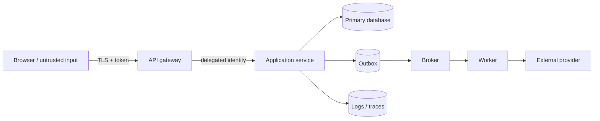

## Threat model không phải danh sách checkbox

Threat Modeling là quy trình có cấu trúc để trả lời bốn câu hỏi: ta đang xây gì, điều gì có thể sai, sẽ làm gì, và đã làm đủ tốt chưa. Giá trị lớn nhất không phải một sơ đồ đẹp mà là các quyết định: boundary nào cần xác thực, dữ liệu nào không được lộ, action nào cần authorization lại, signal nào phát hiện abuse và ai chịu trách nhiệm khi control thất bại.

Checklist như OWASP Top 10 giúp nhắc nhớ, nhưng không biết business invariant của bạn. Một hệ thống điểm thưởng có threat “tự tăng điểm hai lần”; một nền tảng đa tenant có threat “đọc object tenant khác”; webhook có threat “replay request hợp lệ”. Threat model phải gắn với asset, actor, flow và hậu quả cụ thể.

## Bước 1 — Xác định scope, asset và invariant

Chọn một use case đủ hẹp: “khách hàng đổi email”, “service nhận webhook thanh toán”, hoặc “admin export dữ liệu tenant”. Ghi:

- Asset: tiền, credential, PII, signing key, availability, audit evidence.
- Actor: end user, admin, service account, support, CI runner, third party và attacker.
- Entry/exit point: API, browser, queue, file upload, callback, database replica, log export.
- Invariant: chỉ owner được sửa; một business operation không apply hai lần; audit không thể bị caller giả mạo; secret không xuất hiện trong artifact.
- Assumption: identity provider đáng tin đến đâu, network nào hostile, clock/replication lag nào tồn tại.

Risk không chỉ là confidentiality. Integrity và availability có thể gây hậu quả lớn hơn: sửa số tài khoản nhận tiền, làm cạn connection pool, tạo event vô hạn hoặc xóa audit trail.

## Bước 2 — Vẽ data flow và trust boundary

Đánh dấu nơi dữ liệu đổi trust level hoặc owner: Internet → gateway; gateway → service; service → broker; workload → external provider; production → observability/support. “Internal network” không tự là trusted. Mỗi arrow cần protocol, identity, authorization context, dữ liệu, encryption, timeout/retry và audit.

DFD nên thể hiện source of truth và bản sao. Nếu PII đi vào log, cache, DLQ và data warehouse, retention/delete không còn là chuyện một database. Nếu gateway bỏ token và thêm `X-User-Id`, cần chứng minh client ngoài không thể inject/đi vòng gateway và service xác minh upstream.

## Bước 3 — Tìm threat bằng nhiều góc nhìn

STRIDE là mnemonic hữu ích:

| Nhóm | Câu hỏi thực tế |
|---|---|
| Spoofing | Có thể giả user, workload, webhook sender hoặc tenant không? |
| Tampering | Có thể sửa amount, resource ID, event, image hoặc config trên đường đi không? |
| Repudiation | Ai có thể phủ nhận action vì audit thiếu actor/time/result? |
| Information disclosure | Error, log, cache key, export hoặc response có lộ dữ liệu không? |
| Denial of service | Input nào kích hoạt CPU, memory, thread, DB query hoặc fan-out không giới hạn? |
| Elevation of privilege | User thường có thể gọi admin action hoặc đổi object ID không? |

Sau đó thêm **abuse cases** theo business: credential stuffing, enumeration, mass assignment, coupon farming, replay, race condition, bulk export, scraping, expensive search và supply-chain compromise. Hỏi “attacker đạt mục tiêu bằng feature hợp lệ thế nào?”, vì nhiều abuse không cần exploit kỹ thuật.

Đừng chỉ xem happy path. Với mỗi dependency timeout, duplicate, out-of-order, stale authorization cache và partial commit, hỏi liệu failure có mở quyền hay apply side effect sai không. Security và reliability giao nhau tại đây.

## Bước 4 — Ưu tiên risk có căn cứ

Risk ranking cần thống nhất nhưng không giả chính xác. Đánh giá impact lên tài chính, pháp lý, người dùng và phục hồi; likelihood dựa trên exposure, precondition, attacker capability và control hiện có. Ghi uncertainty. Một threat impact rất cao nhưng khó xảy ra vẫn có thể cần control bắt buộc; một threat nhỏ lặp hàng triệu lần có thể thành abuse kinh tế lớn.

Ưu tiên **prevent → detect → respond/recover**. Không phải threat nào cũng loại bỏ được; có thể giảm, chuyển giao, chấp nhận có thời hạn hoặc tránh feature. Mỗi accepted risk cần owner, lý do, expiry/review trigger. “TLS đã xử lý” không đủ nếu threat là broken object authorization.

## Bước 5 — Chuyển mitigation thành requirement

Mitigation tốt phải test/observe được:

- Mơ hồ: “bảo vệ endpoint admin”.
- Kiểm chứng được: “mọi mutation `/admin/*` xác minh audience, role và tenant ở server; deny mặc định; negative/cross-tenant tests chạy trong CI; denied decision có audit event không chứa token”.

Phân lớp control:

1. Input contract: size, type, schema, canonicalization và parser limit.
2. Authentication: issuer, audience, algorithm/key lifecycle, replay/session policy.
3. Authorization: subject + action + resource + context, object/tenant check và state transition.
4. Data protection: tối thiểu hóa, encryption, retention, redaction và access audit.
5. Abuse/availability: rate/concurrency/cost quota, timeout, circuit breaker và backpressure.
6. Detection: stable security event, alert theo hành vi, correlation nhưng không high-cardinality vô hạn.
7. Recovery: revoke key/session, quarantine consumer, restore evidence, communicate owner.

Control ở client chỉ cải thiện UX; server vẫn enforcement. WAF không thay validation/domain policy. Encryption at rest không ngăn account đã được cấp quá quyền đọc dữ liệu.

## Ví dụ — Webhook thanh toán

Assets là payment state và entitlement. Threats gồm forged sender, replay một request hợp lệ, body bị thay đổi, duplicate do retry, event đến sai thứ tự, secret leak trong log, endpoint bị flood và provider timeout.

Design có thể gồm TLS; xác minh signature trên **raw body** theo tài liệu provider; timestamp/nonce với acceptance window; lưu unique provider event ID; transaction cập nhật state machine + outbox; state transition chỉ tiến theo rule; response nhanh sau durable acceptance; xử lý async idempotent; redaction header/body; rate/concurrency limit và reconciliation với provider.

Nếu process crash sau commit trước response, provider retry không tạo side effect lần hai nhờ unique event ID. Nếu event “refund completed” đến trước “payment captured”, state/version rule quarantine hoặc reconcile thay vì ép thứ tự bằng timestamp máy. Signature đúng chỉ chứng minh sender/body, không chứng minh business transition hợp lệ.

## Security verification

Mỗi threat quan trọng cần evidence:

- Unit/property tests cho policy và state machine.
- Integration tests cho cross-tenant, replay, expired token, signature sai và duplicate.
- Fuzz/size tests cho parser/upload/search expression.
- Dependency/config scanning cho supply chain, nhưng triage context thay vì tin scanner tuyệt đối.
- Manual review/penetration test cho business logic và chained attack.
- Chaos/game day cho IdP, secret rotation, policy service, broker hoặc audit sink outage.

Production signals: auth failure theo bounded dimension, denied cross-tenant attempt, privilege/secret change, unusual export volume, replay/duplicate, rate-limit activation và audit pipeline lag. Không log credential, full token, password, card data hoặc raw PII chỉ để “quan sát tốt hơn”. Alert phải có owner/runbook; metric không owner là dữ liệu, chưa phải control.

## Khi nào cập nhật threat model

Không làm một lần trước go-live rồi đóng file. Review khi thêm data flow/dependency, đổi auth model, mở public endpoint, thay tenant boundary, thêm async/retry/cache, xử lý loại dữ liệu mới, có incident hoặc assumption scale thay đổi. ADR và pull request có thể link delta của DFD/threat thay vì họp lại toàn hệ thống.

Giữ artifact nhẹ: diagram có version, threat ID, asset, scenario, impact, control, verification, owner và trạng thái. Xóa threat đã hết scope kèm lý do; đừng để backlog hàng trăm dòng không ai tin.

## Failure scenarios của chính control

- **Identity provider down:** fail-open có thể mở quyền; fail-closed có thể outage. Chọn theo action risk, token validation local/cached key với expiry và break-glass được audit.
- **Authorization cache stale:** quyền đã thu hồi vẫn sống. Đo policy age, TTL/invalidation và dùng fresh check cho action nhạy cảm.
- **Rate limiter down:** fallback unlimited gây overload; fail-closed chặn user. Dùng local emergency limit/bounded degrade theo endpoint.
- **Audit sink chậm:** synchronous log có thể làm request fail, async queue có thể mất evidence. Xác định durability/backpressure và alert lag.
- **Secret rotation lỗi:** dual-key overlap có hạn, metric theo key version và rollback không tái bật key đã compromise.

## Góc phỏng vấn

:::interview Bạn threat-model một API mới như thế nào?
Tôi chọn use case, asset/invariant và actors; vẽ data flow với trust boundaries và bản sao dữ liệu. Tôi dùng STRIDE cộng abuse cases/failure paths để tìm threat, xếp ưu tiên theo impact/exposure, rồi biến mitigation thành requirement test được với owner. Tôi kiểm tra cả prevent, detect, recovery và cập nhật model khi kiến trúc hoặc incident làm assumption thay đổi. Tôi không coi TLS, JWT hay WAF là câu trả lời chung cho authorization và business abuse.
:::

Senior follow-up: gateway đã auth thì service cần gì; policy outage fail-open hay closed; webhook replay; log để điều tra mà không lộ PII; rate limit theo request hay operation cost; accepted risk được quản lý ra sao.

## Key Takeaways

- Threat model bắt đầu từ asset, invariant, data flow và trust boundary.
- STRIDE là công cụ gợi ý; business abuse và partial failure mới làm model sát thực tế.
- Mỗi mitigation phải kiểm chứng được, có signal, owner và recovery.
- Authentication không thay object/tenant authorization; TLS không thay application policy.
- Threat model là living artifact đi cùng thay đổi và incident learning.
