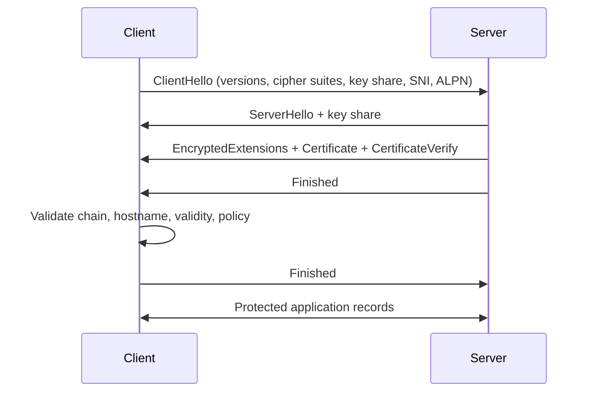
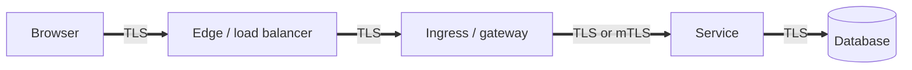

## TLS tạo secure channel, không tạo business trust

TLS cung cấp kênh chống nghe lén và sửa đổi, đồng thời xác thực server bằng certificate; client authentication là tùy chọn. HTTPS là HTTP chạy qua TLS, nên HTTP method, authorization, validation và data semantics vẫn thuộc application. Kết nối có biểu tượng khóa không chứng minh server được phép chuyển tiền, response không chứa dữ liệu tenant khác hay client không bị XSS.

Ba câu hỏi nên tách biệt:

1. **Peer identity:** endpoint đang nói chuyện có đúng hostname/workload mong đợi không?
2. **Channel protection:** dữ liệu trên hop này có confidentiality và integrity không?
3. **Application authorization:** identity đó được phép làm action trên resource nào?

TLS xử lý chủ yếu hai câu đầu. JWT, session, mTLS identity hoặc policy engine vẫn phải nối đến câu ba.

## Mental model handshake TLS 1.3

Đây là mental model, không phải packet trace đầy đủ cho mọi mode. Hai phía thương lượng version/cipher parameters và tạo shared traffic keys; server chứng minh sở hữu private key tương ứng certificate. Client phải kiểm chain đến trust anchor, thời hạn, hostname/service identity và policy. Chỉ “certificate có chữ ký hợp lệ” nhưng hostname sai vẫn không phải peer mong muốn.

SNI giúp client nêu hostname để server/proxy chọn certificate; ALPN giúp thương lượng protocol ứng dụng như HTTP/2. Đây không phải secret business data, và topology/proxy có thể làm chi tiết quan sát khác. Session resumption giảm handshake work nhưng làm key/ticket lifecycle và 0-RTT cần threat analysis; early data có replay risk nên không dùng tùy tiện cho mutation không idempotent.

## Certificate và chain of trust

Certificate gắn public key với subject identity trong thời hạn nhất định, được issuer ký. Server thường gửi leaf cùng intermediate cần thiết; client đã có root trust anchor. Private key không nằm trong certificate và phải được bảo vệ/rotate như secret cấp cao.

Hostname validation dùng Subject Alternative Name theo rule phù hợp; wildcard có phạm vi hạn chế và không nên biến thành cách cấp một private key cho mọi service. Certificate còn hạn không có nghĩa private key chưa bị lộ. Revocation có giới hạn vận hành/client behavior, vì vậy short lifetime, inventory và rotation automation quan trọng.

:::warning Trust store là policy
Thêm một CA vào trust store cho phép CA đó xác nhận các identity trong phạm vi client chấp nhận. Không import certificate/CA để “hết lỗi TLS” mà không biết ownership, scope và rotation. Tắt hostname verification hoặc trust-all trong production biến secure channel thành kênh dễ bị man-in-the-middle.
:::

## TLS termination và nhiều hop

Kiến trúc phổ biến: browser → CDN/load balancer → ingress/reverse proxy → service → database. TLS có thể terminate và được thiết lập lại ở từng hop. Vì vậy câu “hệ thống dùng HTTPS” chưa đủ; cần inventory từng segment, ai giữ private key, network/trust boundary, cách forward client identity và policy khi gọi upstream.

Khi proxy thêm `Forwarded` hoặc `X-Forwarded-Proto`, ứng dụng chỉ tin header từ proxy đã xác thực và phải chặn client đi thẳng/inject header. Nếu redirect/cookie policy dựa sai scheme, có thể tạo redirect loop hoặc bỏ `Secure`. Không đưa toàn certificate client vào header không ký/không bảo vệ.

## mTLS cho workload identity

Mutual TLS yêu cầu cả server và client xuất trình certificate. Nó hữu ích cho workload-to-workload authentication, nhưng không tự là end-user authorization. Một service có certificate hợp lệ vẫn cần scope/action/resource policy; một workload bị compromise có thể dùng identity trong thời hạn certificate.

mTLS production cần:

- CA/issuer và enrollment bootstrap rõ ràng.
- Identity ổn định gắn workload, không gắn IP tạm thời.
- Certificate ngắn hạn, auto-renew và trust bundle rotation.
- Authorization mapping từ verified identity, không parse chuỗi subject tùy tiện.
- Telemetry cho handshake failure, expiry và peer identity với cardinality có kiểm soát.
- Emergency revoke/deny và quy trình khi CA hoặc private key bị compromise.

Service mesh có thể tự động hóa sidecar/proxy certificates, nhưng application vẫn sở hữu business authorization và end-to-end data classification. Mesh cũng tạo failure mới: control plane, policy rollout, proxy resource và clock/certificate renewal.

## Certificate lifecycle không downtime

Inventory ít nhất gồm hostname/service, issuer, owner, environment, nơi giữ private key, expiration, renewal mechanism và dependencies pin/trust. Alert trước expiry theo nhiều mức và kiểm tra từ góc nhìn bên ngoài; file trên máy có thể mới nhưng process chưa reload.

Rotation an toàn thường dùng overlap: cấp certificate/key mới, deploy nơi phục vụ, xác minh handshake và traffic, sau đó thu hồi/xóa bản cũ. Khi đổi CA, distribute trust bundle chấp nhận old+new trước, rồi rotate leaf, đo adoption, cuối cùng bỏ CA cũ. Đảo thứ tự có thể outage toàn bộ clients.

Private key không xuất hiện trong Git, container image layer, command line, log hay support bundle. Quyền đọc giới hạn workload cần nó. Nếu nghi lộ key, không chỉ xóa file: rotate/revoke theo khả năng, xác định nơi copy, kiểm access logs và đánh giá sessions/tokens liên quan.

## Configuration và browser boundary

Chỉ hỗ trợ protocol/cipher suite theo compatibility và security policy hiện hành; không copy danh sách cũ từ blog. HSTS có thể yêu cầu browser chỉ dùng HTTPS, nhưng rollout sai (đặc biệt includeSubDomains/preload) có blast radius lớn và cần inventory mọi subdomain. Cookie chứa session cần `Secure`, cùng `HttpOnly` và `SameSite` theo use case; TLS không ngăn JavaScript đã bị XSS đọc dữ liệu DOM/API.

Mixed content, redirect từ HTTP, insecure absolute URL và CDN origin không bảo vệ đều có thể làm yếu end-to-end. CORS không phải cơ chế mã hóa hay xác thực; nó là browser policy về đọc response cross-origin.

## Failure scenarios

| Failure | Dấu hiệu | Điều tra / khắc phục |
|---|---|---|
| Certificate hết hạn | handshake đồng loạt fail | kiểm chain từ client, renewal job, process reload và owner alert |
| Hostname mismatch | chỉ hostname/route cụ thể lỗi | SNI, SAN, DNS, virtual host và route mapping |
| Missing intermediate | một số client được, số khác fail | server chain order/completeness, không yêu cầu client tự tải issuer |
| Clock lệch | not-yet-valid/expired bất thường | đồng bộ clock, kiểm node/container và validity window |
| CA rotation sai thứ tự | clients cũ mất trust | trust overlap, adoption metric, rollback bundle |
| TLS termination loop | redirect liên tục/sai cookie | trusted forwarded headers và scheme handling |
| mTLS renewal lỗi | workload mất kết nối theo cụm | expiry histogram, issuer/control-plane health, cached identity policy |
| Handshake CPU spike | latency/CPU edge tăng | connection reuse, resumption policy, abusive clients và capacity |

Debug từ client-facing hop: resolve DNS, kiểm TCP reachability, xem SNI/ALPN, chain/hostname/time, rồi HTTP status. Một `502` có thể là TLS upstream từ proxy chứ không phải public certificate. Trace/log phải phân biệt handshake error, connect timeout, application timeout và policy deny; không log private key/session secrets.

## Observability và runbook

Theo dõi ngày còn lại theo certificate, renewal success, reload/deploy version, handshake failure theo bounded reason, negotiated protocol/version, active connection và edge/upstream latency. Synthetic check từ bên ngoài phát hiện DNS/chain khác monitor nội bộ. Runbook nêu owner CA/DNS/load balancer/service, lệnh kiểm read-only, rollback trust bundle và communication path.

Test rotation trong staging chưa đủ nếu trust stores/client versions khác production. Game day có thể rotate leaf, intermediate/trust bundle và mô phỏng issuer unavailable. Không chờ expiry thật để khám phá application chỉ đọc certificate lúc startup.

## Góc phỏng vấn

:::interview HTTPS bảo vệ điều gì?
HTTPS dùng TLS để bảo vệ confidentiality/integrity trên kết nối và xác thực server identity khi client kiểm certificate chain + hostname. Nó không tự authorization business, không chặn XSS/SQL injection và không bảo vệ plaintext sau điểm terminate. Trong production tôi inventory từng hop, tự động renewal/rotation với overlap, bảo vệ private key, monitor expiry/handshake và không bao giờ sửa lỗi bằng trust-all hoặc tắt hostname verification.
:::

Senior follow-up: đổi CA không downtime; mTLS khác JWT; certificate hợp lệ nhưng vẫn MITM thế nào; TLS terminate ở load balancer thì upstream ra sao; 0-RTT và replay; vì sao một số client lỗi chain còn số khác không.

## Key Takeaways

- TLS bảo vệ một channel và peer identity; application authorization vẫn riêng.
- Certificate validation cần chain, hostname, time và trust policy.
- Mỗi termination tạo hop mới phải threat-model và quan sát.
- Rotation CA/leaf cần overlap đúng thứ tự, inventory và verification từ client.
- Không dùng trust-all, bỏ hostname validation hoặc log private key để chữa sự cố.
