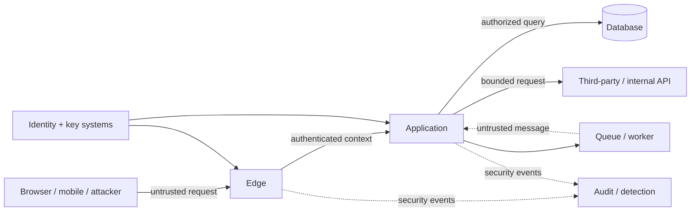

## Mental model: bảo vệ asset qua mọi trust boundary

Security không phải danh sách headers hay một middleware. Bắt đầu từ **asset** (tiền, dữ liệu, quyền, availability), **actor** (user, service, admin, attacker), entry point, data flow và trust boundary. Mỗi boundary phải xác minh identity/context, validate input, authorize action, giới hạn resource và tạo audit đủ dùng. Client, network, queue message, cache và webhook đều là untrusted cho tới khi được kiểm chứng theo contract.

OWASP Top 10:2025 là awareness/prioritization input, không phải checklist chứng nhận. Risk thực phụ thuộc threat model, business impact và architecture. Defense-in-depth giả định một lớp sẽ lỗi: parameterized query cộng least-privilege database; secure cookie cộng CSRF defense; authorization cộng audit/anomaly detection. “Đã ở internal network” không xóa trust boundary.



## Identity lifecycle: AuthN, session và AuthZ

**Authentication (AuthN)** xác minh subject/control của authenticator. **Session/token management** nối các request sau với subject. **Authorization (AuthZ)** quyết định subject có được thực hiện action trên resource trong context hiện tại. Login thành công không trao quyền với mọi object. Server phải kiểm object-level và function-level authorization ở mọi path: HTTP, WebSocket message, batch/admin API và background command.

Một decision thường cần `subject`, roles/attributes, `action`, `resource owner/tenant/state` và context như assurance/risk. Deny by default; centralize policy semantics nhưng enforce tại boundary có resource thật. UI ẩn nút chỉ cải thiện UX. Không nhận `ownerId`, price, role hoặc approval state từ client rồi mass-assign vào entity.

```text
allow = policy.can(subject, "activity:update", activity, context)
if (!allow) return 403              // không query/update trước rồi mới check
updateAllowedFields(validatedInput) // không bind toàn bộ payload vào domain object
```

Password dùng password-hashing algorithm/config hiện hành với unique salt; không lưu plaintext hoặc reversible encryption. MFA, recovery và admin reset cùng thuộc identity lifecycle: recovery yếu sẽ vô hiệu password mạnh.

Session ID là bearer credential: random, rotate khi privilege đổi, expire/revoke theo policy. Cookie cần `Secure`, `HttpOnly`, `SameSite` phù hợp flow và narrow scope. JWT/JWS signature không encrypt payload; authorization vẫn kiểm resource hiện tại. Bài `oauth2-oidc-jwt-security` đi sâu protocol/token trade-off.

## Browser boundary: same-origin, CORS, CSRF và XSS

Browser same-origin policy giới hạn script đọc resource khác origin. **CORS** là cơ chế server cho browser biết origin nào được phép đọc/gửi credential theo response/preflight; nó không authenticate caller và không chặn curl/server-to-server. Origin allowlist phải exact scheme/host/port theo requirement; không phản chiếu Origin mù, và credentialed response không dùng wildcard.

**CSRF** lợi dụng browser tự gắn credential như cookie để gửi state-changing request. Defense tùy architecture: framework anti-CSRF/synchronizer token, signed double-submit, SameSite, Origin/Fetch Metadata checks và custom header + strict CORS. GET phải safe, không đổi password/xóa data. XSS có thể vượt nhiều CSRF defense, nên hai lớp đều cần. Webhook không phải browser CSRF case nhưng cần signature/replay/idempotency riêng.

**XSS** xảy ra khi attacker-controlled data tới executable DOM/HTML/URL/JavaScript context. Ưu tiên framework interpolation/escaping, context-aware output encoding, safe DOM API và sanitizer cho HTML thật sự cần. Không dùng một regex “lọc script” cho mọi context; CSP/Trusted Types giảm blast radius nhưng không thay safe sinks. Bài `angular-security-xss-trusted-types` xử lý chi tiết framework/browser enforcement.

## Injection: giữ data không trở thành instruction

Injection xuất hiện khi untrusted data được nối vào grammar của interpreter: SQL, shell, template, LDAP, expression hoặc log. Defense ưu tiên API tách code/data: prepared statement/parameterized query; process API với argument array thay shell string; templating auto-escape theo context. Allowlist identifier khi parameter không thể đại diện table/order direction. Escaping toàn chuỗi là brittle và encoding-dependent.

```sql
SELECT id, tenant_id, status
FROM orders
WHERE tenant_id = :tenantId AND id = :orderId;
```

Parameterized SQL ngăn value đổi syntax, nhưng query vẫn phải chứa tenant predicate/authorization. ORM không tự ngăn raw query, mass assignment hay insecure direct object reference. Validation kiểm type, length, range, normalization và business invariant; output encoding bảo vệ sink—hai việc không thay nhau.

SSRF biến server thành network client của attacker. Allowlist scheme/host/port khi có thể, chặn private/link-local/metadata ranges, kiểm redirect và egress tại actual network boundary; regex URL không đủ.

Deserialization dùng schema/allowlisted types và size/depth limits. Queue message cũng có thể giả/replay; validate schema, authorize business command và deduplicate.

## Data, crypto, secret và availability

TLS bảo vệ data in transit và server identity khi certificate được validate; terminate TLS ở proxy không nghĩa hop sau an toàn mặc định. Encrypt-at-rest hữu ích nhưng key access quyết định security. Không tự thiết kế crypto; dùng maintained library/protocol và tách key rotation/revocation. Bài `tls-https-certificate-operations` và `secrets-authorization-boundaries` đi sâu certificate/secrets.

Classify data, thu tối thiểu, giới hạn retention, tenant access và deletion/backup contract. Log không chứa password, token, session ID, raw authorization header hoặc PII không cần. Hash password khác hash dữ liệu tra cứu và khác encryption cần giải mã.

Availability cũng là security. Bound body/decompression, pagination, regex/JSON depth, upload, concurrent work, queue và export. Rate limit không chỉ theo IP vì NAT/distributed attack; kết hợp subject/tenant/resource/cost và global capacity. Timeout, circuit breaker, load shedding và idempotency ngăn attacker hoặc failure khuếch đại. Error handling fail closed cho authorization/verification nhưng graceful degrade cho feature không nhạy cảm; đừng catch exception rồi mặc định allow.

## Secure lifecycle và operational controls

Threat model trước feature risky và cập nhật khi thêm boundary. Review dependency/base image/action, scan/triage và patch theo impact; scanner pass không chứng minh business logic an toàn. Infrastructure/config và admin plane phải được kiểm như code.

Security logging ghi login/recovery, authorization denial, policy/key/admin change, suspicious validation/replay/rate-limit với subject/resource reference an toàn, outcome và trace/time. Không log secret/PII; bảo vệ integrity/access/retention. Alert cần runbook cho credential leak, account takeover, cross-tenant access và unexpected key use. Backups phải restore-test và chống xóa/sửa theo threat model.

## Failure scenarios và troubleshooting

- **User đọc object tenant khác:** dừng/contain, audit scope, sửa server-side object policy và thêm subject-action-resource matrix test; UI fix không đủ.
- **CORS error sau deploy:** phân biệt browser preflight/response header với backend 401/5xx; kiểm exact origin, credential, method/header và proxy. Không bật `*` để chữa nhanh.
- **CSRF token fail ngẫu nhiên:** xem session rotation, cookie domain/SameSite, multiple tabs/nodes và token binding; không disable middleware toàn cục.
- **SQL injection suspicion:** revoke/limit database credential, giữ query/audit evidence, tìm dynamic SQL/raw path; chuyển parameterization và least privilege, không chỉ blacklist payload.
- **Token/key lộ:** revoke/rotate, giới hạn blast radius, audit usage/cache/log/artifact và invalidate sessions theo contract; chỉ xóa commit không thu hồi credential.
- **Security control làm outage:** rate-limit/policy/key service false denial. Fail behavior phải theo operation sensitivity; có cached signed policy/key grace có bound và break-glass audit.

## Trade-offs và khi không dùng “security control” máy móc

Security thêm latency, friction và operational dependency. MFA step-up cho high-risk action tốt hơn bắt lại mọi request; short token giảm exposure nhưng tăng refresh/key-service load; fine-grained policy giảm overprivilege nhưng tăng cache/testing complexity. Chọn bằng threat/impact và đo denial/false positive.

Không tự viết crypto, sanitizer, password store hoặc OAuth flow khi maintained framework/provider đáp ứng. Không đặt mọi defense ở API gateway: gateway thiếu object state và internal/background path vẫn cần enforcement. Không coi WAF/scanner/CORS/VPN là thay thế secure design. Exception cần owner, lý do, compensating control và expiry.

## Production checklist

- [ ] Asset, actor, data flow, trust boundary và abuse case có owner.
- [ ] AuthN/session/recovery/rotation và AuthZ subject-action-resource được test riêng.
- [ ] Server deny by default trên HTTP, async, admin và real-time paths.
- [ ] CORS/CSRF/cookie/XSS controls khớp credential/browser architecture.
- [ ] Interpreter boundaries dùng parameterization/safe API, validation và output encoding đúng context.
- [ ] Secret/key/TLS/data retention có least privilege, rotation, revoke và audit.
- [ ] Request/work/queue/resource có bound; exceptional condition không fail-open authorization.
- [ ] Security events, alert, incident playbook, backup/restore và break-glass được diễn tập.

## Góc phỏng vấn

**Authentication khác authorization?** AuthN xác minh subject; AuthZ quyết định subject-action-resource trong context. Token hợp lệ không chứng minh quyền với object hiện tại.

**CORS có bảo vệ API không?** Nó hướng dẫn browser cho phép cross-origin read/credential; non-browser client không bị chặn. API vẫn cần authentication, authorization và abuse controls.

**Validation có ngăn XSS/SQL injection không?** Validation giảm input space nhưng sink quyết định defense: parameterized SQL, context-aware output encoding/safe DOM. Không có một sanitizer chung cho mọi interpreter.

## Key Takeaways

- Security bắt đầu từ asset/trust boundary và business abuse, không từ header checklist.
- Authentication, session và authorization là lifecycle khác nhau; enforce quyền tại resource boundary.
- CORS, CSRF và XSS là browser concerns liên quan nhưng không thay nhau.
- Giữ untrusted data tách khỏi interpreter bằng safe API/parameterization và đúng output context.
- Defense production gồm least privilege, bounds, telemetry, rotation/revocation và incident recovery.
