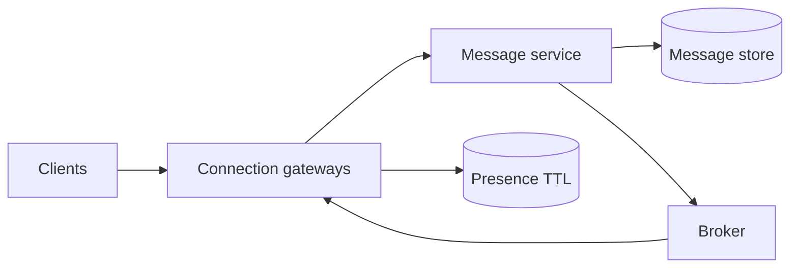

## Requirements
1:1 và group chat, online delivery, offline sync, sent/delivered/read state. Chốt max group size, attachment, retention, multi-device và latency. Presence là trạng thái gần đúng; message durability là requirement mạnh hơn.

## Planes
Connection gateways giữ WebSocket và authenticate device. Message service cấp messageId/sequence theo conversation, persist trước acknowledgment, rồi fan-out qua broker. Sync API trả messages sau cursor cho reconnect/offline device.

## Ordering và delivery
Không cần global order; cần deterministic order trong conversation. Client-generated idempotency key ngăn resend tạo message mới. Sequence có thể cấp theo shard leader hoặc logical version. Delivered/read receipt là event riêng và có thể đến trễ.

:::production Reconnect
Gateway mất connection không có nghĩa user offline ngay. Presence dùng heartbeat + TTL. Sau reconnect, client gửi last cursor, sync durable messages rồi tiếp tục stream; nếu chỉ reconnect socket sẽ có gap.
:::

## Scale và failure
Shard theo conversation giúp locality/order nhưng celebrity group tạo hot partition. Nhóm lớn có thể dùng hierarchical fan-out hoặc pull/sync hybrid. Gateway drain khi deploy; broker lag ảnh hưởng live delivery nhưng durable sync vẫn là recovery path.

## Security và privacy
Authorize membership cho send và history read, không chỉ lúc connect. Rate limit spam, validate attachment metadata, encrypt transport, audit admin access và xác định retention/deletion semantics. End-to-end encryption thay đổi server search/moderation và key recovery trade-off.

## Key Takeaways
- Persist trước ack nếu durability quan trọng.
- Ordering theo conversation đủ cho phần lớn use case.
- Stream cần sync API làm recovery.
- Presence là soft state, message history là durable state.
