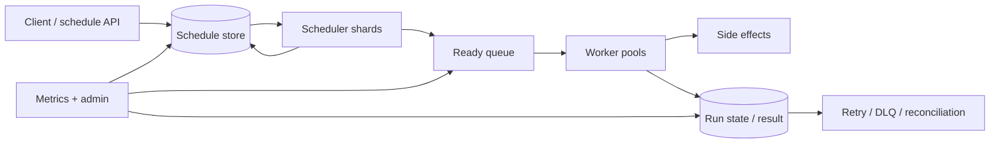
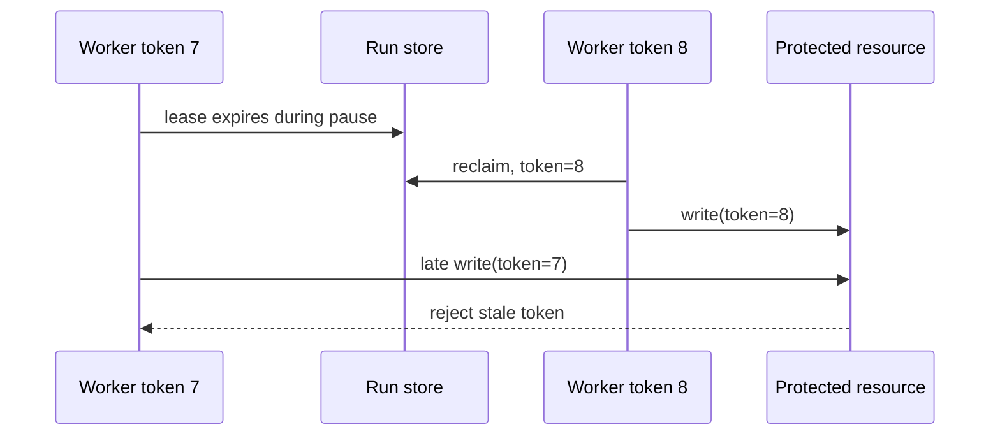

## “Chạy lúc 09:00” chưa phải requirement đủ

Scheduler nhận intent thời gian và biến nó thành execution có thể retry/quan sát. Use case gồm email nhắc lịch, billing batch, report, workflow timeout và maintenance. Khó khăn không nằm ở `sleep()` mà ở durable state, nhiều scheduler cạnh tranh, clock/time zone, worker crash, duplicate, backlog và side effect ngoài transaction.

Clarify:

- One-off, fixed interval hay cron; time zone của schedule là gì.
- Earliest execution, deadline, acceptable lateness/jitter và duration.
- Nếu hệ thống down qua ba kỳ: catch up tất cả, chỉ chạy kỳ mới nhất hay skip.
- Một schedule có cho overlap không; max concurrent theo tenant/job type.
- Delivery là at-most-once hay at-least-once; side effect có idempotent không.
- Cancel/update race với dispatch; retention/audit; priority và fairness.
- Peak due jobs/s và burst tại đầu phút/ngày, không chỉ average.

Không hứa exactly-once end-to-end khi worker gọi email/payment/HTTP. Ta có thể đảm bảo một state transition database duy nhất, nhưng crash sau external side effect trước khi ghi success vẫn tạo unknown outcome. Contract thực tế thường là at-least-once dispatch + idempotent execution/reconciliation.

## Kiến trúc control plane và execution plane



**Control plane** quản lý schedule definition, next-run calculation, pause/cancel và ownership. **Execution plane** queue + workers chạy payload với timeout/resource isolation. Tách hai phần giúp scheduler scan nhẹ, còn work dài không giữ lock schedule. Queue absorb burst và cung cấp backpressure, nhưng schedule store vẫn là authority để rebuild ready work.

Data model khái niệm:

```sql title="scheduler.sql"
CREATE TABLE schedule (
  id uuid PRIMARY KEY,
  tenant_id bigint NOT NULL,
  expression text NOT NULL,
  time_zone text NOT NULL,
  next_run_at timestamptz NOT NULL,
  state text NOT NULL,
  version bigint NOT NULL,
  concurrency_policy text NOT NULL
);

CREATE TABLE job_run (
  id uuid PRIMARY KEY,
  schedule_id uuid NOT NULL REFERENCES schedule(id),
  scheduled_for timestamptz NOT NULL,
  attempt integer NOT NULL,
  state text NOT NULL,
  lease_owner text,
  lease_until timestamptz,
  fencing_token bigint NOT NULL DEFAULT 0,
  UNIQUE (schedule_id, scheduled_for)
);
```

Unique `(schedule_id, scheduled_for)` dedup một occurrence. Nếu expression/time zone thay đổi, cần version semantics: occurrence cũ đã materialize xử lý/cancel thế nào. Payload lớn nằm object store/domain DB; scheduler giữ reference/version, tránh table/queue phình.

## Time semantics, time zone và clock

Lưu instant thực thi bằng UTC, nhưng recurring rule có thể gắn IANA time-zone vì “09:00 Asia/Ho_Chi_Minh” là wall-clock intent. Daylight Saving Time ở các zone khác tạo giờ bị lặp hoặc không tồn tại; policy phải chọn skip, run once/twice hoặc dịch chuyển và test bằng timezone database version.

Không dùng local process clock làm duy nhất source of truth cho distributed ownership. Clock có thể lệch/nhảy; database/server time hoặc coordinated time service vẫn có uncertainty. Window query `next_run_at <= now + lookahead` với duplicate guard tốt hơn đòi đúng microsecond. SLA nên là “start within X after scheduled time” theo distribution, không “đúng tuyệt đối”.

Recurring next time nên tính từ intended `scheduled_for`, không từ finish time nếu muốn fixed schedule; ngược lại fixed-delay semantics tính sau completion. Khi downtime, misfire policy explicit:

- `SKIP`: bỏ occurrence đã quá deadline.
- `LATEST_ONLY`: tạo một run mới nhất.
- `CATCH_UP`: tạo từng occurrence, có cap/rate limit.
- `COALESCE`: gộp range vào một batch có window.

Catch up vô hạn sau outage có thể đánh sập dependency ngay khi phục hồi.

## Claim jobs với nhiều scheduler

Cách đơn giản ở quy mô vừa: scheduler transaction ngắn chọn due rows bằng row locking/`SKIP LOCKED` phù hợp, insert `job_run`, advance `next_run_at`, commit rồi publish outbox/queue. `SKIP LOCKED` tránh workers chờ nhau nhưng cho inconsistent view, phù hợp queue-like claim hơn report; phải có index `(state, next_run_at)` và batch nhỏ.

Không giữ transaction khi publish/gọi external. Dùng outbox để queue dispatch không mất sau commit. Nếu publish duplicate, unique run ID và idempotent worker xử lý.

Ở quy mô lớn, partition schedule theo hash tenant/schedule hoặc time bucket. Coordinator assign shards bằng lease/consensus system; mỗi shard scan gần thời gian. Rebalance cần checkpoint/watermark và overlap-safe. Hot tenant/time bucket được split, nhưng shard key migration phải giữ dedup.

In-memory heap/timing wheel giúp lấy next due hiệu quả nhưng không là authority; process crash phải reload từ durable store. Lookahead window preloads gần future, còn far-future ở database. Mọi prefetch item mang version để update/cancel cũ bị từ chối.

## Lease và fencing

Worker claim run với `lease_until`; heartbeat gia hạn khi job dài. Lease hết hạn cho phép worker khác retry, nhưng worker cũ có thể chỉ pause do GC/network rồi tiếp tục. Vì vậy lease không tự mutual exclusion an toàn.

Gán `fencing_token` tăng đơn điệu mỗi claim; resource/commit path chỉ chấp nhận token mới nhất. Nếu external system không hỗ trợ fencing/idempotency, side effect vẫn có duplicate risk và cần operation key/reconciliation. Job duration phải bounded; cancel là cooperative signal, không bảo đảm đã đảo side effect.



## Queue, worker và backpressure

Ready queue partition theo routing key giữ ordering cần thiết, không global order. Separate worker pools/quotas theo job class để report dài không chặn notification. Bounded concurrency phải nối tới downstream capacity: connection pool, provider quota, CPU/memory. “Thêm workers” có thể chỉ làm DB overload.

Worker flow:

1. Nhận run ID và fetch current state/version.
2. Nếu terminal/cancelled/expired, ack không làm side effect.
3. Acquire claim/attempt; tạo operation idempotency key.
4. Execute với deadline, cancellation và resource limits.
5. Commit result/outbox conditional theo token/version.
6. Ack message; duplicate sau crash sẽ thấy state/idempotency cũ.

Payload handler phải phân loại retryable (timeout/transient) và permanent (invalid input/authorization). Retry exponential backoff + jitter với attempt/time budget. Poison job sang quarantine/DLQ có owner, không retry nóng vô hạn. Một job thất bại không được block toàn partition nếu ordering không thực sự cần.

## Overlap, concurrency và fairness

Recurring run có thể kéo dài qua kỳ tiếp. Policies:

- `ALLOW`: phù hợp run độc lập; cần cap.
- `FORBID`: occurrence mới skip/đợi nếu run trước active.
- `REPLACE`: cancel cũ rồi chạy mới, chỉ an toàn khi handler cancellation-safe.

Per-tenant token bucket/concurrency quota tránh noisy neighbor; global admission giữ headroom cho critical jobs. Priority queue có starvation risk, nên aging/weighted fair scheduling và reserved capacity. Deadline-aware scheduling có thể bỏ stale low-value jobs thay vì tăng backlog.

Backlog không chỉ count: đo oldest due age, lag theo priority/tenant/job type và estimated work. Autoscaling theo queue length đơn thuần dễ oscillation khi job duration biến động; dùng throughput/service time và downstream saturation guard.

## Update và cancel races

Client update schedule dùng optimistic version. Scheduler đã materialize run cũ thì policy phải nêu: update chỉ future unclaimed occurrences, hay cancel outstanding version. Worker re-check state/version trước side effect. Cancel sau side effect là quá muộn; response nên phân biệt accepted cancellation với actually stopped.

Delete schedule thường là soft delete/tombstone cho audit, ngăn late outbox/replay resurrect. Retention dọn terminal runs theo partition/batch; không xóa khối lớn gây lock/WAL burst. Admin replay tạo run mới liên kết original và yêu cầu authorization/audit.

## Kubernetes CronJob: dùng khi nào

Kubernetes CronJob tạo Jobs theo schedule và có concurrency/history/deadline controls. Nó phù hợp workload cluster-scoped, vận hành batch/container và không cần product-level multi-tenant scheduling API phức tạp. Chính tài liệu Kubernetes lưu ý scheduling là approximate: trong một số tình huống có thể tạo nhiều hoặc không tạo Job; workload phải idempotent.

Không biến hàng triệu user reminders thành hàng triệu CronJob objects. Một scheduler ứng dụng + queue thường kiểm soát cardinality, fairness, audit và product semantics tốt hơn. Ngược lại, không tự xây distributed scheduler nếu vài maintenance jobs đã được platform xử lý đủ.

## Failure scenarios

| Failure | Tác động | Recovery/guardrail |
|---|---|---|
| Scheduler leader/shard chết | dispatch trễ | lease expiry + reassignment + durable scan |
| Crash sau DB commit trước queue | run không đến worker | transactional outbox replay |
| Crash sau side effect trước success | duplicate khi retry | idempotency/fencing/reconciliation |
| Clock/timezone lỗi | sớm/trễ/duplicate | UTC instant + zone/version tests + dedup occurrence |
| Queue outage | due backlog tăng | keep durable run/outbox, bounded catch-up |
| Worker surge | downstream overload | quotas, bounded concurrency, backpressure |
| Poison job | retry storm | classify, budget, quarantine + owner |
| Database slow | claim latency/lock tăng | index, small batch, shard, pause admission |
| Bad schedule update | stale run execute | version/tombstone + worker preflight |

## Observability và operations

Core metrics: schedule-to-start lag p50/p95/p99, due/ready/running counts, oldest backlog age, success/failure/timeout, attempts, lease expiry/reclaim, execution duration, misfire/cancel, queue lag và downstream saturation. Tách bounded job type/tenant tier, không label từng schedule ID.

Trace từ schedule occurrence → queue → worker → dependency; logs có run/schedule/attempt/token và stable error code. Dashboard phân biệt “scheduler không dispatch”, “queue chậm”, “worker thiếu”, “dependency chậm”. SLO đặt theo class: critical timeout có deadline khác weekly report.

Runbook có pause job type/tenant, drain workers, replay/quarantine, reshard và catch-up throttle. Game day kill scheduler/worker ở từng commit point, làm queue/DB chậm, skew clock trong test và chạy DST cases. Backup schedule store chưa đủ; phải test restore + rebuild next runs không duplicate.

## Góc phỏng vấn

:::interview Làm sao scheduler không chạy job hai lần?
Trong distributed system tôi không hứa exactly-once side effect chung. Tôi tạo unique occurrence `(scheduleId, scheduledFor)`, claim bằng transaction ngắn, dispatch qua outbox và worker idempotent theo run/operation key. Lease cho recovery nhưng cần fencing token để chặn stale worker nếu resource hỗ trợ. Crash sau external side effect vẫn có unknown outcome nên cần provider idempotency hoặc reconciliation. Contract thực tế là at-least-once với duplicate-safe execution.
:::

Senior follow-up: DST/misfire; update/cancel race; hot đầu phút; lease owner pause; queue outage; job kéo dài qua kỳ; fairness; Kubernetes CronJob vs custom; đo backlog bằng gì.

## Key Takeaways

- Time zone, misfire, overlap và lateness là product semantics phải explicit.
- Durable store là authority; heap/timing wheel/queue là execution optimizations.
- Unique occurrence + outbox + idempotency xử lý duplicate tốt hơn lời hứa exactly-once.
- Lease cần fencing hoặc idempotent resource để chống stale owner.
- Backpressure, fairness và oldest-backlog age quyết định scheduler sống được trong production.
