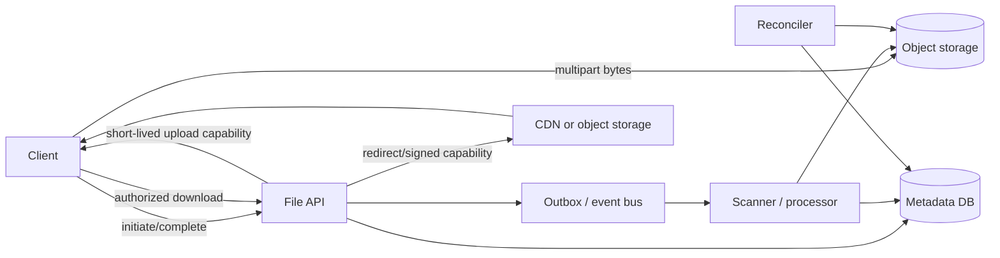
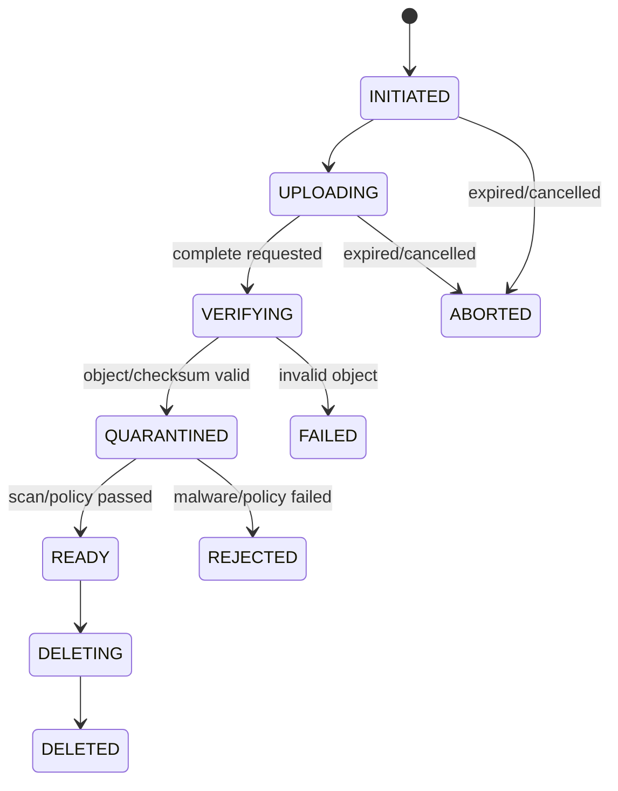

## 1. Clarify requirement trước khi vẽ storage

“Cho người dùng tải file lên” chưa phải requirement đủ chặt. Cần hỏi:

- File là avatar vài MB, video hàng GB, bản sao lưu hàng TB hay hỗn hợp?
- Cần upload resumable, versioning, share link, preview, search metadata và range download không?
- Ai được đọc: owner, thành viên project, cả tenant hay public internet?
- Byte phải durable đến mức nào, giữ bao lâu, có legal hold/right-to-delete không?
- Sau upload có antivirus, DLP, OCR/transcode hay moderation không? File được tải trước khi scan xong chứ?
- Peak request, peak ingress/egress, geographic distribution và latency target là gì?
- Chi phí storage, request, egress và CDN có bound nào?

Ba con số “dung lượng tổng, upload/giây, download/giây” không thay nhau. Một kho lưu 10 PB nhưng gần như lạnh khác hệ thống video có cùng dung lượng và egress rất lớn. Tách metadata traffic nhỏ nhưng nhiều query khỏi byte traffic lớn là quyết định nền tảng.

## 2. Mental model: control plane và data plane

Application/API là **control plane**: xác thực, authorization, quota, metadata, trạng thái workflow và cấp quyền upload/download ngắn hạn. Object storage/CDN là **data plane**: vận chuyển và lưu byte. Không ép mọi byte đi xuyên qua application server nếu không có lý do nghiệp vụ, vì proxy file lớn làm tốn connection, memory/buffer, bandwidth và khả năng scale của business API.



Object store không thay metadata database. DB giữ owner/tenant, original filename, media type do hệ thống xác minh, logical version, size, checksum, object key, retention, scan status và policy fields. Object key nên opaque, chẳng hạn `tenant-hash/file-id/version-id`, không lấy trực tiếp filename người dùng. Tên khó đoán giảm va chạm và path trick nhưng không phải authorization.

## 3. Domain model và state machine

Một record có thể gồm:

```text
FileVersion {
  id, fileId, tenantId, ownerId,
  objectKey, uploadSessionId,
  originalName, declaredMediaType, detectedMediaType,
  expectedSize, actualSize, checksum,
  state, version, createdAt, retentionUntil
}
```

Không dùng một boolean `uploaded`. Workflow cần trạng thái đủ để recovery:



`READY` mới được cấp download thông thường. `QUARANTINED` phải dùng bucket/prefix hoặc policy cô lập để public/CDN không đọc được. State transition dùng optimistic version/conditional update để callback lặp không đưa `REJECTED` trở lại `READY`.

## 4. Upload protocol

### Bước 1 — initiate

Client gửi metadata và idempotency key:

```http
POST /v1/files/uploads
Idempotency-Key: 7f9c...
Content-Type: application/json

{"name":"report.pdf","size":73400320,"mediaType":"application/pdf"}
```

API xác thực tenant/user, kiểm quota/size/type policy, tạo `FileVersion(INITIATED)` và một upload session. Idempotency key phải scoped theo caller/tenant; retry cùng intent trả lại session tương thích thay vì tạo nhiều object. Không tin file size hoặc media type khai báo là sự thật cuối cùng.

### Bước 2 — truyền byte trực tiếp

File nhỏ có thể dùng một presigned upload. File lớn dùng multipart: client chia part, upload song song có giới hạn, retry riêng part lỗi và lưu part number/ETag để resume. Service cấp capability chỉ cho đúng bucket/key, operation, TTL và constraint mà storage hỗ trợ. Không cấp credential storage dài hạn cho browser/mobile.

Multipart cải thiện recovery nhưng thêm state và chi phí. Part chưa complete vẫn chiếm storage; lifecycle/reaper phải abort session hết hạn. Part size không thể tùy tiện: quá nhỏ tăng request/state, quá lớn làm retry đắt và giảm parallelism. Chọn theo giới hạn provider, distribution file size, network và memory client; benchmark bằng workload thật.

```text
initiate -> create multipart upload -> sign part 1..N
         -> client uploads bounded parallel parts
         -> client reports ordered parts -> server completes
         -> verify object attributes/checksum -> enqueue scan
```

### Bước 3 — complete và verify

`POST /uploads/{id}/complete` cũng idempotent. Server không chỉ tin client nói “xong”: đọc object metadata từ storage, xác nhận key, size, checksum/algorithm và multipart completion. ETag không nên mặc định được coi là MD5 nội dung trong mọi mode; semantics thay đổi với multipart/encryption/provider. Dùng checksum feature/cryptographic digest được định nghĩa rõ và lưu algorithm cùng giá trị.

Sau transaction cập nhật state, ghi outbox event cùng commit để scanner cuối cùng nhận được. Consumer scan idempotent theo file version. Nếu publish event thất bại sau DB commit, outbox relay retry; nếu scanner callback lặp, conditional transition giữ kết quả ổn định.

## 5. Consistency: strong object store không làm cả workflow atomic

Amazon S3 hiện cung cấp strong read-after-write cho GET/PUT và LIST của object, nhưng toàn hệ thống vẫn có nhiều consistency boundary: metadata DB, object storage, event bus, scanner, CDN và search index. Không có transaction ACID chung giữa tất cả.

Các trạng thái lệch cần được thiết kế như trường hợp bình thường:

- Object đã upload nhưng DB transaction thất bại: object mồ côi, reaper xóa sau grace period.
- DB ghi `UPLOADING` nhưng client bỏ cuộc: session expiry chuyển `ABORTED` và abort multipart.
- Object complete nhưng complete API timeout: client retry cùng idempotency key; server đối chiếu storage rồi trả kết quả hiện có.
- DB `READY` nhưng CDN cache lỗi cũ: versioned object key và cache policy tránh overwrite ambiguity.
- Delete metadata thành công nhưng xóa object tạm lỗi: state `DELETING`, background retry và audit; không báo physical deletion khi chưa chứng minh.

Reconciler định kỳ so sánh theo bounded partition/time window, không LIST toàn bucket mỗi phút. Metric cần có age/count của `UPLOADING`, `VERIFYING`, `QUARANTINED`, `DELETING`, orphan candidate và multipart chưa hoàn tất. Alert dựa trên age/backlog và user impact, không chỉ error log.

## 6. Download, cache và HTTP semantics

Download flow trước tiên authorize trên metadata hiện tại, rồi trả short-lived signed URL/redirect. Presigned URL là **bearer capability**: ai có URL trong thời hạn thường có thể dùng quyền đã ký. Vì vậy TTL ngắn, HTTPS, scope đúng object/operation, không ghi URL đầy đủ vào analytics/referrer/log, và cân nhắc one-time/application proxy cho tài liệu cực nhạy cảm.

File immutable/versioned phù hợp CDN: cache key gắn version/object key, cache-control dài và không overwrite byte tại cùng URL. Với private content, ký CDN URL/cookie hoặc authorize trước mỗi issuance. Revocation share link phải tách share token logical khỏi raw storage URL; nếu phát URL sống một giờ thì revoke logical link không thu hồi bản URL đã phát trừ khi CDN/storage policy hỗ trợ.

HTTP Range cho phép resume/seek; conditional request với ETag/Last-Modified giảm truyền lại. Server/CDN phải xử lý đúng `206 Partial Content`, `Content-Range`, validator và `If-Range`, không tự ghép byte tùy tiện. Đặt `Content-Disposition` an toàn, encode filename đúng và thêm `nosniff`/media handling phù hợp để nội dung người dùng không biến thành active content cùng origin ứng dụng.

## 7. Sizing bằng assumption, không giả làm benchmark

Ví dụ phỏng vấn **giả định** 2 triệu upload/ngày, kích thước trung bình 8 MiB và hệ số peak 10 lần:

```text
raw ingest/day = uploads/day × average size
                = 2,000,000 × 8 MiB ≈ 15.3 TiB/day

average uploads/s = 2,000,000 / 86,400 ≈ 23
assumed peak      ≈ 230 upload initiations/s
```

Average che tail: vài video lớn có thể thống trị bandwidth. Phải lấy distribution/p95/p99 size và concurrency, không chỉ mean. Storage forecast gồm raw bytes × retention × version growth, replica/provider overhead, thumbnails/transcodes, quarantine và incomplete multipart. Network forecast tách ingress khỏi egress; download amplification và cache hit ratio thường quyết định chi phí.

Metadata QPS gồm initiate/complete/list/share/delete, không bằng byte throughput. Partition DB theo tenant/file ID cần tránh một tenant lớn thành hotspot; index cho `tenantId + parent/folder + createdAt/id` và pagination cursor ổn định. Folder thường là logical metadata, không cần directory vật lý trong object store.

## 8. Security và abuse boundary

- Authorization trên tenant/owner/share policy trước khi cấp capability; không tin object key client gửi.
- Presigned operation, key, TTL, size/content constraint càng hẹp càng tốt; rate limit initiate/sign endpoint.
- Xác minh magic bytes/media type, filename normalization và archive policy; extension `.pdf` không chứng minh nội dung PDF.
- Scan trong quarantine. Scanner xử lý archive bomb bằng giới hạn CPU, memory, recursion, expanded size và timeout.
- Encrypt in transit và at rest; chọn provider-managed hay customer-managed key theo threat/compliance. KMS permission cũng cần least privilege và quota/cost monitoring.
- Không deduplicate toàn cục theo client-supplied hash rồi tiết lộ “file đã tồn tại”: response timing/existence có thể thành cross-tenant oracle. Nếu dedup, xác minh byte và giữ authorization/reference count đúng tenant.
- Download user content trên origin/domain cô lập khi có nguy cơ script/HTML/SVG active content.
- Audit issuance, complete, policy/scan result, share/revoke/delete; không log raw signed URL hoặc secret header.

Malware scanning giảm risk đã biết, không chứng minh file “an toàn tuyệt đối”. Với encryption đầu-cuối mà server không đọc plaintext, server-side scanning/search/preview có thể không thực hiện được; đây là product/security trade-off phải nêu rõ.

## 9. Versioning, deletion và retention

Logical overwrite nên tạo version mới và object key mới. Metadata chỉ đổi current version bằng conditional transaction; reader đang dùng version cũ vẫn hoàn tất. Rollback đổi pointer chứ không copy hàng GB.

Delete có nhiều nghĩa: ẩn khỏi user, thu hồi share, xóa logical reference, đặt lifecycle delete, xóa mọi replica/version và cập nhật search/CDN. Retention/legal hold có thể cấm physical deletion dù user bấm xóa; API cần phản ánh đúng policy thay vì hứa đã xóa. Ngược lại, privacy deletion cần deadline và evidence qua primary store, replicas, derived thumbnails và backup lifecycle.

Reference counting cho dedup/version phải chống race: không xóa object khi vẫn còn reference. Tombstone + delayed GC cho phép event/cache hội tụ; GC kiểm lại reference ở thời điểm xóa. Lifecycle rule của provider là safety net, không thay domain audit.

## 10. Failure scenarios và troubleshooting

- **Upload kẹt 99%:** kiểm part cụ thể, presigned expiry, clock skew, CORS/network và part concurrency. Chỉ ký lại part thiếu; không bắt đầu session mới vô điều kiện.
- **Complete timeout nhưng byte đã tồn tại:** retry idempotent, query multipart/object metadata và conditional state transition. Không tạo object key mới chỉ vì response mất.
- **File READY nhưng download 403:** phân biệt authorization API, signed URL expiry/audience, storage policy, encryption key permission và client clock; correlation ID không được chứa URL bí mật.
- **Download hỏng ở giữa:** kiểm Range/Content-Range, CDN cache key, content length/checksum và version overwrite. Immutable version key loại một lớp race.
- **Quarantine backlog tăng:** đo event lag, scanner saturation, timeout theo file type, KMS/storage dependency; autoscale có bound để archive bomb không khuếch đại chi phí.
- **Chi phí tăng đột biến:** tách storage, request, unfinished multipart, replication, processing và egress; xem cache hit ratio và abuse, không chỉ dung lượng bucket.
- **Đã xóa nhưng vẫn tải từ CDN:** purge/invalidation, TTL và versioned URL policy; xác định đây là cache window đã định nghĩa hay vi phạm deletion SLO.

## 11. Production checklist

- [ ] Requirement có distribution file size, peak ingress/egress, durability, retention, residency và cost bound.
- [ ] Byte đi trực tiếp client–object store/CDN; control API không vô tình thành bandwidth bottleneck.
- [ ] Metadata dùng opaque versioned key và state machine có conditional transition.
- [ ] Initiate/complete/callback idempotent; multipart hết hạn được abort và orphan được reconcile.
- [ ] Server verify object size/checksum; không coi ETag luôn là content MD5.
- [ ] Quarantine cô lập khỏi download/CDN cho tới khi scan/policy pass.
- [ ] Signed capability có HTTPS, operation/key/TTL hẹp và không rò qua log/referrer.
- [ ] Authorization kiểm tenant/resource ở server; list/search/export cùng policy.
- [ ] CDN/Range/conditional request được test với immutable version và private content.
- [ ] Encryption/KMS permission, key rotation, audit và recovery được diễn tập.
- [ ] Delete/retention/legal hold/version/derived object có semantics và evidence rõ.
- [ ] Dashboard có state age/backlog, multipart/orphan, scan latency, byte throughput, egress cost và cache hit ratio.

## 12. Góc phỏng vấn

**“Tại sao không upload qua backend?”** Trả lời bằng control plane/data plane: direct upload giảm bandwidth, connection và memory pressure; backend vẫn authorize, cấp capability, verify complete và điều phối workflow. Sau đó nêu trường hợp proxy hợp lý như transform streaming bắt buộc hoặc client không hỗ trợ.

**“Object store strong consistency rồi còn cần reconciliation không?”** Strong consistency của object operation không tạo transaction với DB, event bus, scanner và CDN. Đưa ba ví dụ partial failure và state/reaper tương ứng.

**“Làm sao resume file 20 GB?”** Multipart session, part number/checksum, bounded parallelism, retry part riêng, persist client/session state, re-sign part hết hạn và complete idempotent. Nêu cleanup incomplete upload.

**“Presigned URL có an toàn không?”** Nó là capability có thời hạn, không phải URL vô hại. Scope, TTL, HTTPS, leakage, revocation window và authorization tại lúc issuance là điểm chính.

**“Đảm bảo file không malware thế nào?”** Không hứa tuyệt đối: quarantine, scanner cập nhật, sandbox/resource limits, policy theo file type, delayed READY, rescan khi cần và incident response. E2E encryption làm thay đổi khả năng scan.

## Key takeaways

- Tách metadata/control plane khỏi byte/data plane để scale, nhưng giữ authorization và workflow ở API.
- Multipart + idempotency + state machine biến retry/partial failure thành behavior có chủ đích.
- Object storage, DB, event, scanner và CDN vẫn cần outbox, reconciliation và immutable versioning.
- Presigned URL là bearer capability; quarantine, tenant authorization và content handling là security boundary.
- Capacity phải tách object count, stored bytes, metadata QPS, ingress, egress và processing cost.
