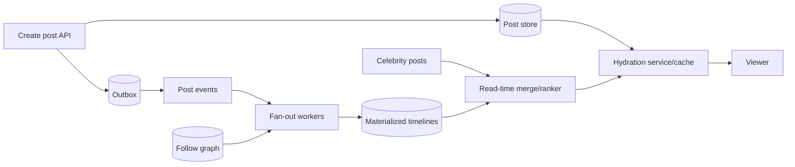

## Requirements quyết định fan-out

News feed có write “post được tạo” và read “viewer mở timeline”, nhưng distribution mới là phần khó: số followers lệch mạnh, active users chỉ là một phần tổng users, ranking có thể thay đổi và privacy/delete phải phản ánh đủ nhanh.

Clarify:

- Feed chronological hay ranked; freshness và pagination stability.
- Follow graph size/distribution; có celebrity với hàng triệu followers không.
- Read/write ratio, active-user ratio, peak sau event lớn.
- Post types/visibility/block/mute; edit/delete propagation deadline.
- Region, retention, offline history, sponsored content và audit.
- Có yêu cầu read-your-own-post, no-duplicate và order theo author không.

Không hứa “exact order toàn hệ thống”. Feed ranked vốn là projection theo model/version; contract thực tế thường là không lộ nội dung bị cấm, hạn chế duplicate và freshness trong SLO.

## Estimate bằng distribution

Gọi `P` là posts/giây và `F` là followers trung bình. Fan-out-on-write work trung bình `P × F`, nhưng average che tail celebrity. Cần percentile/max followers, active follower ratio và batch write capacity. Read work là feed reads/giây × candidates per request; ranking complexity phụ thuộc candidate count, không chỉ page size.

Storage tách source posts/follows khỏi derived inbox/timeline entries. Timeline entry chỉ cần post ID, author, score/time và reason/version; copy toàn payload tăng write/storage/invalidation. Cache memory estimate dùng active timelines × entries retained × bytes/entry × overhead/replication, không chỉ raw IDs.

## Kiến trúc hybrid



Fan-out-on-write precomputes timeline entries nên read nhanh, hợp authors thường và active recipients. Nó write-amplify, tốn storage và celebrity burst. Fan-out-on-read truy vấn posts từ followed authors lúc đọc, giảm write cho inactive users/celebrity nhưng read/ranking đắt và graph lớn.

Hybrid: push posts của authors bình thường vào active followers' inbox; giữ celebrity/recent candidates để merge lúc read. Threshold không hard-code từ blog; lấy distribution/cost measurement và có hysteresis khi author vượt/ngang ngưỡng.

## Source of truth và projection

Post store + follow/privacy state là authoritative; materialized timeline là derived projection có thể rebuild. Kafka/event log giúp distribute/replay nhưng retention phải đủ cho recovery hoặc có backfill từ source. Projection consumer dùng `(eventId, projectionVersion)` để dedup và checkpoint atomically với batch write khi có thể.

Follow/unfollow tạo semantics khó: unfollow có xóa historical entries hay chỉ chặn future? Block/privacy change thường cần filter-at-read ngay để không lộ trong window, rồi async cleanup. Không dựa hoàn toàn vào precomputed inbox cho authorization vì projection lag.

:::warning Security filter cuối
Candidate generation có thể stale. Trước response, enforce visibility/block/tenant policy từ state đủ mới hoặc fail closed theo risk. Cache key phải bao gồm viewer/security context phù hợp.
:::

## Timeline data model

Relational sketch:

```sql title="timeline_entries.sql"
CREATE TABLE timeline_entry (
  viewer_id     bigint NOT NULL,
  score_time    timestamptz NOT NULL,
  post_id       bigint NOT NULL,
  author_id     bigint NOT NULL,
  rank_version  integer NOT NULL,
  PRIMARY KEY (viewer_id, score_time, post_id)
);
```

Composite key hỗ trợ seek theo viewer và descending order; exact syntax/index direction theo engine/query plan. Redis sorted set có thể map member=post ID, score=time/rank, cho range nhanh nhưng floating score/tie cần stable secondary identity và cache không phải source of truth. Một post có score đổi cần update/removal có idempotency.

## Cursor pagination ổn định

Offset pagination drift khi entries mới chèn phía trước. Cursor chứa sort tuple cuối `(score, postId)` cùng rank/filter version. Query lấy item `< cursor` theo deterministic order. Cursor được ký/opaque để client không sửa tenant/viewer, nhưng server vẫn authorization.

Ranked feed khó hơn chronological: model score có thể đổi giữa pages. Options:

- Snapshot/session ID giữ candidate/rank version trong thời gian ngắn: ổn định hơn, tốn state.
- Cursor theo score/version hiện tại: rẻ hơn, có thể duplicate/miss khi rerank.
- Dedup IDs phía client/session: giảm duplicate nhưng không đảm bảo complete.

Chọn theo product; ghi rõ consistency thay vì gọi cursor là “không bao giờ trùng”.

## Ranking pipeline

Candidate generation lấy từ precomputed inbox, celebrity merge và optional exploration. Filter privacy/deleted/muted, hydrate features, score, diversify rồi truncate. Feature/model service chậm cần timeout/fallback rank đơn giản; không để một personalization call làm toàn feed fail.

Model/version được log cùng impression để debug/experiment. Không dùng user ID làm metric label. Sponsored item cần pacing/quota và audit tách khỏi organic rank. Feedback loop phải chống event duplicate và bot/abuse.

## Cache strategy

Cache phù hợp cho hydrated post, author profile nhỏ và first-page result theo cohort/viewer nếu invalidation/privacy kiểm soát được. Cache full personalized feed cho mọi inactive user có thể lãng phí memory.

Stampede ở celebrity post/profile xử lý bằng request coalescing, TTL jitter, refresh-ahead có giới hạn. Delete/privacy update cần tombstone/version và cache invalidation; negative cache ngắn có thể giảm miss storm nhưng đừng giữ “not found” sau create quá lâu.

Nếu Redis down, fallback phải bounded. Rebuild first page từ DB cho mọi user đồng thời có thể hạ source. Degrade số candidates, tắt enrichment hoặc trả last-known-safe data theo freshness/security contract; sensitive deletion không được stale-open.

## Hot users, shards và rebalancing

Shard timeline theo viewer để read một partition; follow graph có thể shard theo follower/followee tùy query. Celebrity author fan-out không nên chạy một task khổng lồ: chunk deterministic, checkpoint và throttle. Một viewer cực active có hot timeline key; segment theo time/bucket hoặc dedicated shard chỉ khi đo thấy cần.

Replication tăng availability/read nhưng có lag; sharding tăng capacity nhưng làm backfill/reshard. Cross-region feed có thể chấp nhận eventual freshness, còn create post nên trả source commit và read-your-own overlay để tác giả thấy bài ngay dù fan-out chưa tới.

## Edit, delete và privacy

Timeline lưu ID nên edit hydrate payload mới mà không rewrite mọi inbox. Delete phát tombstone; read path cũng check source/tombstone để cover lag. Hard-delete/privacy SLA cần prioritized propagation, cache purge và audit. Event replay không được resurrect deleted post: source/version/tombstone thắng historical create.

Out-of-order event dùng aggregate version: update v5 đến trước v4 thì projection bỏ v4. Timestamp từ nhiều producer không đủ cho causal order. Backfill phải tôn trọng current version và share capacity với live traffic.

## Failure scenarios

| Failure | Tác động | Recovery/guardrail |
|---|---|---|
| Fan-out lag | feed thiếu bài mới | queue-age SLO, read-time overlay, scale/throttle |
| Duplicate event | duplicate entry/write | unique key/idempotent projection |
| Celebrity burst | hot partition/write amplification | hybrid read merge, chunk, separate quota |
| Redis loss | miss storm/source overload | bounded fallback, warm gradually, admission |
| Rank service timeout | p99 tăng/empty feed | deadline + deterministic fallback rank |
| Privacy update lag | data exposure | final read authorization, tombstone priority |
| Rebuild chạy cùng live | DB/Kafka saturation | rate limit, isolated resources, dual projection |

## Observability và experiments

Theo dõi create-to-visible latency, fan-out queue age, projection duplicate/error, candidates before/after filters, cache hit cùng source load, hydration/ranking p95/p99, empty/duplicate rate và privacy-delete propagation. Tách by algorithm/version có cardinality hữu hạn.

Product metric không thay system SLO. A/B ranking cần guardrails latency, error, diversity và abuse; assignment stable và impression logging đúng. Rollout model canary, có fallback và rollback version, không rebuild toàn feed chỉ để đổi scoring function nếu có thể score at read.

## Trả lời phỏng vấn

:::interview Fan-out-on-write hay on-read?
Tôi không chọn một phía cho toàn hệ thống. Write fan-out cho read latency tốt nhưng khuếch đại theo followers và lãng phí cho inactive users; read fan-out giảm write nhưng merge/rank đắt. Tôi dùng distribution để chọn hybrid: precompute authors thường cho active followers, merge celebrity lúc đọc, với source/projection tách rõ, cursor ổn định, idempotent replay và privacy filter cuối.
:::

Senior follow-up: threshold celebrity từ đâu; edit/delete không rewrite triệu entries thế nào; cursor khi rank đổi; rebuild projection không chặn live traffic; cache down bảo vệ DB; read-your-own-post qua region.

## Key Takeaways

- Follower distribution và active ratio quan trọng hơn average traffic.
- Timeline là projection có thể rebuild; post/privacy state mới là authority.
- Hybrid fan-out cân bằng write amplification và read merge.
- Cursor cần stable tuple và rank/version semantics rõ.
- Authorization cuối, tombstone/version và bounded fallback bảo vệ correctness khi lag/cache lỗi.
