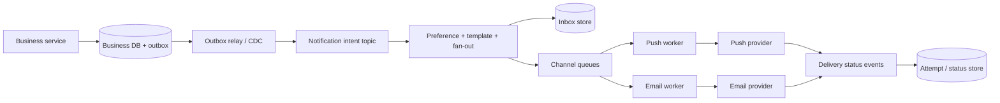

## Clarify trước khi vẽ queue

“Gửi notification” có ít nhất ba outcome khác nhau: hệ thống chấp nhận intent, provider nhận request, và user thật sự nhìn/thao tác. Email accepted không chứng minh vào inbox; push provider success không chứng minh device hiển thị; in-app unread mới chỉ là server state. SLO và UI phải dùng đúng thuật ngữ.

Câu hỏi cần chốt:

- Kênh: in-app, mobile/web push, email, SMS; transactional hay marketing.
- Latency: tức thời, scheduled, digest; deadline sau đó notification không còn giá trị.
- Guarantee: được phép duplicate/mất/stale không; có thứ tự theo user hay entity không.
- Preference/compliance: opt-in, quiet hours, unsubscribe, tenant policy, legal retention.
- Scale shape: average, peak burst theo event, recipients mỗi campaign, payload/template size.
- Region/provider: data residency, provider quota, failover và cost.

:::warning Invariant
Không gửi một notification transactional nhiều lần chỉ vì consumer retry; không gửi channel mà user đã từ chối tại thời điểm policy yêu cầu; không biến provider outage thành overload toàn hệ thống.
:::

## Estimate bằng biến, không bịa con số

Gọi `E` là business events/giây, `R` là recipients trung bình/event, `C` là số channel được chọn. Notification intents/giây xấp xỉ `E × R`; delivery attempts có thể tới `E × R × C × retry factor`. Campaign fan-out tạo burst khác hẳn steady transactional traffic.

Storage unread phụ thuộc số recipients, retention và read/delete rate. Queue capacity cần giữ backlog trong recovery window: `arrival rate × tolerated outage duration`, cộng replication/serialization overhead. Mọi estimate phải ghi peak factor và payload percentile; không dùng average size cho provider batch limit.

## High-level architecture



Business service phát domain event như `OrderShipped`, không tự dựng mọi email. Notification service map event thành notification intent theo use case/version. Với event gắn chặt invariant, business row và outbox commit cùng local transaction để tránh DB thành công nhưng event mất.

Tách fan-out khỏi channel delivery. Fan-out đọc preference, chọn template/language và tạo một logical notification per recipient. Channel worker sở hữu provider API, batching, quota, retry và credential. Nhờ đó email chậm không block in-app/push.

## API và data model

Một command nội bộ có thể chứa:

```json title="NotificationIntent.json"
{
  "eventId": "01J...",
  "notificationType": "ORDER_SHIPPED",
  "recipientId": "user-42",
  "templateVersion": 7,
  "variables": { "orderId": "A123" },
  "occurredAt": "2026-09-02T10:00:00Z",
  "expiresAt": "2026-09-03T10:00:00Z"
}
```

Không đưa rendered HTML tùy ý từ producer vào event; notification service kiểm template và escape theo channel. Data model thường cần `notification` (logical/user-visible), `delivery_attempt` theo channel/provider, `preference`, `template_version`, và idempotency/dedup record.

Dedup key nên gắn business semantics, ví dụ `(tenant, notificationType, recipient, eventId)`. Provider message ID chỉ có sau call nên không bảo vệ crash trước response. Cùng key nhưng payload khác là conflict cần điều tra, không silently overwrite.

## Preference và thời điểm kiểm tra

Preference có thể được kiểm khi tạo intent hoặc ngay trước dispatch. Kiểm sớm giảm work nhưng notification scheduled có thể gửi sau khi user opt-out. Kiểm muộn phản ánh policy mới nhất nhưng cần data access/cache availability. Compliance rule quyết định; đôi khi cần cả snapshot audit và final suppression.

Quiet hours không chỉ là delay theo UTC: cần user timezone, daylight-saving behavior, deadline và priority override. Scheduled queue phải idempotent khi scheduler failover. Digest gom nhiều events cần aggregation window và stable key; không để retry tạo hai digest.

## Ordering, partition và fan-out

Global order không cần và rất đắt. Nếu user phải thấy trạng thái order theo thứ tự, key Kafka theo recipient hoặc aggregate và mang sequence/version để consumer phát hiện gap/out-of-order. Key theo recipient có thể hot khi campaign gửi một user ít vấn đề, nhưng key theo campaign có thể tạo một hot partition; chọn theo ordering và distribution thực.

Celebrity/campaign fan-out không nên tạo hàng triệu records trong một transaction. Chunk có checkpoint, deterministic recipient range và idempotent generation. Backpressure tách campaign traffic khỏi transactional priority bằng topic/queue/quota riêng.

## Rate limit và overload

Rate limit có nhiều scope: provider account, tenant, user, channel và notification type. Token bucket cho burst hữu hạn; concurrency limit bảo vệ số request đang chờ provider. Redis atomic script có thể phối hợp rate trong region, nhưng limiter down cần fail-open/closed theo loại notification.

Transactional password-reset có thể fail-closed nếu vượt abuse threshold nhưng phải có recovery UX; marketing nên fail-closed/schedule lại. Không fallback toàn backlog vào provider vừa hồi phục. Resume bằng ramp-up, jitter và quota headroom.

## Retry, DLQ và outcome unknown

Phân loại response provider:

| Outcome | Hành động |
|---|---|
| Success có provider ID | Lưu attempt/status idempotently |
| Rate limited có retry hint | Schedule lại trong deadline + jitter |
| Temporary network/5xx | Retry có budget nếu provider idempotency hỗ trợ |
| Invalid token/address | Mark endpoint invalid; không retry mù |
| Template/payload invalid | Quarantine và alert owner |
| Timeout sau send | Outcome unknown; query status/idempotency hoặc reconcile |

DLQ không phải nghĩa trang. Record cần error category, original identity, attempt history và payload được bảo vệ. Replay có owner, filter, rate limit và dedup. Nếu notification đã hết deadline, mark expired thay vì gửi muộn gây hại.

## In-app inbox và realtime

Inbox store là source cho unread history; WebSocket/SSE chỉ là acceleration. Client reconnect với cursor/last version, lấy delta hoặc snapshot để bù gap. “Đã push qua socket” không đồng nghĩa client đã persist/read. Mark-as-read là idempotent update có user/tenant authorization.

Unread count có thể là derived counter; duplicate/out-of-order update làm drift nên cần recompute/reconciliation. Keyset pagination theo `(createdAt, id)` tránh offset drift. Retention/archive phải khớp product và privacy deletion.

## Multi-region và provider failover

Active-active generation cần globally unique event/dedup key và quyết định home region/ordering. Preference replication lag có thể gửi sai policy; compliance-sensitive flow có thể route về authoritative region. Hai regions cùng dispatch một intent tạo duplicate nếu dedup chỉ local.

Provider failover không miễn phí: template, sender reputation, unsubscribe list, idempotency semantics và status callback khác nhau. Abstraction nên giữ common intent nhưng adapter phải bộc lộ capability khác biệt; lowest-common-denominator có thể che lỗi.

## Security và privacy

- Payload tối thiểu; link dùng opaque identifier và authorization khi click, không nhét secret/PII vào URL.
- Template variable được context-aware escape; không tin HTML từ upstream.
- Provider webhook xác thực signature, timestamp/replay và mapping tenant.
- Credential theo channel/tenant có rotation và least privilege; không log token/raw content.
- Preferences, audit và deletion có retention policy; analytics tách khỏi transactional source.
- Abuse controls cho OTP/reset: rate, attempt, enumeration-safe response và monitoring.

## Observability và SLO

Đo từng stage: outbox oldest age, intent lag, fan-out duration, queue age, attempt rate/error/throttle, provider latency, expired count, DLQ age, inbox write và realtime reconnect gap. Tag theo channel/type/provider/tenant tier có bounded cardinality; recipient/event ID ở trace/log có kiểm soát, không là metric label.

SLO có thể là “99% transactional intents hợp lệ được accepted bởi provider trước deadline”, không tuyên bố user đã đọc. Synthetic delivery account và provider callbacks bổ sung evidence. Alert theo queue age/deadline burn thay vì chỉ queue length vì arrival rate thay đổi.

## Failure scenarios và recovery

1. DB commit, broker publish fail: outbox relay retry; monitor oldest unpublished.
2. Fan-out crash giữa chunk: checkpoint + deterministic idempotency key.
3. Provider timeout sau accept: provider idempotency/status lookup hoặc reconcile; không gửi mù.
4. Redis limiter down: policy theo class; local emergency bound và queue thay vì storm.
5. Template lỗi rollout: version pin, canary và rollback; existing intents vẫn resolve version.
6. Kafka replay: consumer dedup và channel deadline ngăn gửi lại historical message.
7. WebSocket fleet deploy: drain/reconnect+jitter, inbox cursor bù gap.

## Trả lời phỏng vấn

:::interview 2 phút
Tôi tách domain event, logical notification và channel attempt. Business service ghi outbox với state; Kafka phân phối, fan-out áp preference/template và workers riêng bảo vệ provider bằng quota, retry budget và idempotency. Inbox là source cho user-visible state, socket chỉ acceleration. Tôi thiết kế dedup, deadline, DLQ/replay, preference timing, multi-region ownership và đo queue age tới provider acceptance thay vì gọi chung là delivered.
:::

Senior follow-up: campaign fan-out không hot partition thế nào; opt-out xảy ra sau schedule xử lý ra sao; timeout provider outcome unknown; unread counter reconciliation; failover provider có duplicate không; SLO nào thực sự đo được.

## Key Takeaways

- Accepted, provider-delivered và user-read là ba outcome khác nhau.
- Outbox bảo vệ event intent; consumer/channel vẫn cần idempotency.
- Preference, deadline, rate limit và retry phải theo notification class.
- Inbox/cursor phục hồi state; WebSocket không phải durable delivery.
- Queue age, attempt state và reconciliation mới làm platform vận hành được.
