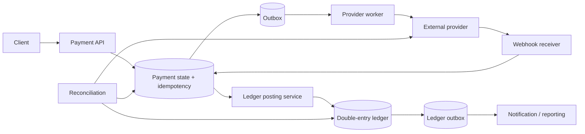

## Scope và invariants trước kiến trúc

“Payment system” có thể là checkout gọi cổng thanh toán, ví nội bộ, ledger kế toán hoặc settlement giữa nhiều bên. Case này thiết kế ba boundary: **Payment Orchestrator** quản lý workflow, **double-entry ledger** ghi nhận biến động nội bộ, và **external payment provider** thực hiện charge/refund ngoài transaction của ta. Đây không phải hướng dẫn tuân thủ tài chính; currency, rounding, retention, authorization và reporting phải theo miền thực tế.

Clarify requirements:

- Phương thức payment, currencies, authorize/capture/refund/void và partial operation.
- Người dùng cần kết quả đồng bộ hay trạng thái `PENDING` được chấp nhận.
- Invariant: một business request không charge hai lần; ledger cân bằng; không sửa/xóa lịch sử đã post.
- Availability so với correctness: khi provider timeout, có được báo failed không?
- Settlement/reconciliation cadence, dispute/chargeback và manual operations.
- Audit, data classification, role separation và transaction authorization.

Capacity estimate dùng assumptions: peak payment attempts/s, ledger entries/transaction, provider latency/tail, retry volume, event retention và reconciliation scan. Không lấy một con số TPS chung làm sự thật vì durability/index/hardware/workload quyết định.

## Tách workflow, provider và ledger



Payment state (`CREATED`, `PROCESSING`, `AUTHORIZED`, `CAPTURED`, `FAILED`, `REFUNDED`...) mô tả workflow. Ledger account/transaction/entry mô tả giá trị kinh tế. Provider status là external truth của provider. Không nhét cả ba thành một cột `status` vì chúng có thể hội tụ ở thời điểm khác nhau: provider captured nhưng webhook chậm; payment state chưa cập nhật; ledger chưa post.

Mỗi boundary có identity riêng:

- `payment_id`: operation của sản phẩm.
- `idempotency_key`: retry identity do caller cung cấp, scoped theo actor/operation.
- `provider_reference`: identity phía provider.
- `ledger_transaction_id`: accounting event không đổi.
- `event_id`: message delivery/dedup, không thay business identity.

## Idempotency từ entry point

Client có thể timeout sau khi server commit. Nếu retry tạo payment mới, hệ thống có thể charge hai lần. Trong transaction đầu, insert `(merchant/account, operation, idempotency_key)` unique cùng request fingerprint và response/status. Cùng key + cùng fingerprint trả lại operation cũ; cùng key + payload khác là conflict. TTL chỉ đặt sau khi biết retry/dispute window; xóa quá sớm làm key tái sử dụng nguy hiểm.

```sql title="payment_idempotency.sql"
CREATE TABLE payment_request (
  payment_id       uuid PRIMARY KEY,
  account_id       bigint NOT NULL,
  idempotency_key  text NOT NULL,
  request_hash     bytea NOT NULL,
  amount_minor     bigint NOT NULL CHECK (amount_minor > 0),
  currency         char(3) NOT NULL,
  state            text NOT NULL,
  version          bigint NOT NULL,
  UNIQUE (account_id, idempotency_key)
);
```

Tiền không dùng binary floating point. Minor unit integer hoặc decimal với currency/scale rule explicit; zero-decimal hoặc special rounding cần domain model, không giả mọi currency có hai chữ số.

## Double-entry ledger

Mỗi ledger transaction có ít nhất hai entries; tổng debit và credit theo currency phải cân bằng. Cách biểu diễn sign/debit-credit tùy model, nhưng invariant phải enforced tại posting boundary. Ledger đã post là append-only: correction tạo reversal/adjustment liên kết record cũ, không `UPDATE amount` để mất audit.

Một schema khái niệm:

```sql title="ledger.sql"
CREATE TABLE ledger_transaction (
  id uuid PRIMARY KEY,
  business_key text NOT NULL UNIQUE,
  kind text NOT NULL,
  effective_at timestamptz NOT NULL,
  created_at timestamptz NOT NULL DEFAULT now()
);

CREATE TABLE ledger_entry (
  transaction_id uuid NOT NULL REFERENCES ledger_transaction(id),
  entry_no smallint NOT NULL,
  account_id bigint NOT NULL,
  currency char(3) NOT NULL,
  amount_minor bigint NOT NULL CHECK (amount_minor <> 0),
  PRIMARY KEY (transaction_id, entry_no)
);
```

Ví dụ đơn giản, user cash account `+100` và provider-clearing account `-100`; tổng bằng 0 trong cùng currency. Thực tế fees, tax, reserve và multi-currency tạo thêm accounts/transactions; không cân bằng chéo currency bằng tỷ giá ngầm.

:::warning Schema minh họa, không phải production DDL hoàn chỉnh
`entry_no` cho phép nhiều ledger lines cùng account/currency. Constraint tổng bằng 0 và append-only không thể hiện đầy đủ trong snippet row-level này; production phải đóng write path, post toàn bộ entries atomically, validate theo currency và ngăn sửa/xóa bằng quyền cùng audit phù hợp.
:::

Post ledger transaction + entries + outbox trong một database transaction. Validation trong code là chưa đủ vì race/bug/deploy khác có thể đi vòng; dùng unique/check/foreign key và cơ chế database phù hợp. Nếu invariant tổng entries không diễn đạt được bằng check constraint row-local, posting function/service phải khóa/validate atomically và có reconciliation độc lập.

## Balance: derived nhưng phải phục hồi được

Balance có thể tính từ entries nhưng quét toàn lịch sử không phù hợp read nóng. Dùng balance projection/materialized snapshot cập nhật cùng transaction hoặc async theo version. Nếu synchronous, khóa account rows theo thứ tự ổn định để giảm deadlock; nếu async, contract nói rõ freshness và available balance không được dùng sai cho authorization tức thời.

Current balance không thay ledger. Projection cần checkpoint, idempotent apply và rebuild. So sánh aggregate entries với projection là reconciliation nội bộ. Hot account (ví dụ clearing) có thể gây row contention; partition/striped intermediate aggregation chỉ được thêm sau profiling và vẫn phải giữ invariant tổng.

## Gọi external provider: không có distributed transaction

Database transaction của ta không bao phủ HTTP call provider. Không giữ DB lock trong network call dài. Orchestrator commit intent + outbox, worker gọi provider với provider idempotency/reference nếu được hỗ trợ, rồi commit result. Nếu provider không có idempotency mạnh, ta vẫn dedup local nhưng không thể tuyệt đối ngăn remote side effect khi outcome unknown; reconciliation trở thành bắt buộc.

Timeout nghĩa là **unknown**, không đồng nghĩa failed. Request có thể đã tới provider và charge xong trước khi response mất. Mark `UNKNOWN/PENDING`, query provider hoặc đợi signed webhook; không tự charge lại như operation mới. Retry dùng cùng reference, bounded backoff và deadline. Circuit breaker giảm pressure nhưng không giải quyết correctness.

Webhook receiver xác minh sender/signature theo contract provider, lưu raw-event hash/ID có retention phù hợp, ack sau durable acceptance, xử lý async idempotent. Event đến duplicate/out-of-order nên state transition có version/precedence và reconciliation. Signature hợp lệ không cho phép chuyển từ `REFUNDED` về `CAPTURED` nếu domain rule cấm.

## Transactional Outbox và event boundary

Khi state/ledger commit mà publish fail, outbox relay retry. Consumer dedup bằng event/business key gần side effect. Kafka idempotent/transactional producer giúp boundary Kafka, nhưng database và provider vẫn cần outbox/idempotency/reconciliation. Không tuyên bố “exactly-once payment” chỉ vì producer config.

Event payload tối thiểu, versioned, không chứa full card/secret. `PaymentCaptured` có payment ID, amount/currency, provider reference đã tokenized/masked theo policy, occurred time và version. Notification/reporting consumer không được trở thành authority quyết định money state.

## Concurrency và isolation

Hai refund đồng thời hoặc capture/refund race cần optimistic version, conditional update hoặc row lock trong transaction ngắn. Isolation mạnh hơn có thể tạo serialization failures phải retry toàn transaction; nó không sửa business predicate thiếu. Unique constraint bảo vệ một business key tốt hơn “check rồi insert”.

Deadlock xử lý bằng lock ordering, transaction ngắn, index đúng và retry bounded. Không tăng connection pool để chữa lock contention: nhiều waiting transactions có thể làm tail latency xấu hơn. Theo dõi transaction age, lock wait, deadlock, connection acquisition và statement latency.

## Reconciliation là một feature chính

Reconciliation so sánh ba nguồn: provider reports/API, payment workflow và ledger. Match theo stable references, amount/currency và time window; phân loại missing, duplicate, amount mismatch, wrong state, orphan và late event. Job phải checkpoint/idempotent, không tự “sửa” money state không audit.

Sai lệch tạo case có severity/owner, evidence và action: replay event, fetch provider, post adjustment/reversal hoặc manual approval. Mọi manual action cần least privilege, transaction-specific authorization và audit trước/sau. Dashboard có oldest unresolved discrepancy và value-at-risk theo bounded labels, không chỉ count tổng.

## Security và dữ liệu nhạy cảm

Giảm phạm vi dữ liệu: dùng provider token thay vì lưu credential/card data nếu architecture cho phép. TLS trên từng hop, encryption/secret lifecycle, log redaction và access audit. Authorization gắn actor + account + operation + amount/state; admin role chung không tự cho phép refund mọi tenant. High-risk action có thể cần step-up/dual control theo yêu cầu miền.

Không lấy amount/account từ client confirmation screen làm authority; server bind authorization với transaction data cụ thể và kiểm lại khi execute. Webhook secret/signing key rotate có overlap, replay window và monitor version. Idempotency endpoint cũng cần abuse limits để attacker không làm đầy storage bằng key ngẫu nhiên.

## Failure matrix

| Failure | Trạng thái đúng | Recovery |
|---|---|---|
| API crash sau local commit | operation tồn tại | retry cùng idempotency key trả operation cũ |
| Provider timeout | `UNKNOWN/PENDING`, không `FAILED` vội | query/webhook/reconcile cùng reference |
| Duplicate webhook/event | không post ledger lần hai | unique business key + idempotent state transition |
| Outbox relay dừng | state đúng, downstream lag | alert oldest outbox age, resume/replay |
| Ledger post lỗi | payment và ledger chưa hội tụ | retry có idempotency; discrepancy alert |
| Balance projection lag | ledger vẫn authority | expose freshness, rebuild/checkpoint |
| DB primary failover | request outcome có thể unknown | retry idempotent, inspect commit/result |
| Provider reports mismatch | không silently overwrite | reconciliation case + audited resolution |

## Observability và SLO

Theo dõi success không chỉ HTTP 200: authorization-to-capture latency, pending/unknown age, provider error/timeout, idempotency hit/conflict, webhook verification/replay, outbox age, ledger posting failure, reconciliation mismatch và manual adjustment. Trace liên kết payment/provider/ledger IDs nhưng không dùng raw PII làm label.

SLO tách API acceptance, finalization và reconciliation freshness. Alert theo symptom có user/value impact; provider failure cần circuit/degrade message rõ cho client. Audit event phải immutable đủ để điều tra ai yêu cầu, policy nào cho phép và state transition nào xảy ra.

## Góc phỏng vấn

:::interview Làm sao tránh charge hai lần?
Tôi không dựa vào “exactly once”. Entry API lưu idempotency key + request fingerprint bằng unique constraint trong cùng transaction tạo payment. Gọi provider dùng cùng stable reference/idempotency nếu hỗ trợ; timeout được coi là unknown và reconcile thay vì tạo charge mới. Webhook/event/ledger posting đều idempotent bằng provider event ID hoặc business key. Ledger append-only double-entry giữ invariant và reconciliation so sánh provider, workflow, ledger để phát hiện sai lệch.
:::

Senior follow-up: crash ở mọi điểm; refund concurrent; ledger balance hot row; provider không có idempotency; cross-currency; manual correction; exactly-once Kafka bao phủ gì; authorization của refund.

## Key Takeaways

- Payment workflow, provider state và ledger là ba boundary khác nhau cần reconciliation.
- Timeout remote là unknown outcome; retry phải giữ cùng operation identity.
- Double-entry append-only + constraints bảo vệ invariant; correction bằng reversal.
- Outbox/idempotent consumer giảm dual-write gap nhưng không thay reconciliation.
- Security gắn authorization với transaction data, least privilege và audit.
