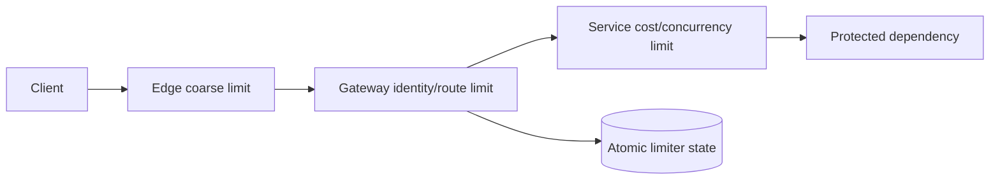

## 1. Clarify requirement trước algorithm
“Giới hạn 100 request/phút” chưa đủ để thiết kế. Cần hỏi:
- Giới hạn theo user, API key, tenant, IP, route hay tổ hợp?
- `100/min` là steady rate, burst hay quota billing chính xác?
- Một request rẻ và export report 30 giây có cùng cost không?
- Policy áp dụng global, theo region hay theo gateway instance?
- Khi limiter/store lỗi: fail-open để giữ availability hay fail-closed để bảo vệ tiền/security?
- Client cần biết còn bao nhiêu quota và retry lúc nào?

Rate limiter không chỉ chống abuse. Nó bảo vệ capacity, chia fairness giữa tenant, kiểm soát cost và tạo backpressure. Security authentication/authorization vẫn là lớp khác; attacker có thể phân tán qua nhiều identity/IP.



## 2. Policy model
Một rule có thể biểu diễn bằng:

```text
key       = tenantId + routeGroup
capacity  = burst tokens
refill    = tokens per second
cost      = weight of this operation
decision  = allow if tokens >= cost
response  = remaining + retryAfter + policyId
```

Identity phải lấy từ credential đã xác thực khi có thể. Tin header `X-User-Id` từ internet hoặc chỉ dùng IP sau proxy/NAT tạo bypass hoặc phạt nhầm hàng nghìn user. Gateway chuẩn hóa trusted proxy chain; anonymous endpoint có thể kết hợp IP prefix, device/session signal và global protection.

Hierarchical quota giải noisy neighbor: global service bucket, tenant bucket, user/route bucket. Request phải qua tất cả rule liên quan. Tuy nhiên update nhiều bucket atomic xuyên shard phức tạp; có thể đặt chúng cùng ownership key, reserve quota theo tầng hoặc chấp nhận bound sai số được định nghĩa.

## 3. So sánh algorithm
| Algorithm | State | Burst/Fairness | Điểm yếu |
|---|---|---|---|
| Fixed window counter | Một counter/window | Cho burst ở biên hai window | Spike gần boundary, coarse |
| Sliding log | Timestamp mỗi request | Chính xác cửa sổ trượt | Memory/O(log n) cao |
| Sliding window counter | Vài counter + trọng số | Gần đúng, tiết kiệm | Có approximation error |
| Token bucket | Token + last refill | Cho burst có kiểm soát | Cần atomic time/refill |
| Leaky bucket/queue | Queue/drain rate | Output mượt | Tăng latency, queue phải bounded |
| Concurrency limiter | In-flight count | Bảo vệ work dài | Cần lease/cleanup khi crash |

Token bucket thường phù hợp API vì tách steady rate `r` khỏi burst capacity `B`. Tại thời điểm `t`:

```text
refilled = min(B, tokens + (t - lastRefill) * r)
allow    = refilled >= requestCost
next     = allow ? refilled - requestCost : refilled
```

Decision đọc–tính–ghi phải atomic. Dùng monotonic/server time nhất quán; clock client không đáng tin. Capacity bucket không phải “max concurrent request”: burst 100 request tức thời có thể tạo 100 in-flight, nên downstream chậm còn cần concurrency limit/queue.

## 4. Distributed state và atomicity
Limiter local trong mỗi gateway rất nhanh nhưng tổng quota tăng theo số instance và traffic routing không đều. Shared store cho global-ish decision nhưng thêm network hop, hotspot và dependency. Mô hình hybrid cấp một lượng token nhỏ từ global bucket cho local instance: giảm latency nhưng overshoot tối đa phải tính và chấp nhận.

Redis có thể giữ fixed window bằng `INCR` + expiry; read rồi increment tách rời tạo race, và crash giữa `INCR`/`EXPIRE` có thể leak key. Transaction hoặc script/function gom decision atomic. Token bucket cần script cập nhật token + timestamp trong một lần.

```lua title="token_bucket.lua"
local key = KEYS[1]
local now = tonumber(ARGV[1])
local rate = tonumber(ARGV[2])
local capacity = tonumber(ARGV[3])
local cost = tonumber(ARGV[4])

local values = redis.call('HMGET', key, 'tokens', 'updated_at')
local tokens = tonumber(values[1]) or capacity
local updated = tonumber(values[2]) or now
tokens = math.min(capacity, tokens + math.max(0, now - updated) * rate)

local allowed = 0
if tokens >= cost then
  tokens = tokens - cost
  allowed = 1
end

redis.call('HSET', key, 'tokens', tokens, 'updated_at', now)
redis.call('EXPIRE', key, math.ceil(capacity / rate) * 2)
return {allowed, tokens}
```

Đây là skeleton để giải thích atomicity; production cần đơn vị thời gian/number precision, validation khi `rate=0`, cluster key placement, script timeout và response `retryAfter` được test kỹ.

Hot tenant tạo hot key dù Redis cluster còn tổng capacity. Có thể dedicated bucket/shard cho whale tenant, hierarchical allocation hoặc split token lease; hash cùng một logical quota ra nhiều key rồi cộng không atomic sẽ cho vượt quota.

## 5. Consistency và multi-region
Strong global limit cần coordination xuyên region, tăng latency và giảm availability khi partition. Nhiều hệ thống chọn quota region-local với allocation tổng: tenant có 1.000 token, phân 600/400; rebalancer dịch chuyển allocation chậm. Overshoot/underutilization được bound nhưng request path không gọi cross-region.

Quota billing hoặc operation đắt/không đảo ngược có thể cần reservation ở authority duy nhất. Public read API có thể chấp nhận approximate AP limiter. Quyết định consistency phải theo consequence, không áp một mode cho mọi endpoint.

Khi store lỗi:
- Login/password reset có thể fail-closed hoặc dùng local emergency cap để tránh brute force.
- Read endpoint không nhạy cảm có thể fail-open có giới hạn để giữ availability.
- Payment/export tốn tiền có thể queue/fail-closed theo business risk.

Policy này phải explicit theo route và có metric; đừng catch exception rồi allow tất cả một cách vô hình.

## 6. API response và client behavior
Khi reject vì rate, HTTP 429 là tín hiệu chuẩn và response có thể kèm `Retry-After`. Error body nên có stable code, policy scope và retry time không lộ dữ liệu tenant khác. Client tôn trọng server hint, backoff + jitter và không retry nếu deadline hết.

```http title="Response minh họa"
HTTP/1.1 429 Too Many Requests
Retry-After: 12
Content-Type: application/problem+json

{"type":"rate-limit","title":"Request rate exceeded","retryAfterSeconds":12}
```

Header “remaining” chỉ advisory trong distributed system: request song song có thể dùng quota ngay sau response. Không dùng nó làm authorization/billing source of truth.

## 7. Capacity và availability
Ước lượng từ workload:

```text
limiter decisions/s = incoming requests/s × number of rules evaluated
state cardinality   = active identities × route groups × active windows
network bandwidth   = decisions/s × request+response bytes
hot-key share       = max decisions for one key / total decisions
```

Thêm TTL cleanup, replication/failover, script CPU và p99 latency vào benchmark. Không dùng average RPS để chọn capacity; kiểm tra burst, retry storm và key distribution. Local cache “allow” quá lâu tăng overshoot; cache deny quá lâu phạt user sau khi window hết.

Limiter itself phải có timeout ngắn, connection pool riêng, circuit behavior và admission control. Nếu mọi request treo chờ limiter, lớp bảo vệ trở thành nguồn outage.

## 8. Observability và test
Metric tối thiểu: allowed/denied theo policy/route/tenant class, limiter latency p50/p95/p99, store error, fail-open/fail-closed count, token saturation, hot keys và estimated overshoot. Không gắn raw user ID vào metric cardinality cao; log sampled/audit có kiểm soát.

Test gồm:
- Boundary của refill/window bằng deterministic clock.
- Nhiều thread/process tranh cùng key, không double-spend.
- Burst rồi steady state; weighted request.
- Store timeout/failover và policy từng route.
- Clock đi lùi, duplicate request và retry storm.
- Multi-region partition/reallocation nếu hỗ trợ.

:::interview Trade-off cần nói rõ
Nếu interviewer yêu cầu “strict global 100/s ở mọi region”, hãy hỏi họ chấp nhận latency/unavailability khi partition hay chấp nhận bounded overshoot. Đó là yêu cầu consistency, không chỉ là chọn Redis.
:::

## Production checklist
- Rule có owner, identity source, dimension, algorithm, rate/burst/cost và exception policy.
- Atomic decision được chứng minh dưới concurrency; TTL không leak state.
- Layer edge/gateway/service không vô tình cộng quota hoặc trả retry storm.
- Fail-open/fail-closed theo consequence và được đo.
- Hot key, multi-region overshoot và rebalancing có bound/runbook.
- 429 + `Retry-After` contract; client backoff/jitter.
- Load/chaos test limiter và dependency dưới burst, latency, partition.

## Câu trả lời phỏng vấn 2 phút
Tôi bắt đầu bằng dimension và semantics: per user/tenant/route, steady rate, burst, strict hay approximate, multi-region và failure policy. Với API phổ biến tôi chọn token bucket vì kiểm soát burst và refill; decision atomic trong Redis/script, key từ identity đáng tin. Tôi thêm quota phân tầng để chống noisy neighbor, concurrency limit cho work dài, 429/Retry-After cho client. Tôi phân tích hot key, store outage, fail-open/closed và global coordination; capacity từ peak distribution và test, observability gồm deny rate, latency, store error và overshoot.

## Key Takeaways
- Rate limiting là capacity/fairness policy, không chỉ một counter.
- Algorithm phải khớp burst, accuracy, memory và latency requirement.
- Distributed decision cần atomicity; strict global quota có coordination cost.
- Failure policy, client contract và observability quan trọng ngang data structure.
