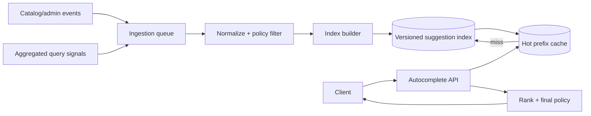

## Autocomplete khác full search

Autocomplete trả một danh sách ngắn khi người dùng còn đang gõ. Nó có latency budget chặt, request rate cao hơn search hoàn chỉnh, query rất ngắn và ambiguity lớn. Product có thể muốn gợi ý entity (“Spring Boot”), query phổ biến (“spring transaction”), command hoặc lịch sử cá nhân. Mỗi loại có authority, ranking và privacy khác nhau.

Clarify:

- Prefix-only hay hỗ trợ infix/typo/fuzzy; có bỏ dấu tiếng Việt không.
- Corpus: catalog quản trị, user-generated query, entity hay hỗn hợp.
- Ranking: popularity, freshness, personalization, locale và business rule.
- Freshness cho create/update/delete; nội dung bị cấm phải biến mất trong bao lâu.
- Peak keystrokes/s, active locales, max result, availability và fallback.
- Có được hiển thị query hiếm có thể làm lộ PII không.

Đừng bắt đầu bằng “dùng Trie/Elasticsearch”. Trước hết xác định semantics và dataset. Vài chục nghìn catalog items có thể chạy tốt bằng database index + cache; hàng trăm triệu queries đa ngôn ngữ với fuzzy/ranking phức tạp có thể cần search engine chuyên dụng.

## Kiến trúc đọc nhiều, ghi theo pipeline

Write path thu thập source records/signals, normalize, kiểm policy, tính features và xây versioned index. Read path validate query, normalize cùng version, lookup candidates, rank/filter rồi trả kết quả. Index là derived data có thể rebuild; source catalog và approved aggregate signals mới là authority.

Client debounce/cancel request cũ giúp giảm tải và tránh response cũ ghi đè query mới, nhưng server vẫn cần capacity/rate limit. Request mang query sequence hoặc client chỉ render nếu input hiện tại khớp response.

## Normalization không phải `lowercase()` đơn giản

Unicode có nhiều chuỗi code point canonically equivalent. Chọn normalization form (thường NFC cho lưu/hiển thị; use case search có thể tạo normalized search key riêng) và áp nhất quán lúc index/query. Case folding, whitespace, punctuation, width, locale và accent folding là product decisions.

Với tiếng Việt, bỏ dấu có thể giúp người dùng gõ `quan ly` tìm “quản lý”, nhưng tăng collision và có thể đổi nghĩa. Lưu cả display text nguyên bản và search variants; ranking ưu tiên exact accent/case hợp lý rồi fallback folded. Không overwrite canonical display bằng chuỗi đã bỏ dấu.

Pipeline cần version (`normalizerVersion`) để rebuild khi rule đổi. Đừng normalize security identifier/username bằng rule search nếu identity contract khác; confusable characters và mixed scripts cần abuse review. Giới hạn code points/bytes, không xử lý regex do user cung cấp tùy ý.

## Các cấu trúc index và trade-off

### Relational prefix index

Table `suggestion(normalized_text, display_text, type, locale, score, version, ...)` với B-tree có thể phục vụ range/prefix nếu collation/operator/index phù hợp và query được kiểm bằng `EXPLAIN ANALYZE`. Trigram extension hỗ trợ similarity/infix nhưng index/write/storage cost khác; full-text search xử lý token/lexeme chứ không tự là prefix autocomplete hoàn hảo.

Ưu điểm: transaction/catalog consistency, ít hệ thống, query/filter dễ. Nhược: fuzzy/ranking lớn có thể tốn CPU, hot prefixes và QPS keystroke gây pressure primary. Read replica/cache có lag cần contract.

### Trie/FST hoặc search engine

Trie chia sẻ prefix, lookup nhanh theo độ dài query nhưng memory overhead phụ thuộc alphabet/representation. Compressed trie/FST giảm memory và có thể lưu top-K tại node, đổi lại build/update phức tạp. Search engine có analyzers, completion/prefix/fuzzy và distributed index, nhưng thêm cluster, shard, refresh/reindex và relevance expertise.

### Redis sorted set/cache

Sorted set giữ members theo score, hữu ích cho top candidates đã materialize hoặc hot-prefix cache. Tạo key cho mọi prefix có write/memory amplification rất lớn; một từ dài sinh nhiều prefix, cộng locale/version/cohort. Chỉ cache prefixes có traffic, giới hạn độ dài/cardinality/TTL và đo actual bytes, không xem Redis là vô hạn.

## Candidate generation và ranking

Pipeline ranking nên tách:

1. Candidate retrieval đủ recall theo prefix/variant.
2. Hard filter: tenant, locale, visibility, moderation, deleted/tombstone.
3. Features: exactness, static quality, decayed popularity, freshness, type prior.
4. Optional personalization theo consent và bounded user profile.
5. Diversity/dedup và stable tie-breaker.

Một công thức minh họa là `score = w1*textMatch + w2*quality + w3*log(popularity) + w4*freshness`; weights phải học/đánh giá từ dữ liệu sản phẩm, không copy số. Log/normalize popularity để một head query không nuốt mọi kết quả. Stable tie-breaker như `(score, normalizedText, id)` giúp pagination/debug, dù autocomplete thường chỉ top K.

Popularity từ raw user queries có poisoning và privacy risk. Aggregate với threshold hoặc k-anonymity policy thích hợp, filter PII/toxic/spam, rate-limit actors và decay theo thời gian. Threshold/k-anonymity chỉ giảm một số disclosure risks, không tự bảo đảm anonymity hay ngăn re-identification khi kết hợp dữ liệu khác. Không log raw query nhạy cảm vô thời hạn. Editorial pinned results cần audit, locale/tenant scope và expiry.

## Freshness, delete và rebuild

Indexing async tạo freshness lag. Catalog create có thể chờ giây/phút theo SLO, nhưng legal/security delete có thể cần tombstone final-read ngay. Mọi record mang source version; out-of-order update cũ không được resurrect item mới xóa.

Rebuild không overwrite live index tại chỗ:

1. Snapshot source và tạo index version mới.
2. Consume changes sau checkpoint vào cả current/new hoặc catch up có kiểm soát.
3. So sánh count, sample queries, policy deletes, latency và relevance guardrails.
4. Canary/shadow traffic; atomic switch alias/version.
5. Giữ old version đủ rollback rồi xóa theo retention.

Normalizer/ranker/cache key đều chứa version để tránh response trộn. Rebuild throttle theo resource; nó không được làm live query/primary DB mất SLO.

## Cache và hot prefixes

Một ký tự như `s` có cardinality/candidate rất lớn và traffic cao. Có thể yêu cầu minimum normalized length, trả curated default, cache top K theo `(locale, tenant/cohort, prefix, indexVersion)` và request coalescing. TTL jitter giảm synchronized expiry; refresh-ahead chỉ cho hot keys có quota.

Cache hit không bỏ final authorization/moderation nếu policy có thể thay đổi nhanh. Khi Redis down, fallback phải bounded: local small cache, giảm candidate/fuzzy/personalization, hoặc trả empty/curated response. Cho mọi miss đánh thẳng search cluster/DB có thể tạo cache-outage cascade.

Negative caching cho prefix không kết quả giảm repeated misses nhưng TTL ngắn để item mới xuất hiện. Theo dõi cache memory, eviction, big/hot key, command latency và source QPS chứ không chỉ hit ratio.

## API và client contract

Ví dụ `GET /suggestions?q=...&locale=vi-VN&limit=8`. Server clamp limit, query bytes/code points, timeout và complexity. Response gồm stable ID, display label, type, optional highlight ranges theo code point contract và index version/debug token nội bộ. Không trả raw scoring features nhạy cảm.

HTTP cache có thể dùng cho public cohort prefixes nhưng personalized/tenant response cần key/Vary/private policy chính xác. Rate limit dựa identity/IP/risk và operation cost; bot có thể enumerate catalog bằng mọi prefix. Trả generic errors, không leak “query này thuộc user X”.

Client debounce là trade-off UX; con số phải đo theo typing/device/network. Cancel request cũ không đảm bảo server đã dừng, nên backend vẫn deadline/cancellation aware. Accessibility cần keyboard navigation, screen-reader announcement và selection semantics.

## Failure scenarios

| Failure | Tác động | Guardrail |
|---|---|---|
| Indexing lag | item mới thiếu | freshness metric, checkpoint, source fallback có hạn |
| Delete event trễ | nội dung cấm còn hiện | tombstone/version + final policy filter |
| Hot one-character prefix | CPU/cache key nóng | min length, curated result, partition/cache/admission |
| Cache flush | thundering herd | coalescing, warm gradually, source concurrency limit |
| Ranking deploy xấu | relevance/latency giảm | version, offline set, shadow/canary, rollback alias |
| Unicode rule đổi | miss/duplicate | normalizer version + full rebuild |
| Signal poisoning | spam lên top | actor limits, robust aggregate, moderation/audit |
| Search cluster down | empty/slow UI | bounded local/default fallback, short deadline |

## Observability và quality

System metrics: QPS, latency p50/p95/p99, timeout/error, cache hit/miss/eviction, index lookup/candidate count, hot prefixes, ingestion lag, index age/size và rebuild progress. Product/relevance: zero-result, reformulation, suggestion selection, abandonment và diversity—được thu thập theo privacy policy.

High-cardinality raw query không là metric label. Dùng sampled/redacted logs có access/retention; trace slow path theo component. Alert theo user symptoms và freshness/delete SLO. Load test phải dùng prefix distribution, locales, cache cold/warm, index update và failure, không random uniform strings.

## Góc phỏng vấn

:::interview Thiết kế autocomplete bắt đầu từ đâu?
Tôi tách autocomplete khỏi full search, hỏi corpus, prefix/fuzzy, locale, ranking, freshness/delete và privacy. Tôi giữ source riêng, xây versioned derived index; bắt đầu database index nếu scale/feature cho phép, chỉ thêm Trie/search engine khi evidence cần. Read path normalize nhất quán, lookup candidates, hard-filter, rank và cache hot prefixes. Tôi thiết kế cache-outage fallback, zero-downtime reindex, tombstone và metrics cả latency lẫn relevance.
:::

Senior follow-up: tiếng Việt bỏ dấu; một ký tự hot; PII trong query logs; update/delete trong rebuild; Trie memory; cache key explosion; đo relevance; personalization leak giữa tenant.

## Key Takeaways

- Semantics, locale, privacy và freshness quyết định thiết kế trước data structure.
- Normalization cần version và giữ display text; accent folding là product trade-off.
- Index là derived data phải rebuild/switch/rollback được.
- Hot-prefix cache cần bounded fallback và cardinality control.
- Relevance, abuse và delete propagation quan trọng ngang latency.
