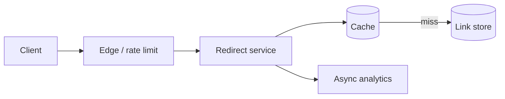

## Requirements và assumptions
Core: tạo short URL, redirect, optional expiry/custom alias. Non-functional: redirect p99 thấp, read-heavy, high availability, chống malicious URL. Giả sử 10 triệu URL mới/ngày, 100 redirect trên mỗi write và lưu 5 năm; cần xác nhận average URL size và replication trước khi ước lượng storage.

## API và data model
POST /links dùng idempotency key; GET /{code} trả 301 hoặc 302. 301 cache mạnh nhưng khó thay đổi target/analytics; 302 linh hoạt hơn. Mapping gồm code, normalized target, owner, createdAt, expiresAt, status và abuse flags.

## ID generation
Random base62 giảm coordination nhưng phải xử lý collision bằng unique constraint/retry. Sequence + base62 đơn giản nhưng cần allocation service/range khi multi-region và dễ đoán. Hash URL tạo collision và cùng URL không luôn cùng policy/owner.

## Failure và security
Cache miss storm cần single-flight/bounded fallback. Database unavailable có thể serve cached hot links nhưng create path fail rõ ràng. Validate scheme http/https, block internal/admin schemes, scan/report abuse, rate limit creation và không fetch user URL từ privileged network để tránh SSRF.

## Trade-offs
Multi-region active-active giảm latency nhưng collision/allocation và consistency phức tạp. Nếu links immutable, replication eventual dễ hơn. Analytics đi async để không tăng redirect latency, chấp nhận at-least-once và dedup theo event ID khi cần.

## Interview discussion
Hỏi interviewer ưu tiên custom alias, link update, analytics accuracy và global latency. Chọn design nhỏ nhất đáp ứng. Nêu metric: redirect p50/p99, cache hit, DB latency, abuse block, create collision và region failover.

## Key Takeaways
- Read và write path có SLO khác nhau.
- HTTP redirect code là product/consistency decision.
- ID generation ảnh hưởng coordination và enumeration.
- Abuse prevention là requirement, không phải phụ lục.
