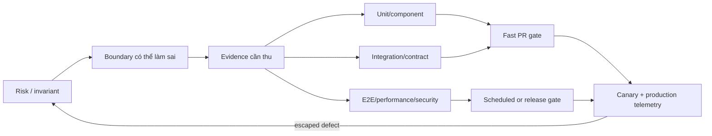

## Mental model: test mua evidence, không mua số lượng

Test là thí nghiệm tự động để giảm một uncertainty cụ thể. Nó chỉ đáng tin trong phạm vi environment, data, dependency và assertion đã chọn. `10.000 tests passed` không chứng minh hệ thống an toàn nếu tất cả chỉ kiểm method với mock; một test integration đúng boundary có thể phát hiện lỗi serializer/transaction mà hàng trăm unit test bỏ qua.

Thiết kế strategy bắt đầu từ risk inventory: hành vi nào gây mất tiền/dữ liệu/quyền truy cập, boundary nào thường thay đổi, lỗi nào khó phát hiện hoặc rollback. Với mỗi risk, chọn evidence rẻ nhất nhưng đủ fidelity; quyết định test nào chạy local, pull request, merge, nightly, pre-production và production verification.

## Các lớp test trả lời câu hỏi khác nhau

**Unit test** kiểm rule/algorithm nhỏ, không I/O thật; nhanh, định vị lỗi tốt và bao phủ edge cases. **Component/slice test** chạy một UI component với template/DOM hoặc một phần framework context. Angular nhấn mạnh component là class cộng template; chỉ gọi method class không chứng minh binding/user interaction. Spring test slice giảm context nhưng chỉ có ý nghĩa nếu slice chứa đúng wiring cần kiểm.

**Integration test** kiểm boundary thật: ORM với database engine, HTTP serialization/filter, message broker, filesystem hoặc identity adapter. Containerized dependency tăng fidelity và reproducibility, nhưng lifecycle/readiness, image version và resource vẫn cần pin. **Contract test** bảo vệ schema/semantics giữa consumer-provider: required fields, status/error, compatibility. Nó không chứng minh provider business state thật hoặc network reliability.

**End-to-end (E2E)** đi qua critical user journey trên deployed stack. Nó phát hiện routing, browser, auth, configuration và multi-service wiring, nhưng chậm, khó định vị và dễ phụ thuộc shared data. Giữ ít journey có giá trị cao, tạo dữ liệu riêng và assert outcome business thay vì từng DOM detail.

**Performance, resilience và security tests** là các experiment khác: workload/capacity, timeout/retry/failover, access-control/abuse. Không gắn nhãn “non-functional” rồi chạy một lần trước release; chúng bảo vệ requirement thực. Bài `load-testing-capacity-model` đi sâu workload và percentile, còn OWASP WSTG là baseline cho security test có hệ thống.

Test pyramid là heuristic về feedback cost, không quota. Có hệ thống nhiều parser cần dày unit tests; integration-heavy data service cần nhiều database tests; UI critical có component tests hơn raw class tests. Tránh “ice cream cone” E2E khổng lồ, nhưng cũng tránh kim tự tháp toàn mock.

## Chọn test theo invariant và boundary

Ví dụ `register(user, activity)` có invariant không vượt capacity và không đăng ký trùng. Cần:

- unit test eligibility/calendar rules;
- repository integration test với unique constraint và transaction thật;
- concurrency test hai request cùng user/slot;
- HTTP test status/error schema và authorization;
- contract test event `RegistrationCreated`;
- một E2E critical journey từ UI tới confirmation.

PostgreSQL isolation behavior phụ thuộc level và concurrent operations; mock repository không tái hiện serialization failure, lock hay unique race. Test phải chạy transaction song song có synchronization point, assert một kết quả hợp lệ và retry contract. Không dùng `sleep(100)` để “tạo race”: nó vừa chậm vừa không chắc; dùng barrier/latch hoặc database coordination.

Đối với external payment/email, mock adapter ở unit test để kiểm decision, dùng sandbox/fake server ở integration để kiểm HTTP signing/error mapping, và vài controlled smoke tests với provider. Không gọi production provider trong mọi PR. Contract do chính team tự viết có thể cùng sai với implementation; ưu tiên provider schema/example hoặc consumer-driven verification độc lập.

## Test doubles và fidelity

**Stub** trả response định trước; **spy/mock** còn xác minh interaction; **fake** có implementation nhẹ như in-memory repository; emulator/test container mô phỏng/chạy service thật hơn. Chọn double theo câu hỏi. Mock clock/random/ID generator là tốt vì tạo determinism. Mock ORM, transaction manager hoặc framework security chain thường che integration bug.

In-memory database không luôn có collation, SQL dialect, index, locking và isolation như production. Nếu behavior đó quan trọng, chạy đúng engine/major version gần production. Tuy vậy, test container không tự động đại diện topology, replication, network latency hay managed-provider extension; ghi rõ fidelity gap.

Assert public outcome/state/event, không khóa implementation call order trừ khi interaction chính là contract. Test private method làm refactor khó. Snapshot lớn dễ được update mù; chỉ dùng khi diff reviewable và semantics ổn định.

## Determinism, isolation và flaky tests

Mỗi test sở hữu data namespace, không phụ thuộc thứ tự hay wall clock. Inject clock, seeded random và ID generator; freeze time chỉ trong scope rồi restore. Async test chờ condition/event với deadline, không fixed sleep. Network test có timeout và server lifecycle rõ. Cleanup bằng transaction rollback chỉ khi code-under-test không mở transaction khác hoặc async worker; nếu không, dùng unique data và explicit cleanup.

Flaky test là defect của test **hoặc** tín hiệu race thật, không nên rerun đến xanh rồi bỏ qua. Quarantine có owner, issue và expiry; giữ failure artifact như seed, timeline, logs, screenshot/trace. Troubleshoot bằng cách phân loại shared state, order dependence, clock, concurrency, resource exhaustion, eventual consistency hay environment drift. Chạy lặp với cùng seed và tăng observability trước khi sửa assertion.

## Pipeline, test data và production feedback

Fast PR gate gồm static checks, unit/component và integration chọn lọc; parallelize theo isolation nhưng giữ deterministic shard. Merge/release gate chạy contract, migration, security và representative E2E. Nightly chạy matrix browser/database, soak/performance hoặc fault test đắt. Cache dependency giúp nhanh nhưng build artifact/test result phải gắn commit/config/version; cache hit không được bỏ validate lockfile.

Test data không copy production PII tùy tiện. Dùng synthetic factory có invariant, tokenized/anonymized data theo approval, secret riêng cho test và automatic expiry. Negative data kiểm authorization tenant/object, encoding, size và malformed input. Migration test phải bắt đầu từ snapshot schema phiên bản được hỗ trợ rồi upgrade, không chỉ tạo database sạch.

Production confidence còn gồm feature flag, canary, SLI, logs/traces và rollback. Synthetic probe xác nhận journey cơ bản nhưng không thay real-user/business outcome. Sau incident, thêm regression ở lớp thấp nhất tái hiện đúng **và** monitor/guard tại boundary để lỗi tương tự được phát hiện sớm.

## Failure scenarios, trade-offs và khi không test ở một lớp

- **Suite nhanh nhưng defect integration lọt:** mock quá sâu; chuyển một số test sang real serializer/database/broker.
- **E2E đỏ ngẫu nhiên:** shared account/data, selector chi tiết, eventual timing; tạo tenant riêng, stable test API/harness và condition wait.
- **Test pass local, fail CI:** timezone/locale, resource/concurrency, dependency version; pin environment và xuất diagnostic artifact.
- **Pipeline quá chậm:** đo critical path, bỏ duplicate setup, dùng slice/parallel/cache có kiểm soát; không xóa high-risk evidence mù.
- **Security test chỉ scan dependency:** thiếu business authorization/session abuse; sinh matrix subject-action-resource và test deny path.

Không E2E mọi permutation; đưa combinatorial rules xuống unit/property test. Không integration-test getter thuần. Không mock boundary đang cần chứng minh. Không chạy load test nặng trên shared environment nếu traffic sẽ làm sai kết quả hoặc ảnh hưởng đội khác; dùng capacity cô lập và production canary guard.

## Production checklist

- [ ] Risk/invariant map có owner và lớp evidence tương ứng.
- [ ] Boundary quan trọng được test với implementation/version đủ giống production.
- [ ] Tests kiểm outcome, độc lập thứ tự, kiểm soát clock/random/data và không fixed sleep.
- [ ] Flaky test có artifact, owner, quarantine expiry; rerun không che failure.
- [ ] Contract, migration, concurrency, authorization và failure path có negative cases.
- [ ] PR/release/nightly suites có latency budget và lý do gate rõ.
- [ ] Test data/secrets tuân thủ privacy, isolation, rotation và cleanup.
- [ ] Canary/telemetry/rollback bổ sung điều mà pre-production không mô phỏng được.

## Góc phỏng vấn

**Unit hay integration test quan trọng hơn?** Không có đáp án tuyệt đối. Chọn lớp rẻ nhất đủ chứng minh risk; rule thuần dùng unit, transaction/serialization cần integration thật.

**Làm gì với flaky test?** Giữ evidence, phân loại nondeterminism/race, sửa synchronization/data/time. Quarantine tạm có owner/expiry; không rerun vô hạn để biến đỏ thành xanh.

**Coverage cao có đủ không?** Không. Coverage đo execution, không đo assertion/invariant. Tôi gắn tests với risk, mutation/escaped defects và production signals.

## Key Takeaways

- Test strategy là portfolio evidence theo risk và feedback time, không kim tự tháp máy móc.
- Mock decision boundary, nhưng dùng dependency thật khi behavior của dependency là điều cần chứng minh.
- Determinism đến từ owned data, controlled time/random và condition-based synchronization.
- E2E ít nhưng critical; concurrency, migration, security và performance cần test riêng.
- Production confidence là tests cộng safe delivery, observability, canary và incident learning.
