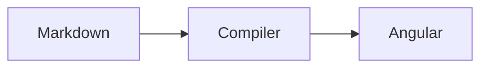

# Hướng dẫn authoring nội dung

`knowledge/**/*.md` là nguồn kiến thức có thẩm quyền. Không viết nội dung bài học, đáp án phỏng vấn hoặc flashcard trực tiếp trong Angular và không sửa `public/generated/*.json` bằng tay. Content compiler validate Markdown rồi tạo runtime data cho ứng dụng.

## 1. Cấu trúc thư mục

```text
knowledge/
├── _config/
│   └── official-sources.json
├── _roadmaps/
│   └── <roadmap>.md
└── <technology-slug>/
    ├── basic/
    │   └── <filename>.md
    ├── advanced/
    │   └── <filename>.md
    ├── extended/
    │   └── <filename>.md
    └── interview/
        └── <question>.md
```

Tên file chỉ giúp con người tìm kiếm. Identity, route, relation, progress và bookmark dùng `id`/`slug` trong front matter. Có thể đổi tên file mà không đổi identity.

Ba learning level duy nhất:

| Canonical value | Nhãn UI | Dùng cho |
| --- | --- | --- |
| `basic` | Cơ bản | mental model và kiến thức bắt buộc để sử dụng đúng |
| `advanced` | Nâng cao | internals, integration, production practice và trade-off |
| `extended` | Mở rộng | quy mô lớn, failure phức tạp, architecture/system design |

Không dùng `beginner`, `intermediate`, `senior` làm lesson level. `junior`, `middle`, `senior`, `system-design` chỉ là **interview difficulty**.

## 2. Lesson front matter

Mọi lesson phải có YAML front matter. Bản mẫu đầy đủ ở [knowledge-template.md](templates/knowledge-template.md).

```yaml
---
id: java-hashmap-internals
slug: java-hashmap-internals
title: HashMap — Cơ chế hoạt động và collision
description: Phân tích hashing, bucket, resize và treeification.
technology: Java
domain: backend
category: backend
level: advanced
contentType: internals
order: 30
estimatedMinutes: 45
tags:
  - java
  - hashmap
learningObjectives:
  - Hiểu cách HashMap định vị bucket
  - Giải thích collision và resize
prerequisites:
  - java-object-contracts
related:
  - java-concurrent-collections-coordination
aliases:
  - Java HashMap
appliesTo:
  java: "21+"
deprecated: false
authors:
  - Content team
sources:
  - title: HashMap API
    url: https://docs.oracle.com/en/java/javase/21/docs/api/java.base/java/util/HashMap.html
    organization: Oracle
    type: official-documentation
    accessedAt: 2026-09-26
lastReviewed: 2026-09-26
---
```

### Trường bắt buộc

| Field | Ràng buộc |
| --- | --- |
| `id` | kebab-case, duy nhất toàn repository, ổn định theo thời gian |
| `slug` | kebab-case, duy nhất toàn repository, ổn định nếu muốn giữ route |
| `title` | tiêu đề hiển thị; nên khớp H1 |
| `description` | mô tả ngắn cho catalog/search |
| `technology` | metadata hiển thị và sinh filter; không hardcode trong UI |
| `domain` | domain kiến thức tổng quát |
| `category` | category/route hiện hành |
| `level` | `basic`, `advanced` hoặc `extended` |
| `contentType` | một value trong danh sách bên dưới |
| `order` | số không âm dùng để sắp xếp |
| `estimatedMinutes` | số dương |
| `tags` | mảng chuỗi không rỗng |
| `learningObjectives` | mảng mục tiêu không rỗng |
| `sources` | mảng có ít nhất một source hợp lệ |
| `lastReviewed` | ngày thật theo `YYYY-MM-DD` |

Trường tùy chọn: `prerequisites`, `related`, `aliases`, `appliesTo` (mapping chuỗi → chuỗi), `deprecated` (boolean), `replacedBy` (lesson ID), `difficulty`, `authors`. Có thể thêm `type: lesson`; nếu có thì value phải đúng là `lesson`. `prerequisites`, `related` và `replacedBy` phải trỏ tới lesson ID tồn tại; prerequisite không được có chu kỳ.

### `contentType` hợp lệ

```text
core
internals
production
troubleshooting
performance
security
architecture
system-design
integration
comparison
reference
interview
supplementary
```

Không tự tạo level hoặc contentType mới trong một bài riêng lẻ; validator sẽ chặn build.

## 3. Cấu trúc Markdown

Mỗi lesson phải có đúng một H1 và ba H2 bắt buộc:

```md
# Tiêu đề khớp front matter

## Tổng quan

...

## Key Takeaways

- ...

## Nguồn chính thống

- [Tổ chức — tài liệu](https://...)
```

Các section như Mental Model, Khái niệm cốt lõi, Cơ chế hoạt động, Ví dụ, Production, Performance, Security, Failure Scenarios, Troubleshooting, Best Practices, Sai lầm thường gặp, Trade-offs và Phỏng vấn được khuyến nghị khi tạo giá trị, nhưng không bắt buộc cho mọi chủ đề.

Pipeline hỗ trợ:

- H1/H2/H3; H2/H3 sinh TOC;
- paragraph, ordered/unordered list, inline code và emphasis;
- GitHub-style table;
- fenced code block có language và tùy chọn `title="File.java"`;
- fenced `mermaid` diagram;
- structured block liệt kê ở phần sau.

Raw HTML bị cấm. Link dùng protocol nguy hiểm như `javascript:`, `data:`, `file:` bị từ chối. Nội dung được compile thành typed block và render bằng Angular interpolation, không đi qua trusted raw HTML.

Ví dụ code và Mermaid:

````md
```java title="OrderService.java"
return repository.findById(id)
    .orElseThrow(NotFoundException::new);
```


````

## 4. Structured blocks

Các kind hợp lệ:

```text
note
info
warning
danger
tip
best-practice
production
interview
flashcard
quiz
misconception
glossary
```

Callout văn bản nhận title ngay sau kind:

```md
:::production Failure khi retry
Retry phải có budget, backoff và idempotency.
:::
```

`note`, `info`, `warning`, `danger`, `tip`, `best-practice` dùng cú pháp tương tự. Block phải đóng bằng `:::`; block lạ, thiếu dấu đóng hoặc YAML payload sai là ERROR.

Các block có cấu trúc dùng YAML mapping:

```md
:::misconception
claim: Java truyền object bằng reference.
correction: Java luôn pass-by-value; value có thể là object reference.
:::

:::glossary
term: Safe publication
definition: Làm object trở nên nhìn thấy đúng trạng thái với thread khác qua happens-before.
:::
```

`:::quiz` hiện được render như callout luyện tập, không tạo artifact quiz riêng. `:::glossary` còn sinh flashcard bổ sung.

## 5. Sources

Source trong front matter là dữ liệu chuẩn mà UI/compiler sử dụng. Mỗi entry bắt buộc có:

```yaml
- title: CompletableFuture API
  url: https://docs.oracle.com/en/java/javase/21/docs/api/java.base/java/util/concurrent/CompletableFuture.html
  organization: Oracle
  type: official-documentation
  accessedAt: 2026-09-26 # tùy chọn
```

Source type hợp lệ:

```text
official-documentation
specification
standard
vendor-documentation
academic
secondary
```

Quy tắc:

- ưu tiên specification/standard/official/vendor primary source;
- URL phải là HTTP(S), không trùng trong cùng document;
- organization và type không được bỏ trống;
- domain của source không phải `secondary` phải có trong `knowledge/_config/official-sources.json`;
- chỉ thêm domain vào registry sau khi xác minh tổ chức sở hữu/duy trì tài liệu;
- không bịa URL hoặc gắn nhãn “official” cho blog/aggregator;
- nội dung thay đổi theo version phải ghi `appliesTo` và review lại khi nâng version.

`npm run content:validate` kiểm schema/domain offline. `npm run content:check-links` mới gọi mạng; chạy riêng vì site chính thức có thể timeout, rate-limit hoặc chặn HEAD mà không nên làm production build mất tính tái lập.

## 6. Dedicated interview Markdown

Câu hỏi quan trọng nằm ở `knowledge/<technology>/interview/*.md`. Một file nên chứa một câu hoặc một nhóm nhỏ có cùng ngữ cảnh; không tạo một file hàng chục nghìn dòng.

Front matter tối thiểu:

```yaml
---
id: interview-java-hashmap-thread-safety
type: interview-question
technology: Java
category: Java
difficulty: middle
topics:
  - hashmap
  - concurrency
relatedLessons:
  - java-concurrent-collections-coordination
sources:
  - title: HashMap API
    url: https://docs.oracle.com/en/java/javase/21/docs/api/java.base/java/util/HashMap.html
    organization: Oracle
    type: official-documentation
rubric:
  dimensions:
    technicalCorrectness: 40
    completeness: 20
    reasoning: 15
    production: 10
    tradeoffs: 10
    communication: 5
  concepts:
    - id: no-synchronization
      required: true
      aliases:
        - không có synchronization guarantee
        - no synchronization guarantee
      points:
        technicalCorrectness: 20
        completeness: 10
  misconceptions:
    - id: concurrent-hashmap-same
      patterns:
        - HashMap và ConcurrentHashMap an toàn như nhau
      penalty: 20
---
```

`difficulty` chỉ nhận `junior`, `middle`, `senior`, `system-design`. `relatedLessons` phải chứa lesson ID tồn tại. ID interview là kebab-case và không được trùng lesson, roadmap hay interview khác.

Body bắt buộc:

```md
# Tại sao HashMap không thread-safe?

## Rubric

### Must Include

- race condition
- no synchronization guarantee

### Strong Answer Includes

- resize implications
- ConcurrentHashMap alternative

## Câu trả lời 30 giây

...

## Câu trả lời chi tiết

...

## Góc nhìn Production

...

## Trade-offs

...

## Câu trả lời sai thường gặp

...

## Follow-up

- ...

## Nguồn chính thống

- [Oracle — HashMap API](https://docs.oracle.com/...)
```

Compiler xuất `answer30s`, `answerDetailed`, `production`, `tradeoffs`, `wrongAnswer`, `followUps`, `relatedLessons`, `sources`, `rubric`. Alias `answer2m` và route `relatedLesson` vẫn được phát sinh để tương thích runtime/dữ liệu cũ.

### Rubric 100 điểm

Sáu dimension chuẩn:

| Dimension | Điểm |
| --- | ---: |
| `technicalCorrectness` | 40 |
| `completeness` | 20 |
| `reasoning` | 15 |
| `production` | 10 |
| `tradeoffs` | 10 |
| `communication` | 5 |

Tổng weight phải bằng 100. Mỗi concept có `id`, `aliases` không rỗng, `required` và `points` theo dimension. Misconception có `patterns` và `penalty` không âm. Alias nên gồm cách diễn đạt tiếng Việt/Anh thực sự tương đương, không dùng keyword rộng đến mức match sai.

Nếu không khai báo rubric front matter, compiler có thể tạo concept fallback từ `Must Include`/`Strong Answer Includes`; với câu mới nên author rubric rõ để điểm minh bạch. Engine chấm local bằng normalized concept/alias coverage, proxy có thể đo và misconception penalty. Nó không hiểu ngữ nghĩa như người phỏng vấn và không phải AI.

### Quick question nhúng trong lesson

Dedicated file vẫn là lựa chọn ưu tiên. Question gắn chặt với một lesson có thể dùng:

```md
:::interview
id: java-hashmap-collision-followup
difficulty: middle
question: Hash collision ảnh hưởng HashMap thế nào?
answer30s: Collision đặt nhiều entry vào cùng bucket; HashMap dùng equals để tìm key đúng.
answerDetailed: Giải thích đầy đủ cơ chế bucket, equals, resize và treeification.
production: Key/hashCode kém có thể gây hotspot và latency.
tradeoffs: Hash tốt tốn chi phí tính toán nhưng giảm collision.
wrongAnswer: Hai key cùng hashCode luôn bằng nhau.
followUps:
  - equals và hashCode liên quan thế nào?
mustInclude:
  - collision
  - equals
strongAnswerIncludes:
  - treeification
misconceptions:
  - id: same-hash-equal
    patterns:
      - cùng hashCode thì bằng nhau
    penalty: 20
:::
```

Embedded question kế thừa technology/category/tags/source và tự liên kết tới lesson chứa nó. Các field `id`, `difficulty`, `question`, `answer30s`, `answerDetailed` là bắt buộc; nên luôn cung cấp production, tradeoffs, wrongAnswer và followUps để trải nghiệm đầy đủ.

## 7. Flashcard

Manual flashcard là authoritative:

```md
:::flashcard
id: java-hashmap-load-factor
front: Load factor của HashMap là gì?
back: Ngưỡng tỷ lệ size/capacity dùng để quyết định resize; default thường là 0.75.
level: advanced
tags:
  - hashmap
  - performance
:::
```

`id`, `front`, `back` bắt buộc. `technology`, `category`, `level`, `tags` có thể ghi đè metadata lesson; nếu bỏ thì compiler kế thừa. Manual card có `generated: false` và trace ngược qua `sourceLesson`/`sourcePath`.

Compiler còn tạo card deterministic (`generated: true`) từ:

- từng list item trong `## Key Takeaways`;
- từng `:::glossary` có `term`/`definition`;
- từng câu interview, dùng question làm front và answer 30 giây làm back.

Nếu front đã được manual card bao phủ sau chuẩn hóa, manual card thắng. Duplicate card ID là ERROR; duplicate concept còn lại bị bỏ với WARNING.

Lịch ôn local dùng `completedReviews` trước rating:

| Rating | Interval |
| --- | --- |
| `Again` | luôn 10 phút |
| `Hard` | `(reviewCount + 1)` ngày, cap 7 ngày |
| `Good` | 3 ngày rồi nhân đôi, cap 60 ngày |
| `Easy` | 7 ngày rồi nhân đôi, cap 120 ngày |

Trình duyệt lưu `lastReviewed`, `reviewCount`, `lastRating`, `nextSuggestedReview`, bookmark. Đây là heuristic deterministic dễ giải thích, không phải SM-2 và không cam kết tối ưu khoa học; dữ liệu không sync giữa thiết bị.

## 8. Roadmap

Roadmap nằm ở `knowledge/_roadmaps/*.md`:

```yaml
---
id: java
type: roadmap
title: Java Core, JVM và Concurrency
description: Lộ trình Java từ core đến production.
steps:
  - lessonId: java-object-contracts
    note: Identity, equality và immutability.
---
```

Body cần đúng một H1 và `## Tổng quan`. Mọi `lessonId` phải tồn tại; step lặp tạo WARNING.

## 9. Quy trình thêm hoặc thay lesson

### Thêm lesson

1. Copy `docs/templates/knowledge-template.md` vào `knowledge/<technology>/<level>/`.
2. Chọn `id`/`slug` duy nhất và không gắn identity với filename.
3. Điền metadata, objective, source thật và các section bắt buộc.
4. Thêm relation bằng lesson ID, không dùng route/filename.
5. Chạy validate/build/test; đọc diagnostics và review generated diff.
6. Commit Markdown và generated artifact cùng thay đổi.

### Thay lesson nhưng giữ dữ liệu người dùng

Ví dụ thay `knowledge/java/advanced/hashmap.md` bằng file mới:

1. Giữ `id: java-hashmap-internals` và `slug: java-hashmap-internals`.
2. Có thể đổi filename, title/body/source/order; cập nhật `lastReviewed`.
3. Nếu deprecate thay vì replace tại chỗ, dùng `deprecated: true` và `replacedBy` trỏ ID tồn tại.
4. Chạy:

```bash
npm run content:validate
npm run content:build
npm test
npm run build
```

Giữ ID/slug giúp route, progress, bookmark, related link, roadmap và interview relation không bị mất.

### Thêm technology

1. Tạo `knowledge/<technology-slug>/basic`, `advanced`, `extended`; chỉ tạo `interview` khi có câu hỏi.
2. Thêm lesson theo schema và dùng một `technology` label nhất quán.
3. Nếu official hostname chưa có, thêm entry đã xác minh vào `knowledge/_config/official-sources.json`.
4. Chạy full pipeline. Catalog/filter/stats lấy từ metadata nên bình thường không cần sửa Angular.

## 10. Commands, Git và deployment

```bash
npm run content:validate
npm run content:build
npm run content:index
npm run content:stats
npm run content:test
npm run content:check-links
npm run lint
npm test
npm run build
```

Workflow admin dự kiến:

```text
edit knowledge Markdown
→ content:validate + content:build
→ review Markdown/generated diff
→ git commit + git push
→ GitHub Actions lint/test/compile/build
→ GitHub Pages deploy
```

Không có `/admin` web UI và không có database. Production build chạy validation + compilation trước Angular; bất kỳ ERROR nào đều chặn deploy. Warning được in nhưng bình thường không chặn.

GitHub Pages chạy dưới repository subpath. Application code phải dùng base-href-aware asset URL, không dùng `/generated/...` root-absolute và không hardcode username/repository. Workflow production truyền `--base-href "/${repository-name}/"` rồi deploy `dist/it-learning-platform/browser`.

## 11. Generated artifact policy

`public/generated/` gồm `lessons.json`, `interview.json`, `flashcards.json`, `search-index.json`, `roadmaps.json`, `manifest.json`, `content-stats.json`.

- Không author hoặc sửa JSON trực tiếp.
- Commit `knowledge/**/*.md` là bắt buộc.
- Repository commit generated JSON để local development và GitHub Pages có artifact rõ ràng.
- CI vẫn chạy compiler mỗi lần, nên JSON committed chỉ là output có thể tái tạo, không phải nguồn sự thật.
- Sau `content:build`, review cả count lẫn diff trước commit.

## 12. AI và bảo mật

Chấm phỏng vấn hiện là deterministic rubric-based evaluation. UI/docs không được gọi nó là AI semantic evaluation. Điểm là tín hiệu coverage/proxy, không thay thế review của chuyên gia.

AI thật hiện disabled/not configured. Tuyệt đối không:

- hardcode API key;
- để secret trong Angular environment hoặc repository;
- lưu private key vào localStorage;
- gọi AI vendor trực tiếp từ GitHub Pages bằng private key.

Nếu tích hợp sau này, dùng backend/serverless proxy giữ secret, rate-limit, audit và truyền question + rubric + user answer + ideal answer + source metadata. Curated answer trong Markdown phải luôn dùng được khi AI tắt.

## 13. Checklist trước commit

- [ ] `knowledge/` là nơi duy nhất chứa nội dung mới.
- [ ] ID/slug kebab-case, ổn định và không trùng.
- [ ] Level/contentType đúng enum.
- [ ] H1, Tổng quan, Key Takeaways, Nguồn chính thống đầy đủ.
- [ ] Source URL/type/organization/domain hợp lệ.
- [ ] Relation và roadmap step trỏ ID tồn tại.
- [ ] Structured block đóng đúng và YAML hợp lệ.
- [ ] Interview có answer/rubric/follow-up/source đầy đủ.
- [ ] Manual flashcard có ID/front/back duy nhất.
- [ ] `npm run content:validate` và `npm run content:build` thành công.
- [ ] Test/build phù hợp phạm vi thay đổi đã chạy.
- [ ] Generated diff đã được review, không sửa tay.
