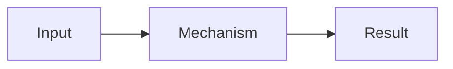

# Java Example Topic — Mental model đến production

## Tổng quan

Nêu chủ đề là gì, giải quyết vấn đề nào và ranh giới bài viết. Tránh mở đầu chung chung hoặc sao chép tài liệu nguồn.

## Mental Model

Đưa ra mô hình tư duy ngắn giúp người học dự đoán hành vi trước khi đi vào API/implementation.

:::note Phạm vi
Ghi rõ assumption, version và điều bài này không cố giải quyết.
:::

## Khái niệm cốt lõi

- Khái niệm thứ nhất và invariant quan trọng.
- Khái niệm thứ hai và mối liên hệ với khái niệm thứ nhất.

## Cơ chế hoạt động

Mô tả flow, state transition hoặc internal mechanism. Phân biệt điều specification bảo đảm với implementation detail.



## Ví dụ

```java title="Example.java"
final class Example {
  String explain() {
    return "Replace with a focused, runnable example";
  }
}
```

Giải thích tại sao ví dụ đúng, output/failure expected và điều gì cần thay trong production.

## Production

:::production Checklist vận hành
Nêu timeout, capacity, metrics, alert, rollback hoặc runbook liên quan; không dùng số liệu giả.
:::

## Performance và Security

Nêu resource bottleneck, cách đo, trust boundary hoặc threat phù hợp. Nếu không áp dụng, xóa section này.

## Failure Scenarios

- Failure mode, signal quan sát và cách xử lý.
- Misconfiguration phổ biến và blast radius.

:::warning Cảnh báo
Nêu một điều có thể đúng trong demo nhưng nguy hiểm ở production.
:::

## Trade-offs

So sánh lợi ích, chi phí, điều kiện chọn và trường hợp không nên dùng.

:::misconception
claim: Ghi nhận định sai thường gặp.
correction: Ghi correction chính xác, có thể kiểm chứng.
:::

## Phỏng vấn

Trình bày cách trả lời ngắn, điểm phân biệt ứng viên hiểu cơ chế và follow-up thường gặp.

:::interview
id: java-example-topic-followup
difficulty: middle
question: Câu hỏi nhanh gắn chặt với lesson này là gì?
answer30s: Câu trả lời ngắn, trực tiếp và đúng technical contract.
answerDetailed: Giải thích cơ chế, điều kiện, failure và ví dụ.
production: Nêu cách vận hành hoặc kiểm chứng trong hệ thống thật.
tradeoffs: Nêu điều kiện lựa chọn và cái giá phải trả.
wrongAnswer: Một nhận định sai cụ thể cần phát hiện.
followUps:
  - Câu follow-up tiếp theo là gì?
mustInclude:
  - core concept
strongAnswerIncludes:
  - production evidence
misconceptions:
  - id: example-misconception
    patterns:
      - nhận định sai cụ thể
    penalty: 20
:::

## Key Takeaways

- Một kết luận kỹ thuật độc lập, đủ cụ thể để compiler tạo flashcard hữu ích.
- Một production rule hoặc trade-off cần nhớ.

:::flashcard
id: java-example-topic-core
front: Câu hỏi flashcard authoritative cho chủ đề là gì?
back: Câu trả lời ngắn nhưng đủ context và không phụ thuộc việc đoán câu hỏi.
level: basic
tags:
  - java
  - example-topic
:::

:::glossary
term: Example term
definition: Định nghĩa ngắn, chính xác để compiler tạo thẻ bổ sung.
:::

## Nguồn chính thống

- [Oracle — Java Platform documentation](https://docs.oracle.com/en/java/javase/21/docs/api/)
