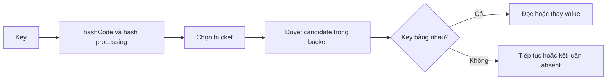

# HashMap Internals — Bucket, Collision và Capacity

## Tổng quan

`HashMap<K,V>` là implementation hash table của `Map`: mỗi key ánh xạ tới tối đa một value, lookup cơ bản có expected constant time khi hash phân bố tốt, và iteration order không được bảo đảm. “Expected O(1)” không phải lời hứa rằng mọi `get` luôn mất cùng thời gian. Cost thực tế phụ thuộc `hashCode`, `equals`, collision, capacity, resize, kích thước map, memory locality và workload.

Bài này tách hai lớp sự thật:

- **Java API contract:** behavior mà application được phép dựa vào, như hỗ trợ một `null` key, không bảo đảm order, không thread-safe, load factor/capacity ảnh hưởng performance và iterator fail-fast theo best effort.
- **OpenJDK implementation:** bucket table, node chain, balanced tree cho collision dày và threshold nội bộ. Các detail này giúp reasoning và profiling, nhưng code nghiệp vụ không được phụ thuộc vào constant hay layout nội bộ của một phiên bản.

## Mental model: thu hẹp rồi xác nhận

HashMap không dùng `hashCode` để kết luận hai key bằng nhau. Nó dùng hash để chọn một vùng ứng viên, rồi dùng equality để xác nhận key đúng.



Lookup có thể được hiểu theo các bước:

1. Nếu key là `null`, implementation xử lý theo nhánh dành cho `null`; `HashMap` cho phép một `null` key.
2. Với key khác `null`, map lấy `hashCode` và chuyển nó thành thông tin chọn bucket theo layout hiện tại.
3. Trong bucket, map so candidate bằng identity nhanh trước rồi dùng `equals` khi cần.
4. Nếu không có candidate bằng key, `get` trả `null`; nhưng `null` cũng có thể là value được lưu, nên dùng `containsKey` khi cần phân biệt “absent” với “present-null”.

Pseudo-code để reasoning, không phải source code OpenJDK:

```java title="ConceptualLookup.java"
V conceptualGet(K key) {
  int bucket = bucketFor(key == null ? 0 : key.hashCode());
  for (Entry<K, V> entry : candidates(bucket)) {
    if (entry.key() == key || Objects.equals(entry.key(), key)) {
      return entry.value();
    }
  }
  return null;
}
```

## Equality contract là một phần của dữ liệu

Nếu `a.equals(b)` là `true`, `a.hashCode()` và `b.hashCode()` bắt buộc bằng nhau. Chiều ngược lại không đúng: cùng hash chỉ tạo collision, không làm hai key equal. `equals` còn phải reflexive, symmetric, transitive, consistent và trả `false` với `null`.

Key cần ổn định trong thời gian nằm trong map. Nếu field tham gia `equals/hashCode` thay đổi sau `put`, object vẫn ở bucket chọn bởi hash cũ, nhưng lookup tính bucket mới. Entry có thể trở nên không truy cập được bằng key đã mutate dù nó vẫn chiếm memory và vẫn xuất hiện khi duyệt một số view.

```java title="MutableKeyFailure.java"
final class CustomerKey {
  String email;

  @Override public boolean equals(Object other) {
    return other instanceof CustomerKey key && Objects.equals(email, key.email);
  }

  @Override public int hashCode() {
    return Objects.hashCode(email);
  }
}

CustomerKey key = new CustomerKey();
key.email = "old@example.com";
Map<CustomerKey, String> map = new HashMap<>();
map.put(key, "customer-42");

key.email = "new@example.com"; // phá invariant của hash table
String value = map.get(key);   // không được dựa vào việc lookup còn thành công
```

Ưu tiên immutable value object cho key. Nếu identity nghiệp vụ thay đổi, remove bằng key cũ rồi put bằng key mới qua một boundary kiểm soát, hoặc dùng một ID ổn định làm key.

## Collision và tree bin

Collision xảy ra khi nhiều key đi vào cùng bucket. HashMap phải phân biệt chúng bằng `equals`; vì vậy collision không làm sai dữ liệu nếu contract đúng, nhưng làm tăng số candidate và latency.

Từ JDK 8, JEP 180 đưa balanced tree vào các hash bin có nhiều collision để cải thiện worst-case behavior trong một số điều kiện. Tuy nhiên:

- API `HashMap` chỉ nói implementation **có thể** dùng comparison order giữa key `Comparable` để phá tie khi có nhiều key cùng hash.
- Việc bucket chuyển sang tree hay quay lại dạng khác, cùng các threshold cụ thể, là implementation detail.
- Tree bin không biến một `hashCode` tệ thành thiết kế tốt: nó vẫn tăng comparison, node overhead, branch và có thể tạo hotspot.
- Không viết test hoặc sizing rule phụ thuộc threshold nội bộ; kiểm tra lại source/runtime khi nghiên cứu một JDK cụ thể.

:::misconception
claim: HashMap treeify collision nên hashCode nào cũng được và lookup luôn O(1).
correction: Tree bin chỉ giảm tác hại của collision dày trong implementation phù hợp. Expected performance vẫn phụ thuộc phân bố hash, equality/comparison cost, capacity, allocation và workload.
:::

Nếu key đến từ input không tin cậy, hash collision còn là vấn đề resource consumption. Giới hạn cardinality/request size, validate input và theo dõi latency thay vì coi treeification là lớp phòng thủ duy nhất.

## Capacity, load factor và resize

Capacity là số bucket trong table; load factor là thước đo mức đầy cho phép trước khi capacity tăng. API Java SE 26 ghi nhận default load factor `0.75` là trade-off chung giữa time và space. Khi số mapping vượt tích của capacity và load factor, cấu trúc được rebuild với số bucket xấp xỉ gấp đôi.

Resize có ba tác động cần hiểu:

1. **CPU:** entry phải được phân phối lại theo capacity mới.
2. **Allocation/GC:** table mới và bookkeeping làm tăng allocation pressure tạm thời.
3. **Latency:** batch insert đúng lúc request nhạy latency có thể thấy spike, dù amortized cost dài hạn vẫn hợp lý.

Pre-size hữu ích khi biết tương đối chính xác số mapping và map sống đủ lâu. Từ Java 19, `HashMap.newHashMap(expectedMappings)` tạo map phù hợp với số mapping dự kiến, giúp tránh tự tính công thức capacity dễ sai.

```java title="PreSizeWhenBounded.java"
int expectedMappings = validatedRows.size();
Map<String, Order> byId = HashMap.newHashMap(expectedMappings);
for (Order order : validatedRows) {
  byId.put(order.id(), order);
}
```

Không pre-size từ giá trị client khai báo mà chưa có quota. Capacity quá lớn lãng phí memory; theo API, thời gian iteration qua collection view tỷ lệ với **capacity + size**, nên một map thưa nhưng table khổng lồ cũng duyệt chậm hơn và giữ footprint không cần thiết.

## Put, update và các live view

`put(key, value)` thêm mapping mới hoặc thay value của key equal đã có. Return value `null` cũng mơ hồ giữa “không có mapping cũ” và “mapping cũ có value null”; khi semantics quan trọng, dùng `containsKey`, `putIfAbsent`, `compute` hoặc một domain type không dùng `null` làm trạng thái.

`keySet()`, `values()` và `entrySet()` là view được backing bởi map:

- remove qua view có thể remove mapping tương ứng;
- thay `Map.Entry.setValue` qua iterator phù hợp có thể cập nhật map;
- structural mutation bên ngoài trong lúc iterator thường đang chạy có thể gây `ConcurrentModificationException`;
- behavior fail-fast là best effort để phát hiện bug, không phải synchronization.

Iteration qua `entrySet` thường phù hợp hơn lặp key rồi gọi `get` khi cần cả key lẫn value. Nhưng tối ưu nhỏ này chỉ đáng quan tâm sau khi correctness, cardinality và access pattern đã rõ.

## HashSet liên quan thế nào

`HashSet<E>` được backing bởi một `HashMap` và dùng element như key với một placeholder value. Vì vậy các vấn đề chính được truyền sang:

- uniqueness dựa trên `equals/hashCode`;
- mutable element có thể trở nên không tìm thấy;
- capacity/load factor ảnh hưởng memory và iteration;
- không bảo đảm iteration order;
- không thread-safe cho concurrent structural mutation.

Nếu cần insertion order, dùng `LinkedHashSet`; nếu cần sorted/range navigation, dùng `TreeSet`; đừng cố suy ra order từ `HashSet` hiện tại.

## HashMap không thread-safe

Hai thread concurrent read trên một map đã publish an toàn và không còn mutation có thể là use case hợp lệ. Nhưng khi có structural mutation mà không synchronization, `HashMap` không cung cấp thread-safety. “Chạy test chưa lỗi” không chứng minh visibility, atomicity hay structural integrity.

`Collections.synchronizedMap` bọc các method đơn, nhưng iteration vẫn cần tuân thủ locking contract của wrapper và chuỗi nhiều operation không tự thành atomic transaction. `ConcurrentHashMap` hỗ trợ concurrent access tốt hơn, không cho `null` key/value, và cung cấp atomic operation theo key như `compute`/`merge`; nó vẫn không tự bảo vệ invariant xuyên nhiều key hoặc nhiều cấu trúc.

Không dùng `containsKey` rồi `put` như một check-then-act trong code concurrent. Chọn operation atomic theo key hoặc thiết kế ownership/locking phù hợp.

## Khi nào dùng và khi nào không

### Dùng HashMap khi

- cần lookup/update theo key, không cần sorted hoặc insertion order;
- key có equality/hash ổn định;
- ownership và mutation model rõ;
- cardinality có giới hạn hợp lý;
- expected constant-time lookup phù hợp workload và đã được đo khi path quan trọng.

### Chọn cấu trúc khác khi

- cần insertion/access order: `LinkedHashMap`;
- cần sorted keys, floor/ceiling hoặc range view: `TreeMap`;
- cần concurrent mutation: thường bắt đầu từ `ConcurrentHashMap`, rồi xác định invariant vượt quá một key;
- cần immutable configuration nhỏ: `Map.of`/`Map.copyOf` có contract rõ hơn;
- cần dữ liệu vượt memory hoặc durable: database/index/external store, không phải map trong process;
- cần cache: dùng cache có size/TTL/eviction/metrics thay vì `HashMap` không giới hạn.

## Failure scenarios và quy trình debug

### Lookup trả null dù vừa put

1. Phân biệt absent với present-null bằng `containsKey`.
2. Kiểm tra key có bị mutate sau `put` không.
3. Kiểm tra `equals` có symmetry/transitivity và `hashCode` có nhất quán không.
4. So sánh đúng runtime class; ORM proxy/subclass hoặc key từ nhiều class loader có thể làm equality bất ngờ.
5. Thu test tối thiểu tái hiện lifecycle của key, không chỉ gọi `equals` trên hai object tĩnh.

### CPU hoặc p99 tăng khi dùng map

1. Đo map size, growth rate, request size và read/write ratio.
2. Profile cost của `hashCode`, `equals`, comparator và allocation thay vì suy đoán.
3. Tìm burst insert/resize và key có phân bố hash kém.
4. Kiểm tra iteration vô tình chạy trên map capacity lớn hoặc lặp nested qua map.
5. Dùng JFR/profile và benchmark representative; không microbenchmark một key đẹp rồi kết luận cho dữ liệu production.

### Memory tăng liên tục

Map giữ strong reference tới key và value, và mỗi value có thể giữ cả object graph. Kiểm tra cache/static registry/listener không eviction, request key có cardinality cao, duplicate logical key do equality sai và map theo tenant/user không được cleanup. Heap dump retained path hữu ích để chứng minh owner; chỉ nhìn shallow size của entry dễ bỏ sót graph phía sau.

### Lỗi chỉ xuất hiện khi concurrent load

Tìm thread nào sở hữu map, nơi publish và mọi writer. Thay `HashMap` bằng `ConcurrentHashMap` có thể sửa structural race nhưng chưa chắc sửa check-then-act hoặc multi-key invariant. Viết stress test cho invariant, quan sát contention và dùng atomic API/lock/partition ownership phù hợp.

## Performance và production checklist

1. Ghi contract của key: field nào tạo identity, có immutable không, `null` có ý nghĩa gì.
2. Đặt bound cho cardinality; cache cần size/TTL/eviction và metric hit/miss/eviction.
3. Pre-size chỉ từ estimate đã validate; ưu tiên `HashMap.newHashMap(expectedMappings)` trên Java 21+.
4. Theo dõi size, growth, allocation, GC, latency lookup/update và thời gian iteration ở hot path.
5. Không log toàn bộ key/value khi debug nếu có PII, token hoặc payload lớn; dùng sample/hash an toàn.
6. Benchmark key distribution và access pattern thật, gồm collision xấu và batch insert, không chỉ happy path.
7. Không dựa vào iteration order, fail-fast exception hoặc treeification threshold.
8. Với concurrency, xác định invariant và ownership trước khi chọn wrapper hay concurrent collection.

## Trade-offs

HashMap đổi ordering và worst-case predictability lấy expected lookup/update tốt. Load factor cao tiết kiệm bucket nhưng tăng candidate/collision cost; load factor thấp dùng nhiều memory hơn và iteration qua capacity lớn hơn. Pre-size giảm resize nhưng sai estimate có thể giữ table quá lớn. Tree bin giảm tác hại collision dày nhưng thêm node/comparison overhead và là detail implementation. ConcurrentHashMap tăng concurrency nhưng có contract khác và không giải quyết transaction đa key.

Không có cấu hình “tốt nhất” tách khỏi workload. Quyết định phải gắn với số key, distribution, object size, read/write ratio, latency SLO, CPU/memory budget và concurrency model.

## Key Takeaways

- HashMap dùng hash để chọn bucket rồi dùng equality để xác nhận key; cùng hash không có nghĩa là equal.
- Mutable key phá vị trí lookup và có thể làm entry không truy cập được trong khi vẫn giữ memory.
- Expected O(1) phụ thuộc phân bố hash và workload; collision, resize, capacity và equality cost vẫn quan trọng.
- Iteration cost gắn với cả capacity và size, nên pre-size quá lớn cũng có giá.
- Tree bin là cơ chế OpenJDK giảm collision dày, không phải API contract để application phụ thuộc threshold.
- HashSet kế thừa nhiều đặc tính vì được backing bởi HashMap.
- HashMap không thread-safe; concurrent collection không tự biến invariant nhiều bước thành atomic.

:::flashcard
id: java-hashmap-lookup-contract
front: HashMap dùng hashCode và equals theo thứ tự nào khi lookup?
back: HashMap dùng hash để thu hẹp tới bucket/candidate rồi dùng identity hoặc equals để xác nhận đúng key. hashCode bằng nhau chỉ tạo collision, không chứng minh hai key equal.
level: advanced
tags:
  - java
  - hashmap
  - equality
:::

:::flashcard
id: java-hashmap-mutable-key
front: Vì sao không nên mutate field tham gia hashCode khi object đang là key HashMap?
back: Entry nằm ở bucket chọn bằng hash cũ, còn lookup sau mutation tính hash/bucket mới; key có thể trở nên không tìm thấy dù entry vẫn nằm trong map và giữ memory.
level: advanced
tags:
  - java
  - hashmap
  - mutable-key
:::

:::flashcard
id: java-hashmap-iteration-cost
front: Vì sao pre-size HashMap quá lớn có thể làm iteration chậm?
back: API nêu iteration qua collection view tốn thời gian tỷ lệ với capacity cộng size; table rất thưa vẫn phải trả memory và scanning overhead theo capacity.
level: advanced
tags:
  - java
  - hashmap
  - performance
:::

:::flashcard
id: java-hashmap-tree-bin-contract
front: Application có nên phụ thuộc threshold treeify của HashMap không?
back: Không. Balanced tree cho collision dày là detail OpenJDK/version-specific; API không cam kết threshold hay layout. Dùng nó để hiểu performance, không làm business logic hoặc test phụ thuộc.
level: advanced
tags:
  - java
  - hashmap
  - collision
:::

## Nguồn chính thống

- [Oracle — HashMap API, Java SE 26](https://docs.oracle.com/en/java/javase/26/docs/api/java.base/java/util/HashMap.html)
- [Oracle — HashSet API, Java SE 26](https://docs.oracle.com/en/java/javase/26/docs/api/java.base/java/util/HashSet.html)
- [Oracle — ConcurrentHashMap API, Java SE 26](https://docs.oracle.com/en/java/javase/26/docs/api/java.base/java/util/concurrent/ConcurrentHashMap.html)
- [Dev.java — Using Maps to Store Key Value Pairs](https://dev.java/learn/api/collections-and-streams/collections-framework/maps/)
- [Dev.java — Choosing Immutable Types for Your Key](https://dev.java/learn/api/collections-and-streams/collections-framework/choosing-keys/)
- [OpenJDK — JEP 180: Handle Frequent HashMap Collisions with Balanced Trees](https://openjdk.org/jeps/180)
