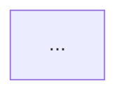

# MASTER REFACTOR PROMPT — MARKDOWN-DRIVEN IT LEARNING PLATFORM

Continue working on the CURRENT EXISTING repository.

This is a MAJOR CONTENT ARCHITECTURE REFACTOR.

Do NOT rebuild the application from scratch.

Do NOT throw away existing working Angular UI/features unless required by this architecture.

Do NOT merely describe the migration.

ACTUALLY IMPLEMENT THE MIGRATION.

The primary goal is to redesign the entire platform so that:

> MARKDOWN FILES ARE THE SINGLE SOURCE OF TRUTH FOR ALL LEARNING CONTENT.

The Angular application must NOT contain hardcoded technical lesson content, interview answers, flashcards, cheat sheets, or system-design knowledge inside TypeScript components/services.

All educational knowledge must originate from Markdown files.

The application may generate JSON, manifests, indexes, search data, interview data and flashcards during build time, but those are GENERATED ARTIFACTS only.

Admins/authors edit Markdown.

The application consumes generated artifacts.

---

# 1. CURRENT PRODUCT CONTEXT

This repository already contains:

- Angular application
- learning pages
- domain/category pages
- lesson rendering
- Markdown/content tooling
- search
- roadmap
- interview preparation
- local learning state
- bookmarks
- progress
- GitHub Pages deployment
- generated runtime content

Preserve working features where possible.

The current architecture must be evolved rather than replaced blindly.

---

# 2. NEW CONTENT ARCHITECTURE — CORE PRINCIPLE

The final system must follow:

```text
Markdown Authoring Files
        ↓
Front Matter Validation
        ↓
Markdown Validation
        ↓
Content Compiler
        ↓
Relationship Resolution
        ↓
Derived Content Generation
        ↓
Generated Runtime Artifacts
        ↓
Angular Application
```

More concretely:

```text
knowledge/
        ↓
Content Pipeline
        ↓
public/generated/
        ├── lessons.json
        ├── interview.json
        ├── flashcards.json
        ├── search-index.json
        ├── roadmaps.json
        ├── manifest.json
        └── content-stats.json
        ↓
Angular Runtime
```

The `.md` files are authoritative.

Generated JSON is disposable.

Deleting generated JSON and rerunning the content build must recreate the same runtime knowledge base.

---

# 3. ONE COMMON KNOWLEDGE ROOT

Create a clear single authoring root:

```text
knowledge/
```

All educational content must live underneath this directory.

Recommended architecture:

```text
knowledge/
├── java/
│   ├── basic/
│   ├── advanced/
│   └── extended/
│
├── spring/
│   ├── basic/
│   ├── advanced/
│   └── extended/
│
├── angular/
│   ├── basic/
│   ├── advanced/
│   └── extended/
│
├── database/
│   ├── basic/
│   ├── advanced/
│   └── extended/
│
├── mysql/
├── postgresql/
├── oracle/
├── mongodb/
├── redis/
├── kafka/
├── networking/
├── websocket/
├── docker/
├── kubernetes/
├── architecture/
├── microservices/
├── distributed-systems/
├── performance/
├── security/
├── testing/
├── cicd/
├── observability/
├── system-design/
└── ...
```

Every major technology/domain should follow:

```text
technology/
├── basic/
├── advanced/
└── extended/
```

Do not keep technical knowledge split among unrelated legacy directories after migration unless there is a strong architectural reason.

---

# 4. EXACT KNOWLEDGE LEVEL MODEL

The platform now has exactly THREE primary learning levels:

```text
Cơ bản
Nâng cao
Mở rộng
```

Internal canonical values:

```text
basic
advanced
extended
```

Do NOT continue exposing the previous:

```text
beginner
intermediate
advanced
senior
```

as the primary learning-level model.

Migrate existing content carefully.

Approximate migration reasoning:

```text
beginner
→ basic

intermediate
→ usually basic or advanced depending actual content

advanced
→ advanced

senior
→ usually extended
```

Do NOT mechanically map intermediate without reading the lesson.

Use content meaning.

---

# 5. MEANING OF THE THREE LEVELS

## Basic — Cơ bản

Core knowledge required to understand/use the technology.

Examples:

Java:
- JVM/JDK overview
- primitive/reference
- OOP
- collections fundamentals
- exceptions
- basic concurrency

Spring:
- IoC/DI
- beans
- controller
- REST
- configuration

Database:
- SQL
- indexes fundamentals
- transactions
- joins

---

## Advanced — Nâng cao

Deeper mechanisms and real engineering usage.

Examples:

Java:
- Java Memory Model
- ConcurrentHashMap
- CompletableFuture
- GC behavior
- JVM diagnostics

Spring:
- transaction propagation
- proxy behavior
- WebFlux
- Hibernate fetching
- security internals

Database:
- query plans
- MVCC
- lock contention
- optimization
- partitioning

---

## Extended — Mở rộng

Knowledge outside the essential core path, including:

- Senior engineering
- Production engineering
- System Design
- troubleshooting
- scaling
- distributed concerns
- architecture
- alternative approaches
- integrations
- comparative knowledge
- related technologies
- deeper implementation details

BUT because "extended" covers several different kinds of content, each Markdown file must have an additional classification field.

Example:

```yaml
contentType: production
```

Allowed values should include a controlled set such as:

```text
core
internals
production
troubleshooting
performance
security
architecture
system-design
integration
comparison
reference
interview
supplementary
```

Choose a clean final enum.

Do not allow arbitrary inconsistent values.

---

# 6. FRONT MATTER IS MANDATORY

EVERY knowledge Markdown file must contain validated YAML front matter.

Example:

```yaml
---
id: java-hashmap-internals
slug: java-hashmap-internals
title: HashMap — Cơ chế hoạt động và Collision
description: Phân tích HashMap từ hashing, bucket đến resize và treeification.
technology: java
domain: backend
category: collections
level: advanced
contentType: internals

order: 30
estimatedMinutes: 45

tags:
  - java
  - hashmap
  - collections
  - hashing

prerequisites:
  - java-equals-hashcode
  - java-collections-overview

related:
  - java-concurrenthashmap
  - java-hashset

learningObjectives:
  - Hiểu HashMap lưu key/value như thế nào
  - Hiểu collision và resize
  - Hiểu vai trò equals và hashCode

sources:
  - title: HashMap Java API
    organization: OpenJDK
    url: https://docs.oracle.com/...
    type: official-documentation

lastReviewed: 2026-09-26
---
```

---

# 7. FRONT MATTER SCHEMA

Create a strongly validated schema.

Required fields:

```text
id
slug
title
description
technology
domain
category
level
contentType
order
estimatedMinutes
tags
learningObjectives
sources
lastReviewed
```

Optional fields:

```text
prerequisites
related
aliases
appliesTo
deprecated
replacedBy
difficulty
authors
```

IDs must be globally unique.

Slugs must be globally unique unless routes intentionally namespace them.

Prefer globally unique slugs to simplify routing/search.

---

# 8. FILE NAME MUST NOT DEFINE IDENTITY

Routing/content identity must use:

```text
id
slug
```

from front matter.

Do NOT depend on filename.

Example:

```text
knowledge/java/advanced/hashmap.md
```

could be renamed:

```text
knowledge/java/advanced/java-map-hashmap.md
```

without changing:

```yaml
id: java-hashmap-internals
slug: java-hashmap-internals
```

Therefore:

- bookmarks remain valid;
- related links remain valid;
- progress remains valid;
- interview relations remain valid.

---

# 9. AUTHOR REPLACEMENT REQUIREMENT

A core requirement:

An author must be able to replace one `.md` file with another `.md` file following the same schema, then:

```text
npm run content:validate
npm run content:build
```

or:

```text
git commit
git push
```

and after GitHub Actions rebuilds:

THE WEBSITE MUST DISPLAY THE NEW CONTENT.

No Angular component changes should be necessary.

No TypeScript hardcoding should be necessary.

No manual JSON editing should be necessary.

---

# 10. BUILD-TIME COMPILATION

Markdown is processed at BUILD TIME.

Do NOT fetch arbitrary repository `.md` files directly from Angular at runtime.

Pipeline:

```text
knowledge/**/*.md
        ↓
scan
        ↓
parse front matter
        ↓
validate
        ↓
parse Markdown
        ↓
extract headings
        ↓
extract special blocks
        ↓
resolve references
        ↓
build search data
        ↓
build interview data
        ↓
build flashcards
        ↓
emit generated JSON
```

Advantages expected:

- faster runtime
- no Markdown filesystem discovery in browser
- easy validation
- strong search
- static GitHub Pages compatible
- deterministic production build
- safe sanitization

---

# 11. GENERATED ARTIFACTS

Generate:

```text
public/generated/
├── manifest.json
├── lessons.json
├── search-index.json
├── interview.json
├── flashcards.json
├── roadmaps.json
└── content-stats.json
```

Add other generated files only if necessary.

Generated files should contain:

```text
GENERATED FILE — DO NOT EDIT DIRECTLY
```

where format permits documentation/comments.

README must state:

> Never manually maintain generated JSON.

---

# 12. LESSON RUNTIME MODEL

`lessons.json` should contain all information necessary for Angular to render lessons.

Possible structure:

```json
{
  "id": "java-hashmap-internals",
  "slug": "java-hashmap-internals",
  "title": "...",
  "level": "advanced",
  "contentType": "internals",
  "metadata": {},
  "toc": [],
  "html": "...",
  "sources": [],
  "related": [],
  "prerequisites": []
}
```

Choose a schema matching the current renderer.

Do NOT store raw unsafe HTML without sanitization controls.

---

# 13. MARKDOWN STANDARD TEMPLATE

Create:

```text
docs/templates/knowledge-template.md
```

Recommended structure:

```md
---
metadata
---

# Title

## Tổng quan

## Mental Model

## Khái niệm cốt lõi

## Cơ chế hoạt động

## Ví dụ

## Production

## Trade-offs

## Sai lầm thường gặp

## Phỏng vấn

## Key Takeaways

## Nguồn chính thống
```

BUT not all sections are mandatory.

---

# 14. REQUIRED MARKDOWN SECTIONS

Because some topics do not logically need every section, validator should only require essential structure.

Required:

```text
# title
## Tổng quan
## Key Takeaways
## Nguồn chính thống
```

Or equivalent normalized headings if current language strategy differs.

Recommended but optional:

```text
Mental Model
Core Concepts
How It Works
Internal Mechanism
Example
Production
Performance
Security
Failure Scenarios
Troubleshooting
Best Practices
Common Mistakes
Trade-offs
Interview
```

Optional sections must not trigger build failure.

---

# 15. CUSTOM MARKDOWN BLOCKS

Support structured extensions such as:

```md
:::note
...
:::
```

```md
:::warning
...
:::
```

```md
:::tip
...
:::
```

```md
:::production
...
:::
```

```md
:::interview
...
:::
```

```md
:::flashcard
question: HashMap collision là gì?
answer: ...
:::
```

```md
:::quiz
...
:::
```

```md
:::misconception
claim: Java pass-by-reference
correction: Java luôn pass-by-value.
:::
```

Choose syntax compatible with the Markdown parser.

Do NOT write fragile regex-only parsing for complex nested Markdown if a robust parser/plugin approach exists.

---

# 16. SAFE MARKDOWN RENDERING

Markdown rendering must be secure.

Consider:

- XSS
- embedded raw HTML
- links
- code fences
- Mermaid
- custom containers
- heading anchors

Do not enable arbitrary dangerous HTML.

Do not use Angular:

```ts
bypassSecurityTrustHtml(...)
```

without carefully controlled sanitization.

If raw HTML is unnecessary, disable it.

---

# 17. MERMAID

Continue supporting Mermaid diagrams from Markdown:

````md

````

Mermaid must remain content-driven.

No lesson-specific Mermaid diagrams hardcoded in Angular.

---

# 18. CODE BLOCKS

Markdown fenced code blocks must support:

- syntax highlighting
- language label
- copy
- optional filename/title if current renderer supports it

Example:

````md
```java title="Example.java"
...
```
````

---

# 19. SOURCE VALIDATION

Official sources are critical.

Every knowledge file must include:

```yaml
sources:
```

Validator rules:

- at least one source for substantial technical content;
- URLs must be valid URLs;
- source type required;
- organization required;
- no duplicate source entries;
- source domains checked against official-source registry where applicable.

Source categories:

```text
official-documentation
specification
standard
vendor-documentation
academic
secondary
```

---

# 20. OFFICIAL SOURCE REGISTRY

Preserve/improve:

```text
content-sources/
```

or migrate into:

```text
knowledge/_config/official-sources.json
```

Choose one clean source.

Official domains include:

```text
angular.dev
typescriptlang.org
dev.java
docs.oracle.com
openjdk.org
spring.io
docs.spring.io
dev.mysql.com
postgresql.org
mongodb.com/docs
redis.io
kafka.apache.org
docs.docker.com
kubernetes.io
git-scm.com
docs.github.com
developer.mozilla.org
ietf.org
rfc-editor.org
owasp.org
prometheus.io
grafana.com
opentelemetry.io
```

---

# 21. VALIDATION SEVERITY MODEL

Use:

```text
ERROR
WARNING
INFO
```

Build-blocking ERROR examples:

- malformed front matter
- duplicate ID
- duplicate slug
- invalid level
- invalid contentType
- missing title
- missing body
- missing required source
- invalid prerequisite ID
- invalid related ID
- malformed structured block
- broken generated JSON

WARNING examples:

- missing optional section
- content not reviewed recently
- no flashcards
- no interview section
- unusually short lesson
- secondary-only sources
- estimatedMinutes missing if ultimately optional

Production build should fail on ERROR.

Warnings should be printed but normally allow build.

---

# 22. CONTENT PIPELINE COMMANDS

Refactor scripts to provide:

```bash
npm run content:validate
npm run content:build
npm run content:index
npm run content:stats
npm run content:check-links
```

Avoid redundant scripts if clean subcommands are better.

For example:

```bash
node scripts/content/content-pipeline.mjs validate
node scripts/content/content-pipeline.mjs build
node scripts/content/content-pipeline.mjs stats
```

Keep package scripts developer-friendly.

---

# 23. WATCH MODE — OPTIONAL BUT VALUABLE

If straightforward, provide:

```bash
npm run content:watch
```

When Markdown changes during local development:

```text
.md change
↓
rebuild generated content
↓
Angular dev server sees generated file
↓
browser refresh
```

Do not introduce a brittle watcher.

---

# 24. SEARCH MUST USE MARKDOWN-DERIVED DATA

Search index must be generated entirely from Markdown.

Index:

```text
title
description
headings
tags
technology
category
level
contentType
body text
aliases
```

Generated:

```text
public/generated/search-index.json
```

Changing Markdown must update search after content build.

---

# 25. ROUTING

Lesson URL should use stable slug:

```text
/learn/:slug
```

or preserve current domain-based route if already useful.

Important requirement:

URL identity comes from metadata, NOT filesystem path.

Changing file location must not necessarily break route.

---

# 26. MIGRATE ALL CURRENT CONTENT

The user selected FULL migration.

Migrate all existing educational content into the new Markdown system.

This includes current:

- Java
- Spring
- Angular
- database
- MySQL
- PostgreSQL
- Oracle
- Redis
- Kafka
- MongoDB
- architecture
- microservices
- distributed systems
- security
- performance
- DevOps
- Kubernetes
- Docker
- testing
- system design
- interview knowledge
- related engineering material

Do not discard useful content.

---

# 27. NO HARDCODED KNOWLEDGE AFTER MIGRATION

Audit:

```text
src/
```

Look for hardcoded technical material.

The following should NOT live in Angular source:

- lesson paragraphs
- model interview answers
- technical explanations
- flashcard answers
- detailed system-design solutions
- technology cheat sheets

UI labels may of course remain in Angular.

Example valid:

```ts
label = 'Phỏng vấn';
```

Example invalid:

```ts
answer = 'Kafka guarantees ordering only within a partition...';
```

Move educational knowledge to Markdown.

---

# 28. INTERVIEW SYSTEM — NEW ARCHITECTURE

Interview data also comes from Markdown.

Hybrid source model:

1. dedicated interview Markdown files;
2. selected interview blocks extracted from lesson Markdown.

Both feed:

```text
public/generated/interview.json
```

---

# 29. DEDICATED INTERVIEW AUTHORING

Use an appropriate structure such as:

```text
knowledge/java/interview/
knowledge/spring/interview/
```

OR:

```text
knowledge/_interview/
```

But because all content should live under the common root, prefer a pattern that is easy to discover and maintain.

A good candidate:

```text
knowledge/
├── java/
│   ├── basic/
│   ├── advanced/
│   ├── extended/
│   └── interview/
```

Each interview file can contain one important question or a logically coherent group.

Avoid one giant 50,000-line Markdown file.

---

# 30. INTERVIEW QUESTION MARKDOWN FORMAT

Example:

```md
---
id: interview-java-hashmap-thread-safety
type: interview-question
technology: java
category: collections
difficulty: middle
topics:
  - hashmap
  - concurrency
relatedLessons:
  - java-hashmap-internals
sources:
  - ...
---

# Tại sao HashMap không thread-safe?

## Rubric

### Must Include

- race condition
- concurrent modification
- no synchronization guarantee

### Strong Answer Includes

- resize implications
- visibility
- ConcurrentHashMap alternative

## Câu trả lời 30 giây

...

## Câu trả lời chi tiết

...

## Góc nhìn Production

...

## Câu trả lời sai thường gặp

...

## Follow-up

- ConcurrentHashMap khác gì?
- synchronizedMap thì sao?

## Nguồn chính thống

...
```

---

# 31. LESSON-EMBEDDED INTERVIEW BLOCKS

A lesson may contain:

```md
:::interview
id: java-hashmap-collision-followup
difficulty: middle
question: Hash collision ảnh hưởng HashMap thế nào?
mustInclude:
  - collision
  - equals
  - bucket
answer30s: ...
answerDetailed: ...
:::
```

Pipeline extracts these into interview.json.

Dedicated interview files remain the preferred home for major questions.

Embedded blocks are suitable for lesson-specific quick questions.

---

# 32. INTERVIEW QUESTION DUPLICATE DETECTION

Pipeline must detect:

- duplicate interview ID;
- duplicate exact question;
- optionally suspicious near-duplicate question warning.

Do not create shallow duplicates.

---

# 33. MOCK INTERVIEW MODE

The interview system should support:

```text
Select technology/category
↓
Select difficulty
↓
Question
↓
User writes answer
↓
Submit
↓
Automatic evaluation
↓
Detailed result
↓
Official answer
↓
Follow-up
```

---

# 34. AUTOMATIC SCORING — CURRENT IMPLEMENTATION

The user selected HYBRID grading:

```text
Rule/Rubric Evaluation
+
Future AI Evaluation
```

BUT:

NO secure AI backend will be added in this refactor.

Therefore:

THE CURRENT WORKING VERSION MUST USE DETERMINISTIC LOCAL RUBRIC-BASED SCORING.

Do not pretend that local keyword matching is an AI semantic evaluator.

Label it honestly.

---

# 35. RULE-BASED GRADER

Implement an interview grading engine that can evaluate:

- expected concepts;
- required concepts;
- optional strong concepts;
- prohibited misconceptions;
- answer length/completeness;
- relevant terminology coverage.

Do NOT only do naive:

```text
answer.includes("Kafka")
```

Use normalized text matching.

Consider:

- lowercase normalization
- punctuation removal
- token matching
- aliases/synonyms from rubric
- weighted concepts

Example rubric metadata:

```yaml
rubric:
  required:
    - id: partition-ordering
      weight: 20
      terms:
        - partition
        - thứ tự trong partition
    - id: no-global-order
      weight: 20
      terms:
        - không global order
        - không đảm bảo toàn topic

  recommended:
    - id: key-strategy
      weight: 10
      terms:
        - key
        - partition strategy

  misconceptions:
    - id: global-order
      penalty: 20
      patterns:
        - kafka đảm bảo thứ tự toàn bộ topic
```

Design a cleaner schema if appropriate.

---

# 36. SCORING RUBRIC — 100 POINTS

Use:

```text
Technical Correctness       40
Completeness                20
Reasoning / Explanation     15
Production Awareness        10
Trade-off Awareness         10
Communication               5
--------------------------------
Total                      100
```

If local deterministic evaluation cannot fairly evaluate every dimension, use rubric metadata authored in Markdown to define how each dimension is scored.

Do not fabricate precision.

---

# 37. SCORE LABEL

Return both:

```text
0–100
```

and evaluation level:

```text
Weak
Acceptable
Good
Excellent
```

Define clear thresholds, for example:

```text
0–49   Weak
50–69  Acceptable
70–84  Good
85–100 Excellent
```

Tune if justified.

Use consistent terminology in Vietnamese UI if appropriate:

```text
Yếu
Đạt
Tốt
Xuất sắc
```

---

# 38. INTERVIEW EVALUATION RESULT UI

After user submits:

Display:

```text
Điểm tổng
Điểm từng tiêu chí

Ý đúng
Ý còn thiếu
Ý sai / misconception

Nhận xét

Cách cải thiện

Câu trả lời 30 giây

Câu trả lời chi tiết

Production Perspective

Trade-offs

Follow-up Questions

Related Lessons

Official Sources
```

All authoritative ideal-answer content must come from Markdown-derived data.

NOT from hardcoded TypeScript strings.

---

# 39. FUTURE AI ARCHITECTURE

Prepare abstraction for future semantic AI grading:

```ts
interface InterviewEvaluator {
  evaluate(
    question: InterviewQuestion,
    answer: string
  ): Promise<InterviewEvaluation>;
}
```

Implement:

```text
RuleBasedInterviewEvaluator
```

now.

Optionally prepare:

```text
AiInterviewEvaluator
```

but keep disabled/not configured.

Do not make API requests from browser with private keys.

---

# 40. AI FEATURE STATUS

The application should clearly represent:

```text
AI semantic evaluation: disabled/not configured
```

The grading that works now is:

```text
Rubric-based automatic evaluation
```

Do NOT label the local rule engine "AI".

---

# 41. AI SECURITY

Never:

- hardcode OpenAI key;
- expose secret in Angular environment;
- store private API key in repository;
- send hidden secrets from GitHub Pages.

README should explain:

> Real AI grading requires a secure backend/serverless proxy later.

---

# 42. FUTURE AI RESPONSE EXPECTATION

When AI is added later, it should receive:

- question
- grading rubric
- user's answer
- official ideal answer
- official source metadata
- related lesson excerpts if required

Expected output:

```text
technical score
completeness score
reasoning score
production score
tradeoff score
communication score

strengths
missing concepts
incorrect claims
improvement
```

But do not implement insecure remote AI calls now.

---

# 43. OFFICIAL ANSWER MUST EXIST WITHOUT AI

Every interview question must have curated Markdown content providing:

```text
answer30s
answerDetailed
production
tradeoffs
sources
```

Therefore interview preparation remains fully useful when AI is disabled.

---

# 44. FLASHCARD SYSTEM

Create a first-class route:

```text
/flashcards
```

or equivalent.

Flashcards are built from Markdown.

---

# 45. FLASHCARD AUTHORING — HYBRID

Manual flashcards are authoritative.

Support:

```md
:::flashcard
id: java-hashmap-load-factor
front: Load factor của HashMap là gì?
back: ...
level: advanced
tags:
  - hashmap
  - performance
:::
```

Also automatically derive supplemental cards from:

- Key Takeaways
- interview questions
- glossary/definition blocks

Derived cards must be marked:

```text
generated: true
```

Manual cards:

```text
generated: false
```

---

# 46. FLASHCARD DEDUPLICATION

Avoid generating duplicate cards.

If manual card covers same concept as derived card:

prefer manual card.

---

# 47. FLASHCARD GENERATED ARTIFACT

Generate:

```text
public/generated/flashcards.json
```

Possible schema:

```json
{
  "id": "...",
  "technology": "java",
  "level": "advanced",
  "front": "...",
  "back": "...",
  "sourceLesson": "...",
  "tags": [],
  "generated": false
}
```

---

# 48. FLASHCARD UI

Support:

```text
Technology filter
Level filter
Category filter

Front
Flip
Back

Previous
Next
Shuffle

Bookmark

Again
Hard
Good
Easy
```

Keyboard support if straightforward.

---

# 49. FLASHCARD LOCAL STATE

No database.

Use localStorage through existing storage abstraction.

Track:

```text
lastReviewed
reviewCount
lastRating
nextSuggestedReview
```

---

# 50. SIMPLE SPACED-REPETITION SUPPORT

Do NOT implement a needlessly complex algorithm.

But ratings:

```text
Again
Hard
Good
Easy
```

should influence the next recommended review timestamp.

Use a small transparent deterministic algorithm.

Document it.

Example concept:

```text
Again → very soon
Hard → short interval
Good → normal interval
Easy → longer interval
```

Store locally.

Avoid falsely calling it scientifically optimal.

---

# 51. FLASHCARD STUDY MODES

Support:

```text
All
Due for review
New
Bookmarked
Difficult
```

if feasible.

---

# 52. KNOWLEDGE LEVEL TABS

Update learning catalog level filters to:

```text
Tất cả
Cơ bản
Nâng cao
Mở rộng
```

Remove primary UI dependency on:

```text
Beginner
Intermediate
Advanced
Senior
```

---

# 53. OPTIONAL EXTENDED TYPE FILTER

When level is:

```text
Mở rộng
```

optionally allow filtering:

```text
Production
System Design
Troubleshooting
Performance
Architecture
Integration
Comparison
Supplementary
```

Do not clutter UI.

Use metadata-driven options.

---

# 54. CATALOG DATA

Lesson rows/cards must get all displayed educational metadata from generated Markdown data.

Examples:

- title
- description
- level
- tags
- estimatedMinutes
- technology
- contentType

Do not duplicate lesson metadata in Angular configs.

---

# 55. TECHNOLOGY NAVIGATION

Technology/category registry may exist separately if it is UI taxonomy.

But lesson counts and available topics must derive from content.

Do not hardcode:

```ts
javaLessonCount = 32;
```

---

# 56. ROADMAPS

Roadmaps must reference lesson IDs/slugs.

Consider migrating roadmap authoring into Markdown too, because the user selected ALL KNOWLEDGE from Markdown.

Example:

```text
knowledge/_roadmaps/backend-developer.md
```

with front matter defining ordered lesson references.

Do not hardcode roadmap descriptions/learning explanations in TypeScript.

Generated artifact remains:

```text
roadmaps.json
```

---

# 57. SYSTEM DESIGN

System-design content must be Markdown-based.

Possible:

```text
knowledge/system-design/
├── basic/
├── advanced/
└── extended/
```

Scenario files:

```text
url-shortener.md
chat-system.md
rate-limiter.md
notification-system.md
```

---

# 58. CHEAT SHEETS / REFERENCES

If cheat-sheet content exists, place under Markdown.

Use:

```yaml
contentType: reference
```

or appropriate metadata.

---

# 59. GLOSSARY

If useful, allow Markdown structured glossary blocks:

```md
:::glossary
term: Backpressure
definition: ...
:::
```

This can feed:

- search
- flashcards

Do not overcomplicate.

---

# 60. MIGRATION STRATEGY

Perform migration carefully.

Recommended phases:

```text
Phase 1
Audit current content

Phase 2
Design schema

Phase 3
Implement parser/compiler

Phase 4
Implement validator

Phase 5
Implement generated artifacts

Phase 6
Migrate lessons

Phase 7
Migrate interview data

Phase 8
Generate flashcards

Phase 9
Update Angular data services

Phase 10
Update UI levels

Phase 11
Implement interview grading

Phase 12
Implement flashcard UI

Phase 13
Remove legacy hardcoded content

Phase 14
Tests

Phase 15
GitHub Pages validation
```

Do not perform destructive removal before generated replacement works.

---

# 61. BACKWARD COMPATIBILITY

Existing user localStorage may contain progress keyed by old lesson identifiers.

Try to preserve existing IDs/slugs where sensible.

If IDs change:

create migration mapping.

Example:

```text
oldSlug → newSlug
```

Do not silently erase users' progress.

---

# 62. LEGACY CONTENT REMOVAL

After successful migration:

- remove unused old JSON authoring;
- remove duplicate knowledge constants;
- remove obsolete hardcoded interview arrays;
- remove unused parsers/services.

BUT:

do not delete generated runtime JSON.

---

# 63. CONTENT COMPILER ARCHITECTURE

Avoid one massive script.

Prefer modules:

```text
scripts/content/
├── content-pipeline.mjs
├── schema/
├── parsers/
├── validators/
├── compilers/
├── generators/
└── utilities/
```

Exact structure may differ.

Keep responsibility clear.

---

# 64. MARKDOWN PARSER

Use a reliable Markdown ecosystem.

Before adding dependencies:

inspect existing parser/tooling.

Reuse maintained libraries when appropriate.

Potential concepts:

- gray-matter/front matter
- unified/remark/rehype
- markdown-it

Choose based on compatibility.

Do NOT install multiple redundant Markdown stacks.

---

# 65. SCHEMA VALIDATION

Use a robust validation approach.

Possible:

```text
Zod
JSON Schema/Ajv
custom strongly typed validation
```

Do not create a huge fragile chain of `if` statements if a proper schema library is cleaner.

But do not add unnecessary dependency weight to runtime if validation only runs in Node tooling.

---

# 66. DERIVED TABLE OF CONTENTS

TOC should be derived from Markdown headings.

Do not manually maintain TOC metadata.

---

# 67. PREVIOUS / NEXT LESSON

Compute from:

```text
technology
level
order
```

or roadmap.

No hardcoded previous/next maps.

---

# 68. RELATED LESSON VALIDATION

`related` IDs must exist.

Missing references:

ERROR.

Self-reference:

ERROR or warning depending context.

---

# 69. PREREQUISITE VALIDATION

Every prerequisite must exist.

Detect obvious cycles if feasible.

Example:

```text
A requires B
B requires A
```

should be flagged.

---

# 70. CONTENT STATISTICS

Generate:

```text
content-stats.json
```

Include:

```text
total lessons
count by technology
count by level
count by contentType
interview question count
flashcard count
source count
warnings
```

Useful for dashboard/maintenance.

---

# 71. AUTHORING DOCUMENTATION

Create:

```text
docs/content-authoring.md
```

It must explain:

1. where files go;
2. folder convention;
3. required front matter;
4. allowed levels;
5. contentType;
6. Markdown template;
7. special blocks;
8. sources;
9. interview questions;
10. flashcards;
11. validation commands;
12. how to replace a lesson;
13. how to add a new technology;
14. deployment behavior.

---

# 72. REPLACEMENT WORKFLOW DOCUMENTATION

Explicit example:

```text
knowledge/java/advanced/hashmap.md
```

Author replaces it with another Markdown file maintaining:

```yaml
id: java-hashmap-internals
slug: java-hashmap-internals
```

Then:

```bash
npm run content:validate
npm run content:build
npm run build
```

Website reflects new content.

---

# 73. ADDING A NEW LESSON

README/documentation example:

```text
1. Copy template.
2. Put file in knowledge/<technology>/<level>/.
3. Set unique id/slug.
4. Add official sources.
5. Run validator.
6. Run content build.
7. Test.
8. Commit/push.
```

---

# 74. ADDING A NEW TECHNOLOGY

No Angular coding should normally be necessary.

Example:

```text
knowledge/rabbitmq/
├── basic/
├── advanced/
└── extended/
```

Add Markdown.

Pipeline discovers technology.

UI should ideally show it automatically or require only taxonomy configuration, not lesson-specific code.

---

# 75. GITHUB PAGES

The existing production deployment uses a repository subpath.

All generated asset URLs must respect Angular base href.

Never hardcode:

```text
/generated/...
```

Use base-href-aware asset URL logic.

Verify:

```text
https://...github.io/<repo>/generated/lessons.json
```

etc.

---

# 76. BUILD PIPELINE

Production build should run:

```text
content validation
↓
content compilation
↓
Angular build
↓
GitHub Pages deploy
```

If Markdown contains blocking ERROR:

deployment should fail before publishing broken content.

---

# 77. CONTENT CHANGE DEPLOYMENT

The author workflow is:

```text
edit Markdown
↓
git commit
↓
git push
↓
GitHub Actions
↓
content compiler
↓
Angular build
↓
GitHub Pages update
```

This is the intended "admin" workflow.

NO `/admin` web UI is required.

---

# 78. NO DATABASE

Do not add database.

Do not add Firebase.

Do not add Supabase.

Do not add server backend.

All content is repository-driven static data.

---

# 79. NO AUTHENTICATION

No admin login is required.

The repository itself is the authoring access control.

---

# 80. INTERVIEW ANSWER STORAGE

User-entered mock interview answers may remain local-only.

Store:

```text
question id
answer
score
evaluation
timestamp
```

via existing versioned localStorage abstraction.

Allow clearing history.

---

# 81. INTERVIEW HISTORY

If straightforward, add:

```text
Lịch sử phỏng vấn
```

Show:

```text
question
technology
score
date
level
```

No backend.

---

# 82. INTERVIEW GRADING LIMITATIONS

Because no real AI evaluator is enabled:

UI/docs should explain:

> Điểm tự động hiện dựa trên rubric/coverage được định nghĩa trong tài liệu học. Đây không phải đánh giá ngữ nghĩa bằng AI.

Do not overstate grading capability.

---

# 83. DETAILED OFFICIAL ANSWER

Regardless of grader sophistication, after submission display the Markdown-curated detailed answer.

This guarantees educational usefulness.

---

# 84. FOLLOW-UP INTERVIEW FLOW

Allow user to proceed to:

```text
follow-up question
```

where available.

Follow-ups come from Markdown.

---

# 85. INTERVIEW DIFFICULTY

Interview difficulty can remain:

```text
junior
middle
senior
system-design
```

This is separate from learning lesson level:

```text
basic
advanced
extended
```

Do not confuse the two taxonomies.

---

# 86. FLASHCARD DIFFICULTY/LEVEL

Flashcards reference the lesson learning level:

```text
basic
advanced
extended
```

and can optionally carry difficulty metadata.

---

# 87. TESTS — CONTENT PIPELINE

Add tests for:

- valid Markdown parsing;
- invalid front matter;
- duplicate id;
- invalid level;
- invalid contentType;
- missing source;
- broken related;
- broken prerequisite;
- interview extraction;
- flashcard extraction;
- manual-over-generated flashcard precedence;
- rubric parsing;
- generated artifact correctness.

---

# 88. TESTS — INTERVIEW GRADER

Test:

- full concept coverage;
- partial answer;
- misconception penalty;
- empty answer;
- synonym matching;
- score bounds 0–100;
- score label;
- deterministic output.

---

# 89. TESTS — FLASHCARDS

Test:

- filtering;
- flip state;
- rating persistence;
- due calculation;
- generated/manual distinction;
- local state.

---

# 90. TESTS — GITHUB PAGES

Build with:

```bash
npm run build -- --configuration production --base-href "/it-knowledge/"
```

Verify generated assets are under:

```text
dist/it-learning-platform/browser/generated/
```

including:

```text
lessons.json
interview.json
flashcards.json
search-index.json
manifest.json
```

---

# 91. UI LEVEL MIGRATION

Update labels:

Old:

```text
Beginner
Intermediate
Advanced
Senior
```

New:

```text
Cơ bản
Nâng cao
Mở rộng
```

Update:

- tabs;
- filters;
- badges;
- query params;
- dashboard stats;
- roadmap UI where appropriate.

---

# 92. QUERY PARAMS

Canonical values:

```text
?level=basic
?level=advanced
?level=extended
```

Invalid value:

fallback to `all`.

---

# 93. SEARCH FILTERS

Search should allow filtering:

```text
technology
level
contentType
```

Do not overcomplicate search UI.

---

# 94. DASHBOARD

Dashboard may show:

```text
Continue Learning
Due Flashcards
Interview Practice
Learning Progress
Recent Lessons
Bookmarks
```

Use generated stats/data.

Do not hardcode content counts.

---

# 95. CONTENT AUTHORING QUALITY

When migrating existing content:

do NOT flatten rich content into minimal Markdown.

Preserve:

- headings
- diagrams
- code
- notes
- official sources
- interview tips
- production notes

---

# 96. CONTENT SOURCE OF TRUTH AUDIT

At the end:

search the repository for content duplication.

Confirm:

```text
knowledge/**/*.md
```

is the authoritative technical knowledge source.

Generated JSON must be reproducible.

---

# 97. REMOVE MANUAL EDITING OF GENERATED FILES

Mark:

```text
public/generated/
```

as generated data in documentation.

If appropriate add:

```text
README.md
```

inside generated folder or generated metadata.

Do not accidentally `.gitignore` generated files if GitHub Pages/development requires them committed, unless build workflow guarantees creation before Angular build.

Determine the correct strategy based on current pipeline.

---

# 98. GENERATED FILE COMMIT POLICY

Choose one and document it.

Preferred:

```text
source Markdown committed
generated JSON optionally committed for local convenience
CI always regenerates and validates it
```

OR:

```text
source Markdown committed
generated JSON ignored
CI always generates
```

Pick based on repository workflow.

Do not allow generated artifacts to become authoritative.

---

# 99. MIGRATION SAFETY

Before removing old data:

1. compile new Markdown;
2. compare lesson counts;
3. compare interview counts;
4. verify routes;
5. verify search;
6. verify roadmap links;
7. verify production build.

Only then remove legacy sources.

---

# 100. MIGRATION REPORT

Create:

```text
docs/content-migration-report.md
```

Include:

```text
old architecture
new architecture
migrated content count
preserved IDs
changed IDs
compatibility mappings
known warnings
remaining technical debt
```

---

# 101. PERFORMANCE

The browser should NOT parse hundreds of Markdown files.

All expensive work happens build-time.

Runtime consumes optimized generated data.

If `lessons.json` becomes very large, consider chunking:

```text
generated/lessons/java.json
generated/lessons/spring.json
...
```

but only if current size warrants it.

Do not prematurely complicate.

---

# 102. LAZY LOADING LARGE KNOWLEDGE DATA

If the knowledge corpus is already several MB, evaluate:

```text
per-domain chunks
lesson metadata manifest
individual lesson payloads
```

Possible model:

```text
manifest.json
↓
technology metadata
↓
lazy fetch lesson JSON
```

Do not force the whole 10–20 MB corpus into initial page load.

Measure.

---

# 103. SEARCH INDEX SIZE

Search index can be separated and lazy-loaded when user invokes search.

Preserve current good behavior where possible.

---

# 104. CONTENT COMPILER SHOULD BE DETERMINISTIC

Same Markdown inputs should produce semantically identical output.

Avoid timestamps that unnecessarily change every generated artifact unless needed.

---

# 105. SLUG COLLISION

Validator must catch:

```text
same slug
different lesson
```

before build.

---

# 106. BROKEN SOURCE URL CHECK

Keep network link validation separate:

```bash
npm run content:check-links
```

Do NOT make every production build fail just because an external official documentation site temporarily times out.

Structural source validation belongs in build.

Remote availability check can remain separate.

---

# 107. CONTENT LAST REVIEWED

Keep:

```yaml
lastReviewed:
```

Provide warnings if very old.

Do not automatically change it simply because build runs.

---

# 108. VERSION-AWARE KNOWLEDGE

Support:

```yaml
appliesTo:
  java: "21+"
```

where relevant.

Do not require version metadata everywhere.

---

# 109. FLASHCARD SOURCE TRACEABILITY

Every flashcard should be able to navigate back to:

```text
source lesson
```

if derived from a lesson.

---

# 110. INTERVIEW SOURCE TRACEABILITY

Every interview question should link to:

```text
related lesson(s)
official sources
```

where possible.

---

# 111. DO NOT GENERATE FAKE OFFICIAL SOURCES

Migration must preserve real sources.

Never invent URLs.

---

# 112. DO NOT CREATE AI CONTENT AT RUNTIME

All authoritative answer content is curated at build-time from Markdown.

Runtime automatic grader does NOT invent an ideal answer.

---

# 113. NO RANDOM CONTENT GENERATION

Flashcard auto-generation must be deterministic based on explicit content structures.

Do not use random LLM-like extraction.

---

# 114. CONTENT QUALITY

The Markdown format should make authorship easy.

Avoid front matter containing huge blocks of prose.

Long technical explanations belong in Markdown body.

Metadata remains metadata.

---

# 115. INTERVIEW RUBRIC AUTHORING

Rubric definitions should be compact.

Example:

```yaml
rubric:
  dimensions:
    technicalCorrectness:
      weight: 40
    completeness:
      weight: 20
    reasoning:
      weight: 15
    production:
      weight: 10
    tradeoffs:
      weight: 10
    communication:
      weight: 5

  concepts:
    - id: per-partition-order
      aliases:
        - ordering within partition
        - thứ tự trong partition
      points:
        technicalCorrectness: 20

    - id: no-global-order
      aliases:
        - no global ordering
        - không có global order
      points:
        technicalCorrectness: 20

  misconceptions:
    - pattern: kafka đảm bảo thứ tự toàn topic
      penalty: 20
```

Improve schema if necessary.

---

# 116. COMMUNICATION SCORE

Local grader must not pretend to evaluate eloquence deeply.

Use measurable proxies such as:

- non-empty answer;
- reasonable length;
- sentence structure;
- no excessive repetition.

Keep this score low weight.

---

# 117. SCORE TRANSPARENCY

Show user why score was given.

Example:

```text
+20 Mentioned partition-level ordering
+20 Correctly stated no global ordering
+8 Mentioned key strategy
-20 Claimed global topic ordering
```

Transparent scoring is strongly preferred.

---

# 118. FLASHCARD REVIEW ALGORITHM DOCUMENTATION

Document intervals.

Example initial simple model:

```text
Again: 10 minutes
Hard: 1 day
Good: 3 days
Easy: 7 days
```

Then grow with review count.

Choose a reasonable deterministic schedule.

Do not overclaim scientific validity.

---

# 119. ACCESSIBILITY

Flashcards/interview controls must be keyboard-accessible.

Buttons must be semantic.

Score presentation should not rely only on colors.

---

# 120. MOBILE

Interview answer textarea and scoring UI must work well on mobile.

Flashcards must not require hover.

---

# 121. ERROR STATES

If generated data cannot load:

show meaningful message.

Example:

```text
Không thể tải dữ liệu học tập.
```

Do not tell public website users:

```text
run npm run content:index
```

That is author/developer guidance, not user-facing production guidance.

Development logs may contain technical details.

---

# 122. ADMIN MODEL

There is NO admin web page.

"Admin" means repository author.

Content management happens through:

```text
VSCode
Git
GitHub
Markdown
```

Document this clearly.

---

# 123. GIT DIFF FRIENDLINESS

Markdown and metadata structure should produce readable Git diffs.

Avoid generated IDs that change unnecessarily.

---

# 124. CONTENT REVIEW WORKFLOW

Recommended author lifecycle:

```text
edit Markdown
↓
content:validate
↓
content:build
↓
review local
↓
git diff
↓
commit
↓
push
↓
CI
↓
deploy
```

---

# 125. PHASED EXECUTION

Implement in this order.

## Phase 1 — Audit

Inspect:

- current content directories;
- generated JSON;
- parser;
- content pipeline;
- runtime services;
- interview system;
- flashcard-related code;
- search;
- routing;
- localStorage;
- GitHub Pages workflow.

Produce a migration plan internally, then implement.

---

## Phase 2 — Define New Schema

Implement:

```text
KnowledgeDocument
InterviewQuestion
InterviewRubric
Flashcard
RoadmapDocument
SourceReference
```

plus canonical enums.

---

## Phase 3 — Markdown Parser

Implement front matter parsing and custom blocks.

---

## Phase 4 — Validation

Implement errors/warnings.

---

## Phase 5 — Compiler

Generate runtime artifacts.

---

## Phase 6 — Migrate All Lessons

Move existing knowledge into:

```text
knowledge/
```

Do not lose content.

---

## Phase 7 — Migrate Interview Content

Convert current interview JSON/hardcoded data into Markdown source.

---

## Phase 8 — Flashcard Extraction

Implement manual + derived.

---

## Phase 9 — Angular Runtime Refactor

Update ContentRepository/services to consume generated artifacts.

---

## Phase 10 — Learning Levels

Replace old UI model with:

```text
Basic
Advanced
Extended
```

Vietnamese UI:

```text
Cơ bản
Nâng cao
Mở rộng
```

---

## Phase 11 — Interview Grading

Implement rule evaluator + score UI.

---

## Phase 12 — Flashcards

Implement route, UI, review state.

---

## Phase 13 — Roadmaps/Search

Update references.

---

## Phase 14 — Remove Legacy Content Systems

Only after successful parity.

---

## Phase 15 — Tests

Run/add tests.

---

## Phase 16 — Production Validation

GitHub Pages build.

---

# 126. REQUIRED COMMAND VERIFICATION

At completion run actual repository equivalents of:

```bash
npm run content:validate
npm run content:build
npm run lint
npm test
npm run build -- --configuration production --base-href "/it-knowledge/"
```

If `content:build` does not exist before refactor, create the final appropriate command.

---

# 127. VERIFY MARKDOWN REPLACEMENT REQUIREMENT

Perform an explicit automated/manual test:

1. choose a test Markdown lesson;
2. build;
3. verify output;
4. change its Markdown body;
5. rebuild;
6. confirm generated lesson changes;
7. confirm no Angular source change required.

This requirement is critical.

---

# 128. VERIFY INTERVIEW PIPELINE

Verify:

```text
Markdown question
↓
compiler
↓
interview.json
↓
Interview page
↓
question displayed
↓
answer submitted
↓
score
↓
detailed feedback
↓
official answer
↓
source
```

---

# 129. VERIFY FLASHCARD PIPELINE

Verify:

```text
Markdown flashcard
↓
compiler
↓
flashcards.json
↓
Flashcard page
↓
flip
↓
rate
↓
local review schedule
```

---

# 130. DEFINITION OF DONE

Do NOT consider this refactor complete unless:

[ ] `knowledge/` is the authoritative content root.

[ ] All lessons are sourced from Markdown.

[ ] Current educational content has been migrated.

[ ] No lesson prose is hardcoded in Angular.

[ ] Front matter is validated.

[ ] Levels are Basic / Advanced / Extended.

[ ] Extended content has contentType.

[ ] IDs/slugs drive identity.

[ ] Filename does not drive URL identity.

[ ] Markdown replacement works without Angular code changes.

[ ] Generated lessons.json exists.

[ ] Generated manifest exists.

[ ] Generated search-index exists.

[ ] Interview source is Markdown-based.

[ ] interview.json is generated.

[ ] Interview questions display.

[ ] User can submit interview answer.

[ ] Rule-based automatic score works.

[ ] Score is 0–100.

[ ] Score label works.

[ ] Criterion breakdown works.

[ ] Strengths/missing/wrong concepts display.

[ ] Curated detailed answer displays.

[ ] Official sources display.

[ ] AI abstraction exists but real AI remains disabled.

[ ] No API secrets are exposed.

[ ] Flashcards derive from Markdown.

[ ] Manual flashcards work.

[ ] Derived flashcards work.

[ ] flashcards.json exists.

[ ] Flashcard UI works.

[ ] Again/Hard/Good/Easy works.

[ ] Review state persists locally.

[ ] Search uses generated Markdown data.

[ ] Roadmaps use content IDs.

[ ] GitHub Pages subpath works.

[ ] Content validation passes.

[ ] Lint passes.

[ ] Tests pass.

[ ] Production build passes.

[ ] Authoring docs exist.

[ ] Migration report exists.

---

# 131. FINAL CONTENT ARCHITECTURE TARGET

The final architecture should conceptually look like:

```text
                  AUTHOR / ADMIN
                       │
                       │ edit
                       ▼
                knowledge/**/*.md
                       │
        ┌──────────────┴───────────────┐
        │                              │
   Front Matter                    Markdown
        │                              │
        └──────────────┬───────────────┘
                       ▼
               Content Compiler
                       │
       ┌───────────────┼──────────────────┐
       │               │                  │
       ▼               ▼                  ▼
   Validator       Extractors        Relationship
                                      Resolver
       │               │                  │
       └───────────────┼──────────────────┘
                       ▼
               Generated Runtime Data
                       │
       ┌───────────────┼────────────────┬─────────────┐
       ▼               ▼                ▼             ▼
 lessons.json   interview.json   flashcards.json search-index
       │               │                │             │
       └───────────────┴────────────────┴─────────────┘
                       ▼
                  Angular App
                       │
          ┌────────────┼─────────────┐
          ▼            ▼             ▼
        Learn       Interview     Flashcards
```

---

# 132. FINAL PRINCIPLE

The system must behave as a CONTENT PLATFORM, not a collection of hardcoded Angular pages.

Angular is responsible for:

```text
rendering
navigation
interaction
state
search UX
interview UX
flashcard UX
```

Markdown is responsible for:

```text
knowledge
lesson text
examples
interview questions
official answers
rubrics
sources
flashcards
production notes
trade-offs
```

The compiler is responsible for:

```text
validation
normalization
extraction
relationship resolution
search indexing
runtime artifact generation
```

Keep these responsibilities separate.

---

# 133. EXECUTION DIRECTIVE

Do NOT stop after designing the schema.

Do NOT create only example Markdown.

Do NOT migrate only Java and leave the rest behind.

The user explicitly requested FULL migration.

Do NOT keep old JSON as a second source of truth.

Do NOT call generated JSON "content authoring".

Do NOT implement fake AI.

Do NOT expose API keys.

Do NOT break GitHub Pages.

Do NOT remove working functionality before replacements are verified.

Proceed:

```text
AUDIT
→ DESIGN
→ IMPLEMENT
→ MIGRATE
→ VALIDATE
→ TEST
→ BUILD
→ VERIFY
→ CLEAN UP LEGACY
→ VERIFY AGAIN
```

Start by inspecting the existing repository and current content pipeline.

Then perform the refactor autonomously.

DO NOT ask me to reconfirm implementation details already specified above.

START IMPLEMENTATION NOW.
